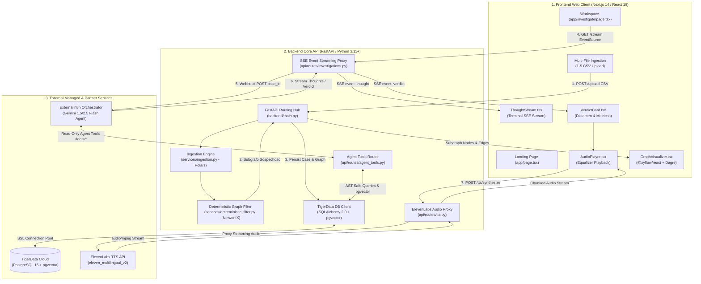

# Forensic Auditor: Master Architecture & Documentation Hub

[Agent Navigation & Context Index](./index.md) | [Architecture](./architecture/README.md) | [Backend](./backend/README.md) | [Frontend](./frontend/README.md) | [Data & Compliance](./data-and-compliance/README.md)

---

## 1. Executive Summary & System Purpose

**Forensic Auditor** is an enterprise-grade financial intelligence platform designed for high-performance forensic analysis, deterministic anti-money laundering (AML) detection, and automated legal audit reasoning on large transaction graphs (such as the IBM AMLSim benchmark).

Financial crime networks utilize sophisticated obfuscation strategies—such as circular layering (*smurfing* / round-tripping) and high-velocity mule conduits (*passthrough accounts*)—to mask illicit money trails within millions of legitimate transactions. Traditional rule engines trigger severe false-positive alert fatigue, while naively feeding raw transaction logs into Large Language Models (LLMs) saturates context windows and induces hallucinations on graph structures.

Forensic Auditor resolves this through a multi-tier hybrid architecture:
1. **Deterministic Algorithmic Graph Pruning**: Ingests transaction ledgers via [Polars](https://pola.rs/) in sub-second time, constructs directed multigraphs with [NetworkX](https://networkx.org/), and isolates elementary cycles ($k \le 5$) and rapid passthrough flows ($\ge 90\%$ pass-through within $\Delta t \le 48\text{h}$). This deterministically eliminates **85% to 98% of computational noise** before touching any LLM.
2. **External Agentic Legal Reasoning & Tooling**: Exposes dedicated database inspection endpoints and dynamic query facilities (`/api/v1/tools/*`) to external ReAct agents (e.g. n8n with Google Gemini), backed by managed PostgreSQL on **TigerData** equipped with `pgvector` for semantic legal searches against Mexican fiscal and AML frameworks (Art. 69-B del CFF, NIFs, and UIF/GAFI typologies).
3. **Reactive Real-Time Forensic Console**: Streams turn-by-turn investigative reasoning and verdicts to a **Next.js 14 / React 18** dashboard (`/investigate`) via Server-Sent Events (SSE), renders an interactive money trail graph via **React Flow (`@xyflow/react`)**, and vocalizes the final judicial dictamen via an **ElevenLabs** streaming voice proxy.

---

## 2. Prior Documentation & Architectural Evolution Synthesis

This documentation synthesizes the initial prototype base, production architecture, and recent multi-agent forensic additions:

| Architectural Dimension | Initial Base Prototype | Target Production Architecture | Documentation Location |
| :--- | :--- | :--- | :--- |
| **System Ingestion & Pruning** | In-memory CSV upload with Polars & NetworkX pruning in `backend/api/routes/investigations.py`. | High-speed Polars/NetworkX pipeline with multigraph aggregation, structured subgraph metadata, and database persistence. | [`doc/backend/README.md`](./backend/README.md) |
| **Database Persistence** | Ephemeral in-memory dictionary (`INVESTIGATION_CASES`). | Production PostgreSQL with `pgvector` hosted on **TigerData**, integrated via Async **SQLAlchemy 2.0** for connection pooling, transaction persistence, and vector similarity search. | [`doc/backend/README.md`](./backend/README.md) |
| **AI Orchestration & Agent Tools** | Webhook proxy stub in `investigations.py` with fallback 6-step thought generator. | Dedicated read-only investigative tool endpoints (`/api/v1/tools/*`) with dynamic AST validation, alongside n8n webhook proxying and SSE reasoning fallback. | [`doc/architecture/README.md`](./architecture/README.md) |
| **Frontend Workspace** | Metric cards, text-based ThoughtStream console, and VerdictCard. | Dual-mode forensic workspace (`/investigate`) featuring 1-5 multi-file upload, interactive `@xyflow/react` + Dagre graph canvas, and telemetry cards. | [`doc/frontend/README.md`](./frontend/README.md) |
| **Audio Synthesis** | Direct backend streaming proxy to ElevenLabs with silent MPEG frame fallback. | Hardened streaming proxy preserving key confidentiality and zero-downtime offline presentation fallback (`X-Audio-Source` header). | [`doc/backend/README.md`](./backend/README.md) |
| **Legal & Regulatory Alignment** | Basic GAFI risk metrics in code comments. | Formal Mexican tax & AML compliance engine (Art. 69-B CFF EFOS/EDOS, NIF A-2 materiality, UIF ROI reporting, and pgvector HNSW index). | [`doc/data-and-compliance/README.md`](./data-and-compliance/README.md) |

---

## 3. High-Level System Architecture Diagram



---

## 4. Master Documentation Tree

The complete technical documentation is structured as follows:

```text
doc/
├── README.md                           # Master Architecture & Documentation Hub (This Document)
├── index.md                            # Mandatory AI Agent Routing Index (Prevents Context Exhaustion)
│
├── architecture/                       # Global Topology & Cross-Cutting Integration
│   └── README.md                       # 6-stage lifecycle, container topology, SSE JSON schemas, security
│
├── backend/                            # FastAPI Core, Polars Ingestion & NetworkX Pruning
│   └── README.md                       # API reference, Polars alias mapper, cycle & passthrough math,
│                                       # SQLAlchemy TigerData blueprint, ElevenLabs proxy, pytest suite
│
├── frontend/                           # Next.js 14 App Router & Reactive Streaming UI
│   ├── README.md                       # Component hierarchy, SSE event consumption, audio player lifecycle,
│   │                                   # state machine, types, and critical bug resolutions
│   └── react-flow-blueprint.md         # Full implementation design for @xyflow/react Money Trail Visualizer
│
└── data-and-compliance/                # Benchmark Schemas & Mexican AML Regulatory Framework
    └── README.md                       # IBM AMLSim CSV schema, deterministic graph pruning formulas,
                                        # Art. 69-B CFF (EFOS/EDOS), NIF A-2 materiality, UIF/GAFI standards
```

### Module Quick Links
- **[System Architecture & Integration (`doc/architecture/README.md`)](./architecture/README.md)**: Detailed end-to-end dataflow, container orchestration with `docker-compose.yml`, unified SSE event schemas (`thought`, `verdict`), and multi-service topology.
- **[Backend Service & Analytics (`doc/backend/README.md`)](./backend/README.md)**: Polars ingestion mechanics, NetworkX deterministic pruning, public REST/SSE endpoints, testing patterns, and the SQLAlchemy connection blueprint to remote TigerData PostgreSQL with `pgvector`.
- **[Frontend Client Dashboard (`doc/frontend/README.md`)](./frontend/README.md)**: Next.js App Router architecture, UI component catalog, custom streaming hooks (`useInvestigationStream`, `useAudioStream`), and client-side considerations.
- **[React Flow Visualizer Blueprint (`doc/frontend/react-flow-blueprint.md`)](./frontend/react-flow-blueprint.md)**: Complete implementation guide for `@xyflow/react` and `@dagrejs/dagre` graph visualizer.
- **[Data Schemas & Forensic Compliance (`doc/data-and-compliance/README.md`)](./data-and-compliance/README.md)**: IBM AMLSim schema specs, graph mathematical invariants, and Mexican legal compliance framework (CFF Art. 69-B, NIFs, UIF/GAFI).
- **[AI Agent Routing Index (`doc/index.md`)](./index.md)**: Context-saving index designed specifically for future AI agents to identify single-file targets for specific coding tasks.

---

## 5. Cross-Cutting Concerns

### 5.1 Environment Configuration & Secret Management
All sensitive API credentials and integration endpoints are managed via environment variables and shielded from client exposure:
- `ELEVENLABS_API_KEY`: Kept strictly on the backend. The frontend communicates exclusively with the backend `/api/v1/tts/synthesize` proxy endpoint.
- `DATABASE_URL`: Connection string for the external TigerData PostgreSQL instance (`postgresql+asyncpg://...`), secured with SSL mode (`sslmode=require`).
- `N8N_WEBHOOK_URL`: Configurable webhook endpoint pointing to the external n8n ReAct agent runner. If unset or unreachable, the backend seamlessly activates high-fidelity local simulation fallback.
- `NEXT_PUBLIC_API_URL`: Configured on the frontend (`http://localhost:8000` in dev) to route API and SSE requests to FastAPI.

### 5.2 Error Handling & Resilient Fallbacks
- **Zero-Downtime Audio Playback**: If `ELEVENLABS_API_KEY` is not provided or fails, `backend/api/routes/tts.py` generates a valid minimal MPEG audio frame (silent MP3) with header `X-Audio-Source: synthetic-fallback-mode`, ensuring client audio players do not crash during offline demonstrations.
- **SSE Stream Resilience**: If the external n8n webhook is offline or times out, the backend gracefully catches the connection exception and yields the built-in 6-phase forensic reasoning steps, ensuring uninterrupted UI demonstrations.
- **Dynamic Column Aliasing**: The Polars ingestion engine handles irregular column naming across banking datasets without code modifications using canonical alias matching (`origin`, `nameorig`, `from_account`, etc.).

### 5.3 Concurrency & Performance Optimization
- **Columnar Pre-filtering with Polars**: Polars processes tabular CSV ledgers using SIMD and multi-core parallelism, performing column selection, filtering ($>0$), and type casting up to 30x faster than standard Pandas.
- **Computational Cycle Bounds in NetworkX**: Cycle detection uses `nx.simple_cycles` constrained by `MAX_CYCLE_LENGTH` (default $k=5$) to avoid exponential path exploration stalls on dense subgraphs.
- **Non-blocking SSE Proxying**: Event streaming utilizes asynchronous generators (`async for line in response.aiter_lines()`) and `asyncio.sleep()`, preventing thread pool starvation in Uvicorn.

### 5.4 Testing & Quality Assurance
The codebase includes a comprehensive automated test suite across 13 test modules (121 tests) in `backend/tests/` executed via `pytest`:
- End-to-end pipeline verification in `backend/tests/test_pipeline.py`.
- Algorithmic pruning unit tests in `backend/tests/test_deterministic_filter.py`.
- TigerData PostgreSQL async persistence and pooling in `backend/tests/test_database.py`.
- Agent tool inspection and AST query security in `backend/tests/test_agent_tools.py`.
- Asserts that deterministic pruning eliminates legitimate payroll and merchant noise.
- Connects to the SSE endpoint using `httpx.ASGITransport` to validate `thought` and `verdict` payloads.
- Validates the ElevenLabs audio synthesis proxy endpoint and silent frame fallback.

