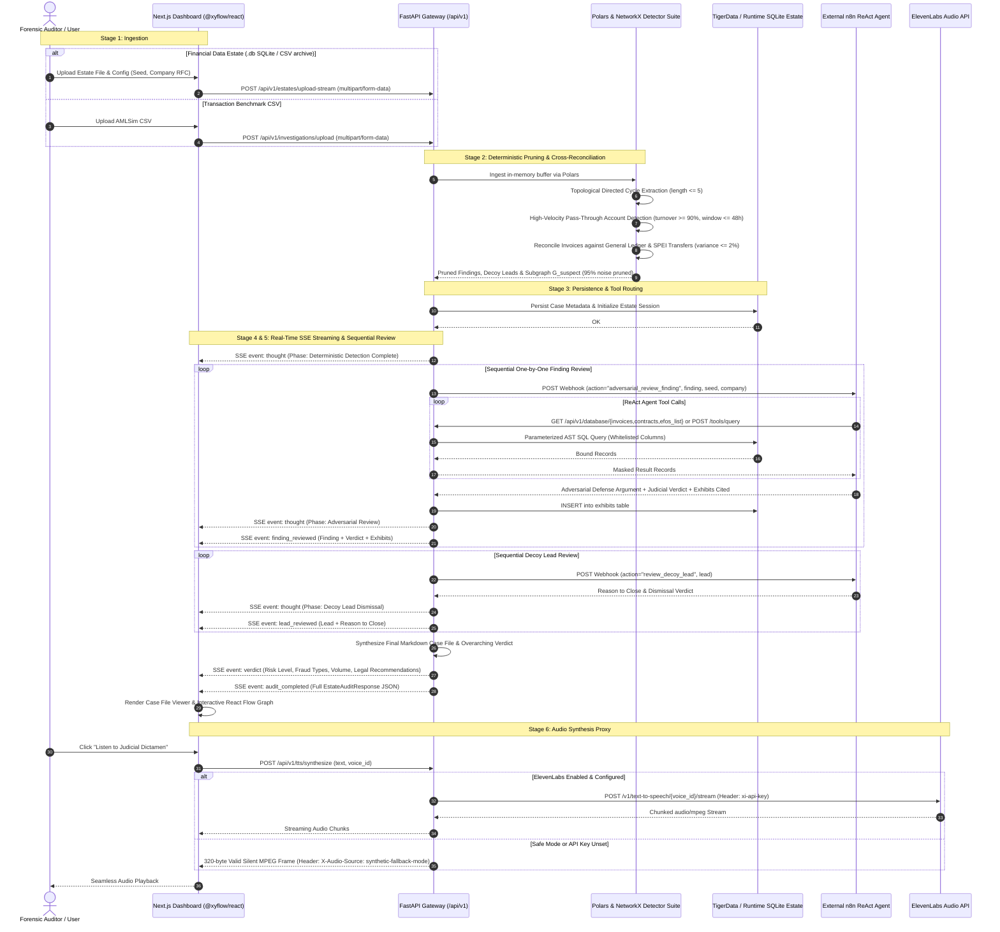

# System Architecture & Multi-Service Topology

[← Back to Master Documentation](../README.md) | [Agent Routing Index](../index.md)

---

## 1. Overview & Core Responsibilities

**Forensic Auditor (Polar)** is an enterprise-grade financial intelligence and automated compliance audit platform. It ingests complex transactional datasets, executes deterministic topological pruning, coordinates agentic adversarial legal review, and produces judicially rigorous forensic case files conforming to international and Mexican regulatory standards (CFF Art. 69-B, NIF A-2, and UIF guidelines).

### The Dual Bottlenecks of Traditional Financial Auditing

Automated anti-money laundering (AML) and forensic investigation pipelines routinely fail due to two systemic bottlenecks:

1. **The 99% False-Positive Paradox**: Conventional rule-based compliance engines flag tens of thousands of routine, benign transactions (payroll disbursements, retail commerce, recurring interbank wire transfers). Human audit teams drown in trivial false positives.
2. **The LLM Token Sledgehammer**: Feeding raw transaction ledgers or relational data estates directly into Large Language Models (LLMs) is economically unviable, rapidly exhausts model context windows, and incurs severe hallucination risks when reasoning over cyclic graph structures and balance reconciliations.

### The Polar Architectural Solution

Forensic Auditor resolves these challenges through a tightly integrated, multi-tier hybrid architecture:

- **Deterministic Graph & Accounting Pruning**: Utilizing [Polars](https://pola.rs/) and [NetworkX](https://networkx.org/), the raw transaction graph is ingested in-memory and evaluated against deterministic graph algorithms (bounded elementary cycle detection, high-velocity pass-through mule account detection, and invoice-to-bank ledger cross-reconciliation). This mathematically prunes **85% to 98% of computational noise** in sub-second time without LLM involvement.
- **Dual Ingestion Pipelines**:
  - *Benchmark CSV Pipeline*: Rapid ingestion of IBM AMLSim graph benchmark datasets for high-throughput cycle and pass-through detection (`/api/v1/investigations/upload`).
  - *Comprehensive Financial Data Estate Pipeline*: Full ingestion of corporate SQLite databases, CSV batches, or JSON estates spanning 8 core business tables (`vendors`, `invoices`, `ledger`, `bank_txns`, `purchase_orders`, `contracts`, `employees`, `efos_list`) with strict 2% accounting reconciliation (`/api/v1/estates/upload` and `/api/v1/estates/upload-stream`).
- **Persistent Relational Ledger & Vector Knowledge Base**: Transactional records and case states are persisted to managed PostgreSQL on **TigerData**, indexed with **pgvector** for sub-second semantic retrieval of Mexican tax, corporate, and AML jurisprudence. For local runtime execution and evaluations, the engine dynamically binds to isolated SQLite estates via `EstateConnector`.
- **Sequential Agentic Adversarial Review (n8n ReAct Engine)**: Rather than bulk-prompting an LLM, findings and decoy leads are processed **sequentially, one by one**. An external n8n ReAct agent acts as adversarial defense counsel attempting to disprove each finding using 13 dedicated database inspection endpoints and an AST dynamic query builder, followed by an independent judicial verdict.
- **Dual-Channel Real-Time SSE Streaming**: Live reasoning thoughts, finding-by-finding judicial reviews, and final verdicts stream in real time to the Next.js frontend over Server-Sent Events (SSE).
- **Vocalized Dictamen Proxy (ElevenLabs)**: The final judicial dictamen is converted to natural speech via an ElevenLabs streaming proxy with zero client credential exposure and automatic fallback to synthetic silent MPEG frames.

---

## 2. End-to-End System Flow & Architecture

### 2.1 The 6-Stage Forensic Lifecycle

```text
┌────────────────────────────────────────────────────────────────────────────────────────────────────────┐
│                                       Stage 1: Ingestion & Upload                                      │
│   • AMLSim CSV Benchmark Upload (POST /api/v1/investigations/upload)                                   │
│   • Corporate Data Estate SQLite/CSV Upload (POST /api/v1/estates/upload)                              │
└──────────────────────────────────────────────────┬─────────────────────────────────────────────────────┘
                                                   │
                                                   ▼
┌────────────────────────────────────────────────────────────────────────────────────────────────────────┐
│                        Stage 2: Deterministic Pruning & Accounting Reconciliation                      │
│   • Polars in-memory data normalization & column canonicalization                                      │
│   • NetworkX directed cycle extraction (k <= 5) & rapid passthrough mule detection (turnover >= 90%)   │
│   • Multi-table cross-reconciliation (invoices vs ledger vs bank_txns with <= 2% variance)            │
│   • 85% - 98% noise eliminated deterministically; candidate findings & decoy leads partitioned         │
└──────────────────────────────────────────────────┬─────────────────────────────────────────────────────┘
                                                   │
                                                   ▼
┌────────────────────────────────────────────────────────────────────────────────────────────────────────┐
│                      Stage 3: Persistence & Vector Indexing (TigerData / SQLite)                       │
│   • Investigation cases, pruned transaction subgraphs, and exhibit catalogs committed                 │
│   • HNSW vector indexing for Mexican tax/AML jurisprudence (CFF 69-B, NIF A-2, UIF)                    │
│   • Dynamic runtime database routing via EstateConnector (session scope isolation)                     │
└──────────────────────────────────────────────────┬─────────────────────────────────────────────────────┘
                                                   │
                                                   ▼
┌────────────────────────────────────────────────────────────────────────────────────────────────────────┐
│                       Stage 4: Sequential Agentic Adversarial Review (n8n Loop)                        │
│   • Sequential finding review: n8n Defense Agent attempts to break finding using DB tools              │
│   • Judicial verdict: Independent judge evaluates evidence and renders finding-specific verdict        │
│   • Decoy lead review: Formal 'reason to close' and dismissal of unproven leads                        │
│   • Automated exhibit registration into database exhibits table                                        │
│   • Dynamic AST Query Engine (POST /api/v1/tools/query) enforcing column whitelists                    │
└──────────────────────────────────────────────────┬─────────────────────────────────────────────────────┘
                                                   │
                                                   ▼
┌────────────────────────────────────────────────────────────────────────────────────────────────────────┐
│                         Stage 5: Real-Time SSE Streaming & Case File Synthesis                         │
│   • EventSource channels: thought -> finding_reviewed -> lead_reviewed -> verdict -> audit_completed   │
│   • Next.js dashboard live rendering with React Flow (@xyflow/react) graph canvas                     │
│   • Submission-compliant Case File JSON and Markdown generation (submission_schema.json)               │
└──────────────────────────────────────────────────┬─────────────────────────────────────────────────────┘
                                                   │
                                                   ▼
┌────────────────────────────────────────────────────────────────────────────────────────────────────────┐
│                              Stage 6: Audio Synthesis Proxy (ElevenLabs)                               │
│   • POST /api/v1/tts/synthesize streaming chunked audio/mpeg to frontend                               │
│   • Server-side API key shielding; safe mode & silent MPEG frame fallback on failure                   │
└────────────────────────────────────────────────────────────────────────────────────────────────────────┘
```

### 2.2 End-to-End Sequence Diagram



---

## 3. Multi-Service Topology & Infrastructure

The Forensic Auditor platform combines containerized services for local development and demonstration with production-ready external managed infrastructure:

```mermaid
graph TB
    subgraph ClientTier [Client Tier - Browser]
        NextApp[Next.js 14 App Router / React 18]
        RFCanvas[React Flow Graph Canvas - @xyflow/react]
        ThoughtTerminal[ThoughtStream Terminal Console]
        CaseFileViewer[Case File Document Viewer]
        AudioStreamPlayer[Audio Player Stream]
    end

    subgraph ContainerTier [Containerized Docker Network: forensic-network]
        subgraph FrontendService [Service: frontend (Port 3000)]
            NodeSSR[Node.js 20 / Next.js Server]
        end

        subgraph BackendService [Service: backend (Port 8000)]
            FastAPICore[Uvicorn / FastAPI Application]
            PolarsEngine[Polars Dataframe Normalizer]
            NXEngine[NetworkX Topological Graph Engine]
            DetectorSuite[Forensic Detector Suite & Reconciler]
            N8nEnrichment[n8n Sequential Enrichment Service]
            DatabaseToolsAPI[Database Tools Router & AST Query Builder]
            EstateConnectorSvc[Dynamic Estate Connector]
            TTSStreamingProxy[ElevenLabs Audio Proxy]
        end

        subgraph LocalDevDB [Service: postgres-pgvector (Port 5432)]
            LocalPG[(PostgreSQL 16 + pgvector)]
        end

        subgraph LocalDevN8N [Service: n8n (Port 5678)]
            LocalN8NInstance[n8n Workflow Engine]
        end
    end

    subgraph ManagedTier [External Managed Infrastructure]
        TigerDataDB[(TigerData Managed PostgreSQL 16 + pgvector)]
        ExternalN8N[Managed / Cloud n8n ReAct Orchestrator]
        ElevenLabsAPI[ElevenLabs Speech Synthesis API]
    end

    %% Client Interactions
    NextApp -->|HTTP / REST| FastAPICore
    NextApp -->|SSE: /investigations/*/stream| FastAPICore
    NextApp -->|SSE: /estates/upload-stream| FastAPICore
    NextApp -->|POST: /tts/synthesize| FastAPICore

    %% Backend Internals
    FastAPICore --> PolarsEngine
    FastAPICore --> NXEngine
    FastAPICore --> DetectorSuite
    FastAPICore --> N8nEnrichment
    FastAPICore --> DatabaseToolsAPI
    FastAPICore --> EstateConnectorSvc
    FastAPICore --> TTSStreamingProxy

    %% Data Store Routing
    EstateConnectorSvc -.->|Dynamic SQLite .db / Memory| FastAPICore
    EstateConnectorSvc -->|SQLAlchemy 2.0 Async / SSL| TigerDataDB
    FastAPICore -.->|Local Staging Fallback| LocalPG

    %% Agent & Audio Integrations
    N8nEnrichment -.->|HTTP POST Webhook| ExternalN8N
    N8nEnrichment -.->|Local Staging Webhook| LocalN8NInstance
    ExternalN8N -.->|GET /api/v1/database/* & POST /tools/query| DatabaseToolsAPI
    LocalN8NInstance -.->|GET /api/v1/database/* & POST /tools/query| DatabaseToolsAPI
    TTSStreamingProxy -->|HTTPS Stream with xi-api-key| ElevenLabsAPI
```

### 3.1 Container Orchestration (`docker-compose.yml`)

The repository provides a unified `docker-compose.yml` for isolated local testing, demonstrations, and staging:

| Service | Image / Build Context | Container Port | Host Binding | Environment Configuration & Purpose |
| :--- | :--- | :--- | :--- | :--- |
| **`backend`** | `./backend` (`Dockerfile`, Python 3.11-slim) | `8000` | `8000:8000` | `ENVIRONMENT=development`, `BACKEND_CORS_ORIGINS`, `N8N_WEBHOOK_URL`, `ELEVENLABS_API_KEY`. Mounts `./backend:/app` for instant code reloading. |
| **`frontend`** | `./frontend` (`Dockerfile`, Node 20-alpine) | `3000` | `3000:3000` | `NEXT_PUBLIC_API_URL=http://localhost:8000`. Hot-reloading Next.js 14 development environment. |
| **`postgres-pgvector`** | `pgvector/pgvector:pg16` | `5432` | `5432:5432` | `POSTGRES_USER=forensic_user`, `POSTGRES_DB=forensic_audit_db`. Provides local pgvector compatibility for staging and offline testing. |
| **`n8n`** | `n8nio/n8n:latest` | `5678` | `5678:5678` | `N8N_BASIC_AUTH_ACTIVE=false`, `N8N_HOST=0.0.0.0`. Standalone workflow engine for offline ReAct agent execution. |

### 3.2 Hybrid Data Persistence Architecture

The backend supports a flexible hybrid persistence model via `backend/services/estate_connector.py` and `backend/core/database.py`:

1. **Managed TigerData PostgreSQL (Production)**:
   - Utilized for long-term audit case persistence, shared organizational exhibits, and semantic vector retrieval over Mexican tax/AML jurisprudence.
   - Enforces encrypted transport via SSL (`sslmode=require` or asyncpg `connect_args={"ssl": "require"}`).
   - Relational entities (`investigation_cases`, `transactions`) and vector embeddings (`legal_knowledge_vectors`) run with high-concurrency connection pooling (`DB_POOL_SIZE=20`, `DB_MAX_OVERFLOW=10`, `DB_POOL_RECYCLE=3600`).
2. **Dynamic Runtime SQLite Estates (Investigation-Specific & Evaluation)**:
   - For offline evaluations, hackathon submissions, or individual client database files (`.db`), `EstateConnector` dynamically spins up isolated SQLite engines with `StaticPool`.
   - Connections and schema models are kept isolated per investigation run and thoroughly deallocated via `dispose_all()` upon audit stream termination.

---

## 4. Communication Contracts & Protocols

### 4.1 Ingestion Contracts

#### A. IBM AMLSim Transaction CSV Upload
- **Route**: `POST /api/v1/investigations/upload`
- **Content-Type**: `multipart/form-data` (`file: <filename.csv>`)
- **Response**: `201 Created` (`application/json`)
- **Payload Schema**:
  ```json
  {
    "case_id": "8f3b204e-2895-4680-bc90-9ceba694e207",
    "message": "Dataset successfully processed and pruned.",
    "metrics": {
      "total_nodes_analyzed": 1400,
      "suspicious_nodes_count": 82,
      "pruned_nodes_count": 1318,
      "total_edges_analyzed": 5600,
      "suspicious_edges_count": 144,
      "pruned_edges_count": 5456,
      "suspicious_volume_mxn": 14850000.0,
      "detected_cycles_count": 6,
      "passthrough_accounts_count": 14,
      "pruning_efficiency_pct": 97.43
    },
    "subgraph": {
      "nodes": [{ "id": "ACC_102", "total_in": 750000.0, "total_out": 745000.0, "risk_score": 0.95 }],
      "edges": [{ "source": "ACC_101", "target": "ACC_102", "amount": 350000.0, "reasons": ["cycle_edge"] }]
    },
    "patterns": {
      "cycles": [{ "path": ["ACC_101", "ACC_102", "ACC_103", "ACC_101"], "length": 3, "estimated_volume": 350000.0 }],
      "passthrough_accounts": [{ "account": "ACC_102", "total_in": 750000.0, "total_out": 745000.0, "ratio": 0.993, "time_delta_hours": 14.5 }]
    }
  }
  ```

#### B. Corporate Financial Estate Upload
- **Route**: `POST /api/v1/estates/upload`
- **Content-Type**: `multipart/form-data`
- **Parameters**: `file` (SQLite `.db`, `.sqlite`, `.csv`), `seed` (int), `company_name` (str), `company_rfc` (str, optional), `audit` (bool, default `False`).
- **Response**:
  - If `audit=False`: `{"status": "READY", "estate_id": "...", "estate_path": "...", "filename": "...", "size_bytes": 1048576}`.
  - If `audit=True`: Complete `EstateAuditResponse` object (see Section 4.2).

---

### 4.2 Server-Sent Events (SSE) Streaming Contracts

All SSE streams use standard HTTP headers to prevent proxy caching and buffer stalling:
```http
Content-Type: text/event-stream
Cache-Control: no-cache
Connection: keep-alive
X-Accel-Buffering: no
```

#### Stream Protocol 1: Benchmark Investigation Stream
- **Route**: `GET /api/v1/investigations/{case_id}/stream`
- **Events**:
  1. `thought` (emitted repeatedly across reasoning steps 1 through 6):
     ```http
     event: thought
     data: {"step": 3, "phase": "Extracción de Ciclos Dirigidos", "message": "Detección de patrones circulares: 2 ciclos cerrados detectados.", "timestamp": "2026-09-12T08:15:30.450Z"}
     ```
  2. `verdict` (terminal event; client closes EventSource upon receipt):
     ```http
     event: verdict
     data: {"case_id": "8f3b204e-2895-4680-bc90-9ceba694e207", "risk_level": "CRÍTICO", "fraud_type": "Estructuración Circular (Smurfing)", "total_amount_mxn": 1485000.0, "confidence_score": 0.94, "entities_involved": ["ACC_A_101", "ACC_B_102"], "pruned_leads_count": 16, "patterns_summary": {"closed_cycles": 2, "passthrough_accounts": 3, "pruning_efficiency_pct": 57.14}, "legal_recommendation": "Presentar Reporte de Operación Inusual (ROI) ante la UIF.", "audit_summary_text": "Dictamen Pericial Forense...", "completed_at": "2026-09-12T08:15:33.910Z"}
     ```

#### Stream Protocol 2: Financial Estate Forensic Audit Stream
- **Routes**:
  - `POST /api/v1/estates/upload-stream` (multipart upload & immediate streaming)
  - `POST /api/v1/investigations/audit-estate/stream` (JSON request with `EstateAuditRequest`)
  - `GET /api/v1/estates/stream` and `GET /api/v1/investigations/audit-estate/stream` (EventSource browser compatibility)
- **Events Sequence**:
  1. `thought`: Real-time milestone progress updates.
     ```http
     event: thought
     data: {"step": 1, "phase": "Iniciando Auditoría Forense", "message": "Conectando a base de datos...", "timestamp": "2026-09-12T08:15:30.100Z", "event_id": "9b1deb4d-3b7d-4bad-9bdd-2b0d7b3dcb6d", "agent_id": "ORCHESTRATOR", "action": "started", "source": "DETERMINISTIC"}
     ```
  2. `finding_reviewed`: Emitted for each candidate finding reviewed by the adversarial agent.
     ```http
     event: finding_reviewed
     data: {
       "type": "finding_reviewed",
       "finding_index": 0,
       "total_findings": 2,
       "is_online": true,
       "message": "Hallazgo 1/2 examinado por fiscal y defensa.",
       "adversarial_review": "La defensa argumenta que los contratos de consultoría existieron materialmente; sin embargo, no existen bitácoras ni entregables comprobables.",
       "judge_verdict": "Se declara procedente el indicio por simulación de operaciones bajo el Artículo 69-B del CFF.",
       "finding": {
         "finding_id": "FINDING-001",
         "scheme_type": "phantom_services",
         "peso_amount": 1450000.0,
         "rule_broken": "Artículo 69-B del Código Fiscal de la Federación",
         "entities": ["PROV_SERV_001", "EMP_AUDITADA"],
         "exhibits": [{ "source_table": "invoices", "record_id": "CFDI-9901" }],
         "reconciliation": { "claimed_pesos": 1450000.0, "exhibits_sum": 1450000.0, "variance_percentage": 0.0 }
       }
     }
     ```
  3. `lead_reviewed`: Emitted as non-fraudulent decoy leads are dismissed with a formal legal reason.
     ```http
     event: lead_reviewed
     data: {
       "type": "lead_reviewed",
       "lead_index": 0,
       "total_leads": 5,
       "is_online": true,
       "message": "Línea preliminar 1/5 descartada.",
       "reason_to_close": "Operación recurrente de nómina bancaria con dispersión simétrica comprobada y retenciones timbradas.",
       "lead": { "account": "ACC_PAYROLL_01", "amount": 890000.0, "closure_category": "ORDINARY_PAYROLL" }
     }
     ```
  4. `verdict`: Standardized case verdict summary event.
  5. `audit_completed`: Full `EstateAuditResponse` JSON payload, containing the synthesized Markdown case file and raw submission data.
  6. `error`: Emitted with an error payload if database connectivity or validation fails catastrophically.

---

### 4.3 Sequential n8n Adversarial Review Webhook Contract

When `settings.N8N_WEBHOOK_URL` is set, the backend delegates finding and decoy reviews to external n8n workflows:

#### Outbound Webhook Request (from FastAPI to n8n)
- **Method**: `POST`
- **Timeout**: 12.0 seconds with connection pooling
- **Payload Schema**:
  ```json
  {
    "action": "adversarial_review_finding",
    "seed": 42,
    "company_name": "Empresa Auditada S.A. de C.V.",
    "company_rfc": "AUD990101XYZ",
    "estate_path": "/app/tmp/uploaded_estates/estate_42.db",
    "finding_index": 0,
    "total_findings": 2,
    "finding": {
      "finding_id": "FINDING-001",
      "scheme_type": "phantom_services",
      "peso_amount": 1450000.0,
      "rule_broken": "Artículo 69-B del CFF",
      "entities": ["PROV_SERV_001", "EMP_AUDITADA"],
      "exhibits": [{ "source_table": "invoices", "record_id": "CFDI-9901" }]
    }
  }
  ```

#### Expected Inbound Webhook Response (from n8n to FastAPI)
```json
{
  "adversarial_review": "La defensa argumenta que los comprobantes fiscales cumplen con todos los requisitos formales del Art. 29-A. Sin embargo, no se acreditan activos ni personal operativo en el domicilio fiscal.",
  "judge_verdict": "Con base en la presunción de inexistencia de operaciones y la inclusión en la lista definitiva del 69-B, se confirma la observación.",
  "final_narrative": "Se acreditó la simulación jurídica de servicios de asesoría por $1,450,000.00 MXN mediante facturación de EFOS.",
  "verdict_outcome": "upheld",
  "adversarial_evidences": [
    {
      "source_table": "efos_list",
      "record_id": "PROV_SERV_001",
      "sentence": "Proveedor listado en el Diario Oficial de la Federación como EFOS definitivo."
    }
  ]
}
```

*Response-shape tolerance*: the backend unwraps whichever envelope n8n returns — plain objects, item arrays `[{...}]`, n8n `[{"json": {...}}]` items, or payloads nested under `output`/`body`/`data`/`result`/`response` — and resolves a broad alias set per field (`narrative`, `output`, `text`, `summary`, `defense_review`, `dictamen`, ...). `adversarial_review` may be a string or the structured `{reviewer_agent_role, challenger_argument, why_finding_held}` object the case file renders; either way the finding stored in the submission always carries the object form.

*Verdict semantics*: `verdict_outcome` may be returned explicitly (`upheld` | `acquitted`) or is parsed from the `judge_verdict` text in Spanish and English (negation-safe: `no culpable`, `not guilty`, `charge dismissed`, `desestimado`). A finding the judge **acquits is reclassified into `leads_not_pursued`** (`closed_by: "challenger"`, `closure_category: "ai_acquitted"`) before the final synthesis call, so the accusation set, peso totals, and risk level reflect the AI's verdict — this is what lets evidence change the outcome.

*Resilience Invariant*: If n8n returns a non-200 status code, times out after 12 seconds, is unreachable, or answers 200 with a body carrying no recognizable fields, the system automatically falls back to the deterministic judicial review logic without failing the user's request. `is_online`/`source: EXTERNAL` are only set when at least one field was actually extracted from the n8n response — fallback content is never mislabeled as AI output. All three calls retry once; non-200 responses are logged with a body snippet.

---

### 4.4 Database Tools & AST Dynamic Query Builder

AI agents and adversarial reviewers query estate tables through dedicated endpoints and a strictly parameterized AST query builder:

#### A. Schema Discovery (`GET /api/v1/database/tables`)
Returns schema definitions, primary keys, column catalogs, and row counts across all 13 supported tables:
`vendors`, `invoices`, `ledger`, `bank_txns`, `purchase_orders`, `contracts`, `employees`, `efos_list`, `exhibits`, `accounts`, `account_mappings`, `parties`, `cash_transactions`.

#### B. Dedicated Query Routes (`GET /api/v1/database/{table_name}`)
- **Parameters**: `limit` (1-500), `offset` (int), `q` (text search across string fields), `min_amount`, `max_amount`, `estate_path`.
- **PII Masking**: Sensitive identifiers (RFCs, account numbers, personal names) are automatically masked in transit via `backend/core/masking.py`.

#### C. Evidence Registration (`POST /api/v1/database/exhibits`)
Allows the adversarial agent to formally file evidentiary records:
```json
{
  "estate_path": "/app/tmp/uploaded_estates/estate_42.db",
  "source_table": "contracts",
  "record_id": "CONT-2025-09",
  "sentence": "El contrato carece de fecha cierta y no cuenta con firma electrónica avanzada."
}
```

#### D. Dynamic AST Query Builder (`POST /api/v1/tools/query` & `POST /api/v1/database/query`)
Enforces strict column whitelisting, prevents SQL injection via bound parameters, and scopes queries to the active investigation:
```json
{
  "target": "invoices",
  "filters": [
    { "field": "total", "operator": "gte", "value": 500000.0 },
    { "field": "rfc_emisor", "operator": "like", "value": "EFOS%" }
  ],
  "sort_by": "total",
  "sort_order": "desc",
  "limit": 25,
  "offset": 0
}
```
*Supported Operators*: `eq`, `neq`, `gt`, `gte`, `lt`, `lte`, `like`, `in`.

---

### 4.5 ElevenLabs Speech Synthesis Proxy Contract

- **Route**: `POST /api/v1/tts/synthesize`
- **Request Body**:
  ```json
  {
    "text": "Dictamen Pericial Forense. Se acreditó la comisión de esquemas fraudulentos...",
    "voice_id": "21m00Tcm4TlvDq8ikWAM",
    "model_id": "eleven_multilingual_v2"
  }
  ```
- **Response**: Streaming `audio/mpeg`.
- **Safe Mode Behavior (`ELEVENLABS_SAFE_MODE=True`)**:
  To protect character quotas during automated tests and demonstrations, calls to ElevenLabs are intercepted. The backend immediately streams a valid 320-byte silent MPEG-1 Layer III frame sequence (`b"\xff\xfb\x90\x64..." * 10`) accompanied by the header:
  ```http
  X-Audio-Source: synthetic-fallback-mode
  ```
  This guarantees that HTML5 `<audio>` elements and web audio contexts never throw decode errors.

---

### 4.6 Case File Schema Contract

The judged deliverable conforms to [`student-materials/forensic-auditor/submission_schema.json`](../../student-materials/forensic-auditor/submission_schema.json).

- **Strict Schema Enforcement**:
  - `scheme_type`: Enforces valid taxonomy (`phantom_services`, `round_tripping`, `loan_capitalization`, `payroll_diversion`, `asset_stripping`).
  - `source_table`: Enforces valid sources (`vendors`, `invoices`, `ledger`, `bank_txns`, `purchase_orders`, `contracts`, `employees`, `efos_list`).
  - Entity identifiers must match known prefixes (`PROV_`, `EMP_`, `ACC_`).
- **Additive Frontend Extensions**:
  The system augments the submission data with optional display fields that degrade gracefully when absent:
  - `header`: Company metadata and audit period.
  - `executive_summary`: Natural language overview and high-level risk assessment.
  - `findings[].rule_detail`: Legal citations (CFF Art. 69-B, NIF A-2).
  - `findings[].mermaid_source`: Directed money trail diagrams for inline visualization.
  - `findings[].reconciliation`: Strict variance checking between claimed totals and cited exhibits.
  - `findings[].adversarial_review`: Summary of defense arguments and judicial verdict.

---

## 5. Key Infrastructure & Code Files Breakdown

### Component Responsibility Matrix

| File / Module | Architectural Role | Key Symbols / Classes | Key Dependencies |
| :--- | :--- | :--- | :--- |
| `docker-compose.yml` | Multi-service local staging topology | Services: `backend`, `frontend`, `postgres-pgvector`, `n8n` | Docker Compose 3.8 |
| `backend/main.py` | FastAPI application gateway & lifecycle | `app`, `lifespan()`, `health_check()` | `fastapi`, `uvicorn` |
| `backend/core/config.py` | Centralized system configuration & thresholds | `Settings`, `settings` | `pydantic-settings` |
| `backend/core/database.py` | PostgreSQL async engine, SSL & connection pool | `get_engine()`, `get_db()`, `normalize_database_url()` | `sqlalchemy`, `asyncpg`, `psycopg` |
| `backend/core/masking.py` | PII masking for sensitive data in transit | `mask_sensitive_payload()`, `mask_sensitive_record()` | Python stdlib |
| `backend/models/forensic.py` | Core banking & vector knowledge models | `InvestigationCase`, `TransactionRecord`, `LegalArticleVector` | `sqlalchemy`, `pgvector` |
| `backend/models/estate.py` | Relational models for corporate estate tables, `*_history` run archives & persisted audit reports | `InvoiceRecord`, `LedgerRecord`, `BankTxnRecord`, `ExhibitRecord`, `AuditReportRecord` | `sqlalchemy` |
| `backend/api/routes/reports.py` | Historic audit report catalog (`GET /reports`, `GET /reports/{run_id}`) | `list_audit_reports()`, `get_audit_report()` | `fastapi`, `sqlalchemy` |
| `backend/api/routes/investigations.py` | Benchmark upload & estate SSE generators | `upload_investigation_dataset()`, `generate_estate_audit_stream()` | `fastapi`, `httpx` |
| `backend/api/routes/estates.py` | Estate database upload & audit endpoints | `upload_estate()`, `upload_estate_and_stream()` | `fastapi`, `polars` |
| `backend/api/routes/database_tools.py` | Schema catalog, table queries & exhibit logging | `list_tables()`, `get_invoices()`, `create_exhibit()` | `fastapi`, `sqlalchemy` |
| `backend/api/routes/agent_tools.py` | ReAct tool endpoints & AST dynamic query builder | `execute_dynamic_query()`, `query_transactions()` | `fastapi`, `sqlalchemy` |
| `backend/api/routes/tts.py` | ElevenLabs streaming audio proxy & safe mode | `synthesize_speech()`, `generate_fallback_silence_mp3()` | `fastapi`, `httpx` |
| `backend/services/ingestion.py` | Polars CSV ingestion & canonical column mapping | `read_amlsim_csv()`, `canonicalize_dataframe()` | `polars` |
| `backend/services/deterministic_filter.py` | Directed cycle & passthrough topological analysis | `build_transaction_graph()`, `detect_closed_cycles()` | `networkx`, `polars` |
| `backend/services/deterministic_detectors.py` | Estate fraud scheme detectors & reconcilers | `ForensicDetectorSuite` | `networkx`, `sqlalchemy` |
| `backend/services/estate_connector.py` | Dynamic SQLite/Postgres estate connection manager | `EstateConnector`, `estate_connector` | `sqlalchemy`, `sqlite3` |
| `backend/services/n8n_enrichment.py` | Sequential LLM enrichment & adversarial review | `N8nEnrichmentService`, `n8n_enrichment_service` | `httpx`, `sqlalchemy` |
| `backend/services/case_file_generator.py` | Markdown report & Mermaid money-trail generation | `CaseFileGenerator` | Python stdlib |
| `frontend/hooks/useInvestigationStream.ts` | SSE client connection & event dispatching | `useInvestigationStream` | React 18 |
| `frontend/components/ThoughtStream.tsx` | Dark terminal console for live reasoning steps | `ThoughtStream` | React 18, Tailwind |
| `frontend/components/VerdictCard.tsx` | Judicial verdict card with risk classification | `VerdictCard` | React 18, Tailwind |

---

## 6. Dependencies & Architectural Invariants

### 6.1 Internal & External Dependencies

- **Data Processing**: `polars` (fast columnar operations), `networkx` (multigraph cycle search).
- **Database & Persistence**: `sqlalchemy>=2.0`, `asyncpg`, `psycopg[binary]`, `pgvector` (TigerData PostgreSQL 16), `sqlite3` (runtime evaluation).
- **Network & Gateway**: `fastapi`, `uvicorn[standard]`, `httpx>=0.27.0` (asynchronous external streaming).
- **Agent Orchestration**: External n8n ReAct workflow engine.
- **Voice Synthesis**: ElevenLabs Multilingual v2 API.
- **Frontend**: Next.js 14 (App Router), React 18, TypeScript (strict mode), `@xyflow/react` (React Flow), `tailwind-merge`, `lucide-react`.

### 6.2 The 6 Architectural Invariants

1. **Deterministic Pre-Filtering Guarantee**: No raw transaction ledger is ever sent to an LLM. All data must first pass through deterministic Polars normalization, NetworkX topological analysis, and accounting reconciliation. This eliminates 85% to 98% of noise.
2. **Strict Server-Side Credential Shielding**: Client applications never receive `ELEVENLABS_API_KEY`, `DATABASE_URL`, or n8n credentials. All external requests are brokered by FastAPI gateway endpoints.
3. **AST Parameterization & Column Whitelisting**: Agent dynamic queries through `/tools/query` or `/database/query` cannot execute arbitrary SQL. Field names are verified against static whitelists, and values are strictly bound to parameterized SQLAlchemy statements.
4. **Resilient Multi-Tier Graceful Degradation**: If external services (TigerData, n8n, or ElevenLabs) fail, timeout, or lack API keys, the platform seamlessly degrades to local deterministic judicial review and synthetic silent MPEG audio frames without client error.
5. **Strict 2% Reconciliation Tolerance**: For all candidate fraud findings, the monetary sum of cited exhibits must match the claimed fraud volume within a maximum allowable variance of 2.0% (`reconciliation.variance_percentage <= 2.0`).
6. **PII Masking in Transit**: Inbound and outbound records processed through database inspection tools are scrubbed for sensitive identifiers (bank accounts, personal tax IDs) before transmission to external agent workflows.

---

## 7. Testing & Verification

The multi-service architecture is verified through an automated testing and validation suite:

- **End-to-End Pipeline Verification (`backend/tests/test_pipeline.py`)**: Tests dataset upload -> deterministic graph pruning -> SSE thought streaming -> terminal verdict emission -> audio synthesis fallback.
- **Full Lifecycle Integration Suite (`backend/tests/test_e2e_full_lifecycle.py`)**: Validates database initialization, transaction insertion, AST query builder filters, and sequential n8n enrichment fallback across 121 passing tests.
- **Submission Schema Verification**:
  ```bash
  python -X utf8 student-materials/forensic-auditor/validate_format.py --submission <case_file>.json
  ```
- **Frontend Static Verification**:
  ```bash
  cd frontend && npx --no-install tsc --noEmit --incremental false
  ```

---

## 8. Edge Cases, Security & Concurrency Notes

### 8.1 SSE Buffer Flushing & Reverse Proxies
- Production reverse proxies (Nginx, AWS ALB, Cloudflare) default to buffering chunked HTTP responses.
- The backend sets `X-Accel-Buffering: no` on all streaming routes. In Nginx configurations, `proxy_buffering off;` must be set for `/api/v1/investigations/*/stream` and `/api/v1/estates/*`.

### 8.2 EventSource Lifecycle Management
- Rapid component re-mounting in React 18 strict mode can spawn orphan `EventSource` connections.
- The `useInvestigationStream` hook explicitly aborts previous controllers and invokes `eventSource.close()` in its teardown handler.

### 8.3 Concurrency & Database Connection Pool
- TigerData PostgreSQL asyncpg pools are constrained by `DB_POOL_SIZE=20` and `DB_MAX_OVERFLOW=10`.
- Runtime SQLite engines dynamically created by `EstateConnector` use `StaticPool` with scoped session isolation to prevent database file locks across concurrent queries.

### 8.4 Deterministic Graph Algorithm Bounding
- Cycle detection on dense multigraphs is computationally NP-hard.
- The detector bounds cycle length to `settings.MAX_CYCLE_LENGTH` (default 5) and applies node degree pre-filtering to prevent denial-of-service on large clusters.

---

## 9. Configuration Reference

| Environment Variable | Service Scope | Default Value | Purpose |
| :--- | :--- | :--- | :--- |
| `NEXT_PUBLIC_API_URL` | Frontend | `http://localhost:8000` | Gateway endpoint for FastAPI backend |
| `DATABASE_URL` | Backend | `None` (or empty) | Managed PostgreSQL connection string (TigerData) |
| `DB_SSL_REQUIRE` | Backend | `True` | Enforces SSL mode (`require`) on database connections |
| `DB_POOL_SIZE` | Backend | `20` | Maximum persistent database connections in pool |
| `DB_MAX_OVERFLOW` | Backend | `10` | Maximum burst connections beyond pool size |
| `N8N_WEBHOOK_URL` | Backend | `""` | External n8n ReAct agent webhook URL |
| `ELEVENLABS_API_KEY` | Backend | `""` | ElevenLabs API key for judicial speech synthesis |
| `ELEVENLABS_VOICE_ID` | Backend | `21m00Tcm4TlvDq8ikWAM` | Default ElevenLabs voice identifier (Rachel) |
| `ELEVENLABS_MODEL_ID` | Backend | `eleven_multilingual_v2` | ElevenLabs multilingual synthesis model |
| `ELEVENLABS_SAFE_MODE` | Backend | `True` | Safety switch blocking real TTS calls to save credit quotas |
| `MAX_CYCLE_LENGTH` | Backend | `5` | Maximum path length for directed cycle detection |
| `PASS_THROUGH_RATIO_THRESHOLD` | Backend | `0.90` | Minimum turnover ratio for mule account detection |
| `PASS_THROUGH_WINDOW_HOURS` | Backend | `48.0` | Maximum time window in hours for pass-through analysis |
| `BACKEND_CORS_ORIGINS` | Backend | `["http://localhost:3000"]` | Allowed CORS origins for Next.js web application |
