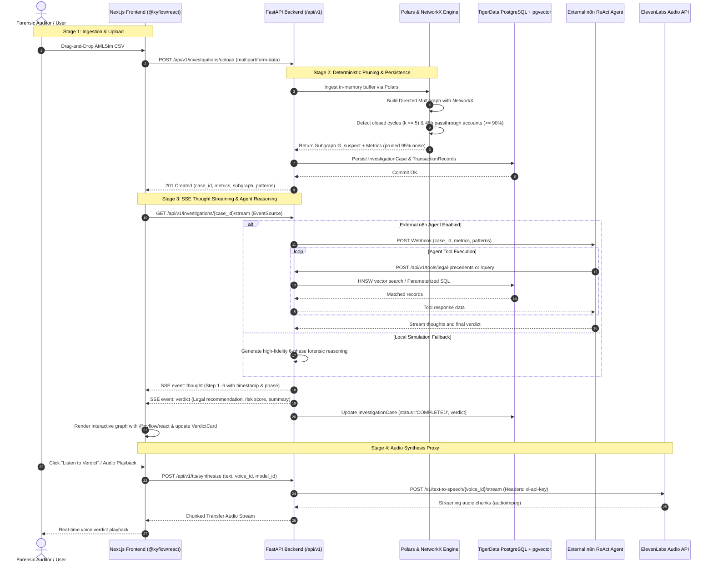
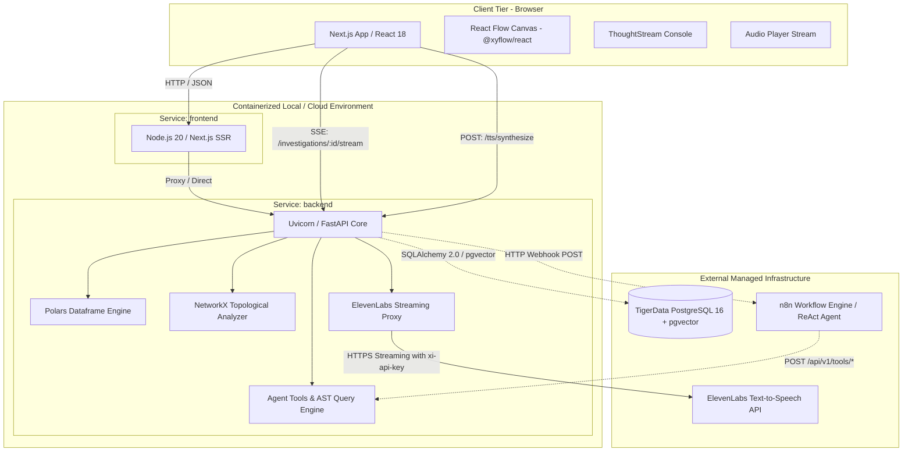

# System Architecture & Multi-Service Topology

[← Back to Master Documentation](../README.md) | [Agent Routing Index](../index.md)

---

## 1. Overview

**Forensic Auditor** is an enterprise-grade financial intelligence platform designed for high-performance forensic analysis, deterministic anti-money laundering (AML) detection, and automated legal audit reasoning on large transaction graphs (such as the IBM AMLSim benchmark).

In conventional compliance pipelines, automated AML monitoring suffers from two catastrophic bottlenecks:

1. **The 99% False-Positive Paradox**: Traditional rule engines trigger thousands of alerts on legitimate transactions (retail payments, payroll, routine wire transfers), overwhelming forensic auditors.
2. **The LLM Token Sledgehammer**: Ingesting raw financial transaction logs directly into Large Language Models (LLMs) is economically unviable, exceeds context windows, and introduces high hallucination risks on numerical graph topologies.

**Forensic Auditor solves this through a hybrid pipeline**:

- **Deterministic Algorithmic Pruning (Graph Theory)**: Using [Polars](https://pola.rs/) and [NetworkX](https://networkx.org/), the raw transaction graph is normalized in memory and subjected to deterministic topological filtering (directed cycle detection and high-velocity passthrough account ratios). This discards **85% to 98% of computational noise** in sub-second execution.
- **Persistent Relational Ledger & Vector Knowledge Base**: Transactional records and investigation metadata persist directly into managed PostgreSQL on **TigerData**, indexed with **pgvector** for sub-second semantic retrieval of Mexican tax/AML jurisprudence (CFF Art. 69-B, NIF A-2, UIF guidelines).
- **Agentic Legal Verification (External n8n & Dynamic Tools)**: External n8n ReAct agents execute queries against dedicated tool routes (`/tools/transactions`, `/tools/entities`, `/tools/patterns`, `/tools/legal-precedents`) and a parameterized dynamic query builder with strict AST column whitelisting.
- **Real-Time Streaming Experience (SSE + ElevenLabs + React Flow)**: Audit reasoning steps are streamed live to the Next.js frontend via Server-Sent Events (SSE), rendered interactively with React Flow (`@xyflow/react`), and vocalized via an ElevenLabs streaming voice proxy.

---

## 2. End-to-End System Flow & Architecture

The following sequence details the lifecycle of an investigation from raw CSV ingestion to interactive exploration and vocalized forensic verdict:



---

## 3. Multi-Service Topology & Infrastructure

The project structure is organized as a production-grade monorepo combining containerized services and external managed providers.



### 3.1 Container Orchestration (`docker-compose.yml`)

The repository includes a `docker-compose.yml` for unified local execution and staging parity:

| Service                | Image / Build Context                            | Internal Port | Exposed Port  | Environment Keys / Responsibilities                                                                                                               |
| :--------------------- | :----------------------------------------------- | :------------ | :------------ | :------------------------------------------------------------------------------------------------------------------------------------------------ |
| **`backend`**  | `./backend` (`Dockerfile`, Python 3.11-slim) | 8000          | `8000:8000` | `ENVIRONMENT=development`, `BACKEND_CORS_ORIGINS`, `N8N_WEBHOOK_URL`, `ELEVENLABS_API_KEY`. Mounts `./backend:/app` for live reloading. |
| **`frontend`** | `./frontend` (`Dockerfile`, Node 20-alpine)  | 3000          | `3000:3000` | `NEXT_PUBLIC_API_URL=http://localhost:8000`. Hot-reloading Next.js dev server.                                                                  |

### 3.2 External Architectural Constraints

> [!IMPORTANT]
> **Production Boundary Clarification**:
>
> - **TigerData PostgreSQL**: In the production deployment, database persistence and vector indexing do **not** run as a local container. Instead, the backend connects directly to an external managed instance on **TigerData** configured with PostgreSQL 16 and the `pgvector` extension via SSL (`sslmode=require`).
> - **n8n Workflow Engine**: The n8n orchestrator runs externally outside this repository. The FastAPI backend sends HTTP POST webhooks to the configured `N8N_WEBHOOK_URL` and proxies the resulting event stream back to the frontend.
> - **docker-compose.yml Dev Services**: While `docker-compose.yml` includes auxiliary definitions (`postgres-pgvector` and `n8n`) for offline demonstration and isolated local testing, all production integrations target external endpoints.

---

## 4. Communication Contracts & Protocols

### 4.1 Dataset Ingestion & Pruning Contract

- **Method & Route**: `POST /api/v1/investigations/upload`
- **Request Format**: `multipart/form-data` with `file: <filename.csv>`
- **Response Format**: `application/json` (Status `201 Created`)

```json
{
  "case_id": "8f3b204e-2895-4680-bc90-9ceba694e207",
  "message": "Dataset successfully processed and pruned.",
  "metrics": {
    "total_nodes_analyzed": 14,
    "suspicious_nodes_count": 8,
    "pruned_nodes_count": 6,
    "total_edges_analyzed": 28,
    "suspicious_edges_count": 12,
    "pruned_edges_count": 16,
    "suspicious_volume_mxn": 1485000.0,
    "detected_cycles_count": 2,
    "passthrough_accounts_count": 3,
    "pruning_efficiency_pct": 57.14
  },
  "subgraph": {
    "nodes": [
      {
        "id": "ACC_B_102",
        "total_in": 750000.0,
        "total_out": 745000.0,
        "in_degree": 2,
        "out_degree": 2,
        "reasons": ["passthrough_ratio_0.99", "part_of_cycle"],
        "risk_score": 0.95
      }
    ],
    "edges": [
      {
        "source": "ACC_A_101",
        "target": "ACC_B_102",
        "amount": 350000.0,
        "count": 1,
        "timestamps": [1672531200],
        "reasons": ["cycle_edge", "passthrough_flow"]
      }
    ]
  },
  "patterns": {
    "cycles": [
      {
        "path": ["ACC_A_101", "ACC_B_102", "ACC_C_103", "ACC_A_101"],
        "length": 3,
        "estimated_volume": 350000.0
      }
    ],
    "passthrough_accounts": [
      {
        "account": "ACC_B_102",
        "total_in": 750000.0,
        "total_out": 745000.0,
        "ratio": 0.993,
        "time_delta_hours": 14.5
      }
    ]
  }
}
```

---

### 4.2 Server-Sent Events (SSE) Stream Contract

- **Method & Route**: `GET /api/v1/investigations/{case_id}/stream`
- **Protocol**: HTTP/1.1 or HTTP/2 `text/event-stream`
- **Headers**:
  ```http
  Content-Type: text/event-stream
  Cache-Control: no-cache
  Connection: keep-alive
  X-Accel-Buffering: no
  ```

#### Event 1: `thought`

Emitted incrementally as the forensic agent progresses through reasoning steps.

```http
event: thought
data: {"step": 3, "phase": "Extracción de Ciclos Dirigidos", "message": "Detección de patrones circulares: 2 ciclos cerrados detectados (evidencia de tipología de pitufeo / smurfing).", "timestamp": "2026-09-12T08:15:30.450Z"}
```

#### Event 2: `verdict`

Emitted as the final payload of the stream. Once received, the client closes the `EventSource` connection.

```http
event: verdict
data: {"case_id": "8f3b204e-2895-4680-bc90-9ceba694e207", "risk_level": "CRÍTICO", "fraud_type": "Estructuración Circular (Smurfing) y Cuentas Mula de Paso Rápido", "total_amount_mxn": 1485000.0, "confidence_score": 0.94, "entities_involved": ["ACC_A_101", "ACC_B_102", "ACC_C_103"], "pruned_leads_count": 16, "patterns_summary": {"closed_cycles": 2, "passthrough_accounts": 3, "pruning_efficiency_pct": 57.14}, "legal_recommendation": "Presentar de forma urgente un Reporte de Operación Inusual (ROI) ante la UIF y proceder con la congelación cautelar de los fondos remanentes en las cuentas puente.", "audit_summary_text": "Dictamen Pericial Forense para el caso 8f3b204e. Se identificó una red estructurada de lavado de dinero por un monto total de $1,485,000.00 pesos mexicanos. El análisis topológico determinó 2 ciclos dirigidos de triangulación de fondos y 3 cuentas mula con dispersión superior al 90% en ventanas menores a 48 horas. Se descartaron exitosamente 16 transferencias no vinculadas mediante poda determinista.", "completed_at": "2026-09-12T08:15:33.910Z"}
```

---

### 4.3 External n8n Webhook Contract

When `settings.N8N_WEBHOOK_URL` is configured, FastAPI delegates reasoning to n8n:

- **Outbound HTTP POST**:
  ```json
  {
    "case_id": "8f3b204e-2895-4680-bc90-9ceba694e207",
    "metrics": { ... },
    "patterns": { ... }
  }
  ```
- **Stream Ingestion**: FastAPI reads lines asynchronously from `n8n` via `httpx.AsyncClient(timeout=10.0)` using `response.aiter_lines()` and proxies them directly into the SSE stream.
- **Resilience**: If n8n times out, returns non-200, or fails, FastAPI falls back without interruption to internal forensic reasoning simulation.

---

### 4.4 ElevenLabs Speech Synthesis Proxy Contract

- **Method & Route**: `POST /api/v1/tts/synthesize`
- **Request Body**:
  ```json
  {
    "text": "Dictamen Pericial Forense para el caso 8f3b204e...",
    "voice_id": "21m00Tcm4TlvDq8ikWAM",
    "model_id": "eleven_multilingual_v2"
  }
  ```
- **Response**: `audio/mpeg` chunked stream piped directly from ElevenLabs or synthetic silence frame fallback if `ELEVENLABS_API_KEY` is absent.

---

### 4.5 Agent Tool Interface & Dynamic Query Builder Contract

External n8n ReAct agents query case data through dedicated tools and composable AST queries:

- **Dedicated Endpoints**:
  - `POST /api/v1/tools/transactions`: Filters transactions by `case_id`, origin/destination accounts, amount range, and suspicion flag.
  - `POST /api/v1/tools/entities`: Profiles counterparty degree, inflow/outflow, and forensic risk score for an account.
  - `POST /api/v1/tools/patterns`: Retrieves extracted elementary cycles and rapid pass-through mule metrics.
  - `POST /api/v1/tools/legal-precedents`: Vector similarity search against `legal_knowledge_vectors` using cosine similarity (`<=>`).
- **Dynamic Query Builder (`POST /api/v1/tools/query`)**:
  ```json
  {
    "target": "transactions",
    "case_id": "8f3b204e-2895-4680-bc90-9ceba694e207",
    "filters": [
      { "field": "amount", "operator": "gte", "value": 150000.0 },
      { "field": "is_suspicious", "operator": "eq", "value": true }
    ],
    "sort_by": "amount",
    "sort_order": "desc",
    "limit": 25
  }
  ```

---

## 5. Key Infrastructure & Code Files Breakdown

### Component Responsibility Matrix

| File / Module | Responsibility | Key Symbols / Classes | External Dependencies |
| :--- | :--- | :--- | :--- |
| `docker-compose.yml` | Multi-container staging and local orchestration (backend, frontend, PostgreSQL pgvector, n8n). | Service definitions | Docker Compose 3.8 |
| `backend/main.py` | FastAPI application factory, lifespan management (`init_db`, `close_db`), and CORS policy. | `app`, `lifespan()`, `health_check()` | `fastapi`, `uvicorn` |
| `backend/core/config.py` | Centralized environment and algorithm threshold settings. | `Settings`, `settings` | `pydantic-settings` |
| `backend/core/database.py` | Async SQLAlchemy engine, SSL enforcement, connection pooling, and session generator. | `get_engine()`, `get_db()`, `init_db()`, `close_db()` | `sqlalchemy`, `asyncpg`, `psycopg` |
| `backend/models/forensic.py` | Relational tables (`investigation_cases`, `transactions`) and vector table (`legal_knowledge_vectors`). | `InvestigationCase`, `TransactionRecord`, `LegalArticleVector` | `sqlalchemy`, `pgvector` |
| `backend/api/routes/investigations.py` | CSV upload, paginated listing, case detail retrieval, and SSE thought streaming with DB persistence. | `upload_investigation_dataset()`, `list_investigations()`, `stream_investigation_thoughts()` | `fastapi`, `httpx` |
| `backend/api/routes/agent_tools.py` | Dedicated tool endpoints and dynamic query builder for external n8n ReAct agents. | `query_transactions()`, `profile_entity()`, `execute_dynamic_query()` | `fastapi`, `sqlalchemy` |
| `backend/api/routes/tts.py` | ElevenLabs speech proxy shielding API key, with 320-byte silent MPEG frame fallback. | `synthesize_speech()`, `generate_fallback_silence_mp3()` | `fastapi`, `httpx` |
| `backend/services/ingestion.py` | In-memory CSV cleansing, column alias resolution, and Polars validation. | `read_amlsim_csv()`, `find_canonical_column()` | `polars` |
| `backend/services/deterministic_filter.py` | Topological graph construction, directed cycle extraction, and pass-through mule detection. | `build_transaction_graph()`, `detect_closed_cycles()`, `detect_passthrough_accounts()` | `networkx`, `polars` |
| `backend/services/tool_registry.py` | Parameterized AST query builder enforcing column whitelists and mandatory case scoping. | `ToolRegistry`, `tool_registry` | `sqlalchemy` |
| `frontend/hooks/useInvestigationStream.ts` | Browser EventSource manager parsing SSE `thought` and `verdict` payloads. | `useInvestigationStream` | `react` |
| `frontend/components/ThoughtStream.tsx` | Collapsible dark terminal rendering real-time reasoning thoughts. | `ThoughtStream` | `next`, `tailwind` |
| `frontend/components/VerdictCard.tsx` | Forensic verdict summary with risk badges, financial metrics, and legal recommendations. | `VerdictCard` | `next`, `tailwind` |
| `frontend/hooks/useAudioStream.ts` | Audio player hook managing streaming MP3 chunks from backend proxy. | `useAudioStream` | `react` |

---

## 6. Architectural Invariants & Data Integrity

1. **Deterministic Pre-Filtering Guarantee**: No raw transaction ledger is ever passed to an LLM or external agent without first passing through the deterministic NetworkX pruning filter. This guarantees 85% to 98% noise reduction.
2. **Credential Shielding**: Client browsers never receive `ELEVENLABS_API_KEY` or `DATABASE_URL`. All external communications pass through the FastAPI backend gateway.
3. **AST Column Whitelisting**: External n8n agent queries to `/tools/query` cannot access unmapped columns or execute arbitrary SQL. Only whitelisted attributes are compiled into bound SQLAlchemy clauses.
4. **Offline Presentation Resilience**: If TigerData, n8n, or ElevenLabs are unreachable, the platform degrades gracefully to local simulation fallback and valid silent MPEG audio frames.

---

## 7. Testing & Multi-Service Verification

The multi-service integration is verified through end-to-end automated pipelines:

- **E2E Full Lifecycle Test (`backend/tests/test_e2e_full_lifecycle.py`)**: Traverses upload -> database persistence -> paginated listing -> detail retrieval -> agent tool queries -> dynamic query builder -> SSE streaming -> verdict persistence -> audio synthesis in a single run.
- **Backend Test Suite**: 121 automated tests executed via `python -m pytest backend/tests/ -v`.
- **Frontend Typecheck**: Non-emitting strict TypeScript check via `npx --no-install tsc --noEmit --incremental false`.

---

## 8. Edge Cases, Security & Gotchas

### 8.1 API Key Shielding & Secret Management
- `ELEVENLABS_API_KEY` and `DATABASE_URL` are strictly confined to server-side environments.
- The frontend client communicates exclusively with the backend `/api/v1` routes using `NEXT_PUBLIC_API_URL`.

### 8.2 Reverse Proxy & SSE Buffer Flushing
- Reverse proxies (such as Nginx or AWS ALB) often buffer chunked HTTP responses by default, delaying real-time event delivery.
- The backend sets `X-Accel-Buffering: no` to guarantee immediate streaming delivery.
- Production reverse proxies must disable proxy buffering (`proxy_buffering off;`) for `/api/v1/investigations/*/stream`.

### 8.3 EventSource Lifecycle Management
- In React client components, rapid component re-renders or unmounts can spawn orphaned `EventSource` connections.
- The `useInvestigationStream` hook closes previous connections before re-opening and registers a cleanup hook on unmount.

### 8.4 External TigerData Database Connectivity
- Connecting from the containerized FastAPI backend to TigerData PostgreSQL requires SSL encryption.
- The connection URL must enforce `sslmode=require` (or `connect_args={"ssl": "require"}` for asyncpg).

### 8.5 Deterministic Pruning Computational Complexity
- To prevent denial-of-service on densely connected graphs, cycle search is bounded by `settings.MAX_CYCLE_LENGTH` (default 5).

### 8.6 AST Parameterization & Injection Resistance
- Dynamic queries evaluate all filter criteria against bound parameters, preventing SQL injection vulnerabilities.

---

## 9. Configuration Reference

| Environment Variable | Service Scope | Default Value | Description |
| :--- | :--- | :--- | :--- |
| `NEXT_PUBLIC_API_URL` | Frontend | `"http://localhost:8000"` | Base URL for FastAPI backend gateway |
| `DATABASE_URL` | Backend | `""` | Managed PostgreSQL connection string (TigerData) |
| `DB_SSL_REQUIRE` | Backend | `True` | Enforces SSL mode on database connection |
| `N8N_WEBHOOK_URL` | Backend | `""` | External n8n ReAct agent orchestrator webhook URL |
| `ELEVENLABS_API_KEY` | Backend | `""` | ElevenLabs API key for speech synthesis |
| `ELEVENLABS_VOICE_ID` | Backend | `"21m00Tcm4TlvDq8ikWAM"` | ElevenLabs voice ID (Rachel) |
| `MAX_CYCLE_LENGTH` | Backend | `5` | Upper limit on path length for cycle detection |
| `PASS_THROUGH_RATIO_THRESHOLD` | Backend | `0.90` | Minimum turnover ratio for mule account detection |
| `PASS_THROUGH_WINDOW_HOURS` | Backend | `48.0` | Maximum time window in hours for pass-through analysis |
| `BACKEND_CORS_ORIGINS` | Backend | `["http://localhost:3000"]` | Allowed CORS origins for Next.js client |
