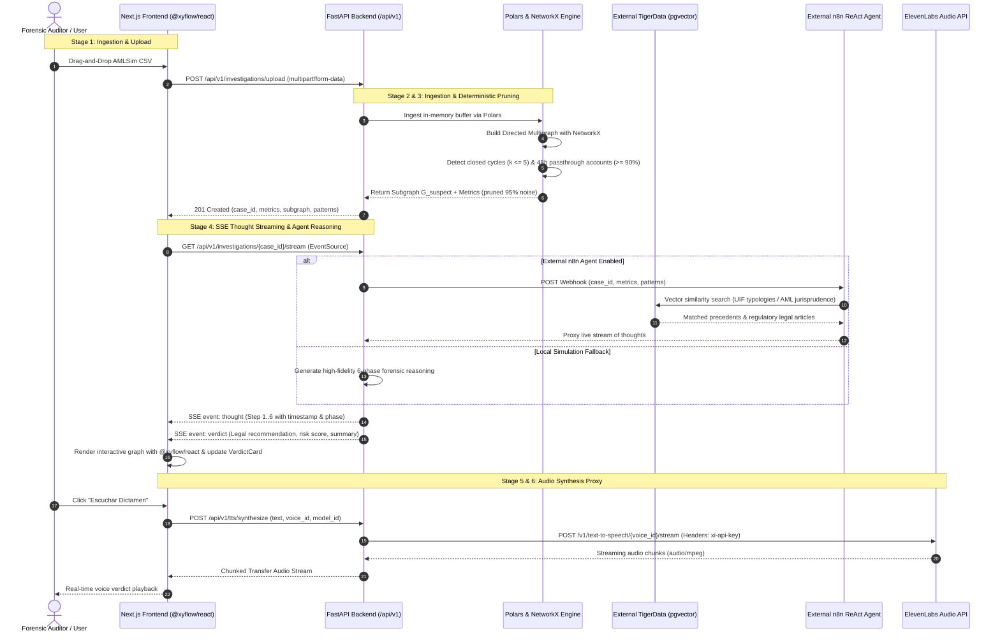
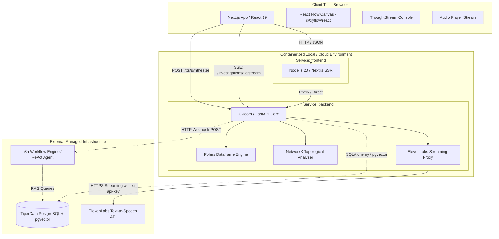

# System Architecture & Multi-Service Topology 🏛️⚡

[← Back to Master Documentation](../README.md) | [Agent Routing Index](../index.md)

---

## 1. Overview

**Forensic Auditor** is an enterprise-grade financial intelligence platform designed for high-performance forensic analysis, deterministic anti-money laundering (AML) detection, and automated legal audit reasoning on large transaction graphs (such as the IBM AMLSim benchmark).

In conventional compliance pipelines, automated AML monitoring suffers from two catastrophic bottlenecks:

1. **The 99% False-Positive Paradox**: Traditional rule engines trigger thousands of alerts on legitimate transactions (retail payments, payroll, routine wire transfers), overwhelming forensic auditors.
2. **The LLM Token Sledgehammer**: Ingesting raw financial transaction logs directly into Large Language Models (LLMs) is economically unviable, exceeds context windows, and introduces high hallucination risks on numerical graph topologies.

**Forensic Auditor solves this through a hybrid pipeline**:

- **Deterministic Algorithmic Poda (Graph Theory)**: Using [Polars](https://pola.rs/) and [NetworkX](https://networkx.org/), the raw transaction graph is normalized in memory and subjected to deterministic topological filtering (directed cycle detection and high-velocity passthrough account ratios). This discards **85% to 98% of computational noise** in sub-second execution.
- **Agentic Legal Verification (External n8n & TigerData)**: Only the dense, mathematically isolated suspicious subgraph is forwarded to an external ReAct agent orchestrated via n8n and backed by an external PostgreSQL with `pgvector` hosted on **TigerData**.
- **Real-Time Streaming Experience (SSE + ElevenLabs + React Flow)**: Audit reasoning steps are streamed live to the Next.js frontend via Server-Sent Events (SSE), rendered interactively with React Flow (`@xyflow/react`), and vocalized via an ElevenLabs streaming voice proxy.

---

## 2. End-to-End System Flow & Architecture

The following sequence details the 6-stage lifecycle of an investigation from raw CSV ingestion to interactive graph exploration and vocalized forensic verdict:



---

## 3. Multi-Service Topology & Infrastructure

The project structure is organized as a production-grade monorepo combining containerized services and external managed providers.



### 3.1 Container Orchestration (`docker-compose.yml`)

The repository includes a `docker-compose.yml` for unified local execution and staging parity:

| Service                | Image / Build Context                            | Internal Port | Exposed Port  | Environment Keys / Responsibilities                                                                                                               |
| :--------------------- | :----------------------------------------------- | :------------ | :------------ | :------------------------------------------------------------------------------------------------------------------------------------------------ |
| **`backend`**  | `./backend` (`Dockerfile`, Python 3.11-slim) | 8000          | `8000:8000` | `ENVIRONMENT=development`, `BACKEND_CORS_ORIGINS`, `N8N_WEBHOOK_URL`, `ELEVENLABS_API_KEY`. Mounts `./backend:/app` for live reloading. |
| **`frontend`** | `./frontend` (`Dockerfile`, Node 20-alpine)  | 3000          | `3000:3000` | `NEXT_PUBLIC_API_URL=http://localhost:8000`. Hot-reloading Next.js dev server.                                                                  |

### 3.2 External Architectural Constraints

> [!IMPORTANT]
> **Production Boundary Clarification**:
>
> - **TigerData PostgreSQL**: In the production deployment, database persistence and vector indexing do **not** run as a local container. Instead, the backend connects directly to an external managed instance on **TigerData** configured with PostgreSQL 16 and the `pgvector` extension via SSL (`sslmode=require`).
> - **n8n Workflow Engine**: The n8n orchestrator runs externally outside this repository. The FastAPI backend sends HTTP POST webhooks to the configured `N8N_WEBHOOK_URL` and proxies the resulting event stream back to the frontend.
> - **docker-compose.yml Dev Services**: While `docker-compose.yml` includes auxiliary definitions (`postgres-pgvector` and `n8n`) for offline demonstration and isolated local testing, all production integrations target external endpoints.

---

## 4. Communication Contracts & Protocols

### 4.1 Dataset Ingestion & Pruning Contract

- **Method & Route**: `POST /api/v1/investigations/upload`
- **Request Format**: `multipart/form-data` with `file: <filename.csv>`
- **Response Format**: `application/json` (Status `201 Created`)

```json
{
  "case_id": "8f3b204e-2895-4680-bc90-9ceba694e207",
  "message": "Dataset successfully processed and pruned.",
  "metrics": {
    "total_nodes_analyzed": 14,
    "suspicious_nodes_count": 8,
    "pruned_nodes_count": 6,
    "total_edges_analyzed": 28,
    "suspicious_edges_count": 12,
    "pruned_edges_count": 16,
    "suspicious_volume_mxn": 1485000.0,
    "detected_cycles_count": 2,
    "passthrough_accounts_count": 3,
    "pruning_efficiency_pct": 57.14
  },
  "subgraph": {
    "nodes": [
      {
        "id": "ACC_B_102",
        "total_in": 750000.0,
        "total_out": 745000.0,
        "in_degree": 2,
        "out_degree": 2,
        "reasons": ["passthrough_ratio_0.99", "part_of_cycle"],
        "risk_score": 0.95
      }
    ],
    "edges": [
      {
        "source": "ACC_A_101",
        "target": "ACC_B_102",
        "amount": 350000.0,
        "count": 1,
        "timestamps": [1672531200],
        "reasons": ["cycle_edge", "passthrough_flow"]
      }
    ]
  },
  "patterns": {
    "cycles": [
      {
        "path": ["ACC_A_101", "ACC_B_102", "ACC_C_103", "ACC_A_101"],
        "length": 3,
        "estimated_volume": 350000.0
      }
    ],
    "passthrough_accounts": [
      {
        "account": "ACC_B_102",
        "total_in": 750000.0,
        "total_out": 745000.0,
        "ratio": 0.993,
        "time_delta_hours": 14.5
      }
    ]
  }
}
```

---

### 4.2 Server-Sent Events (SSE) Stream Contract

- **Method & Route**: `GET /api/v1/investigations/{case_id}/stream`
- **Protocol**: HTTP/1.1 or HTTP/2 `text/event-stream`
- **Headers**:
  ```http
  Content-Type: text/event-stream
  Cache-Control: no-cache
  Connection: keep-alive
  X-Accel-Buffering: no
  ```

#### Event 1: `thought`

Emitted incrementally as the forensic agent progresses through reasoning steps.

```http
event: thought
data: {"step": 3, "phase": "Extracción de Ciclos Dirigidos", "message": "Detección de patrones circulares: 2 ciclos cerrados detectados (evidencia de tipología de pitufeo / smurfing).", "timestamp": "2026-09-12T08:15:30.450Z"}
```

#### Event 2: `verdict`

Emitted as the final payload of the stream. Once received, the client closes the `EventSource` connection.

```http
event: verdict
data: {"case_id": "8f3b204e-2895-4680-bc90-9ceba694e207", "risk_level": "CRÍTICO", "fraud_type": "Estructuración Circular (Smurfing) y Cuentas Mula de Paso Rápido", "total_amount_mxn": 1485000.0, "confidence_score": 0.94, "entities_involved": ["ACC_A_101", "ACC_B_102", "ACC_C_103"], "pruned_leads_count": 16, "patterns_summary": {"closed_cycles": 2, "passthrough_accounts": 3, "pruning_efficiency_pct": 57.14}, "legal_recommendation": "Presentar de forma urgente un Reporte de Operación Inusual (ROI) ante la UIF y proceder con la congelación cautelar de los fondos remanentes en las cuentas puente.", "audit_summary_text": "Dictamen Pericial Forense para el caso 8f3b204e. Se identificó una red estructurada de lavado de dinero por un monto total de $1,485,000.00 pesos mexicanos. El análisis topológico determinó 2 ciclos dirigidos de triangulación de fondos y 3 cuentas mula con dispersión superior al 90% en ventanas menores a 48 horas. Se descartaron exitosamente 16 transferencias no vinculadas mediante poda determinista.", "completed_at": "2026-09-12T08:15:33.910Z"}
```

---

### 4.3 External n8n Webhook Contract

When `settings.N8N_WEBHOOK_URL` is configured, FastAPI delegates reasoning to n8n:

- **Outbound HTTP POST**:
  ```json
  {
    "case_id": "8f3b204e-2895-4680-bc90-9ceba694e207",
    "metrics": { ... },
    "patterns": { ... }
  }
  ```
- **Stream Ingestion**: FastAPI reads lines asynchronously from `n8n` via `httpx.AsyncClient(timeout=10.0)` using `response.aiter_lines()` and proxies them directly into the SSE stream.
- **Resilience**: If n8n times out, returns non-200, or fails, FastAPI falls back without interruption to internal forensic reasoning simulation.

---

### 4.4 ElevenLabs Speech Synthesis Proxy Contract

- **Method & Route**: `POST /api/v1/tts/synthesize`
- **Request Body**:
  ```json
  {
    "text": "Dictamen Pericial Forense para el caso 8f3b204e...",
    "voice_id": "21m00Tcm4TlvDq8ikWAM",
    "model_id": "eleven_multilingual_v2"
  }
  ```
- **Response**: `audio/mpeg` chunked stream piped directly from ElevenLabs or synthetic silence frame fallback if `ELEVENLABS_API_KEY` is absent.

---

## 5. Key Infrastructure & Code Files Breakdown

| Component                        | File Path                                                                                     | Language / Stack          | Core Responsibility                                                                                       |
| :------------------------------- | :-------------------------------------------------------------------------------------------- | :------------------------ | :-------------------------------------------------------------------------------------------------------- |
| **Container Orchestrator** | [`docker-compose.yml`](../../docker-compose.yml)                                             | Docker Compose 3.8        | Orchestrates backend, frontend, and local dev dependencies.                                               |
| **Backend Entrypoint**     | [`backend/main.py`](../../backend/main.py)                                                   | Python / FastAPI          | App initialization, CORS policy, router registration.                                                     |
| **Config Engine**          | [`backend/core/config.py`](../../backend/core/config.py)                                     | Pydantic BaseSettings     | Type-safe environment management, thresholds (`MAX_CYCLE_LENGTH`, `PASS_THROUGH_RATIO_THRESHOLD`).    |
| **Investigation Route**    | [`backend/api/routes/investigations.py`](../../backend/api/routes/investigations.py)         | FastAPI / AsyncIO / HTTPX | CSV upload endpoint, in-memory case cache, SSE generator, n8n proxy.                                      |
| **TTS Voice Proxy**        | [`backend/api/routes/tts.py`](../../backend/api/routes/tts.py)                               | FastAPI / HTTPX           | Shields ElevenLabs API key, streams MP3 audio chunks, provides silent frame fallback.                     |
| **Ingestion Service**      | [`backend/services/ingestion.py`](../../backend/services/ingestion.py)                       | Polars                    | Zero-copy CSV parsing, column normalization, timestamp validation.                                        |
| **Deterministic Filter**   | [`backend/services/deterministic_filter.py`](../../backend/services/deterministic_filter.py) | NetworkX / Python         | Cycle extraction (`nx.simple_cycles`), 48h passthrough ratio calculation, subgraph extraction.          |
| **SSE Client Hook**        | [`frontend/hooks/useInvestigationStream.ts`](../../frontend/hooks/useInvestigationStream.ts) | TypeScript / React        | Manages`EventSource` connection, parses `thought` and `verdict` events, handles stream termination. |
| **Terminal Console UI**    | [`frontend/components/ThoughtStream.tsx`](../../frontend/components/ThoughtStream.tsx)       | Next.js / Tailwind CSS    | Collapsible dark terminal rendering real-time forensic thought updates.                                   |
| **Forensic Verdict Card**  | [`frontend/components/VerdictCard.tsx`](../../frontend/components/VerdictCard.tsx)           | Next.js / Tailwind CSS    | Visualizes risk badge, confidence scores, legal recommendations, and metrics.                             |
| **Audio Player Hook**      | [`frontend/hooks/useAudioStream.ts`](../../frontend/hooks/useAudioStream.ts)                 | TypeScript / Web Audio    | Streams binary MP3 chunks into an`AudioContext` / `<audio>` element for low-latency playback.         |

---

## 6. Gotchas, Edge Cases & Security Considerations

### 6.1 API Key Shielding & Secret Management

- `ELEVENLABS_API_KEY` is strictly confined to the backend container.
- The frontend **never** receives or stores third-party LLM or audio credentials; all external third-party communication is brokered through FastAPI.

### 6.2 Reverse Proxy & SSE Buffer Flushing

- When running behind an HTTP reverse proxy (e.g. Nginx, Cloudflare, Traefik, AWS ALB), SSE streams can stall if the proxy buffers output chunks.
- The backend explicitly sets the response header:
  ```http
  X-Accel-Buffering: no
  ```
- Any production reverse proxy must disable proxy buffering (`proxy_buffering off;`) for routes matching `/api/v1/investigations/*/stream`.

### 6.3 EventSource Lifecycle Management

- In React 19 / Next.js client components, rapid component re-renders or unmounts can spawn orphaned `EventSource` connections.
- The `useInvestigationStream` hook enforces clean termination:
  1. Closes existing `EventSource` instances before initializing new ones (`resetStream`).
  2. Actively calls `es.close()` immediately upon encountering an error or receiving the terminal `verdict` event.
  3. Registers a cleanup hook on `useEffect` unmount.

### 6.4 External TigerData Database Connectivity

- Connecting from the containerized FastAPI backend to TigerData PostgreSQL requires SSL encryption.
- Ensure the connection URI includes `?sslmode=require` or sets `connect_args={"sslmode": "require"}` in SQLAlchemy engine creation.

### 6.5 Deterministic Pruning Computational Complexity

- Finding all cycles in an arbitrary directed graph is NP-hard.
- To prevent denial-of-service on densely connected graphs, `backend/services/deterministic_filter.py` bounds the cycle search using `MAX_CYCLE_LENGTH` (default: 5) and isolates weakly connected sub-components before deep path traversal.
