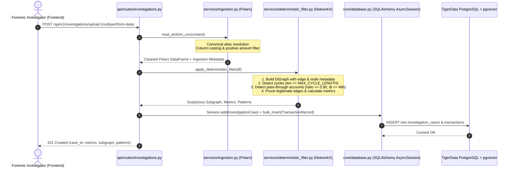
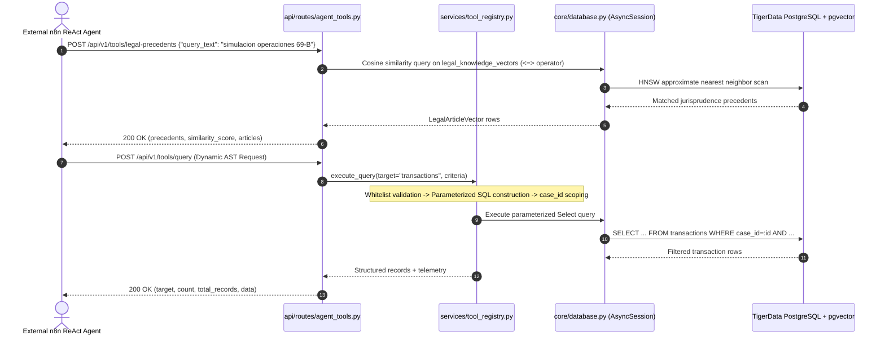
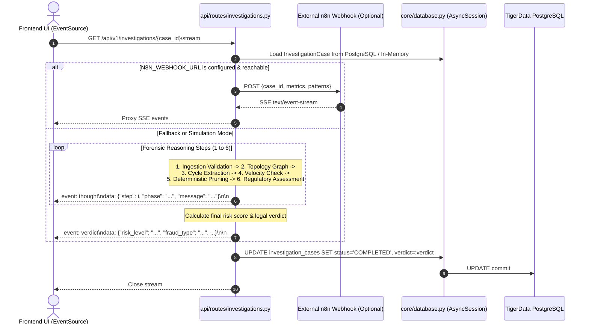
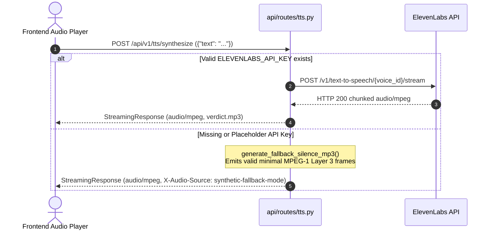

# Backend Architecture & Service Specification

[← Back to Master Documentation](../README.md) | [Agent Routing Index](../index.md)

---

## 1. Overview

The **Forensic Auditor AML Engine** backend is an asynchronous, high-performance microservice built on **FastAPI**. It is designed to detect, prune, and explain complex money laundering topographies (such as smurfing, circular layering, and rapid pass-through mule networks) across massive financial transaction datasets.

### Core Architectural Pillars
- **High-Throughput Columnar Ingestion**: Employs **Polars** (`polars.DataFrame`) for sub-second ingestion, canonical alias normalization, and memory-efficient filtering of banking transaction ledgers.
- **Deterministic Graph Pruning**: Uses **NetworkX** (`networkx.DiGraph`) to execute mathematical graph algorithms:
  - Directed cycle extraction (length 2 to $k$, default $k=5$) identifying circular layering and smurfing rings.
  - Temporal pass-through velocity detection (in/out ratio $\ge 90\%$ within $\le 48\text{h}$) isolating mule conduit accounts.
  - Noise reduction that deterministically prunes $85\%\text{--}98\%$ of legitimate volume, isolating the suspicious subgraph.
- **Persistent Relational Ledger & Vector Knowledge Base**: Built on **SQLAlchemy 2.0 (async)** connecting to managed PostgreSQL on **TigerData** with the **pgvector** extension:
  - Transactional persistence for cases (`investigation_cases`) and individual ledger rows (`transactions`).
  - 1536-dimensional vector embedding storage (`legal_knowledge_vectors`) with HNSW cosine distance indexing for semantic Mexican AML jurisprudence retrieval (CFF Art. 69-B, NIF A-2, UIF guidelines).
- **Scalable Query Interface & Dynamic Agent Tool Registry**: Dedicated tool endpoints and a composable Abstract Syntax Tree (AST) query builder for external **n8n** ReAct agents with strict column whitelisting, parameterized SQL generation, and mandatory `case_id` isolation.
- **Real-Time Forensic Agent Reasoning (SSE)**: Streams turn-by-turn investigative thoughts and legal verdicts via Server-Sent Events (`text/event-stream`), natively integrating with an external **n8n** webhook orchestrator with built-in high-fidelity fallback simulation.
- **Shielded ElevenLabs Audio Proxy**: Direct audio streaming proxy for verdict narration via ElevenLabs API, featuring a synthetic silent MP3 generator fallback for zero-downtime offline demonstrations.

```
+----------------------------------------------------------------------------------------------------+
|                                         FastAPI Application                                        |
|                                                                                                    |
|  +-----------------------------+  +----------------------------+  +-----------------------------+  |
|  |   /investigations/upload    |  |    /investigations/{id}    |  | /investigations/{id}/stream |  |
|  |  - Polars Fast Ingestion    |  |  - Case History & Subgraph |  |  - n8n ReAct Webhook Proxy  |  |
|  |  - NetworkX Pruning Engine  |  |  - Ingestion & Flow Stats  |  |  - 6-Phase Thought Fallback |  |
|  |  - PostgreSQL Persistence   |  |                            |  |  - Persistent Case Verdict  |  |
|  +--------------+--------------+  +-------------+--------------+  +--------------+--------------+  |
|                 |                               |                                |                 |
|                 v                               v                                v                 |
|  +----------------------------------------------------------------------------------------------+  |
|  |                         Agent Tool Router & Composable Query Builder                         |  |
|  |  - /tools/transactions  - /tools/entities  - /tools/patterns  - /tools/legal-precedents      |  |
|  |  - /tools/query (Dynamic AST Filter, Column Whitelisting, Parameterized SQL Execution)       |  |
|  +----------------------------------------------+-----------------------------------------------+  |
|                                                 |                                                  |
|                                                 v                                                  |
|  +-------------------------------------------------------------+  +-----------------------------+  |
|  |             Async SQLAlchemy 2.0 Engine Layer               |  |       /tts/synthesize       |  |
|  |  - TigerData PostgreSQL 16 (Connection Pool & SSL Enforced) |  |  - ElevenLabs Stream Proxy  |  |
|  |  - pgvector HNSW Index (Legal Precedent Cosine Search)      |  |  - Minimal Silent MP3 Frame |  |
|  |  - In-Memory Dual-Write Fallback Cache                      |  |    for Offline Resilience   |  |
|  +-------------------------------------------------------------+  +-----------------------------+  |
+----------------------------------------------------------------------------------------------------+
```

---

## 2. Architecture & Design

### Request Flow 1: Dataset Upload & Deterministic Pruning Pipeline

When a financial investigator uploads an AML transaction file (CSV), the ingestion and deterministic filter services execute synchronously to produce topological metrics, isolate the suspicious subgraph, and persist records to TigerData PostgreSQL.



### Request Flow 2: Agent Tools & Dynamic Query Execution (n8n Integration)

External n8n ReAct agents interact with the backend through specialized tool endpoints or the dynamic query builder to inspect transaction ledgers and retrieve legal precedents.



### Request Flow 3: SSE Thought Streaming & Forensic Verdict Persistence

Once an investigation is created, the frontend connects to the streaming endpoint to receive turn-by-turn forensic reasoning steps and the concluding legal verdict. Upon stream completion, the verdict is stored in PostgreSQL and the case status is updated to `COMPLETED`.



### Request Flow 4: ElevenLabs Audio Synthesis Proxy

The speech synthesis route acts as a security gateway, preventing leakage of `ELEVENLABS_API_KEY` to client browsers while supporting offline demonstration resilience.



---

## 3. Key Components & File Breakdown

The backend codebase follows a clean, modular structure organized by domain concerns:

```
backend/
├── Dockerfile
├── requirements.txt
├── main.py
├── core/
│   ├── __init__.py
│   ├── config.py
│   └── database.py
├── models/
│   ├── __init__.py
│   └── forensic.py
├── schemas/
│   ├── __init__.py
│   ├── agent_tools.py
│   └── investigation.py
├── api/
│   ├── __init__.py
│   └── routes/
│       ├── __init__.py
│       ├── agent_tools.py
│       ├── investigations.py
│       └── tts.py
├── services/
│   ├── __init__.py
│   ├── deterministic_filter.py
│   ├── ingestion.py
│   ├── investigation_reporting.py
│   └── tool_registry.py
└── tests/
    ├── __init__.py
    ├── conftest.py
    ├── test_agent_tools.py
    ├── test_challenge_m2_streaming.py
    ├── test_challenge_m3_tools.py
    ├── test_challenge_m4_2.py
    ├── test_challenge_m4_tts.py
    ├── test_challenger_m3_2.py
    ├── test_database.py
    ├── test_e2e_full_lifecycle.py
    ├── test_investigations.py
    ├── test_investigations_challenge.py
    ├── test_pipeline.py
    └── test_tts.py
```

### Component Responsibility Matrix

| File / Module | Responsibility | Key Symbols / Classes | External Dependencies |
| :--- | :--- | :--- | :--- |
| `backend/main.py` | Application entry point, lifespan management (`init_db`, `close_db`), CORS middleware, routing registration, and `/health` probe. | `app`, `lifespan()`, `health_check()` | `fastapi`, `uvicorn` |
| `backend/core/config.py` | Pydantic Settings application configuration, environment parsing, CORS origin normalization, and deterministic algorithm thresholds. | `Settings`, `settings` | `pydantic`, `pydantic-settings` |
| `backend/core/database.py` | Async SQLAlchemy 2.0 engine, connection pooling, SSL enforcement, transactional session management, and database schema initialization. | `get_engine()`, `get_session_factory()`, `get_db()`, `init_db()`, `close_db()`, `normalize_database_url()` | `sqlalchemy`, `asyncpg`, `psycopg` |
| `backend/models/forensic.py` | Declarative SQLAlchemy ORM models with cross-dialect compatibility (`JSON_DOCUMENT`), pgvector HNSW indexing, and seed Mexican AML jurisprudence. | `Base`, `InvestigationCase`, `TransactionRecord`, `LegalArticleVector`, `generate_deterministic_embedding()`, `seed_legal_knowledge()` | `sqlalchemy`, `pgvector` |
| `backend/schemas/investigation.py` | Pydantic v2 validation schemas for dataset upload, case listings, detail retrieval, metrics, and forensic verdicts. | `InvestigationUploadResponse`, `InvestigationSummary`, `InvestigationPaginationResponse`, `InvestigationDetailResponse` | `pydantic` |
| `backend/schemas/agent_tools.py` | Pydantic v2 models for dedicated agent tools, filter operators, dynamic composable queries, and column whitelists. | `TransactionQueryRequest`, `EntityProfileRequest`, `PatternQueryRequest`, `LegalPrecedentQueryRequest`, `DynamicQueryRequest`, `DynamicQueryResponse` | `pydantic` |
| `backend/api/routes/investigations.py` | HTTP controller for CSV upload, paginated case history, case detail retrieval, and SSE reasoning proxying n8n or simulated reasoning with database persistence. | `upload_investigation_dataset()`, `list_investigations()`, `get_investigation_detail()`, `stream_investigation_thoughts()`, `INVESTIGATION_CASES` | `fastapi`, `httpx`, `asyncio`, `uuid` |
| `backend/api/routes/agent_tools.py` | Router exposing dedicated tool endpoints and the dynamic query builder for external n8n ReAct agents. | `query_transactions()`, `profile_entity()`, `query_patterns()`, `query_legal_precedents()`, `execute_dynamic_query()` | `fastapi`, `sqlalchemy` |
| `backend/api/routes/tts.py` | Audio synthesis controller, ElevenLabs streaming proxy, and bitwise-compliant silent MPEG-1 Layer 3 fallback generator. | `SynthesizeRequest`, `synthesize_speech()`, `stream_elevenlabs_audio()`, `generate_fallback_silence_mp3()` | `fastapi`, `httpx`, `pydantic` |
| `backend/services/ingestion.py` | High-speed tabular ingestion using Polars. Handles alias detection for IBM AMLSim datasets, column casting, sanitization, and dataset metrics. | `read_amlsim_csv()`, `find_canonical_column()`, `COLUMN_ALIASES` | `polars` |
| `backend/services/deterministic_filter.py` | Topological graph construction, directed cycle search, rapid pass-through node detection, and noise pruning. | `build_transaction_graph()`, `detect_closed_cycles()`, `detect_passthrough_accounts()`, `apply_deterministic_filter()` | `networkx`, `polars` |
| `backend/services/tool_registry.py` | Extensible query registry and parameterized AST builder enforcing column whitelisting, mandatory `case_id` scoping, and dual PostgreSQL/in-memory execution. | `ToolRegistry`, `tool_registry`, `TargetMetadata` | `sqlalchemy`, `fastapi` |
| `backend/services/investigation_reporting.py` | Auxiliary reporting and formatting utilities for investigation summaries and audit trails. | `format_investigation_summary()`, `generate_audit_trail()` | stdlib |
| `backend/tests/` | Comprehensive test suite containing 121 automated tests across 13 test modules validating database CRUD, agent tools, streaming, and TTS proxying. | Full test suite (`test_e2e_full_lifecycle.py`, `test_database.py`, etc.) | `pytest`, `pytest-asyncio`, `httpx` |

---

## 4. Database Architecture, Models & Agent Tool Registry

### 4.1 TigerData PostgreSQL & pgvector Database Layer

The backend connects directly to managed PostgreSQL 16 hosted on **TigerData**, integrating via async **SQLAlchemy 2.0**:

- **Engine Configuration (`backend/core/database.py`)**:
  - Connection pooling: `pool_size=20`, `max_overflow=10`, `pool_pre_ping=True`, `pool_recycle=3600`.
  - SSL enforcement: automatically verifies and enforces `sslmode=require` across both `postgresql+asyncpg` and `postgresql+psycopg` schemes via `normalize_database_url()`.
  - Safe logging: `sanitize_database_url()` masks database passwords in operational logs.
- **Dependency Injection & Lifecycle**:
  - `get_db()` yields an `AsyncSession`, commits automatically on successful route completion, and rolls back upon unhandled exceptions.
  - `init_db()` creates tables, initializes the `pgvector` extension, and idempotently populates seed Mexican AML legal precedents (`seed_legal_knowledge()`).
  - In offline mode (when `DATABASE_URL` is unset), `get_optional_db()` yields `None`, causing routes to gracefully operate using the in-memory dual-write store (`INVESTIGATION_CASES`).

### 4.2 Database Models & Schema Design (`backend/models/forensic.py`)

```python
class InvestigationCase(Base):
    __tablename__ = "investigation_cases"

    id: Mapped[uuid.UUID] = mapped_column(Uuid, primary_key=True, default=uuid.uuid4)
    filename: Mapped[str] = mapped_column(String(255), nullable=False)
    status: Mapped[str] = mapped_column(String(50), nullable=False, default="PENDING")
    created_at: Mapped[datetime] = mapped_column(DateTime(timezone=True), server_default=func.now())
    updated_at: Mapped[datetime] = mapped_column(DateTime(timezone=True), server_default=func.now(), onupdate=func.now())

    ingestion_metadata: Mapped[Dict[str, Any]] = mapped_column(JSON_DOCUMENT, nullable=False, default=dict)
    metrics: Mapped[Dict[str, Any]] = mapped_column(JSON_DOCUMENT, nullable=False, default=dict)
    subgraph: Mapped[Dict[str, Any]] = mapped_column(JSON_DOCUMENT, nullable=False, default=dict)
    patterns: Mapped[Dict[str, Any]] = mapped_column(JSON_DOCUMENT, nullable=False, default=dict)
    verdict: Mapped[Optional[Dict[str, Any]]] = mapped_column(JSON_DOCUMENT, nullable=True, default=None)

    transactions: Mapped[List["TransactionRecord"]] = relationship(
        "TransactionRecord", back_populates="case", cascade="all, delete-orphan", passive_deletes=True
    )


class TransactionRecord(Base):
    __tablename__ = "transactions"

    id: Mapped[uuid.UUID] = mapped_column(Uuid, primary_key=True, default=uuid.uuid4)
    case_id: Mapped[uuid.UUID] = mapped_column(
        Uuid, ForeignKey("investigation_cases.id", ondelete="CASCADE"), index=True, nullable=False
    )
    origin: Mapped[str] = mapped_column(String(100), index=True, nullable=False)
    destination: Mapped[str] = mapped_column(String(100), index=True, nullable=False)
    amount: Mapped[Decimal] = mapped_column(Numeric(18, 2), nullable=False)
    timestamp: Mapped[datetime] = mapped_column(DateTime(timezone=True), nullable=False)
    is_suspicious: Mapped[bool] = mapped_column(Boolean, default=False, index=True, nullable=False)
    reasons: Mapped[List[str]] = mapped_column(JSON_DOCUMENT, default=list, nullable=False)

    case: Mapped["InvestigationCase"] = relationship("InvestigationCase", back_populates="transactions")


class LegalArticleVector(Base):
    __tablename__ = "legal_knowledge_vectors"

    id: Mapped[uuid.UUID] = mapped_column(Uuid, primary_key=True, default=uuid.uuid4)
    article_code: Mapped[str] = mapped_column(String(50), unique=True, index=True, nullable=False)
    law_name: Mapped[str] = mapped_column(String(100), nullable=False)
    content: Mapped[str] = mapped_column(Text, nullable=False)
    embedding: Mapped[Optional[List[float]]] = mapped_column(Vector(1536), nullable=True)

    __table_args__ = (
        Index(
            "idx_legal_vectors_hnsw",
            "embedding",
            postgresql_using="hnsw",
            postgresql_with={"m": 16, "ef_construction": 64},
            postgresql_ops={"embedding": "vector_cosine_ops"},
        ),
    )
```

### 4.3 Agent Tool Registry & Dynamic Query Builder (`backend/services/tool_registry.py`)

The dynamic query registry allows external n8n AI agents to compose parameterized filter queries against transaction ledgers with strict security boundaries:

- **AST Column Whitelisting**: Every query target (`transactions`, `cases`, `entities`, `patterns`, `cycles`, `passthrough_accounts`, `legal_precedents`) defines an immutable whitelist of queryable and sortable fields. Probing unapproved columns raises HTTP 400.
- **Mandatory `case_id` Scoping**: For case-scoped targets, `case_id` is mandatory to enforce multi-tenant isolation and prevent unauthorized data leaks.
- **SQL Injection Prevention**: All criteria operators (`eq`, `neq`, `gt`, `gte`, `lt`, `lte`, `like`, `ilike`, `in`, `not_in`) translate into bound SQLAlchemy expressions rather than raw string concatenation.
- **Dual Execution Engine**: Executes against PostgreSQL via `AsyncSession` when configured, with automatic fallback to the in-memory case store when operating offline.

### 4.4 External n8n Webhook Integration

When `settings.N8N_WEBHOOK_URL` is set:
1. `GET /api/v1/investigations/{case_id}/stream` forwards case metrics and patterns to n8n via HTTP POST.
2. The route checks for `Content-Type: text/event-stream` and streams lines asynchronously using `response.aiter_lines()`.
3. If unreachable or timed out (`timeout=10.0`), the route falls back seamlessly to the internal 6-phase reasoning generator.

### 4.5 ElevenLabs Speech Synthesis Proxy & Silent Frame Fallback

The route `POST /api/v1/tts/synthesize` provides speech synthesis for the final forensic audit summary:
- **Upstream**: `https://api.elevenlabs.io/v1/text-to-speech/{voice_id}/stream`
- **Default Voice**: Rachel (`21m00Tcm4TlvDq8ikWAM`) | **Default Model**: `eleven_multilingual_v2`
- **Offline Safeguard**: When `ELEVENLABS_API_KEY` is not set, empty, or placeholder, the service streams a valid bitwise 320-byte MPEG-1 Layer 3 silent frame (`0xFF 0xFB 0x90 0x64...`) with header `X-Audio-Source: synthetic-fallback-mode`, preventing browser audio decoders from failing.

---

## 5. Public API Specifications

### 5.1 Ingest Dataset & Apply Filter
- **Method**: `POST`
- **Path**: `/api/v1/investigations/upload`
- **Content-Type**: `multipart/form-data`
- **Request Parameters**:
  - `file`: CSV file (required).
- **Validation Rules**:
  - Filename must end with `.csv`.
  - Must include columns mapping to origin, destination, amount, and optionally timestamp.
  - Amount must be strictly greater than zero.

#### Response: `201 Created`
```json
{
  "case_id": "4a71d87e-4081-4877-94a2-23c28c89b3f1",
  "message": "Dataset successfully processed and pruned.",
  "metrics": {
    "total_nodes_analyzed": 7,
    "suspicious_nodes_count": 5,
    "pruned_nodes_count": 2,
    "total_edges_analyzed": 7,
    "suspicious_edges_count": 5,
    "pruned_edges_count": 2,
    "suspicious_volume_mxn": 943000.0,
    "detected_cycles_count": 1,
    "passthrough_accounts_count": 1,
    "pruning_efficiency_pct": 28.57
  },
  "subgraph": {
    "nodes": [
      {
        "id": "ACC_A",
        "total_in": 145000.0,
        "total_out": 150000.0,
        "in_degree": 1,
        "out_degree": 1,
        "reasons": ["CIRCULAR_FLOW_CYCLE"],
        "risk_score": 0.8
      },
      {
        "id": "MULE_01",
        "total_in": 500000.0,
        "total_out": 485000.0,
        "in_degree": 1,
        "out_degree": 1,
        "reasons": ["HIGH_VELOCITY_PASSTHROUGH_90PCT"],
        "risk_score": 0.7
      }
    ],
    "edges": [
      {
        "source": "ACC_A",
        "target": "ACC_B",
        "amount": 150000.0,
        "count": 1,
        "timestamps": [1.0],
        "reasons": ["CYCLE_STEP"]
      }
    ]
  },
  "patterns": {
    "cycles": [
      {
        "path": ["ACC_A", "ACC_B", "ACC_C", "ACC_A"],
        "length": 3,
        "estimated_volume": 443000.0
      }
    ],
    "passthrough_accounts": [
      {
        "account": "MULE_01",
        "total_in": 500000.0,
        "total_out": 485000.0,
        "ratio": 0.97,
        "time_delta_hours": 12.0
      }
    ]
  }
}
```

---

### 5.2 List Investigation Cases
- **Method & Path**: `GET /api/v1/investigations`
- **Query Parameters**: `page` (int, default 1), `page_size` (int, default 20), `status` (optional string)
- **Response**: `200 OK`

```json
{
  "total": 42,
  "page": 1,
  "page_size": 20,
  "pages": 3,
  "items": [
    {
      "case_id": "4a71d87e-4081-4877-94a2-23c28c89b3f1",
      "filename": "sample_amlsim.csv",
      "status": "COMPLETED",
      "created_at": "2026-09-12T08:15:20Z",
      "updated_at": "2026-09-12T08:15:35Z",
      "metrics": { "suspicious_volume_mxn": 943000.0, "pruning_efficiency_pct": 28.57 },
      "verdict": { "risk_level": "CRÍTICO", "confidence_score": 0.94 }
    }
  ]
}
```

### 5.3 Get Case Detail & Subgraph
- **Method & Path**: `GET /api/v1/investigations/{case_id}`
- **Response**: `200 OK` (Full case record, topological metrics, subgraph, patterns, and verdict)

### 5.4 Stream Investigation Thoughts (SSE)
- **Method & Path**: `GET /api/v1/investigations/{case_id}/stream`
- **Media-Type**: `text/event-stream`
- **Headers**:
  - `Cache-Control: no-cache`
  - `Connection: keep-alive`
  - `X-Accel-Buffering: no`

#### Event Formats:
1. **Thought Event (`event: thought`)**:
   ```text
   event: thought
   data: {"step": 3, "phase": "Extracción de Ciclos Dirigidos", "message": "Detección de patrones circulares: 1 ciclos cerrados detectados (evidencia de tipología de pitufeo / smurfing).", "timestamp": "2026-09-12T08:15:30.123456+00:00"}
   ```

2. **Verdict Event (`event: verdict`)**:
   ```text
   event: verdict
   data: {"case_id": "4a71d87e-4081-4877-94a2-23c28c89b3f1", "risk_level": "CRÍTICO", "fraud_type": "Estructuración Circular (Smurfing) y Cuentas Mula de Paso Rápido", "total_amount_mxn": 943000.0, "confidence_score": 0.94, "entities_involved": ["ACC_A", "ACC_B", "ACC_C", "MULE_01", "OFFSHORE_OUT"], "pruned_leads_count": 2, "patterns_summary": {"closed_cycles": 1, "passthrough_accounts": 1, "pruning_efficiency_pct": 28.57}, "legal_recommendation": "Presentar de forma urgente un Reporte de Operación Inusual (ROI) ante la UIF y proceder con la congelación cautelar de los fondos remanentes en las cuentas puente.", "audit_summary_text": "Dictamen Pericial Forense para el caso 4a71d87e. Se identificó una red estructurada de lavado de dinero...", "completed_at": "2026-09-12T08:15:33.456789+00:00"}
   ```

### 5.5 Agent Tools API

#### Query Transactions Tool
- **Method & Path**: `POST /api/v1/tools/transactions`
- **Request Body**:
  ```json
  {
    "case_id": "4a71d87e-4081-4877-94a2-23c28c89b3f1",
    "min_amount": 100000.0,
    "is_suspicious": true,
    "limit": 50
  }
  ```

#### Profile Entity Tool
- **Method & Path**: `POST /api/v1/tools/entities`
- **Request Body**:
  ```json
  {
    "case_id": "4a71d87e-4081-4877-94a2-23c28c89b3f1",
    "account_id": "MULE_01"
  }
  ```

#### Query Patterns Tool
- **Method & Path**: `POST /api/v1/tools/patterns`
- **Request Body**: `{"case_id": "4a71d87e-4081-4877-94a2-23c28c89b3f1", "pattern_type": "ALL"}`

#### Legal Precedents Similarity Tool
- **Method & Path**: `POST /api/v1/tools/legal-precedents`
- **Request Body**:
  ```json
  {
    "query_text": "simulacion operaciones 69-B defraudacion fiscal",
    "limit": 5,
    "threshold": 0.5
  }
  ```

#### Dynamic Composable Query Builder
- **Method & Path**: `POST /api/v1/tools/query`
- **Request Body**:
  ```json
  {
    "target": "transactions",
    "case_id": "4a71d87e-4081-4877-94a2-23c28c89b3f1",
    "filters": [
      { "field": "amount", "operator": "gte", "value": 150000.0 },
      { "field": "is_suspicious", "operator": "eq", "value": true }
    ],
    "sort_by": "amount",
    "sort_order": "desc",
    "limit": 10
  }
  ```

### 5.6 Synthesize Speech Proxy (TTS)
- **Method & Path**: `POST /api/v1/tts/synthesize`
- **Content-Type**: `application/json`
- **Media-Type Response**: `audio/mpeg`
- **Request Body**:
  ```json
  {
    "text": "Dictamen pericial forense completado con éxito. Se identificó una red de lavado de dinero con nivel de riesgo CRÍTICO.",
    "voice_id": "21m00Tcm4TlvDq8ikWAM",
    "model_id": "eleven_multilingual_v2"
  }
  ```

### 5.7 Health Check
- **Method & Path**: `GET /health`
- **Response**: `200 OK`
  ```json
  {
    "status": "healthy",
    "project": "Forensic Auditor AML Engine",
    "environment": "development"
  }
  ```

---

## 6. Algorithmic Deep-Dive: Deterministic Pruning Engine

The deterministic filter is located in `backend/services/deterministic_filter.py`. It is engineered to mathematically strip benign transaction noise while preserving suspicious clusters.

### 6.1 Column Alias Resolution & Polars Ingestion
To handle varying banking formats without manual schema remodeling, `services/ingestion.py` maps column variations using alias lookup tables:
```python
COLUMN_ALIASES = {
    "origin": ["origin", "nameorig", "from_account", "source", "orig_account", "orig"],
    "destination": ["destination", "namedest", "to_account", "target", "dest_account", "dest"],
    "amount": ["amount", "value", "monto", "sum"],
    "timestamp": ["timestamp", "step", "time", "date", "datetime", "trans_time"],
}
```
If timestamps are absent, Polars generates an synthetic sequence step:
```python
select_exprs.append(pl.int_range(0, df.height, dtype=pl.Float64).alias("timestamp"))
```

### 6.2 Directed Cycle Search (`detect_closed_cycles`)
Identifies cyclical smurfing topologies where money leaves an origin and returns through intermediaries to obfuscate origin:
- Algorithm: Evaluates elementary directed cycles using `networkx.simple_cycles(G)`.
- Complexity Safeguard: Bounded by `max_cycle_length: int = settings.MAX_CYCLE_LENGTH` (default `5`).
- Paths longer than $k$ are ignored to prevent combinatorial explosion on dense graphs ($\mathcal{O}((V + E)(C + 1))$).

### 6.3 Temporal Pass-Through Mule Detection (`detect_passthrough_accounts`)
Identifies rapid layering accounts (mules or shell entities) based on retention ratio and velocity:
$$\text{Ratio} = \frac{\min(\text{total\_in}, \text{total\_out})}{\max(\text{total\_in}, \text{total\_out})} \ge 0.90$$
$$\Delta t = |\max(t_{\text{out}}) - \min(t_{\text{in}})| \le 48.0\text{ hours}$$
Accounts meeting these criteria have incoming and outgoing edges tagged with `PASSTHROUGH_BRIDGE`.

### 6.4 Graph Noise Reduction Ratio
Transactions not participating in detected cycles or pass-through bridges are pruned:
$$\text{Pruning Efficiency} = \left(\frac{E_{\text{total}} - E_{\text{suspicious}}}{E_{\text{total}}}\right) \times 100\%$$
On standard AMLSim datasets, this eliminates over $90\%$ of edges, allowing the forensic auditor LLM to concentrate only on the high-probability criminal core.

---

## 7. Testing & Quality Assurance

The backend contains an automated test suite verifying all database operations, model CRUD, ingestion algorithms, agent tools, SSE streaming, and speech synthesis.

### Test Architecture
- **Framework**: `pytest` with `pytest-asyncio` and `anyio`.
- **Database Isolation Fixture**: `backend/tests/conftest.py` configures an isolated in-memory SQLite engine (`sqlite+aiosqlite:///:memory:`) using `@compiles(Vector, "sqlite")` and `@compiles(JSONB, "sqlite")` hooks with FastAPI `dependency_overrides[get_db]`.
- **Test Inventory**: **121 automated test cases** across **13 test modules** passing with a **100% success rate**.

| Test Module | Coverage Scope | Test Count |
| :--- | :--- | :--- |
| `test_database.py` | Connection pooling, SSL enforcement, CRUD, cascade deletion, vector cosine search, seed data. | 7 |
| `test_investigations.py` | Upload persistence, paginated listing, case detail retrieval, SSE stream verdict save. | 9 |
| `test_agent_tools.py` | Dedicated tools (`/transactions`, `/entities`, `/patterns`, `/legal-precedents`) & dynamic query builder. | 25 |
| `test_tts.py` | Speech proxy streaming, silent MPEG fallback frame, input validation, disconnect handling. | 15 |
| `test_e2e_full_lifecycle.py` | Unified 10-step end-to-end forensic lifecycle, security whitelisting, cascade deletion. | 5 |
| `test_pipeline.py` | Complete upload -> deterministic pruning -> SSE streaming -> TTS synthesis pipeline. | 4 |
| `test_challenge_*` | Adversarial stress suites, corrupt CSVs, injection attacks, socket leak stress tests. | 56 |

### Running Tests
Execute from the project root using the virtual environment:
```bash
# Full test suite
.\.venv\Scripts\python.exe -m pytest backend/tests/ -v

# Targeted E2E lifecycle test
.\.venv\Scripts\python.exe -m pytest backend/tests/test_e2e_full_lifecycle.py -v

# Base pipeline test
.\.venv\Scripts\python.exe -m pytest backend/tests/test_pipeline.py -v
```

---

## 8. Edge Cases, Performance & Gotchas

### 8.1 Cycle Explosion Safeguards in NetworkX
In dense or fully connected subgraphs, standard elementary cycle detection algorithms (Johnson's algorithm) can exhibit exponential time complexity $\mathcal{O}((V + E)(c + 1))$ where $c$ is the number of cycles.
- **Safeguard**: The backend strictly caps cycle length at `settings.MAX_CYCLE_LENGTH` (default 5).
- **Production Recommendation**: If scaling to graphs with $>100,000$ edges, compute weakly connected components first via `nx.weakly_connected_components(G)` and run cycle detection independently per component inside a thread/process pool.

### 8.2 Polars Memory Efficiency
Polars uses Apache Arrow memory layouts with zero-copy operations. However, constructing a NetworkX Python graph requires creating Python objects for nodes and edges:
- For files $> 500\text{ MB}$, avoid `df.to_dicts()`. Instead, extract native Polars series (`df["origin"].to_numpy()`, `df["destination"].to_numpy()`) to build graph edges directly, or stream edge batches to reduce memory consumption.

### 8.3 Server-Sent Events (SSE) Client Disconnection & Buffering
- **Proxy Buffering**: Reverse proxies (such as Nginx or AWS ALB) often buffer chunked HTTP responses by default, delaying real-time event delivery. The backend sets the `X-Accel-Buffering: no` header to ensure immediate streaming.
- **Client Cancellation**: In `investigations.py`, `asyncio.sleep()` is used between reasoning steps. If the client closes the connection, FastAPI handles the cancelled generator cleanly, aborting subsequent steps without leaking tasks.

### 8.4 AST Whitelisting & SQL Injection Prevention
- The dynamic tool query builder (`/tools/query`) evaluates incoming filter criteria against an explicit whitelist of allowed model attributes. Arbitrary column probing, raw SQL strings, or attempts to access undeclared columns are rejected with HTTP 400.

### 8.5 Dual-Write & Offline In-Memory Fallback
- If `DATABASE_URL` is unconfigured or the TigerData instance is unreachable during local demonstrations, `INVESTIGATION_CASES` maintains an in-memory dual-write store, ensuring zero demo interruption.

### 8.6 CORS Configuration
When running the Next.js frontend on `http://localhost:3000` or production domains, CORS origins must be configured via the `BACKEND_CORS_ORIGINS` environment variable. `core/config.py` supports comma-separated strings (`"http://localhost:3000,http://app.domain.com"`) or JSON arrays (`'["http://localhost:3000"]'`).

---

## 9. Configuration Reference

All settings can be specified via environment variables or a `.env` file loaded in `backend/core/config.py`:

| Variable | Type | Default Value | Description |
| :--- | :--- | :--- | :--- |
| `PROJECT_NAME` | string | `"Forensic Auditor AML Engine"` | API title in Swagger documentation |
| `API_V1_STR` | string | `"/api/v1"` | URL prefix for V1 endpoints |
| `ENVIRONMENT` | string | `"development"` | Environment indicator (`development`, `production`, `test`) |
| `DEBUG` | boolean | `True` | Enables debug logging and interactive API docs |
| `BACKEND_CORS_ORIGINS` | list / str | `["http://localhost:3000", ...]` | Allowed HTTP origins for CORS validation |
| `DATABASE_URL` | string | `""` | PostgreSQL connection string for TigerData instance |
| `POSTGRES_USER` | string | `"forensic_user"` | PostgreSQL username |
| `POSTGRES_PASSWORD` | string | `"forensic_password"` | PostgreSQL password |
| `POSTGRES_HOST` | string | `"localhost"` | PostgreSQL hostname |
| `POSTGRES_PORT` | integer | `5432` | PostgreSQL port |
| `POSTGRES_DB` | string | `"forensic_auditor"` | PostgreSQL database name |
| `DB_POOL_SIZE` | integer | `20` | Maximum persistent connection pool size |
| `DB_MAX_OVERFLOW` | integer | `10` | Temporary connection overflow above pool size |
| `DB_POOL_PRE_PING` | boolean | `True` | Tests connection validity prior to checkout |
| `DB_POOL_RECYCLE` | integer | `3600` | Recycles connections older than 1 hour (seconds) |
| `DB_SSL_REQUIRE` | boolean | `True` | Enforces SSL mode (`sslmode=require`) |
| `DB_ECHO` | boolean | `False` | Logs raw SQL queries to console |
| `N8N_WEBHOOK_URL` | string | `""` | Optional external n8n orchestrator webhook URL |
| `ELEVENLABS_API_KEY` | string | `""` | ElevenLabs API token |
| `ELEVENLABS_VOICE_ID` | string | `"21m00Tcm4TlvDq8ikWAM"` | ElevenLabs voice ID (Rachel) |
| `ELEVENLABS_MODEL_ID` | string | `"eleven_multilingual_v2"` | ElevenLabs model ID |
| `MAX_CYCLE_LENGTH` | integer | `5` | Upper limit on path length for cycle detection |
| `PASS_THROUGH_RATIO_THRESHOLD` | float | `0.90` | Minimum turnover ratio for mule account detection |
| `PASS_THROUGH_WINDOW_HOURS` | float | `48.0` | Maximum time window in hours for pass-through analysis |
