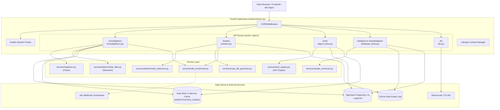
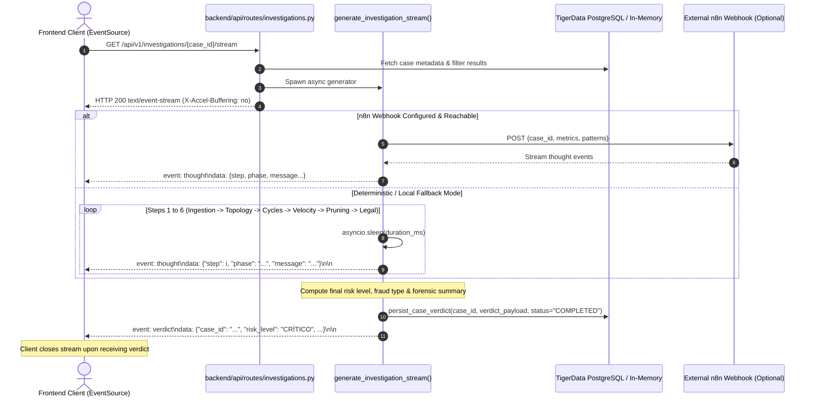
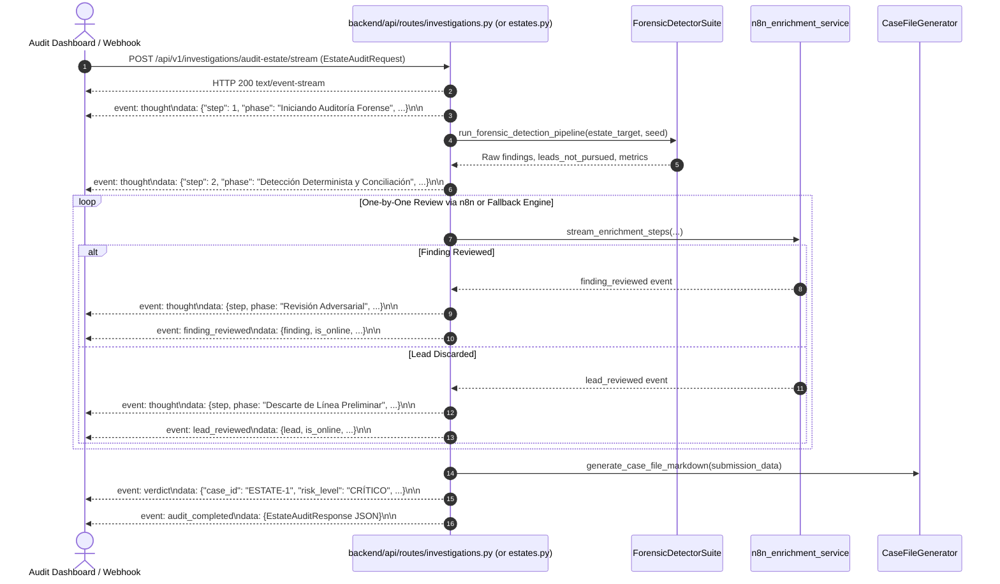

# Backend API & Routing Subsystem

[← Back to Backend Documentation](../README.md) | [Master Architecture](../../README.md) | [Agent Routing Index](../../index.md)

---

## 1. Overview

The **Backend API** subsystem serves as the primary ingress and orchestration layer for the Polar Forensic Auditor AML Engine. Built with **FastAPI** on Python 3.11+, it exposes synchronous REST endpoints, long-lived Server-Sent Events (SSE) reasoning streams, dedicated agent tool APIs for external **n8n** ReAct agents, and an administrative CLI command runner.

### Core Responsibilities
1. **Application Factory & Lifespan Orchestration**: Initializes database connection pools (TigerData PostgreSQL + pgvector) and seed Mexican legal jurisprudence on startup, gracefully tearing down connections upon shutdown (`backend/main.py`).
2. **Investigation Lifecycle Management**: Ingests IBM AMLSim transaction CSVs, executes Polars column alias mapping, applies NetworkX graph pruning, and exposes paginated case queries (`backend/api/routes/investigations.py`).
3. **Real-Time Forensic Reasoning Streaming (SSE)**: Streams turn-by-turn investigative reasoning thoughts and legal verdicts over `text/event-stream` connections for both dataset investigations and full SQLite data estate audits (`backend/api/routes/investigations.py` & `backend/api/routes/estates.py`).
4. **Data Estate Management & Ingestion**: Accepts SQLite `.db` estate uploads, executes zero-network forensic fraud detection pipelines across multiple financial tables, and streams live audits (`backend/api/routes/estates.py`).
5. **Agent Tool Registry & Dynamic AST Query Engine**: Provides 11 dedicated investigation tools (entity profiling, pattern analysis, money flow tracing, circular loops, cashouts, KYC history) and an AST-driven parameterized query builder for autonomous AI agents (`backend/api/routes/agent_tools.py`).
6. **Data Estate Inspection & Evidentiary Exhibits**: Provides schema cataloging, granular table queries across all 13 financial and banking tables, and formal exhibit registration (`backend/api/routes/database_tools.py`).
7. **Shielded Speech Synthesis Proxy (TTS)**: Proxies verdict narration to ElevenLabs while strictly protecting `ELEVENLABS_API_KEY` on the server, featuring a bitwise-valid silent MPEG-1 Layer 3 fallback generator for offline zero-downtime demonstrations (`backend/api/routes/tts.py`).
8. **Autonomous CLI Entry Point**: Enables head-to-head automated audits from the command line, generating reproducible case files (`case_file.md`), schema-compliant JSON submissions (`submission.json`), and per-table 2% peso reconciliation reports (`backend/cli.py`).

---

## 2. Architecture & Design

### 2.1 Endpoint Routing Topology

The following diagram illustrates how incoming requests are dispatched across the FastAPI routers and underlying database/service components:



---

### 2.2 Streaming SSE Reasoning Lifecycles

#### A. Investigation Thought Stream (`GET /api/v1/investigations/{case_id}/stream`)
Connects the frontend to real-time 6-phase reasoning updates. Completes with a terminal verdict event and saves the verdict to PostgreSQL and memory.



#### B. Estate Audit SSE Stream (`POST/GET /api/v1/investigations/audit-estate/stream` or `/api/v1/estates/upload-stream`)
Streams granular review events as individual findings and preliminary leads are inspected by n8n or the deterministic audit suite.



---

## 3. Key Files & Router Structure

| File | Module Path | Primary Responsibility | Key Classes & Functions |
| :--- | :--- | :--- | :--- |
| `backend/main.py` | `backend.main` | Application initialization, CORS middleware, lifespan events, database startup/shutdown, router aggregation, and `/health`. | `app`, `lifespan()`, `health_check()` |
| `backend/cli.py` | `backend.cli` | Zero-network command-line interface for estate audits, artifact export (`case_file.md`, `submission.json`), and validation. | `run_audit()`, `main()`, `print_summary()` |
| `backend/api/routes/investigations.py` | `backend.api.routes.investigations` | AMLSim CSV upload, Polars parsing, NetworkX pruning, paginated case history, detail retrieval, and SSE thought streaming. | `upload_investigation_dataset()`, `list_investigations()`, `get_investigation_detail()`, `stream_investigation_thoughts()`, `audit_estate_endpoint()` |
| `backend/api/routes/estates.py` | `backend.api.routes.estates` | Estate file ingestion (`.db`, `.csv`), immediate/deferred audit execution, and SSE upload-streaming. | `upload_estate()`, `upload_estate_and_stream()`, `get_estate_audit_stream()` |
| `backend/api/routes/agent_tools.py` | `backend.api.routes.agent_tools` | 11 specialized agent tools for n8n ReAct agents and dynamic AST query execution. | `query_transactions()`, `profile_entities()`, `query_patterns()`, `query_legal_precedents()`, `dynamic_query()`, `find_related_entities()`, `detect_circular_flow()` |
| `backend/api/routes/database_tools.py` | `backend.api.routes.database_tools` | Data estate inspection, catalog of 13 tables, individual table queries, exhibit creation, and sensitive field masking. | `list_tables()`, `get_vendors()`, `get_invoices()`, `get_ledger()`, `create_exhibit()`, `query_any_table()` |
| `backend/api/routes/tts.py` | `backend.api.routes.tts` | ElevenLabs text-to-speech audio proxy, key shielding, safe mode quota protection, and silent MPEG fallback generator. | `synthesize_speech()`, `stream_elevenlabs_audio()`, `generate_fallback_silence_mp3()`, `is_elevenlabs_disabled()` |

---

## 4. Complete Endpoints Reference Table

### 4.1 System & Health Probes
| HTTP Method | Route Path | Request Schema | Response Schema | Status Codes | Description |
| :--- | :--- | :--- | :--- | :--- | :--- |
| `GET` | `/health` | None | `dict` (`status`, `project`, `environment`) | `200 OK` | Liveness/readiness probe for container orchestrators. |
| `GET` | `/api/v1/docs` | None | HTML | `200 OK` | Interactive Swagger OpenAPI documentation. |
| `GET` | `/api/v1/redoc` | None | HTML | `200 OK` | ReDoc API specification documentation. |
| `GET` | `/api/v1/openapi.json` | None | `dict` | `200 OK` | Raw OpenAPI 3.1 JSON schema definition. |

---

### 4.2 Investigations Router (`/api/v1/investigations`)
Prefix: `/api/v1/investigations` | Tag: `investigations`

| HTTP Method | Route Path | Request Body / Params | Response Schema | Status Codes | Description |
| :--- | :--- | :--- | :--- | :--- | :--- |
| `POST` | `/upload` | Multipart `file: UploadFile` (CSV) | `InvestigationUploadResponse` | `201 Created`<br/>`400 Bad Request`<br/>`422 Unprocessable`<br/>`500 Internal Error` | Ingests AMLSim CSV dataset, extracts topology, prunes noise, persists case and bulk transactions. |
| `GET` | `` (root) | Query: `page` (int, def 1), `page_size` (int, def 20), `status` (opt string) | `InvestigationPaginationResponse` | `200 OK` | Returns paginated list of cases sorted by `created_at` desc. |
| `GET` | `/{case_id}` | Path: `case_id: uuid.UUID` | `InvestigationDetailResponse` | `200 OK`<br/>`404 Not Found` | Retrieves full case record, topological metrics, subgraph, patterns, and verdict. |
| `GET` | `/{case_id}/stream` | Path: `case_id: uuid.UUID` | `text/event-stream` (`thought`, `verdict`) | `200 OK`<br/>`404 Not Found` | Real-time SSE reasoning stream; persists completed verdict to DB. |
| `POST` | `/audit-estate` | JSON `EstateAuditRequest` | `EstateAuditResponse` | `200 OK`<br/>`404 Not Found` | Executes zero-network deterministic audit against SQLite estate file or PostgreSQL. |
| `POST` | `/audit-estate/stream` | JSON `EstateAuditRequest` | `text/event-stream` (`thought`, `finding_reviewed`, `lead_reviewed`, `verdict`, `audit_completed`) | `200 OK` | SSE stream of estate audit with one-by-one finding/lead review. |
| `GET` | `/audit-estate/stream` | Query: `estate_path`, `seed`, `company_rfc`, `company_name`, `n8n_url` (pass `"offline"` to skip all n8n calls and force the deterministic engine) | `text/event-stream` | `200 OK` | Browser EventSource-compatible GET SSE stream for estate audit. |

---

### 4.3 Estates Router (`/api/v1/estates`)
Prefix: `/api/v1/estates` | Tag: `estates`

| HTTP Method | Route Path | Request Body / Params | Response Schema | Status Codes | Description |
| :--- | :--- | :--- | :--- | :--- | :--- |
| `POST` | `/upload` | Multipart `file: UploadFile` (`.db`, `.csv`), Form: `seed`, `company_name`, `company_rfc`, `audit: bool` | `EstateAuditResponse` (if `audit=True`) or `dict` (`READY`, `estate_id`, `estate_path`, `size_bytes`) | `200 OK`<br/>`400 Bad Request`<br/>`500 Internal Error` | Uploads SQLite `.db` or estate archive. If `audit=True`, immediately audits estate. |
| `POST` | `/upload-stream` | Multipart `file: UploadFile`, Form: `seed`, `company_name`, `company_rfc` | `text/event-stream` | `200 OK`<br/>`400 Bad Request` | Saves uploaded estate and immediately streams SSE reasoning progress. |
| `GET` | `/stream` | Query: `estate_path`, `seed`, `company_rfc`, `company_name`, `n8n_url` (pass `"offline"` to skip all n8n calls and force the deterministic engine) | `text/event-stream` | `200 OK` | EventSource GET endpoint streaming estate audit events. |
| `POST` | `/generate-dataset` | Query: `seed` (opt, random when omitted) | `application/zip` binary (`estate.db` + `ground_truth.json` + `README.txt`); headers `Content-Disposition`, `X-Dataset-Seed` | `200 OK`<br/>`422 Unprocessable`<br/>`500 Internal Error` | Runs `scripts/seed_estate.py` (`EstateSeeder`) in a temp dir and returns the seeded dataset as a downloadable ZIP. |

---

### 4.4 Agent Tools Router (`/api/v1/tools`)
Prefix: `/api/v1/tools` | Tag: `agent-tools`

| HTTP Method | Route Path & Alias | Request Schema | Response Schema | Status Codes | Description |
| :--- | :--- | :--- | :--- | :--- | :--- |
| `POST` | `/transactions`<br/>`/search_transactions` | `TransactionQueryRequest` | `TransactionQueryResponse` | `200 OK`<br/>`400 Bad Request`<br/>`404 Not Found` | Filter transactions by case, origin/dest, entity, amount bounds, time window, suspicion. |
| `POST` | `/entities` | `EntityProfileRequest` | `EntityProfileResponse` | `200 OK`<br/>`400 Bad Request`<br/>`404 Not Found` | Profile nodes: in/out degrees, net flows, risk scores, counterparties. |
| `POST` | `/patterns` | `PatternQueryRequest` | `PatternQueryResponse` | `200 OK`<br/>`400 Bad Request`<br/>`404 Not Found` | Retrieve detected cycles and pass-through mule accounts. |
| `POST` | `/legal-precedents` | `LegalPrecedentQueryRequest` | `LegalPrecedentQueryResponse` | `200 OK` | Vector similarity search (<=> cosine distance) against Mexican AML statutes (CFF 69-B). |
| `POST` | `/query` | `DynamicQueryRequest` | `DynamicQueryResponse` | `200 OK`<br/>`400 Bad Request` | Composable AST query builder with strict column whitelisting and parameterized SQL. |
| `POST` | `/related-entities`<br/>`/find_related_entities` | `RelatedEntitiesRequest` | `RelatedEntitiesResponse` | `200 OK` | Aggregates frequent counterparties, corporate affiliations, and subsidiaries. |
| `POST` | `/compare-entities`<br/>`/compare_entities` | `CompareEntitiesRequest` | `CompareEntitiesResponse` | `200 OK` | Detects common ownership across physical/moral entities via KYC SSNs and mappings. |
| `POST` | `/analyze-payment-patterns`<br/>`/analyze_payment_patterns` | `AnalyzePaymentPatternsRequest` | `AnalyzePaymentPatternsResponse` | `200 OK`<br/>`400 Bad Request`<br/>`404 Not Found` | Rapid boolean check for circular structuring or pass-through mule activity. |
| `POST` | `/financial-history`<br/>`/search_financial_history` | `FinancialHistoryRequest` | `FinancialHistoryResponse` | `200 OK`<br/>`400 Bad Request`<br/>`404 Not Found` | Retrieves KYC party details, account metadata, initial deposit, and prior SAR counts. |
| `POST` | `/cashout`<br/>`/get_cashout` | `CashoutRequest` | `CashoutResponse` | `200 OK` | Lists ATM cash withdrawals and cashout transactions for a target account. |
| `POST` | `/trace-money-flow`<br/>`/trace_money_flow` | `TraceMoneyFlowRequest` | `TraceMoneyFlowResponse` | `200 OK` | Traces directed multi-hop paths from source to destination accounts via DFS. |
| `POST` | `/related-transactions`<br/>`/find_related_transactions` | `RelatedTransactionsRequest` | `RelatedTransactionsResponse` | `200 OK`<br/>`404 Not Found` | Discovers primary, secondary, and tertiary transactions linked to a core transaction ID. |
| `POST` | `/transaction-chains`<br/>`/find_transaction_chains` | `TransactionChainsRequest` | `TransactionChainsResponse` | `200 OK` | Discovers multi-hop transaction sequences connecting two distant endpoint accounts. |
| `POST` | `/shared-entities`<br/>`/find_shared_entities` | `SharedEntitiesRequest` | `SharedEntitiesResponse` | `200 OK` | Detects entities sharing identical 2-hop downstream payment trajectories. |
| `POST` | `/circular-flow`<br/>`/detect_circular_flow` | `DetectCircularFlowRequest` | `DetectCircularFlowResponse` | `200 OK` | Extracts closed elementary cycles representing round-tripping money laundering loops. |

---

### 4.5 Database Tools Router (`/api/v1/database` & `/api/v1/tools/database`)
Prefix: `/api/v1/database` and `/api/v1/tools/database` | Tag: `database-tools`

| HTTP Method | Route Path | Request Parameters | Response Schema | Status Codes | Description |
| :--- | :--- | :--- | :--- | :--- | :--- |
| `GET` | `/tables` | Query: `estate_path` (opt) | `TablesCatalogResponse` | `200 OK` | Returns catalog of 13 tables with columns, primary keys, and total row counts. |
| `GET` | `/vendors` | Query: `estate_path`, `limit`, `offset`, `rfc`, `legal_name`, `bank_clabe`, `category`, `q` | `TableQueryResponse` | `200 OK` | Queries vendors table with filtering and text search. |
| `GET` | `/invoices` | Query: `estate_path`, `limit`, `offset`, `uuid`, `issuer_rfc`, `receiver_rfc`, `status`, `min_amount`, `max_amount`, `q` | `TableQueryResponse` | `200 OK` | Queries CFDI 4.0 invoices table with tax and amount ranges. |
| `GET` | `/ledger` | Query: `estate_path`, `limit`, `offset`, `entry_id`, `account_code`, `invoice_uuid`, `approver`, `q` | `TableQueryResponse` | `200 OK` | Queries general ledger accounting journal entries. |
| `GET` | `/bank_txns` | Query: `estate_path`, `limit`, `offset`, `txn_id`, `from_clabe`, `to_clabe`, `min_amount`, `max_amount`, `q` | `TableQueryResponse` | `200 OK` | Queries bank transactions and SPEI wire transfers. |
| `GET` | `/purchase_orders` | Query: `estate_path`, `limit`, `offset`, `po_id`, `vendor_rfc`, `approver`, `requester`, `min_amount`, `max_amount`, `q` | `TableQueryResponse` | `200 OK` | Queries purchase orders and procurement requisitions. |
| `GET` | `/contracts` | Query: `estate_path`, `limit`, `offset`, `contract_id`, `vendor_rfc`, `min_value`, `max_value`, `q` | `TableQueryResponse` | `200 OK` | Queries commercial contracts and master service agreements. |
| `GET` | `/employees` | Query: `estate_path`, `limit`, `offset`, `emp_id`, `name`, `role`, `bank_clabe`, `q` | `TableQueryResponse` | `200 OK` | Queries personnel, signatories, and corporate officers. |
| `GET` | `/efos_list` | Query: `estate_path`, `limit`, `offset`, `rfc`, `status`, `q` | `TableQueryResponse` | `200 OK` | Queries SAT Art. 69-B blacklisted simulated operation vendors (EFOS). |
| `GET` | `/exhibits` | Query: `estate_path`, `limit`, `offset`, `exhibit_id`, `source_table`, `record_id`, `q` | `TableQueryResponse` | `200 OK` | Queries registered forensic evidence exhibits. |
| `POST` | `/exhibits` | JSON `ExhibitCreateRequest` | `ExhibitCreateResponse` | `201 Created`<br/>`400 Bad Request` | Validates cited record in source table and registers new evidentiary exhibit. |
| `GET` | `/{table_name}` | Path: `table_name`, Query: `estate_path`, `limit`, `offset`, `q`, `min_amount`, `max_amount` | `TableQueryResponse` | `200 OK`<br/>`404 Not Found` | Generic table query with text search across all string columns. |
| `POST` | `/{table_name}/query`| Path: `table_name`, JSON `TableQueryRequest` | `TableQueryResponse` | `200 OK`<br/>`404 Not Found` | Structured JSON table query with explicit criteria and amount ranges. |
| `GET` | `/{table_name}/{id}` | Path: `table_name`, `record_id`, Query: `estate_path` | `Dict[str, Any]` | `200 OK`<br/>`404 Not Found` | Direct single-record lookup by primary key with sensitive data masking. |

---

### 4.6 TTS Audio Router (`/api/v1/tts`)
Prefix: `/api/v1/tts` | Tag: `tts`

| HTTP Method | Route Path | Request Schema | Response Schema | Status Codes | Description |
| :--- | :--- | :--- | :--- | :--- | :--- |
| `POST` | `/synthesize` | JSON `SynthesizeRequest` (`text`, opt `voice_id`, opt `model_id`) | Streaming `audio/mpeg` | `200 OK` | Synthesizes verdict audio via ElevenLabs. Streams minimal silent MP3 if key is unset or in safe mode. |

---

## 5. Public APIs, Schemas & Validation Rules

### 5.1 Request Validation & Canonical Resolution

#### Dataset Ingestion (`/investigations/upload`)
- **File Format**: Filename must end with `.csv`. Empty files reject with HTTP `422`.
- **Column Alias Resolution**: Columns are automatically canonicalized via `COLUMN_ALIASES` in `backend/services/ingestion.py`:
  - `origin`: `["origin", "nameorig", "from_account", "source", "orig_account", "orig"]`
  - `destination`: `["destination", "namedest", "to_account", "target", "dest_account", "dest"]`
  - `amount`: `["amount", "value", "monto", "sum"]`
  - `timestamp`: `["timestamp", "step", "time", "date", "datetime", "trans_time"]`
- **Data Integrity**: Filter enforces `pl.col("amount") > 0.0`. If timestamp is absent, an incremental sequence step (`pl.int_range(0, len)`) is generated.

#### UUID Validation
- Endpoints expecting UUIDs (`/investigations/{case_id}`, `/investigations/{case_id}/stream`, `/tools/transactions`, etc.) explicitly parse inputs via `uuid.UUID(str(val))`. Invalid string formatting immediately raises HTTP `400 Bad Request` with a descriptive message (`"Invalid UUID format for case_id: '...'"`).

#### Dynamic Query Whitelisting
- Every query target in `/tools/query` enforces strict whitelist validation against `TARGET_FIELD_WHITELISTS`:
  - Targets requiring mandatory `case_id`: `transactions`, `entities`, `patterns`, `cycles`, `passthrough_accounts`.
  - Targets queryable globally: `cases`, `legal_precedents`.
  - Any attempt to query, filter, or sort by an unapproved attribute raises HTTP `400 Bad Request`.

---

### 5.2 Server-Sent Events (SSE) Contracts

#### Thought Event Frame
```text
event: thought
data: {
  "step": 3,
  "phase": "Extracción de Ciclos Dirigidos",
  "message": "Detección de patrones circulares: 1 ciclos cerrados detectados (evidencia de tipología de pitufeo / smurfing).",
  "timestamp": "2026-09-12T22:30:15.123456+00:00",
  "event_id": "9b1deb4d-3b7d-4bad-9bdd-2b0d7b3dcb6d",
  "agent_id": "DATA_VALIDATION",
  "action": "finding",
  "source": "DETERMINISTIC"
}
```

#### Terminal Verdict Event Frame
```text
event: verdict
data: {
  "case_id": "4a71d87e-4081-4877-94a2-23c28c89b3f1",
  "risk_level": "CRÍTICO",
  "fraud_type": "Estructuración Circular (Smurfing) y Cuentas Mula de Paso Rápido",
  "total_amount_mxn": 943000.0,
  "confidence_score": 0.94,
  "entities_involved": ["ACC_A", "ACC_B", "ACC_C", "MULE_01", "OFFSHORE_OUT"],
  "pruned_leads_count": 2,
  "patterns_summary": {
    "closed_cycles": 1,
    "passthrough_accounts": 1,
    "pruning_efficiency_pct": 28.57
  },
  "legal_recommendation": "Presentar de forma urgente un Reporte de Operación Inusual (ROI) ante la UIF y proceder con la congelación cautelar de los fondos remanentes en las cuentas puente.",
  "audit_summary_text": "Dictamen Pericial Forense para el caso 4a71d87e...",
  "completed_at": "2026-09-12T22:30:18.456789+00:00",
  "source": "DETERMINISTIC"
}
```

---

## 6. Edge Cases, Resilience & Security

### 6.1 ElevenLabs Key Shielding & Synthetic Silent MP3 Fallback
- **Key Protection**: `ELEVENLABS_API_KEY` is loaded exclusively into server-side Pydantic settings and is never returned in client JSON payloads.
- **Quota & Safety Filter (`is_elevenlabs_disabled`)**: Real upstream API calls to `https://api.elevenlabs.io` are blocked when:
  1. `settings.ELEVENLABS_SAFE_MODE` is `True` (default in dev/test to protect character limits).
  2. `settings.ELEVENLABS_API_KEY` is empty, unset, or a placeholder (`your_...`, `tu_...`).
- **Binary Silent MPEG Fallback**: When upstream calls are suppressed or fail (due to HTTP 401, 429, 500, network timeouts, or connection dropped), the server streams a valid bitwise MPEG-1 Layer III audio frame sequence:
  ```python
  silent_mp3_frame = (
      b"\xff\xfb\x90\x64\x00\x00\x00\x00\x00\x00\x00\x00\x00\x00\x00\x00"
      b"\x00\x00\x00\x00\x00\x00\x00\x00\x00\x00\x00\x00\x00\x00\x00\x00"
      * 10
  )  # 320 bytes total (128 kbps, 44.1 kHz, Joint Stereo)
  ```
  Accompanied by the header `X-Audio-Source: synthetic-fallback-mode`, this ensures frontend audio decoders (HTML5 `<audio>` / Web Audio API) never crash or throw unhandled exceptions.

### 6.2 SSE Client Disconnect & Reverse Proxy Buffering
- **Clean Disconnect Teardown**: SSE generator loops wrap chunk yields in `try...except (asyncio.CancelledError, GeneratorExit)`. When a browser tab is closed or a connection aborts, the generator halts immediately without lingering async tasks or socket leaks.
- **Buffering Suppression**: All SSE endpoints explicitly emit:
  ```http
  Cache-Control: no-cache
  Connection: keep-alive
  X-Accel-Buffering: no
  Content-Type: text/event-stream
  ```
  `X-Accel-Buffering: no` instructs Nginx, Traefik, or AWS Application Load Balancers to disable response buffering, ensuring zero-latency packet delivery.

### 6.3 n8n Webhook Proxy Fallback
- In `backend/services/n8n_enrichment.py` and `backend/api/routes/investigations.py`, calls to `settings.N8N_WEBHOOK_URL` are governed by explicit timeouts (`connect=3.0s`, `read=30.0s`).
- If n8n is unreachable, times out, or returns a non-200 status code, the pipeline transparently falls back to local deterministic narrative synthesis and rule-based legal recommendations. The audit never fails due to an external orchestrator outage.

### 6.4 SQL Injection Defense & AST Whitelisting
- In `backend/services/tool_registry.py` and `backend/api/routes/database_tools.py`, incoming criteria are translated into bound SQLAlchemy column expressions (`column == value`, `column.ilike(...)`, `column.in_(...)`). Raw SQL strings are never concatenated.
- All column names are checked against model attributes and target whitelists. Probing unmapped columns or private database tables is rejected with HTTP `400 Bad Request`.

### 6.5 Sensitive Financial Data Masking
- In `backend/api/routes/database_tools.py`, all returned data estate rows pass through `mask_sensitive_record()` (`backend/core/masking.py`), masking personal identifiers (CURP, RFC, account numbers, and CLABEs) according to compliance guidelines.

---

## 7. Command-Line Interface (`backend/cli.py`)

The CLI provides standalone, zero-network autonomous execution of the forensic auditor pipeline without running the Uvicorn web server.

### 7.1 CLI Invocation Syntax
```bash
python -m backend.cli --estate <path-to-estate.db> [options]
```

### 7.2 Arguments & Flags
| Flag | Type | Default | Description |
| :--- | :--- | :--- | :--- |
| `--estate` | string | *Required* | Path to SQLite data estate file (`.db`) or PostgreSQL URI. |
| `--seed` | int | `1` | Random seed for deterministic reproducibility. |
| `--output-dir` | string | `.` | Directory to write output artifacts (`case_file.md`, `submission.json`). |
| `--prefix` | string | `""` | Optional filename prefix (e.g. `audit_run1_`). |
| `--company-rfc` | string | `None` | RFC of the audited corporate entity. |
| `--company-name` | string | `"Empresa Auditada S.A. de C.V."` | Legal corporate name of the audited company. |
| `--no-validate` | flag | `False` | Disables automated format checking and 2% peso reconciliation. |
| `--n8n-url` | string | `None` | Optional external n8n webhook URL for narrative enrichment. |

### 7.3 CLI Output & Artifact Generation
Upon execution, `backend/cli.py`:
1. Connects to the data estate via `EstateConnector`.
2. Executes 5 deterministic fraud typologies via `ForensicDetectorSuite`.
3. Runs optional n8n narrative enrichment or local deterministic fallback.
4. Renders Mermaid transaction flowcharts and exports:
   - `case_file.md`: Human-readable forensic report.
   - `submission.json`: Schema-compliant JSON submission matching `student-materials/forensic-auditor/submission_schema.json`.
5. Executes automated validation via `validate_structure()` and `validate_against_estate()` (from `student-materials/forensic-auditor/validate_format.py` or `tmp/validate_format.py`), ensuring $0$ format errors and $\le 2\%$ per-table peso reconciliation variance.
6. Prints a formatted execution metrics banner to the console and exits with code `0` on success (or `1` on validation failure).
