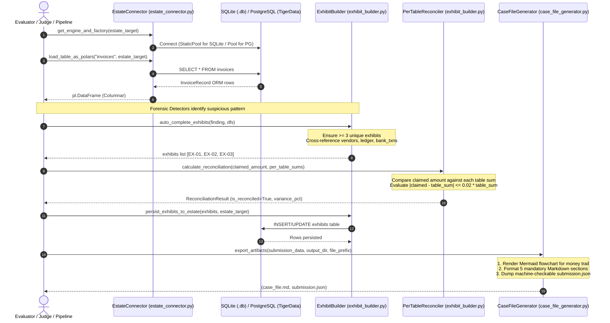
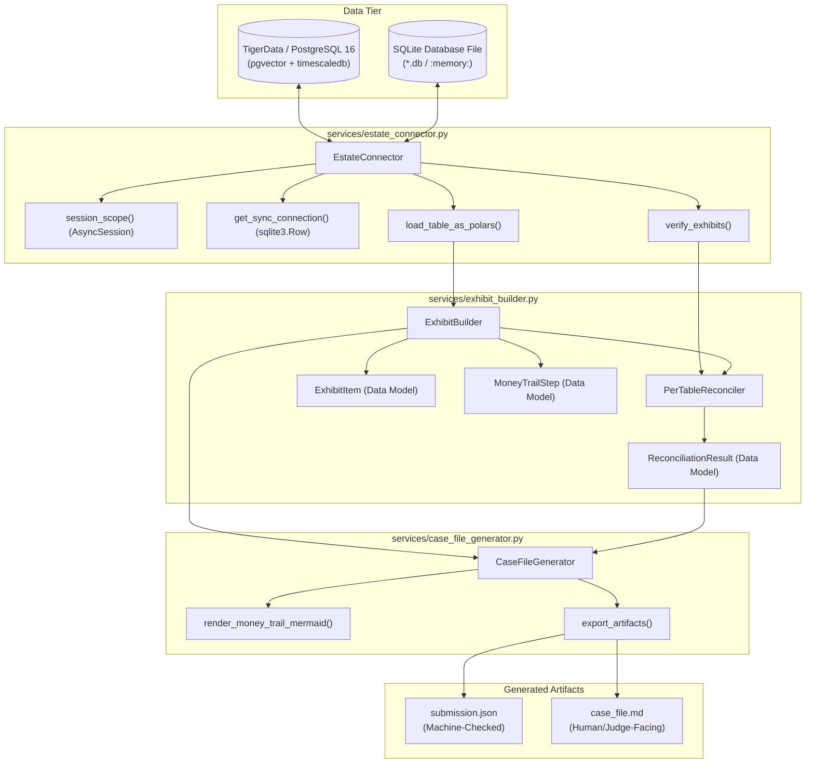

# Data Estate Connector, Exhibit Builder & Case File Generation

[← Back to Backend Documentation](../README.md) | [Master Architecture](../../README.md) | [Agent Routing Index](../../index.md)

---

## 1. Overview & Architectural Role

The **Estate & Exhibits Subsystem** (`backend/services/estate_connector.py`, `backend/services/exhibit_builder.py`, and `backend/services/case_file_generator.py`) provides the end-to-end evidentiary backbone for the Forensic Auditor platform. It connects forensic detection algorithms to heterogeneous relational data estates, builds legally defensible documentary exhibits, enforces strict 2% mathematical per-table peso reconciliation, and compiles final audit determinations into dual artifacts:
1. **`submission.json`**: A machine-validated JSON payload evaluated by automated grading harnesses (such as `validate_format.py`) for precision, recall, false-accusation rate, and evidentiary integrity.
2. **`case_file.md`**: A standalone, judge-facing Markdown document formatted with rendered Mermaid money-trail diagrams, executive summary tables, closed leads documentation, and methodological limits, engineered to be read and understood by non-technical judges without external network access or human narration.

```
+----------------------------------------------------------------------------------------------------+
|                                 Estate & Exhibits Subsystem                                        |
|                                                                                                    |
|  +-----------------------------+     +----------------------------+     +-----------------------+  |
|  |       Data Estates          |     |      Exhibit Builder       |     |  Case File Generator  |  |
|  |  - TigerData (PostgreSQL)   | ==> |  - Exhibit Extraction      | ==> |  - submission.json    |  |
|  |  - Runtime SQLite (.db)     |     |  - Auto-complete (min 3)   |     |  - case_file.md       |  |
|  |  - In-memory (:memory:)     |     |  - 2% Per-Table Reconcile  |     |  - Mermaid Diagrams   |  |
|  +-----------------------------+     +----------------------------+     +-----------------------+  |
|                 |                                   |                               |              |
|                 v                                   v                               v              |
|        Polars DataFrames                  exhibits Table Upsert            Dual Artifact Export    |
+----------------------------------------------------------------------------------------------------+
```

### Core Responsibilities
- **Dynamic Relational Estate Switching**: Seamlessly abstracts connections between production PostgreSQL (TigerData with `pgvector` and `timescaledb`) and dynamic SQLite data estates (either standalone `.db` files or in-memory `:memory:` databases created during offline evaluation runs).
- **High-Throughput Table Ingestion**: Extracts entire estate tables into memory as zero-copy **Polars** DataFrames (`pl.DataFrame`) for ultra-fast vectorized joining, filtering, and topological graph generation.
- **Evidentiary Exhibit Indexing**: Structures forensic proof across 9 normalized estate tables (`vendors`, `invoices`, `ledger`, `bank_txns`, `purchase_orders`, `contracts`, `employees`, `efos_list`, and `exhibits`).
- **Automated Exhibit Completion**: Enforces the evidentiary invariant requiring at least 3 distinct documentary exhibits per finding by cross-referencing company master data, journal entries, and bank transfers.
- **Mathematical 2% Per-Table Peso Reconciliation**: Implements the forensic accounting rule preventing double-counting across different documentary representations of the same funds (e.g. CFDI invoice vs. SPEI bank transfer).
- **Offline Judge-Ready Case File Generation**: Employs deterministic templating and Mermaid diagram synthesis to render complete case files following the strict 5-section sequence required by forensic auditing rubrics.

---

## 2. Architecture & Data Flow

The lifecycle flows from estate connection and schema verification to exhibit compilation, arithmetic reconciliation, and dual artifact export:



### Component Interaction Architecture



---

## 3. In-Depth Component Specifications

### 3.1 Estate Connector (`backend/services/estate_connector.py`)

The `EstateConnector` class manages dynamic relational connections across multiple execution targets. In a single process, the auditor may connect to TigerData PostgreSQL for production persistence, while simultaneously querying an ad-hoc SQLite file (e.g. `tmp/estate_seed_101.db`) supplied for offline evaluation.

#### Dynamic Engine Management & Connection Normalization
The method `_normalize_target(target)` parses input database targets:
- `None` or `"default"`: Resolves to the application-wide PostgreSQL instance configured via `settings.DATABASE_URL`.
- `":memory:"`: Resolves to `sqlite+aiosqlite:///:memory:`.
- Filesystem path (e.g. `data/estate.db`): Resolves to `sqlite+aiosqlite:///<absolute_path>`.

Engines and sessionmakers are lazily instantiated and cached in `self._dynamic_engines`:
- **SQLite Engine Configuration**: Configured with `poolclass=StaticPool` and `connect_args={"check_same_thread": False}`. This ensures that in-memory or single-file SQLite databases can be shared safely across asynchronous greenlets and worker threads without connection collisions or threading errors.
- **PostgreSQL Engine Configuration**: Configured with full connection pooling (`pool_size=20`, `max_overflow=10`, `pool_recycle=3600`) and enforced SSL (`sslmode=require`).

#### Key Mappings & Table Schema
The module maintains central mapping dictionaries synchronizing ORM models and primary key identifiers:

```python
ESTATE_TABLE_MODELS = {
    "vendors": VendorRecord,
    "invoices": InvoiceRecord,
    "ledger": LedgerRecord,
    "bank_txns": BankTxnRecord,
    "purchase_orders": PurchaseOrderRecord,
    "contracts": ContractRecord,
    "employees": EmployeeRecord,
    "efos_list": EfosRecord,
    "exhibits": ExhibitRecord,
}

ESTATE_ID_COLUMNS = {
    "ledger": "entry_id",
    "invoices": "uuid",
    "bank_txns": "txn_id",
    "vendors": "rfc",
    "efos_list": "rfc",
    "purchase_orders": "po_id",
    "contracts": "contract_id",
    "employees": "emp_id",
    "exhibits": "exhibit_id",
}

ESTATE_AMOUNT_COLUMNS = {
    "invoices": "total",
    "bank_txns": "amount",
    "purchase_orders": "amount",
    "contracts": "value",
}
```

#### Polars High-Speed Extraction (`load_table_as_polars`)
To avoid Python ORM object iteration overhead during heavy graph analysis:
1. `load_table_as_polars(table_name, target)` queries the model via SQLAlchemy `select(model_cls)`.
2. Automatically casts `Decimal` monetary columns into `float` values.
3. Constructs an in-memory `polars.DataFrame` with native column schemas, enabling vectorized filtering and instant ingestion by graph traversal algorithms.

#### Synchronous Inspection (`get_sync_connection`)
For direct compatibility with standard library test runners and offline grading scripts (such as `validate_format.py`), `get_sync_connection(target)` creates a standard `sqlite3.Connection` configured with `row_factory = sqlite3.Row`.

---

### 3.2 Exhibit Builder & Per-Table Reconciler (`backend/services/exhibit_builder.py`)

The forensic auditing rubric mandates that accusations must be supported by concrete evidence records present in the audited estate, without hallucinations, and with exact arithmetic reconciliation.

#### Data Models

##### `ExhibitItem`
Represents an individual document cited as proof:
```python
@dataclass
class ExhibitItem:
    exhibit_id: str      # e.g., 'EX-01'
    source_table: str    # e.g., 'invoices', 'bank_txns', 'vendors'
    record_id: str       # e.g., 'INV-001', 'BNK-002', 'RFC:AAAA010101AA1'
    note: str            # Plain-language sentence of what this record proves
```

##### `MoneyTrailStep`
Represents an individual step in the ordered flow of funds:
```python
@dataclass
class MoneyTrailStep:
    from_entity: str     # Origin entity identifier
    to_entity: str       # Destination entity identifier
    amount: float        # Monetary sum transferred
    date: str            # ISO date string
    exhibit_id: str      # Exact exhibit confirming this transfer
```

##### `ReconciliationResult`
Detailed audit calculation output:
```python
@dataclass
class ReconciliationResult:
    is_reconciled: bool
    claimed_amount: float
    best_table: Optional[str]
    best_table_sum: float
    variance_amount: float
    variance_pct: float
    tolerance_pct: float
    per_table_sums: Dict[str, float]
    formula_text: str
    errors: List[str]
```

#### The 2% Per-Table Reconciliation Rule

> [!IMPORTANT]
> **Why Per-Table Summation is Mandatory**:
> In forensic AML investigations, citing both an invoice ($92,800.00 MXN) and the bank transfer ($92,800.00 MXN) that settled it represents **the same pesos seen twice** across different accounting books.
> 
> Simply summing all cited exhibits would yield $185,600.00 MXN, artificially doubling the alleged fraud volume and failing audit verification.
> 
> Therefore, exhibits are grouped and summed **per table**. The claimed fraud amount is matched against the best-matching table within a strict **2% tolerance**.

#### Mathematical Formulation

For an accusation with claimed amount $A_{\text{claimed}}$ and cited exhibits $E$, let $T$ be the set of amount-bearing tables cited ($T \subseteq \{\text{invoices}, \text{bank\_txns}, \text{purchase\_orders}, \text{contracts}\}$).

1. For each table $t \in T$, calculate the table sum:
   $$S_t = \sum_{e \in E, \text{source}(e) = t} \text{amount}(e)$$

2. Identify the best-matching candidate table $t^*$:
   $$t^* = \arg\min_{t \in T} |A_{\text{claimed}} - S_t|$$

3. Compute absolute variance $\Delta$ and relative percentage $V$:
   $$\Delta = |A_{\text{claimed}} - S_{t^*}|$$
   $$V = \frac{\Delta}{\max(S_{t^*}, 1.0)}$$

4. The accusation reconciles if and only if:
   $$\Delta \le \tau \cdot \max(S_{t^*}, 1.0) \quad \text{where } \tau = 0.02 \text{ (2.0% tolerance)}$$

#### Auto-Completion of Exhibits (`auto_complete_exhibits`)
Judicial standards require at least 3 distinct evidentiary exhibits per finding (`len(exhibits) >= 3`). If a specialized detector isolates a scheme with only 1 or 2 exhibits (for instance, citing only two invoices), `auto_complete_exhibits()` cross-references the in-memory Polars tables to automatically link related evidentiary records:
1. **Vendor Corporate Records**: Locates the vendor's tax profile in `vendors` using the RFC.
2. **General Ledger Entries**: Discovers the accounting journal entry in `ledger` referencing the `invoice_uuid`.
3. **Treasury Wire Transfers**: Matches SPEI transactions in `bank_txns` associated with the payment.
4. **ID Normalization**: Renumbers exhibits sequentially (`EX-01`, `EX-02`, ...) while preserving links to `money_trail` steps.

#### Estate Persistence (`persist_exhibits_to_estate`)
Persists all validated exhibits into the data estate's `exhibits` table (`tmp/estate_schema - polar.sql`). The operation creates the table if missing and performs idempotent upserts against `exhibit_id`.

---

### 3.3 Case File Generator (`backend/services/case_file_generator.py`)

The `CaseFileGenerator` service formats structured investigation data into dual evaluation artifacts. It guarantees 100% offline reproducibility and eliminates runtime LLM dependencies during report generation.

#### Mermaid Money Trail Flowchart Synthesis (`render_money_trail_mermaid`)
Judicial evaluation criteria specify that prose-only explanations of financial transactions cap readability scores. `render_money_trail_mermaid` transforms `money_trail` arrays into clean, syntax-compliant Mermaid flowcharts:
- **Node Identifier Sanitization**: Replaces arbitrary string names with deterministic identifiers (`node_1`, `node_2`, ...) while preserving readable labels.
- **Edge Metadata**: Each edge explicitly displays the transferred amount, the transaction date, and the evidentiary bracket citation (`[EX-XX]`).
- **Format Example**:
  ```mermaid
  flowchart LR
      node_1["Empresa Auditada"]
      node_2["Proveedor Fantasma SA"]
      node_3["Empleado Cómplice"]
      node_1 -->|"$92,800.00 MXN • 2026-03-29 • [EX-01]"| node_2
      node_2 -->|"$45,000.00 MXN • 2026-04-02 • [EX-02]"| node_3
  ```

#### The 5 Mandatory Case File Sections
The generator produces `case_file.md` adhering strictly to the sequential section order specified in `tmp/case_file_structure.md`:

| Section | Title | Content & Structural Elements |
| :---: | :--- | :--- |
| **1** | **Header** | Company name, audit period, estate seed, evaluation dataset, disjoint set declaration (trained on seeds 1–3, evaluated on held-out seeds 101–105), LLM call count, estimated MXN cost, wall-clock seconds, and deterministic run flag. |
| **2** | **Executive summary** | Plain-language executive narrative under 150 words, optional formal Judicial Verdict callout quote, and the mandatory 3-row summary table:<br/>• **Findings**: count with confidence breakdown (`proven`, `probable`)<br/>• **Total exposure**: formatted pesos (`$X,XXX.XX pesos`)<br/>• **Leads investigated and closed**: count |
| **3** | **Findings** | One subsections per validated accusation (`### Hallazgo N: ...`):<br/>• Involved entities and statutory rule broken (e.g. `SAT Articulo 69-B`)<br/>• Amount and confidence level (`PROVEN` / `PROBABLE`)<br/>• Narrative explanation ("Qué Sucedió")<br/>• Rendered Mermaid money trail diagram<br/>• Evidentiary exhibits table (Cédula de Evidencias Documentales)<br/>• Formal arithmetic reconciliation calculation and variance confirmation ($\le 2\%$) <br/>• Adversarial review summary explaining counter-arguments analyzed |
| **4** | **Leads not pursued** | Located **in the body** of the document (never an appendix). Detailed table documenting every investigated entity cleared of wrongdoing:<br/>• Entity name and ID<br/>• Signal / detector check<br/>• Specific operational justification reason<br/>• Forensic tools executed (`tool_calls_made`)<br/>• Role that closed the lead (`investigator`, `challenger`, or `validator`) |
| **5** | **Method and limits** | Complete transparency disclosures:<br/>• **Architecture**: Hybrid Polars + NetworkX + 2% per-table reconciliation<br/>• **Out of Scope**: Non-audited date intervals, subjective quality assessments, foreign bank accounts<br/>• **System Limits**: Unrecorded cash transactions, digital credential spoofing, deliverable fabrication with compliant paperwork<br/>• **Reproducibility**: Exact shell commands to rerun offline verification via `validate_format.py` |

#### Dual Artifact Export (`export_artifacts`)
```python
case_file_path, submission_path = case_file_generator.export_artifacts(
    submission_data=submission_dict,
    output_dir="tmp/eval_run_101",
    file_prefix="seed_101",
    company_name="Empresa Auditada S.A. de C.V.",
    audit_period="Ejercicio Fiscal 2026",
)
```
Writes both `seed_101_case_file.md` and `seed_101_submission.json` to the target directory.

---

## 4. Key Files & Public API Reference

### Component Index

| File | Primary Role | Key Classes & Functions |
| :--- | :--- | :--- |
| `backend/services/estate_connector.py` | Estate connection manager, dynamic SQLite/PostgreSQL switcher, Polars loader, exhibit validator. | `EstateConnector`, `estate_connector`, `ESTATE_TABLE_MODELS`, `ESTATE_ID_COLUMNS`, `ESTATE_AMOUNT_COLUMNS` |
| `backend/services/exhibit_builder.py` | Evidentiary exhibit builder, auto-completer for min 3 exhibits, per-table 2% peso reconciler, DB persistence. | `ExhibitBuilder`, `exhibit_builder`, `PerTableReconciler`, `per_table_reconciler`, `ExhibitItem`, `MoneyTrailStep`, `ReconciliationResult` |
| `backend/services/case_file_generator.py` | Dual artifact exporter, Mermaid flowchart synthesizer, 5-section Markdown case file compiler. | `CaseFileGenerator`, `case_file_generator` |

---

### Class & Method Signatures

#### `EstateConnector` (`backend/services/estate_connector.py`)

```python
class EstateConnector:
    def __init__(self) -> None: ...
    
    def get_engine_and_factory(
        self, target: Optional[Union[str, Path]] = None
    ) -> Tuple[AsyncEngine, async_sessionmaker[AsyncSession]]:
        """Retrieves or creates cached AsyncEngine and sessionmaker for PostgreSQL or SQLite."""

    @asynccontextmanager
    async def session_scope(
        self, target: Optional[Union[str, Path]] = None
    ) -> AsyncGenerator[AsyncSession, None]:
        """Context manager yielding AsyncSession; auto-commits on exit, rolls back on error."""

    def get_sync_connection(self, target: Union[str, Path]) -> sqlite3.Connection:
        """Returns standard library sqlite3.Connection configured with sqlite3.Row."""

    async def init_schema(
        self, target: Optional[Union[str, Path]] = None, ddl_path: Optional[Path] = None
    ) -> None:
        """Provisions all 9 estate tables via Base.metadata.create_all."""

    async def get_estate_summary(
        self, target: Optional[Union[str, Path]] = None
    ) -> Dict[str, Any]:
        """Inspects estate database and returns row counts per table."""

    async def load_table_as_polars(
        self, table_name: str, target: Optional[Union[str, Path]] = None
    ) -> pl.DataFrame:
        """Loads an entire table into an in-memory Polars DataFrame."""

    async def verify_exhibits(
        self,
        exhibits: List[Dict[str, Any]],
        claimed_amount: Optional[float] = None,
        target: Optional[Union[str, Path]] = None,
        tolerance: float = 0.02,
    ) -> Dict[str, Any]:
        """Validates exhibit existence and verifies 2% per-table reconciliation."""

    async def dispose_all(self) -> None:
        """Disposes all cached dynamic engines and clears pool resources."""
```

#### `PerTableReconciler` (`backend/services/exhibit_builder.py`)

```python
class PerTableReconciler:
    def __init__(self, tolerance: float = 0.02) -> None: ...

    def calculate_reconciliation(
        self, claimed_amount: float, per_table_sums: Dict[str, float]
    ) -> ReconciliationResult:
        """Computes variance against candidate tables and determines if within 2% margin."""

    def compute_table_sums_from_dfs(
        self, exhibits: List[Dict[str, Any]], dfs: Dict[str, pl.DataFrame]
    ) -> Dict[str, float]:
        """Calculates per-table sums for exhibits using in-memory Polars DataFrames."""

    async def reconcile_against_estate(
        self,
        claimed_amount: float,
        exhibits: List[Dict[str, Any]],
        connector: EstateConnector,
        estate_target: Optional[Union[str, Path]] = None,
    ) -> ReconciliationResult:
        """Reconciles claimed amount by querying the estate database directly."""
```

#### `ExhibitBuilder` (`backend/services/exhibit_builder.py`)

```python
class ExhibitBuilder:
    def __init__(
        self,
        connector: Optional[EstateConnector] = None,
        reconciler: Optional[PerTableReconciler] = None,
    ) -> None: ...

    def build_exhibit(
        self,
        source_table: str,
        record_id: str,
        note: str,
        exhibit_id: Optional[str] = None,
        index: int = 1,
        prefix: str = "EX",
    ) -> ExhibitItem:
        """Creates a validated ExhibitItem with normalized parameters."""

    def build_money_trail_step(
        self, from_entity: str, to_entity: str, amount: float, date: str, exhibit_id: str
    ) -> MoneyTrailStep:
        """Constructs an individual money trail step linking two entities."""

    def auto_complete_exhibits(
        self, finding: Dict[str, Any], dfs: Dict[str, pl.DataFrame]
    ) -> List[Dict[str, str]]:
        """Guarantees at least 3 exhibits per finding by cross-referencing related tables."""

    async def persist_exhibits_to_estate(
        self, exhibits: List[Dict[str, Any]], estate_target: Optional[Union[str, Path]] = None
    ) -> int:
        """Idempotently upserts exhibits into the estate's 'exhibits' table."""
```

#### `CaseFileGenerator` (`backend/services/case_file_generator.py`)

```python
class CaseFileGenerator:
    def __init__(self) -> None: ...

    def render_money_trail_mermaid(
        self, money_trail: List[Dict[str, Any]], exhibits: Optional[List[Dict[str, Any]]] = None
    ) -> str:
        """Renders an ordered money trail into a clean Mermaid flowchart string."""

    def generate_case_file_markdown(
        self,
        submission_data: Dict[str, Any],
        company_name: str = "Empresa Auditada S.A. de C.V.",
        audit_period: str = "Enero 2025 - Diciembre 2026",
    ) -> str:
        """Compiles the complete 5-section Markdown case file string."""

    def export_artifacts(
        self,
        submission_data: Dict[str, Any],
        output_dir: Union[str, Path] = "tmp",
        file_prefix: str = "audit_result",
        company_name: str = "Empresa Auditada S.A. de C.V.",
        audit_period: str = "Enero 2025 - Diciembre 2026",
    ) -> Tuple[Path, Path]:
        """Writes both case_file.md and submission.json to disk; returns paths."""
```

---

## 5. Usage Examples & Workflows

### 5.1 Querying an Estate and Reconciling Exhibits

```python
import asyncio
from pathlib import Path
from backend.services.estate_connector import estate_connector
from backend.services.exhibit_builder import exhibit_builder, per_table_reconciler

async def audit_finding_example():
    db_path = Path("tmp/eval_estate.db")
    
    # 1. Load amount-bearing tables into Polars
    dfs = {
        "invoices": await estate_connector.load_table_as_polars("invoices", db_path),
        "bank_txns": await estate_connector.load_table_as_polars("bank_txns", db_path),
        "vendors": await estate_connector.load_table_as_polars("vendors", db_path),
        "ledger": await estate_connector.load_table_as_polars("ledger", db_path),
    }

    # 2. Define initial finding
    finding = {
        "scheme_type": "phantom_vendor",
        "entities": ["RFC:FANT010101AA1"],
        "peso_amount": 139200.00,
        "exhibits": [
            {"source_table": "invoices", "record_id": "INV-001", "note": "Factura sin entregables."},
            {"source_table": "invoices", "record_id": "INV-002", "note": "Factura complementaria."},
        ]
    }

    # 3. Auto-complete to guarantee >= 3 exhibits
    completed_exhibits = exhibit_builder.auto_complete_exhibits(finding, dfs)
    finding["exhibits"] = completed_exhibits

    # 4. Compute per-table sums and verify 2% reconciliation
    table_sums = per_table_reconciler.compute_table_sums_from_dfs(completed_exhibits, dfs)
    recon = per_table_reconciler.calculate_reconciliation(finding["peso_amount"], table_sums)

    print(f"Reconciled: {recon.is_reconciled}")
    print(f"Formula: {recon.formula_text}")

    # 5. Persist exhibits into estate
    await exhibit_builder.persist_exhibits_to_estate(completed_exhibits, db_path)

asyncio.run(audit_finding_example())
```

### 5.2 Generating Case File and Submission Artifacts

```python
from backend.services.case_file_generator import case_file_generator

submission_payload = {
    "seed": 101,
    "findings": [
        {
            "scheme_type": "phantom_vendor",
            "entities": ["RFC:FANT010101AA1"],
            "rule_broken": "SAT Articulo 69-B",
            "narrative": "Empresa fachada sin infraestructura emitió comprobantes fiscales simulados.",
            "peso_amount": 139200.0,
            "confidence": "proven",
            "money_trail": [
                {
                    "from": "RFC:EMPRESA_AUDITADA",
                    "to": "RFC:FANT010101AA1",
                    "amount": 139200.0,
                    "date": "2026-03-29",
                    "exhibit_id": "EX-01"
                }
            ],
            "exhibits": [
                {"exhibit_id": "EX-01", "source_table": "invoices", "record_id": "INV-001", "note": "Factura simulada"},
                {"exhibit_id": "EX-02", "source_table": "bank_txns", "record_id": "BNK-001", "note": "Transferencia SPEI"},
                {"exhibit_id": "EX-03", "source_table": "vendors", "record_id": "FANT010101AA1", "note": "Ficha fiscal"},
            ],
        }
    ],
    "leads_not_pursued": [
        {
            "entity": "RFC:SOLV020202BB2",
            "signal": "efos_check",
            "reason": "Proveedor con constancia de cumplimiento SAT positiva y entregables en archivo.",
            "tool_calls_made": ["search_transactions", "verify_vendor_profile"],
            "closed_by": "challenger",
        }
    ],
    "run_metadata": {
        "llm_calls": 0,
        "mxn_cost": 0.0,
        "wall_clock_seconds": 0.85,
        "deterministic": True,
    },
}

case_md_path, sub_json_path = case_file_generator.export_artifacts(
    submission_data=submission_payload,
    output_dir="tmp/audit_101",
    file_prefix="estate_101",
    company_name="Corporativo Titan S.A. de C.V.",
    audit_period="Ejercicio Fiscal 2026",
)

print(f"Generated case file: {case_md_path}")
print(f"Generated JSON submission: {sub_json_path}")
```

---

## 6. Edge Cases, Gotchas & Audit Compliance

### 6.1 Avoiding Double-Counting Across Tables
- **Gotcha**: Citing an invoice for \$100,000 MXN and the bank transaction paying that same invoice for \$100,000 MXN.
- **Resolution**: `PerTableReconciler` never sums amounts across distinct tables. It groups sums by `source_table`, compares against candidate amounts, and validates that the claimed amount reconciles with the single best matching table ($|A - S_t| \le 0.02 \times S_t$).

### 6.2 SQLite Threading and Concurrency
- **Gotcha**: When using SQLite with Python's asynchronous SQLAlchemy (`aiosqlite`), executing queries across tasks can trigger `sqlite3.ProgrammingError: SQLite objects created in a thread can only be used in that same thread`.
- **Resolution**: `EstateConnector` dynamically configures all SQLite engines with `StaticPool` and `connect_args={"check_same_thread": False}`.

### 6.3 Special Character Escaping in Mermaid
- **Gotcha**: Company names, entity labels, and notes containing quotation marks (`"`), parentheses (`()`), or brackets (`[]`) will break Mermaid syntax, causing diagrams to render as blank error boxes.
- **Resolution**: `CaseFileGenerator.render_money_trail_mermaid` sanitizes entity strings, assigns internal identifiers (`node_1`, `node_2`), quotes all label strings, and replaces pipe characters (`|`) with dashes in Markdown table rows.

### 6.4 Non-Negotiable Order of Sections
- **Gotcha**: Placing "Leads not pursued" in an appendix or omitting Methodological Limits results in structural scoring penalties during automated format evaluation.
- **Resolution**: `CaseFileGenerator` strictly enforces the 5-section sequence:
  1. Header
  2. Executive summary
  3. Findings (One section per finding)
  4. Leads not pursued (in body)
  5. Method and limits

### 6.5 Offline Determinism
- **Compliance Invariant**: The system must run and produce identical case files when network access is completely severed. Neither `EstateConnector`, `ExhibitBuilder`, nor `CaseFileGenerator` make network calls, external API queries, or non-deterministic timestamp calls.

---

## 7. Verification & Automated Testing

The subsystem is thoroughly tested across multiple automated test modules:

```bash
# Test EstateConnector CRUD, Polars loading, and exhibit verification
python -m pytest backend/tests/test_estate_connector.py -v

# Test CaseFileGenerator section generation, Mermaid rendering, and dual export
python -m pytest backend/tests/test_case_file_generator.py -v

# Validate submission schema format using the official checker
python -X utf8 student-materials/forensic-auditor/validate_format.py --submission tmp/audit_101/estate_101_submission.json

# Validate exhibits directly against SQLite database
python -X utf8 student-materials/forensic-auditor/validate_format.py --submission tmp/audit_101/estate_101_submission.json --estate tmp/eval_estate.db
```
