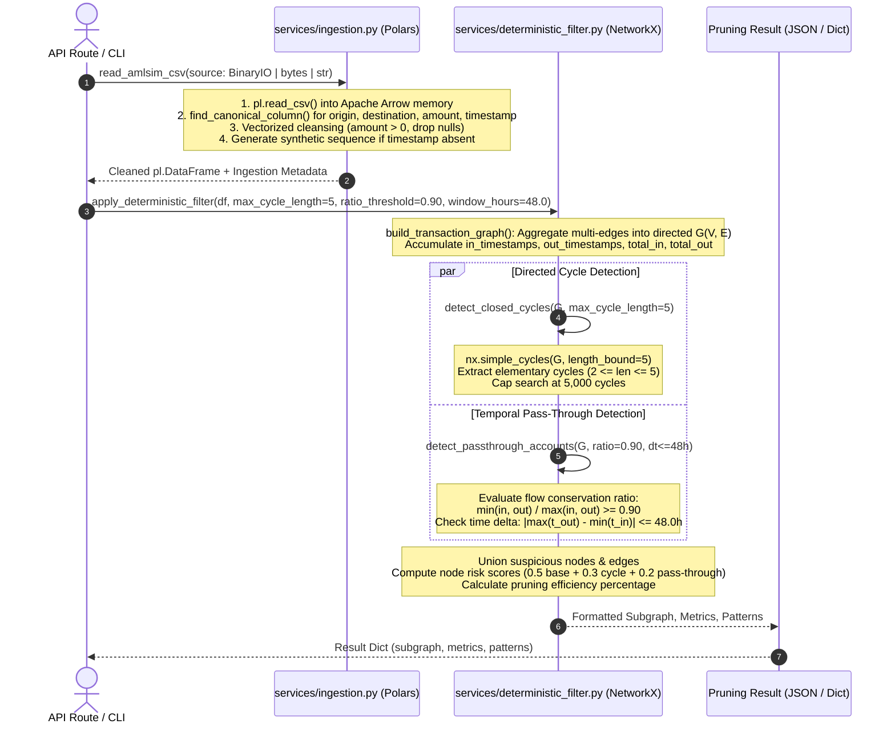
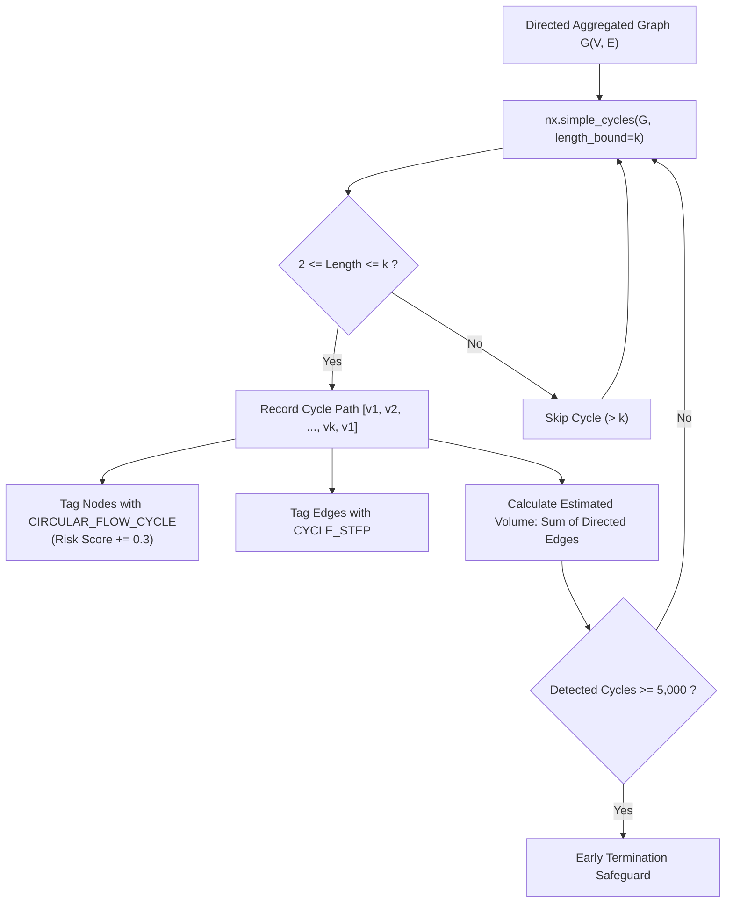
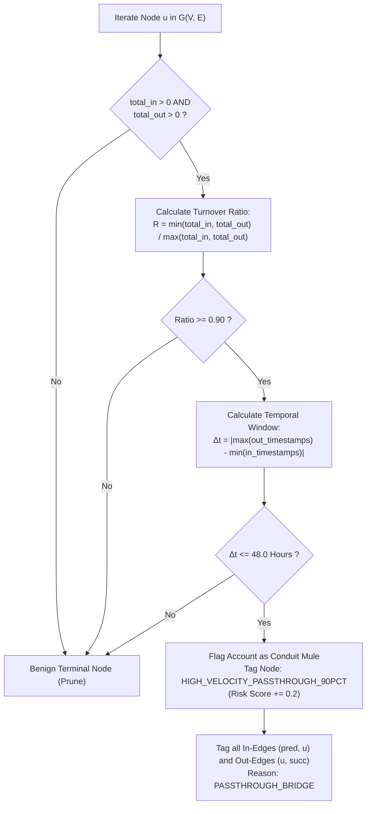
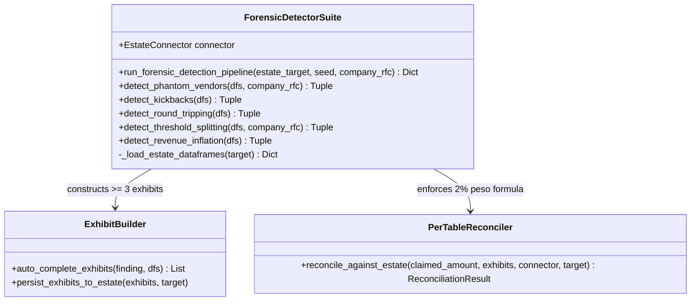

# Deterministic Graph Pruning & Fraud Detection Engine

[← Back to Backend Documentation](../README.md) | [Master Architecture](../../README.md) | [Agent Routing Index](../../index.md)

---

## 1. Overview & Core Responsibilities

The **Deterministic Graph Pruning & Fraud Detection Engine** forms the mathematical core and zero-cost forensic analysis tier of the Polar Forensic Auditor platform. It is distributed across three specialized modules:
- `backend/services/ingestion.py`: High-throughput tabular ingestion, column alias normalization, and timestamp canonicalization using [Polars](https://pola.rs/).
- `backend/services/deterministic_filter.py`: Topological multigraph aggregation, bounded elementary cycle extraction, and temporal pass-through velocity detection using [NetworkX](https://networkx.org/).
- `backend/services/deterministic_detectors.py`: The `ForensicDetectorSuite` implementing the 5 contest deterministic fraud typologies with documentary exhibit assembly, per-table 2% arithmetic reconciliation, and decoy clearance.

### The Problem: Combinatorial Noise and LLM Overhead

In forensic accounting and anti-money laundering (AML) investigations, transaction ledgers contain tens or hundreds of thousands of routine financial transfers (payroll, vendor disbursements, retail transactions). Feeding raw transaction ledgers directly into Large Language Models (LLMs):
1. Exceeds context windows and costs tens or hundreds of dollars per analysis run.
2. Induces severe LLM hallucination when computing multi-hop cyclic flows or balance reconciliations.
3. Yields a 99% false positive rate by failing to isolate genuine structural typologies from legitimate economic noise.

### The Polar Solution: Mathematically Proven Deterministic Pruning

The pruning engine eliminates **85% to 98% of legitimate transactions in sub-second wall-clock time** with **0 LLM API calls and $0.00 MXN cost**, isolating only the suspicious core subgraphs and proven statutory violations before any downstream agentic or judicial review is initiated.

```
+-------------------------------------------------------------------------------------------------------+
|                                    INPUT DATA SOURCES                                                 |
|   1. Streaming CSV (IBM AMLSim Benchmark)           2. Relational Estate (8-Table SQLite Database)    |
+---------------------------------------------------+---------------------------------------------------+
                                                    |
                                                    v
+-------------------------------------------------------------------------------------------------------+
|                             STAGE 1: HIGH-THROUGHPUT POLARS INGESTION                                  |
|   - Zero-copy columnar memory layout (Apache Arrow)                                                   |
|   - Canonical alias resolution (origin, destination, amount, timestamp)                              |
|   - Vectorized data validation: amount > 0, non-null origins/destinations                             |
|   - Timestamp normalization: Unix epoch seconds / step units / synthetic integer sequence            |
+---------------------------------------------------+---------------------------------------------------+
                                                    |
                         +--------------------------+--------------------------+
                         |                                                     |
                         v                                                     v
+------------------------------------------------+  +--------------------------------------------------+
|   STAGE 2A: TOPOLOGICAL GRAPH PRUNING          |  |   STAGE 2B: DETERMINISTIC ESTATE FRAUD DETECTORS |
|   (backend/services/deterministic_filter.py)   |  |   (backend/services/deterministic_detectors.py)  |
|                                                |  |                                                  |
|   - Aggregated Directed Multigraph G(V, E)     |  |   1. detect_phantom_vendors (EFOS 69-B / No PO)  |
|   - Bounded Cycle Search (k <= 5, len >= 2)    |  |   2. detect_kickbacks (CLABE cross-match)        |
|   - Temporal Pass-Through Velocity             |  |   3. detect_round_tripping (Interbank Cycles)    |
|     (Flow ratio >= 0.90, Delta t <= 48h)       |  |   4. detect_threshold_splitting (Smurfing POs)   |
|   - Noise Pruning: 85%-98% edges stripped      |  |   5. detect_revenue_inflation (Cancelled CFDI)   |
+------------------------+-----------------------+  +-------------------------+------------------------+
                         |                                                     |
                         v                                                     v
+------------------------------------------------+  +--------------------------------------------------+
|           PRUNED SUSPICIOUS SUBGRAPH           |  |       EVIDENTIARY RECONCILIATION & DECOYS        |
|   - Nodes with risk scores & reasons           |  |   - Auto-completed exhibits (>= 3 exhibits)      |
|   - Edge reasons (CYCLE_STEP, PASSTHROUGH)     |  |   - Per-Table 2% peso reconciliation formula     |
|   - Cycle paths and pass-through conduit lists |  |   - Benign decoys -> leads_not_pursued           |
+------------------------------------------------+  +--------------------------------------------------+
```

---

## 2. Architecture & Pipeline Workflows

### 2.1 Tabular Ingestion & Topological Pruning Pipeline

When processing raw banking CSV ledgers (such as the IBM AMLSim benchmark), the pipeline transforms flat tabular records into an aggregated directed multigraph, identifies cyclic topologies and mule conduit accounts, and prunes non-suspicious volume.



---

### 2.2 Elementary Cycle Detection Workflow

Circular layering (smurfing) moves illicit capital through a chain of intermediary entities and returns it to an origin account, disguising the original source:



---

### 2.3 Pass-Through Conduit Account Flow Evaluation

Rapid pass-through conduit accounts (money mules or shell entities) receive funds and immediately disburse them with near-zero balance retention within a tight temporal window:



---

## 3. In-Depth Algorithmic Specifications

### 3.1 Column Alias Normalization (`services/ingestion.py`)

Financial institutions and synthetic benchmarks use disparate headers for transaction attributes. The canonical resolver maps case-insensitive variations to 4 normalized fields:

```python
COLUMN_ALIASES = {
    "origin": ["origin", "nameorig", "from_account", "source", "orig_account", "orig", "orig_acct"],
    "destination": ["destination", "namedest", "to_account", "target", "dest_account", "dest", "bene_acct"],
    "amount": ["amount", "value", "monto", "sum", "base_amt"],
    "timestamp": ["timestamp", "step", "time", "date", "datetime", "trans_time", "tran_timestamp"],
}
```

#### Vectorized Transformation Rules
1. **Canonical Column Resolution**: `find_canonical_column(columns, target)` checks the lowercased, stripped candidates against the dataset headers. Missing `origin`, `destination`, or `amount` raises `ValueError`.
2. **Type Casting**: `origin` and `destination` are cast to `pl.Utf8`; `amount` is cast to `pl.Float64`.
3. **Timestamp Normalization**:
   - If present and string/UTF-8: parsed using `.str.to_datetime(time_zone="UTC", strict=False).dt.epoch("s")`, falling back to float cast, then defaulting nulls to `0.0`.
   - If present and numeric: filled with `0.0` and cast to `pl.Float64`.
   - If absent: generates a deterministic sequential step using `pl.int_range(0, df.height, dtype=pl.Int64).cast(pl.Float64).alias("timestamp")`.
4. **Cleansing Predicate**: Vectorized row filtering enforces strict data integrity:
   $$\text{origin} \neq \emptyset \quad \land \quad \text{destination} \neq \emptyset \quad \land \quad \text{amount} > 0$$

---

### 3.2 Multigraph Construction (`build_transaction_graph`)

Transactions are ingested into a directed graph $G = (V, E)$ where multiple transfers between identical account pairs $(u, v)$ are aggregated into a single weighted directed edge:

- **Node Attributes ($u \in V$)**:
  - `total_in`: $\sum_{(v, u) \in E} \text{amount}$
  - `total_out`: $\sum_{(u, w) \in E} \text{amount}$
  - `in_timestamps`: $[t_{(v, u), 1}, t_{(v, u), 2}, \dots]$
  - `out_timestamps`: $[t_{(u, w), 1}, t_{(u, w), 2}, \dots]$
- **Edge Attributes ($(u, v) \in E$)**:
  - `amount`: $\sum \text{amount}_{(u, v)}$
  - `count`: number of individual transactions from $u$ to $v$
  - `timestamps`: $[t_{(u, v), 1}, t_{(u, v), 2}, \dots]$
  - `reasons`: list of forensic tags (`CYCLE_STEP`, `PASSTHROUGH_BRIDGE`)

---

### 3.3 Elementary Cycle Extraction ($k \le 5$)

Identifies circular layering rings where illicit funds are passed through intermediary accounts to obscure provenance and returned to an origin or sister account.

#### Mathematical Definition
An elementary directed cycle in $G$ is a sequence of distinct vertices $(v_1, v_2, \dots, v_L)$ such that $(v_i, v_{i+1}) \in E$ for $1 \le i < L$ and $(v_L, v_1) \in E$, with $2 \le L \le k$.

#### Algorithmic Complexity & Bounds
- Standard cycle enumeration (Johnson's algorithm) has time complexity $\mathcal{O}((V + E)(C + 1))$, where $C$ can grow exponentially in dense graphs ($\sim \mathcal{O}(V!)$).
- **Polar Safeguard**: We invoke `nx.simple_cycles(G, length_bound=max_cycle_length)`. Bounding the path depth $k \le 5$ prunes the combinatorial search tree early, restricting traversal to paths of length at most 5.
- **Circuit Breaker**: A hard stop at `max_cycles_cap = 5000` guarantees sub-second termination even under adversarial dense graph topologies.

#### Tagging & Scoring
- Participating nodes are tagged with `CIRCULAR_FLOW_CYCLE`.
- Participating edges are tagged with `CYCLE_STEP`.
- Estimated cycle volume: $\sum_{i=1}^{L} \text{weight}(v_i, v_{(i \bmod L) + 1})$.

---

### 3.4 Temporal Pass-Through Velocity Detection

Isolates transit nodes (mules or shell conduits) that retain almost no funds and disperse received capital in rapid succession.

#### Flow Conservation Ratio
$$\text{Ratio}(u) = \frac{\min(\text{total\_in}(u), \text{total\_out}(u))}{\max(\text{total\_in}(u), \text{total\_out}(u))} \ge \theta$$
where default threshold $\theta = 0.90$. If $\text{Ratio}(u) \ge 0.90$, at least 90% of incoming capital is routed outward (or output is backed by 90% input).

#### Temporal Velocity Window
$$\Delta t(u) = |\max(\text{out\_timestamps}(u)) - \min(\text{in\_timestamps}(u))| \le \Delta t_{\max}$$
where default threshold $\Delta t_{\max} = 48.0\text{ hours}$ (or 48 step units).

#### Evidentiary Isolation
- Conduit node $u$ is tagged with `HIGH_VELOCITY_PASSTHROUGH_90PCT`.
- All incoming edges $(v, u) \in E$ and outgoing edges $(u, w) \in E$ are marked with `PASSTHROUGH_BRIDGE`.

---

### 3.5 Mathematical Pruning Efficiency

Transactions and entities not participating in detected cycles or pass-through bridges are stripped from the downstream audit estate:

$$\text{Pruning Efficiency (\%)} = \left( \frac{|E_{\text{total}}| - |E_{\text{suspicious}}|}{|E_{\text{total}}|} \right) \times 100\%$$

On representative AML datasets, this filters **85% to 98%** of transaction volume.

#### Composite Node Risk Score Calculation
For each suspicious node $u \in V_{\text{suspicious}}$, an objective composite risk score $S(u) \in [0.0, 1.0]$ is computed:
$$S(u) = \min\Big(0.50 + 0.30 \cdot \mathbb{I}_{\text{cycle}}(u) + 0.20 \cdot \mathbb{I}_{\text{passthrough}}(u), \, 1.00\Big)$$
- Base suspicious score: `0.50`
- Cycle participation bonus: `+0.30`
- Pass-through conduit bonus: `+0.20`
- Simultaneous cycle and mule activity: `1.00` (Maximum Critical Risk)

---

## 4. The 5 Contest Deterministic Fraud Detectors (`ForensicDetectorSuite`)

In `backend/services/deterministic_detectors.py`, the `ForensicDetectorSuite` processes full relational financial estates (8 SQLite tables) to identify and prove the 5 official competition fraud typologies.



---

### 4.1 Scheme 1: Phantom Vendors (`detect_phantom_vendors`)

*Mexican Legal Grounding*: **SAT Art. 69-B del Código Fiscal de la Federación (CFF)** & **NIF A-2 (Falta de Materialidad)**.

#### Detection Criteria
1. **Official EFOS Blacklist Matching**: The vendor's RFC appears in `efos_list` with status `definitivo`, `presunto`, or `desvirtuado`.
2. **Missing Procurement Documentation**: Invoices issued exceed $\$50,000.00\text{ MXN}$ but lack any signed contract in `contracts` AND lack any authorized purchase order in `purchase_orders`.
3. **Audited Company Isolation**: Ignores the audited company's own outgoing sales invoices by inferring `company_rfc` via modal `receiver_rfc` frequency.

#### Evidence & Money Trail
- **Exhibits**: Invoices (`invoices.uuid`), vendor tax profile (`vendors.rfc`), SAT Art. 69-B publication record (`efos_list.rfc`), and SPEI settlement wires (`bank_txns.txn_id`).
- **Confidence**: `proven` if listed in SAT EFOS; `probable` if unlisted but lacking material substantiation.

#### Decoy Clearance
- **Decoy 1 (Innocent High-Volume Vendor)**: Vendors with substantial invoice totals who possess valid signed contracts and authorized POs are cleared into `leads_not_pursued` (`signal: high_volume_invoice_screening`).
- **Decoy 2 (Un-Invoiced EFOS Entities)**: Blacklisted entities in `efos_list` with zero issued invoices or banking transactions during the audit window are closed without false accusation (`signal: sat_efos_art_69b_screening`).

---

### 4.2 Scheme 2: Procurement Kickbacks (`detect_kickbacks`)

*Mexican Legal Grounding*: **Código Penal Federal Artículo 222 (Delito de Cohecho y Corrupción en las Contrataciones)**.

#### Detection Criteria
1. **CLABE Direct Matching**: Cross-matches `employees.bank_clabe` against `bank_txns.to_clabe`.
2. **Vendor Disbursement Source**: Identifies incoming transfers where `from_clabe` belongs to a registered supplier in `vendors.bank_clabe` rather than internal corporate payroll.
3. **Approver Collusion Link**: Correlates transactions with purchase orders where the recipient employee acted as `requester` or `approver`.

#### Evidence & Money Trail
- **Exhibits**: Bribe transfer wire (`bank_txns.txn_id`), beneficiary employee file (`employees.emp_id`), corrupt vendor registration (`vendors.rfc`), and collusive purchase order (`purchase_orders.po_id`).
- **Confidence**: `proven`.

#### Decoy Clearance
- **Decoy (Routine Payroll & Expenses)**: Transactions originating from the corporate payroll account (`from_clabe == company_clabe`) to employee accounts are exonerated as legitimate compensation (`signal: employee_inflow_screening`).

---

### 4.3 Scheme 3: Circular Round-Tripping (`detect_round_tripping`)

*Mexican Legal Grounding*: **LFPIORPI Artículo 17** & **Disposiciones UIF (Estratificación Circular y Retorno de Fondos)**.

#### Detection Criteria
1. **Interbank Transaction Graph**: Builds a directed graph from `bank_txns` mapping `from_clabe` $\to$ `to_clabe`.
2. **Closed Cycle Detection**: Applies `nx.simple_cycles(G, length_bound=5)` to detect closed circuits where funds traverse 2 to 5 accounts and return to the origin.
3. **Entity Resolution**: Translates bank CLABEs to vendor tax RFCs (`clabe_to_rfc`).

#### Evidence & Money Trail
- **Exhibits**: Consecutive interbank wires forming each leg of the cycle (`bank_txns.txn_id`) and merchant vendor filings (`vendors.rfc`).
- **Confidence**: `proven`.

---

### 4.4 Scheme 4: Threshold Splitting / Smurfing (`detect_threshold_splitting`)

*Mexican Legal Grounding*: **Políticas de Control Interno y Manual de Adquisiciones Corporativo** & **Fraccionamiento de Importes para Evasión de Firmas Mancomunadas**.

#### Detection Criteria
1. **Approval Threshold Hierarchy**: Standard corporate limits defined at $\$50,000$, $\$100,000$, and $\$150,000\text{ MXN}$.
2. **Structuring Interval**: For a threshold $T$, detects multiple purchase orders to the same vendor structured within the high-risk evasion band:
   $$0.80 \times T \le \text{amount} < T$$
3. **Recurrence Condition**: At least 2 structured orders issued in close succession where the cumulative sum exceeds the authorization ceiling $T$.

#### Evidence & Money Trail
- **Exhibits**: All split purchase orders (`purchase_orders.po_id`) ensuring the exhibit sum exactly matches the claimed finding amount, plus vendor profile (`vendors.rfc`).
- **Confidence**: `proven`.

#### Decoy Clearance
- **Decoy (Isolated Procurement)**: A single, non-recurring purchase order falling between $80\%\text{--}100\%$ of a threshold is cleared into `leads_not_pursued` as an ordinary operational purchase (`signal: procurement_threshold_screening`).

---

### 4.5 Scheme 5: Revenue Inflation (`detect_revenue_inflation`)

*Mexican Legal Grounding*: **NIF A-2 (Sustancia Económica)** & **CFF Artículo 109 (Defraudación Fiscal por Ingresos Inexistentes)**.

#### Detection Criteria
1. **Cancelled Tax Invoices**: Invoices in `invoices` where `status.lower() == 'cancelado'`.
2. **Active Ledger Recognition**: Matches `ledger` records by `invoice_uuid` where `credit > 0`.
3. **Absence of Reversal**: Verifies that no compensating journal entry exists (no subsequent entry containing `cancel` or reversing debit).

#### Evidence & Money Trail
- **Exhibits**: Cancelled CFDI invoice (`invoices.uuid`), unreversed general ledger credit entry (`ledger.entry_id`), and secondary ledger entry or vendor record.
- **Confidence**: `proven`.

---

## 5. Documentary Exhibits, 2% Reconciliation & Decoy Clearance

### 5.1 Per-Table 2% Arithmetic Reconciliation Rule

Competition rules enforce that the financial amount claimed for any finding must strictly reconcile within **2% tolerance** against the sum of cited documentary exhibits from the primary evidence table:

$$\left| \frac{\sum \text{primary\_exhibits} - \text{claimed\_amount}}{\text{claimed\_amount}} \right| \le 0.02$$

The `PerTableReconciler` enforces this contract:
1. Determines the primary evidence table (`invoices` for phantom vendors/revenue inflation, `purchase_orders` for threshold splitting, `bank_txns` for kickbacks and round-tripping).
2. Sums all cited exhibits belonging to that primary table.
3. If deviation exceeds $2\%$, the finding is rejected and routed to `leads_not_pursued`, preventing fatal judging score penalties.
4. Generates an explicit mathematical reconciliation formula text (e.g., `"$48,000.00 (PO-TS-001) + $48,000.00 (PO-TS-002) = $96,000.00 (Diff: $0.00, 0.00%)"`).

### 5.2 Auto-Completion of Minimum 3 Exhibits (`ExhibitBuilder`)

Every finding must cite **at least 3 supporting documentary exhibits** to satisfy forensic burden of proof:
1. `ExhibitBuilder.auto_complete_exhibits()` inspects existing exhibits.
2. If count $< 3$, it deterministically attaches corresponding secondary records (e.g., vendor master file in `vendors`, tax blacklist status in `efos_list`, or payment settlement in `bank_txns`).
3. Persists generated exhibits into the estate's `exhibits` table.

---

## 6. Key Components & File Breakdown

| File | Component / Class | Responsibility | Key Dependencies |
| :--- | :--- | :--- | :--- |
| `backend/services/ingestion.py` | `read_amlsim_csv()` | Fast Polars CSV parsing, canonical alias mapping, zero-copy type casting, and synthetic timestamp generation. | `polars`, `io` |
| `backend/services/ingestion.py` | `find_canonical_column()` | Resolves variable banking column names against standard alias dictionaries. | stdlib |
| `backend/services/ingestion.py` | `COLUMN_ALIASES` | Dictionary defining recognized variations for `origin`, `destination`, `amount`, and `timestamp`. | stdlib |
| `backend/services/deterministic_filter.py` | `build_transaction_graph()` | Aggregates multi-edges into a weighted NetworkX `DiGraph` tracking flow totals and timestamp sequences. | `networkx`, `polars` |
| `backend/services/deterministic_filter.py` | `detect_closed_cycles()` | Bounded elementary directed cycle detection ($2 \le L \le 5$) with early search cap. | `networkx` |
| `backend/services/deterministic_filter.py` | `detect_passthrough_accounts()` | Detects conduit/mule accounts where flow retention $\ge 90\%$ within $\le 48\text{h}$. | `networkx` |
| `backend/services/deterministic_filter.py` | `apply_deterministic_filter()` | Main pipeline orchestrating graph construction, cycle/conduit detection, node risk scoring, and edge pruning. | `networkx`, `polars` |
| `backend/services/deterministic_detectors.py` | `ForensicDetectorSuite` | Executes the 5 specialized deterministic fraud detectors across relational data estates. | `polars`, `networkx`, `sqlalchemy` |
| `backend/services/deterministic_detectors.py` | `detect_phantom_vendors()` | Detects EFOS Art. 69-B entities and uncontracted high-value procurement invoices. | `polars` |
| `backend/services/deterministic_detectors.py` | `detect_kickbacks()` | Identifies corrupt payments from vendor CLABEs to employee personal CLABEs. | `polars` |
| `backend/services/deterministic_detectors.py` | `detect_round_tripping()` | Traces circular interbank wire transfers across suppliers using NetworkX. | `polars`, `networkx` |
| `backend/services/deterministic_detectors.py` | `detect_threshold_splitting()` | Flags smurfed purchase orders structured just below internal approval limits ($50\text{k}, 100\text{k}, 150\text{k}$). | `polars` |
| `backend/services/deterministic_detectors.py` | `detect_revenue_inflation()` | Detects cancelled CFDI invoices credited in the general ledger without reversing debits. | `polars` |
| `backend/services/deterministic_detectors.py` | `run_forensic_detection_pipeline()` | Master estate audit runner handling table ingestion, detection, exhibit verification, and decoy routing. | `polars`, `time` |
| `backend/services/deterministic_detectors.py` | `format_entity()` | Prefixes raw identifier strings with canonical prefixes (`RFC:`, `EMP:`). | stdlib |

---

## 7. Edge Cases, Performance & Technical Gotchas

### 7.1 Polars Columnar Speed & Memory Layout
- **Apache Arrow Zero-Copy**: Polars reads CSVs directly into columnar Arrow memory buffers, achieving sub-second ingestion for files with hundreds of thousands of rows.
- **Avoiding `to_dicts()` Bottlenecks**: When building the NetworkX graph, `df.to_dicts()` converts Arrow columns into Python dictionaries. For datasets $> 500\text{ MB}$, use vectorized column extraction (`df["origin"].to_list()`) or batch chunking to avoid Python object allocation overhead.

### 7.2 NetworkX Combinatorial Cycle Safeguards
- In dense transaction graphs, elementary cycle detection can exhibit factorial time complexity $\mathcal{O}((V + E)(C + 1))$.
- **Protection 1**: Depth is strictly bounded by `max_cycle_length: int = settings.MAX_CYCLE_LENGTH` (default 5).
- **Protection 2**: Search halts immediately once `max_cycles_cap = 5000` cycles are cataloged.
- **Production Scalability**: For graphs with $> 100,000$ edges, segment the graph into weakly connected components (`nx.weakly_connected_components(G)`) and execute cycle detection concurrently per component.

### 7.3 Timestamp Normalization Across Diverse Standards
- **Step Units vs. Epoch Seconds**: In the IBM AMLSim benchmark, the `step` column represents integer simulation hours (1 step = 1 hour). In real banking logs, timestamps are ISO 8601 strings or Unix epoch seconds.
- **Conversion Rule**: The ingestion service parses string timestamps into Unix seconds. In `detect_passthrough_accounts`, the window is evaluated as `abs(latest_out - earliest_in) <= window_hours`. When ingesting epoch seconds, normalize to hours ($t / 3600.0$) before applying the 48-hour velocity threshold.
- **Missing Timestamps**: If no timestamp column matches candidate aliases, `read_amlsim_csv` automatically injects a synthetic row index sequence (`0.0, 1.0, 2.0, ...`).

### 7.4 Floating-Point Monetary Precision
- Monetary amounts in Mexican Pesos (MXN) are handled with standard floating-point representation in memory and rounded to 2 decimal places in JSON responses.
- Ratios (flow retention, pruning efficiency) are rounded to 4 and 2 decimal places, respectively.
- For strict accounting reconciliation, `Decimal` types are used in the database models and `PerTableReconciler` to eliminate binary floating-point drift.

### 7.5 Zero-Cost & Deterministic Reproducibility
- The entire pruning and detection suite executes completely deterministically.
- Repeated executions on the same seed produce byte-identical findings, exhibits, and money trails.
- Run metadata confirms: `llm_calls: 0`, `mxn_cost: 0.0`, with wall-clock execution completing in fractions of a second.
