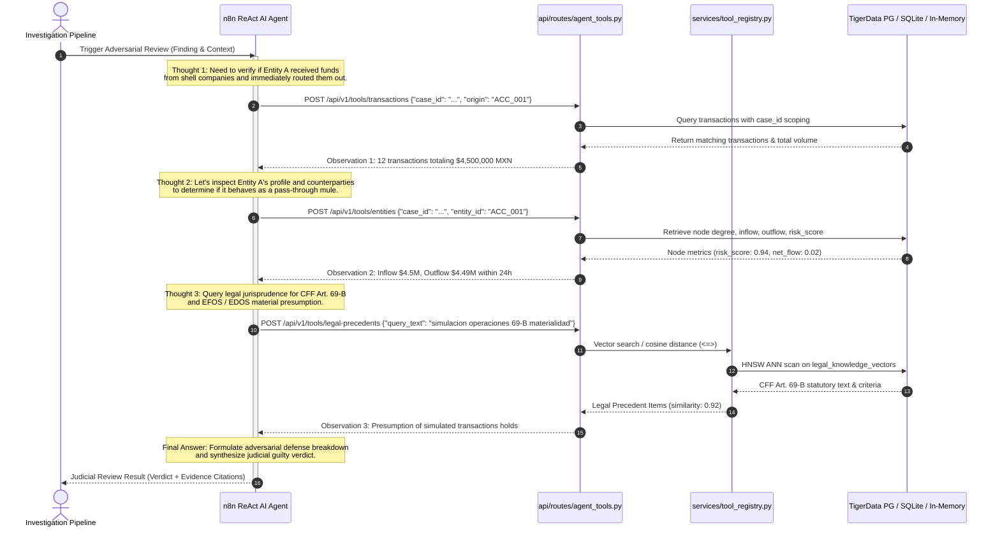
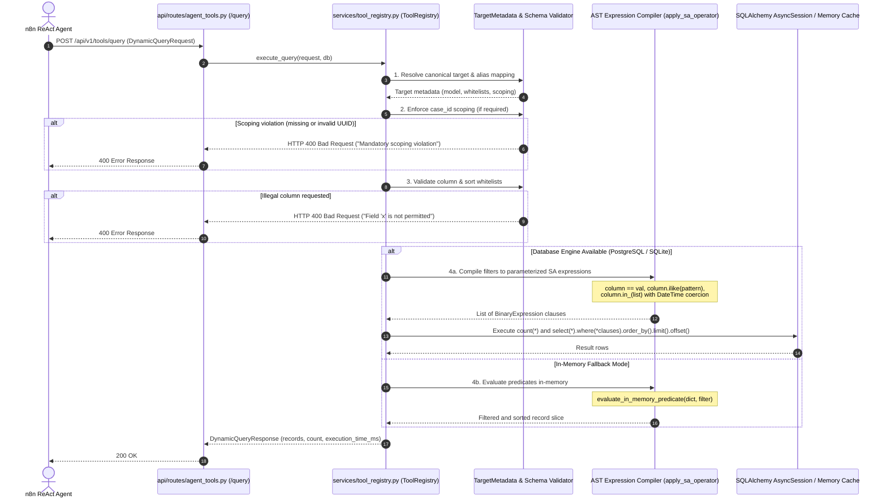
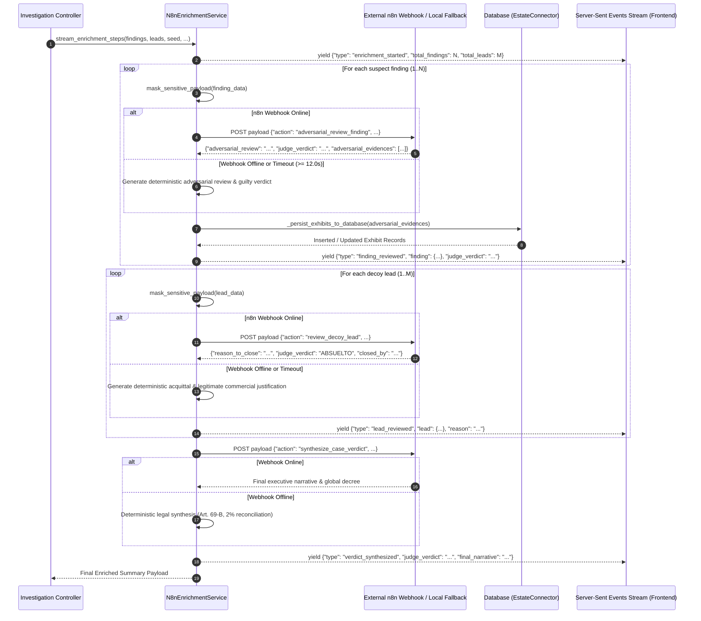

# Orchestration & Agent Tool Services

[← Back to Backend Documentation](../README.md) | [Master Architecture](../../README.md) | [Agent Routing Index](../../index.md)

---

## 1. Module Overview & Core Responsibilities

The **Orchestration & Agent Tools** subsystem forms the analytical intelligence and adversarial reasoning backbone of the Polar Forensic Auditor. Operating at the boundary between deterministic graph algorithms and Large Language Model (LLM) orchestration, this module empowers external **n8n ReAct agents** and local judicial evaluators to safely inspect forensic data estates, test hypotheses, and execute adversarial reviews.

```
+----------------------------------------------------------------------------------------------------+
|                                    n8n ReAct AI Agent Cluster                                      |
|                                                                                                    |
|     [Thought]               [Action / Tool Selection]              [Observation / Synthesis]       |
|         |                               |                                      ^                   |
+---------|-------------------------------|--------------------------------------|-------------------+
          |                               v                                      |
          |               HTTP POST /api/v1/tools/*                              |
          |               HTTP POST /api/v1/tools/query                          |
          v                                                                      |
+--------------------------------------------------------------------------------|-------------------+
| FastAPI Routing Layer (backend/api/routes/agent_tools.py)                      |                   |
|                                                                                |                   |
|  - Dedicated Tool Endpoints (/transactions, /entities, /patterns, /cashout...) |                   |
|  - Dynamic Composable Query Endpoint (/query)                                  |                   |
+--------------------------------------------------------------------------------|-------------------+
                                          |                                      |
                                          v                                      |
+--------------------------------------------------------------------------------|-------------------+
| Dynamic Tool Registry (backend/services/tool_registry.py)                      |                   |
|                                                                                |                   |
|  +--------------------------------+  +--------------------------------+        |                   |
|  |   Mandatory case_id Scoping    |  |    Strict Column Whitelist     |        |                   |
|  |   (Zero cross-case leaks)      |  |    (Field & Sort validations)  |        |                   |
|  +--------------------------------+  +--------------------------------+        |                   |
|  +--------------------------------+  +--------------------------------+        |                   |
|  |   Parameterized AST Compiler   |  |   Dual Execution Engine        |--------+                   |
|  |   (apply_sa_operator, No SQLi) |  |   (PostgreSQL Async + Fallback)|                            |
|  +--------------------------------+  +--------------------------------+                            |
+----------------------------------------------------------------------------------------------------+
                                          ^
                                          | Orchestrates via Webhooks & Fallbacks
+-----------------------------------------v----------------------------------------------------------+
| n8n LLM Enrichment Service (backend/services/n8n_enrichment.py)                                    |
|                                                                                                    |
|  - Sequential One-by-One Finding Review (Adversarial Defense + Judge Verdict)                      |
|  - Decoy Lead Evaluation & Nuanced Dismissals (Acquittal by Challenger/Validator)                 |
|  - Overarching Case Verdict Synthesis (Consolidated MXN volume & Article 69-B CFF decrees)         |
|  - Real-Time SSE Stream Generation (finding_reviewed, lead_reviewed, verdict_synthesized)           |
|  - Idempotent Exhibit Persistence (Automatic exhibits table synchronizer)                         |
|  - Deterministic Offline Fallback Engine (Zero-downtime, fully articulated local reasoning)        |
+----------------------------------------------------------------------------------------------------+
```

### Core Responsibilities
1. **Dynamic Agent Tool Registry (`backend/services/tool_registry.py`)**:
   - Manages registered query handlers across banking ledgers, forensic subgraphs, detected patterns, KYC records, and legal precedents.
   - Enforces an Abstract Syntax Tree (AST) compilation model that translates high-level JSON filter trees into parameterized SQLAlchemy expressions without string interpolation.
   - Enforces mandatory `case_id` scoping across all forensic case-scoped targets to guarantee zero cross-tenant or cross-investigation data leakage.
   - Restricts queryable fields and sort orders via rigid whitelists (`TARGET_FIELD_WHITELISTS`).
   - Implements dual execution: synchronous in-memory dictionary filtering for transient cases and asynchronous SQLAlchemy 2.0 execution against PostgreSQL (TigerData) or SQLite.

2. **Adversarial LLM Enrichment Service (`backend/services/n8n_enrichment.py`)**:
   - Orchestrates Stage 2 ("Deep Intelligence") of the forensic pipeline, reviewing findings sequentially one-by-one.
   - Generates adversarial challenges attempting to break or excuse each finding under Mexican fiscal and corporate law (checking contracts, CFDI 4.0 validity, and economic substance).
   - Formulates individual judge verdicts (`CULPABLE / IMPUTACIÓN PROCEDENTE` vs. `ABSUELTO / LÍNEA DESESTIMADA`) for every suspect finding and decoy lead.
   - Emits fine-grained Server-Sent Event (SSE) progress frames (`enrichment_started`, `finding_reviewed`, `lead_reviewed`, `verdict_synthesized`) consumed by dashboard timelines.
   - Automatically synchronizes cited exhibits directly into the relational `exhibits` table.
   - Houses an offline deterministic fallback engine that delivers structured legal narratives and judicial decisions when n8n is offline or unreachable.

---

## 2. Architecture & Interactive Sequence Workflows

### 2.1 n8n ReAct Agent Tool Invocation Loop

The ReAct (Reasoning + Acting) loop allows external AI agents hosted in n8n to discover, query, and corroborate evidence across financial transaction subgraphs before arriving at an audit verdict.



---

### 2.2 AST Dynamic Query Validation & Safe Execution

The dynamic query builder (`/api/v1/tools/query`) accepts arbitrary multi-clause filter requests from agents, compiles them via an Abstract Syntax Tree (AST), and executes them securely without risking SQL injection.



---

### 2.3 Sequential Finding Enrichment Flow

The enrichment engine evaluates each suspect finding and decoy lead one by one, allowing continuous real-time streaming of thoughts to the frontend and idempotent persistence of exhibits.



---

## 3. Dynamic Tool Registry Specification (`tool_registry.py`)

The dynamic tool registry coordinates all agent-facing query execution. It provides a structured, contract-driven interface that exposes database tables and in-memory data structures while actively defending against SQL injection and data leakage.

### 3.1 Registered Targets & Canonical Aliases

Target entities are registered using the `@tool_registry.register` decorator. Each target defines its backing model, allowed filter fields, allowable sort columns, default sort ordering, and mandatory scoping constraints:

| Canonical Target | Aliases | Backing Model | Requires `case_id` | Default Sort Field | Allowed Filter Fields Whitelist |
| :--- | :--- | :--- | :---: | :--- | :--- |
| `transactions` | — | `TransactionRecord` | **Yes** | `timestamp desc` | `id`, `case_id`, `origin`, `destination`, `amount`, `timestamp`, `is_suspicious`, `reasons` |
| `cases` | — | `InvestigationCase` | **No** | `created_at desc` | `id`, `filename`, `status`, `created_at`, `updated_at` |
| `entities` | `nodes` | Subgraph node dict | **Yes** | `risk_score desc` | `id`, `entity_id`, `total_in`, `total_out`, `net_flow`, `in_degree`, `out_degree`, `risk_score`, `is_suspicious`, `reasons` |
| `patterns` | `cycles`, `passthrough_accounts` | Patterns dict | **Yes** | `estimated_volume desc` | `pattern_type`, `length`, `estimated_volume`, `ratio`, `account`, `node_id`, `time_delta_hours`, `path` |
| `edges` | — | Subgraph edge dict | **Yes** | `amount desc` | `source`, `target`, `amount`, `count` |
| `legal_precedents` | `legal_vectors` | `LegalArticleVector` | **No** | `article_code asc` | `id`, `article_code`, `law_name`, `content` |
| `accounts` | `account` | `AccountRecord` | **No** | `acct_id asc` | `acct_id`, `dsply_nm`, `type`, `acct_stat`, `acct_rptng_crncy`, `prior_sar_count`, `branch_id`, `open_dt`, `close_dt`, `initial_deposit`, `bank_id`, `first_name`, `last_name`, `street_addr`, `city`, `state`, `country`, `zip`, `gender`, `birth_date`, `ssn` |
| `parties` | `party`, `customers` | `PartyRecord` | **No** | `party_id asc` | `party_id`, `party_type`, `is_individual`, `first_name`, `last_name`, `legal_name`, `name`, `name_alias`, `birth_place_country`, `country_of_residency`, `country_of_incorporation`, `nationality`, `occupation`, `organization_symbol`, `source_of_income`, `title`, `website`, `gender`, `marital_status`, `is_active`, `listed_company`, `primary_phone`, `personal_email`, `company_email` |
| `cash_transactions` | `cash_tx`, `cashout` | `CashTransactionRecord`| **No** | `tran_id desc` | `tran_id`, `account_id`, `bene_acct`, `tx_type`, `amount`, `timestamp`, `branch_id`, `is_sar`, `alert_id` |
| `account_mappings` | `account_mapping` | `AccountMappingRecord` | **No** | `cust_acct_mapping_id asc` | `cust_acct_mapping_id`, `acct_id`, `cust_id`, `cust_acct_role`, `src_sys`, `data_dump_dt` |

---

### 3.2 AST-Safe Parameterized Query Compilation

To prevent SQL injection vulnerabilities, the system forbids raw SQL strings and manual string concatenation. All dynamic queries are compiled via `apply_sa_operator()`:

```python
def apply_sa_operator(column: Any, operator_val: Union[FilterOperator, str], value: Any) -> Any:
    """
    Safely compiles a filter operator into a parameterized SQLAlchemy expression.
    Zero string concatenation or raw SQL injection vulnerability.
    """
```

#### Supported Operators & Compilation Matrix:
- **`eq` (`==`)**: Compiles to `column == value`.
- **`neq` (`!=`)**: Compiles to `column != value`.
- **`gt` (`>`)** / **`gte` (`>=`)**: Compiles to `column > value` / `column >= value`.
- **`lt` (`<`)** / **`lte` (`<=`)**: Compiles to `column < value` / `column <= value`.
- **`like` / `ilike`**: Automatically verifies whether `%` wildcards are provided; if absent, encapsulates `f"%{val}%"` safely before passing to `column.like()` or `column.ilike()`.
- **`in`**: Validates that `value` is a collection (`list`, `tuple`, `set`). If empty, generates a safe non-matching predicate (`column.in_([None]) & column.is_not(None)`).
- **`not_in`**: Validates collection type. If empty, evaluates to `True`. Otherwise compiles to `column.not_in(val_list)`.

#### Defensive Column-Level DateTime Coercion:
When filtering on `DateTime` columns (e.g., `timestamp`, `created_at`, `updated_at`), incoming strings or Unix epoch integers are safely parsed into timezone-aware UTC `datetime` objects via `parse_datetime_safe()`. This prevents database driver type mismatches or unhandled exceptions.

#### In-Memory Predicate Evaluator:
When the system runs without a live PostgreSQL database (e.g., in testing or single-case demo sessions), `evaluate_in_memory_predicate()` mirrors the exact behavior of SQLAlchemy expressions against dictionary objects, including secondary alias resolution (`id` ↔ `entity_id` ↔ `account`) and floating-point numeric tolerance.

---

### 3.3 Security & Scoping Constraints

1. **Mandatory `case_id` Scoping**:
   - Queries targeting `transactions`, `entities`, `nodes`, `edges`, `patterns`, `cycles`, or `passthrough_accounts` **must** supply a valid `case_id`.
   - The registry verifies that `case_id` is supplied either at the root request level or as an explicit `eq` filter clause.
   - The UUID format is validated using `uuid.UUID(str(case_id))`.
   - Any attempt to query case-scoped targets without a `case_id` triggers an immediate `HTTP 400 Bad Request`, preventing cross-investigation information disclosure.

2. **Column Whitelist Enforcement**:
   - Every filter clause's `field` attribute is checked against `meta.allowed_columns`.
   - Any unlisted field immediately aborts the query with `HTTP 400 Bad Request` and returns the exact list of permissible columns.

3. **Sort Column Whitelist Enforcement**:
   - If `sort_by` is specified, it must belong to `meta.allowed_sort_columns`.
   - Prevents database error exploitation or unexpected schema reconnaissance.

---

## 4. Specialized Forensic Agent Tools (`agent_tools.py`)

The `/api/v1/tools` router exposes dedicated REST endpoints designed for autonomous AI agents. Each endpoint maps to an exact forensic investigation requirement:

### 4.1 Tool Catalog & Signatures

| Endpoint Route | Primary Tool Alias | Function Name | Purpose |
| :--- | :--- | :--- | :--- |
| `POST /api/v1/tools/transactions` | `search_transactions` | `query_transactions` | Filters transactions by case, origin, destination, amount bounds, and time range. |
| `POST /api/v1/tools/entities` | `get_entity_profile` | `profile_entities` | Retrieves in/out degree, net flow, and forensic risk score for an entity. |
| `POST /api/v1/tools/patterns` | `query_patterns` | `query_patterns` | Discovers closed transaction cycles and temporal pass-through mule conduits. |
| `POST /api/v1/tools/legal-precedents` | `check_legal_precedent`| `query_legal_precedents`| Executes semantic vector search against Mexican AML statutes and CFF Art. 69-B. |
| `POST /api/v1/tools/related-entities` | `find_counterparties` | `find_related_entities` | Finds entities with high transaction frequencies or volume with a target account. |
| `POST /api/v1/tools/compare-entities` | `compare_entities` | `compare_entities` | Identifies common beneficial ownership via customer mappings, SSNs, and RFCs. |
| `POST /api/v1/tools/analyze-payment-patterns` | `analyze_payment_patterns` | `analyze_payment_patterns` | Returns a rapid Boolean assessment of whether circular or mule patterns exist. |
| `POST /api/v1/tools/financial-history`| `search_financial_history` | `search_financial_history`| Retrieves comprehensive customer KYC, account statuses, and prior SAR history. |
| `POST /api/v1/tools/cashout` | `get_cashout` | `get_cashout` | Lists all ATM or physical cash takeout transactions for an account. |
| `POST /api/v1/tools/trace-money-flow` | `trace_money_flow` | `trace_money_flow` | Traces directed multi-hop paths of funds moving between source and destination accounts. |
| `POST /api/v1/tools/related-transactions`| `find_related_transactions` | `find_related_transactions` | Gathers direct, secondary (2-hop), and tertiary (3-hop) transactions surrounding a transaction ID. |
| `POST /api/v1/tools/transaction-chains` | `find_transaction_chains` | `find_transaction_chains` | Detects multi-hop sequences connecting two endpoints through intermediate mules. |
| `POST /api/v1/tools/shared-entities` | `find_shared_entities` | `find_shared_entities` | Identifies entity pairs exhibiting identical downstream transfer destinations. |
| `POST /api/v1/tools/circular-flow` | `detect_circular_flow` | `detect_circular_flow` | Isolates closed loops where capital returns to the originator (round-tripping). |
| `POST /api/v1/tools/query` | `run_dynamic_query` | `dynamic_query` | Dynamic AST query builder dispatching directly to `tool_registry.execute_query`. |

---

## 5. n8n LLM Enrichment Service Specification (`n8n_enrichment.py`)

The `N8nEnrichmentService` class coordinates Stage 2 of the forensic pipeline. It elevates raw mathematical detections (graph cycles, high-ratio conduits) into court-admissible audit reports complete with adversarial defenses and formal judicial verdicts.

### 5.1 Sequential One-by-One Finding Review

Rather than sending an entire case in one monolithic prompt, the service processes findings sequentially through `review_single_finding()`:
- **Masking**: Sanitizes and masks sensitive identifiers (`RFC`, bank accounts) via `mask_sensitive_payload()`.
- **Payload Contract**:
  ```json
  {
    "action": "adversarial_review_finding",
    "seed": 42,
    "company_name": "Empresa Auditada S.A. de C.V.",
    "company_rfc": "AUD890101XYZ",
    "estate_path": "/path/to/estate.db",
    "finding_index": 1,
    "total_findings": 3,
    "finding": {
      "scheme_type": "phantom_vendor",
      "peso_amount": 92800.0,
      "rule_broken": "SAT Articulo 69-B",
      "entities": ["RFC:PHANTOM999"],
      "exhibits": [{"source_table": "invoices", "record_id": "INV-001", "note": "Factura simulada"}]
    }
  }
  ```
- **Adversarial Challenge**: An external n8n ReAct agent examines the defense hypothesis (e.g., standard business expense, verifiable travel allowances, commercial goodwill) and attempts to find supporting documentation.
- **Judge Verdict**: The agent issues a ruling (`CULPABLE / IMPUTACIÓN PROCEDENTE`), confirming criminal/fiscal liability under Mexican jurisprudence.
- **Exhibit Insertion**: New evidence sentences and references are extracted and automatically committed into the data estate's `exhibits` table.

---

### 5.2 Decoy Lead Review & Legitimate Dismissals

Forensic integrity requires documenting why non-fraudulent lines of inquiry were abandoned. `review_single_lead()` reviews decoy leads (leads not pursued):
- **Payload Contract**: Action `"review_decoy_lead"`.
- **Nuanced Justification**: Documents verifiable delivery slips, valid quote comparisons, or genuine payroll records.
- **Judge Verdict**: Renders an acquittal verdict (`ABSUELTO / LÍNEA DESESTIMADA`).
- **Attribution**: Records which agent persona dismissed the lead (`closed_by: "challenger" | "investigator" | "validator"`).

---

### 5.3 Overarching Case Verdict Synthesis

Once all individual findings and leads have been evaluated, `synthesize_case_verdict()` aggregates the results:
- Computes aggregate fraud volume in MXN (`total_fraud_volume_mxn`).
- Counts validated criminal schemes vs. legitimate dismissed leads.
- Issues the comprehensive forensic decree:
  > `"DICTAMEN PERICIAL EMITIDO: Se confirma la existencia de responsabilidad corporativa y fiscal por un monto total de $X MXN distribuido en Y esquemas fraudulentos... Las imputaciones satisfacen plenamente la carga probatoria y la conciliación al 2% pericial."`

---

### 5.4 Server-Sent Events (SSE) Streaming Integration

The service provides `stream_enrichment_steps()`, an asynchronous generator yielding step-by-step telemetry directly into the FastAPI SSE pipeline (`/api/v1/investigations/audit-estate/stream`):

1. `enrichment_started`: Emitted before processing begins with total finding and lead counts.
2. `finding_reviewed`: Emitted after each finding is evaluated; carries individual judicial verdict, adversarial review text, and newly registered exhibits.
3. `lead_reviewed`: Emitted after each decoy lead is closed; carries dismissal reasons and closure attributions.
4. `verdict_synthesized`: Emitted upon case completion; delivers global legal decree and executive narrative.

These steps are translated by `backend/api/routes/investigations.py` into unified SSE `thought` frames with explicit `agent_id` stamps (`RISK_REVIEW`, `ORCHESTRATOR`, `DATA_VALIDATION`) and `source` flags (`EXTERNAL` vs. `DETERMINISTIC`).

---

### 5.5 Deterministic Offline Fallback Reasoning

If `N8N_WEBHOOK_URL` is empty, unreachable, or times out (timeout threshold: 12.0 seconds), `N8nEnrichmentService` gracefully degrades to its deterministic rule engine:
- **Zero Interruption**: The API route does not crash or return a 500 error; the investigation completes seamlessly.
- **Accurate Legal Terminology**: Fallback text incorporates statutory references (Código Fiscal de la Federación Artículo 69-B, NIF A-2, SPEI tracing, 2% reconciliation threshold).
- **Exhibit Persistence**: Baseline evidence extracted from deterministic findings is still formatted and persisted into the `exhibits` table.
- **Telemetry Marking**: Results are explicitly stamped with `is_online: False` and `source: "DETERMINISTIC"` for transparent auditing.

---

### 5.6 Idempotent Exhibit Persistence (`_persist_exhibits_to_database`)

Adversarial findings cite specific evidentiary documents (contracts, invoices, banking transfers). The method `_persist_exhibits_to_database()` guarantees that:
- The `exhibits` table schema is dynamically initialized if absent:
  ```sql
  CREATE TABLE IF NOT EXISTS exhibits (
      exhibit_id VARCHAR(32) PRIMARY KEY,
      source_table VARCHAR(64),
      record_id VARCHAR(64),
      sentence TEXT
  );
  ```
- Each evidence item is checked against existing entries by `exhibit_id`.
- If an exhibit already exists, its `sentence`, `source_table`, and `record_id` are updated in place.
- If new, a deterministic ID (e.g. `EX-ADV-0001-ABCD`) is generated, added to the session, and committed.

---

## 6. Key Files, Classes, and Functions

| File Path | Component / Symbol | Type | Description |
| :--- | :--- | :--- | :--- |
| `backend/services/tool_registry.py` | `ToolRegistry` | Class | Registry managing target definitions, whitelists, and AST query dispatching. |
| `backend/services/tool_registry.py` | `tool_registry` | Instance | Global singleton instance of `ToolRegistry`. |
| `backend/services/tool_registry.py` | `TargetMetadata` | Dataclass | Immutable descriptor holding field whitelists, sort rules, and scoping requirements. |
| `backend/services/tool_registry.py` | `apply_sa_operator` | Function | Compiles filter operators (`eq`, `like`, `in`, etc.) into parameterized SQLAlchemy expressions. |
| `backend/services/tool_registry.py` | `evaluate_in_memory_predicate` | Function | Evaluates filter criteria against dictionary records for in-memory dual execution. |
| `backend/services/tool_registry.py` | `parse_datetime_safe` | Function | Converts ISO strings, floats, and ints into standardized UTC `datetime` objects. |
| `backend/services/n8n_enrichment.py` | `N8nEnrichmentService` | Class | Core service orchestrating sequential finding reviews, judicial verdicts, and exhibits. |
| `backend/services/n8n_enrichment.py` | `n8n_enrichment_service` | Instance | Global singleton instance of `N8nEnrichmentService`. |
| `backend/services/n8n_enrichment.py` | `review_single_finding` | Method | Reviews a single suspect finding with adversarial challenges and judge verdicts. |
| `backend/services/n8n_enrichment.py` | `review_single_lead` | Method | Reviews a single decoy lead, issuing formal dismissal justifications. |
| `backend/services/n8n_enrichment.py` | `synthesize_case_verdict` | Method | Combines all finding verdicts into a unified executive decree and legal narrative. |
| `backend/services/n8n_enrichment.py` | `stream_enrichment_steps` | Async Gen | Yields step-by-step progress events for real-time SSE streaming. |
| `backend/services/n8n_enrichment.py` | `_persist_exhibits_to_database` | Method | Inserts or updates cited evidence records in the database `exhibits` table. |
| `backend/api/routes/agent_tools.py` | `router` | APIRouter | Exposes 15 dedicated forensic tool endpoints and the dynamic `/query` endpoint. |
| `backend/schemas/agent_tools.py` | `DynamicQueryRequest` | Pydantic Model| Request contract enforcing target entities, filters, limits, and case scoping. |
| `backend/schemas/agent_tools.py` | `DynamicQueryResponse` | Pydantic Model| Standardized response envelope with execution time and record counts. |
| `backend/schemas/agent_tools.py` | `TARGET_FIELD_WHITELISTS` | Constant Dict | Rigid column whitelists defining permitted query fields per target. |

---

## 7. Verification & Testing Guide

The behavior and safety of the orchestration tools and n8n enrichment services are verified via dedicated pytest suites:

```bash
# 1. Test n8n sequential enrichment, mock online calls, and offline fallbacks
python -m pytest backend/tests/test_n8n_enrichment.py -v

# 2. Test Agent Tools endpoints, AST query builder, and column whitelisting
python -m pytest backend/tests/test_agent_tools.py -v

# 3. Test multi-hop graph traversals, entity comparisons, and circular flow detection
python -m pytest backend/tests/test_challenger_m3_2.py -v

# 4. End-to-end pipeline verification (upload -> prune -> SSE stream -> TTS)
python -m pytest backend/tests/test_pipeline.py -v
```

Key test invariants verified by these suites:
- **Zero SQL Injection**: Operator compilation verifies that raw strings cannot escape parameter bindings.
- **Mandatory Scoping**: Requests omitting `case_id` on case-scoped targets strictly return HTTP 400.
- **Whitelist Rejection**: Requesting an unknown column (e.g., `password_hash` or `is_admin`) triggers immediate validation errors.
- **Offline Resilience**: Simulating n8n webhook failures verifies that `review_single_finding()` generates full legal narratives without throwing unhandled exceptions.
- **Exhibit Idempotency**: Running sequential reviews multiple times does not create duplicate exhibit rows in SQLite / PostgreSQL.
