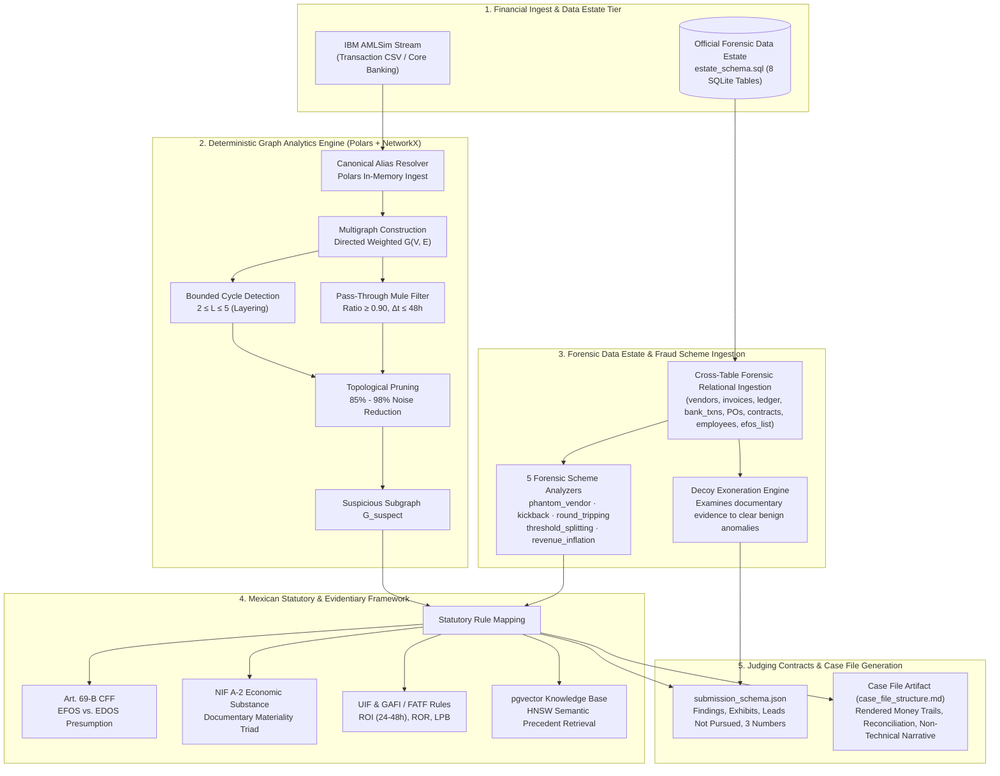
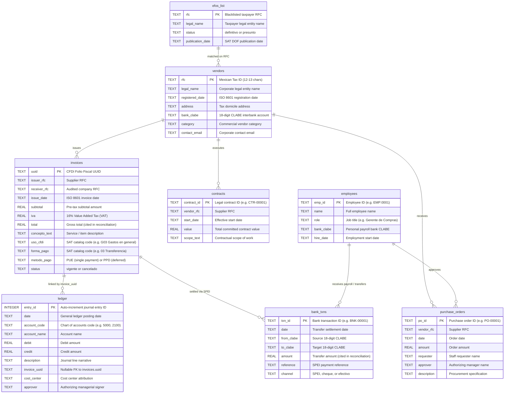
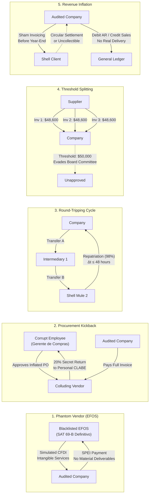
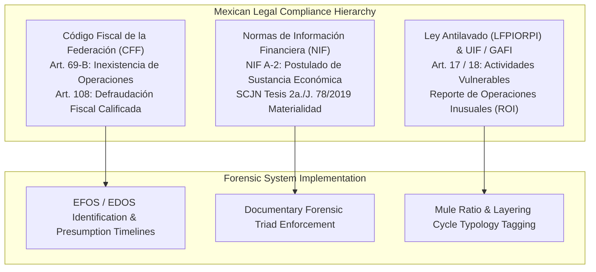
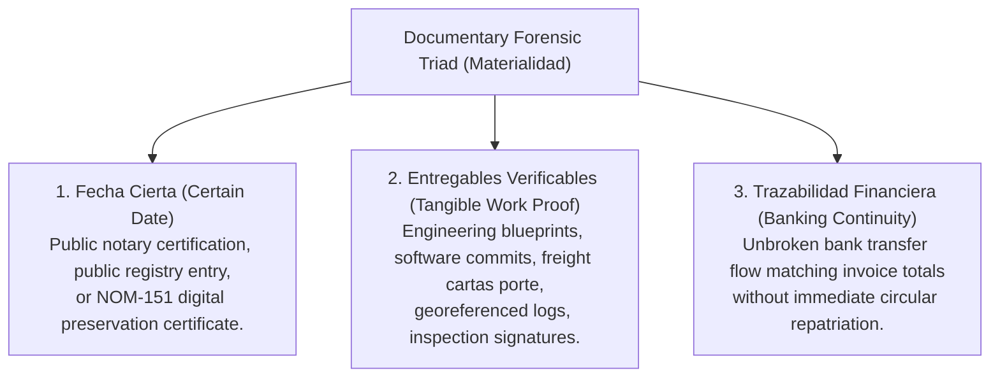

# Data Pipeline, Forensic Data Estate & Legal Compliance Engine

[← Back to Master Documentation](../README.md) | [Agent Routing Index](../index.md)

---

## 1. Overview and Core Responsibilities

The **Data and Compliance** segment forms the investigative data foundation and regulatory engine for the Polar Forensic Auditor monorepo. It manages two complementary data paradigms, deterministic topological graph pruning, and Mexican statutory forensic compliance:



### Core System Responsibilities
1. **Dual-Tier Financial Data Architecture**:
   - **Streaming Transaction Layer**: Ingests high-volume banking transaction CSVs (IBM AMLSim benchmark) with [Polars](https://pola.rs/) and constructs topological directed graphs with [NetworkX](https://networkx.org/).
   - **Relational Enterprise Data Estate Layer**: Manages the official 8-table SQLite database specification (`estate_schema.sql`) modeling Mexican CFDI 4.0 electronic invoices, double-entry general ledger entries, interbank SPEI transfers, purchase orders, contracts, employee profiles, and the SAT Article 69-B blacklists.
2. **Deterministic Topological Pruning**: Executes mathematically provable graph invariant algorithms (closed cycle detection bounded to length $\le 5$ and flow conservation ratio $\ge 0.90$ within $\le 48\text{h}$) to eliminate 85% to 98% of benign economic noise before LLM agent invocation.
3. **Forensic Scheme Identification**: Identifies and proves the 5 required contest fraud archetypes: `phantom_vendor`, `kickback`, `round_tripping`, `threshold_splitting`, and `revenue_inflation`.
4. **Decoy Exoneration & False-Accusation Control**: Systematically investigates benign anomalies with plausible commercial or logistical justifications (e.g. board minutes, vehicle weight limits, framework contracts) to record them in `leads_not_pursued` without lodging false accusations.
5. **Mexican Statutory Compliance**: Binds algorithmic findings directly to statutory articles under the **Código Fiscal de la Federación (CFF)**, **Normas de Información Financiera (NIF)**, and **Unidad de Inteligencia Financiera (UIF)** regulations.
6. **Strict Competition Judging Compliance**: Enforces format compliance with `submission_schema.json`, answer key isolation under `ground_truth_schema.json`, per-table 2% arithmetic peso reconciliation, and reproducible offline evaluation across held-out seeds.

---

## 2. The Official Data Estate Architecture (`estate_schema.sql`)

The official data estate specification defines an enterprise relational database consisting of **8 interconnected tables** modeled after Mexican corporate accounting and tax law standards.

### 2.1 Entity-Relationship Architecture



### 2.2 Table Schema Specifications & CFDI 4.0 Metadata

| Table Name | Primary Key | Key Relationships | Forensics & CFDI 4.0 Semantic Fields |
| :--- | :--- | :--- | :--- |
| `vendors` | `rfc` | Master table referenced by `invoices`, `purchase_orders`, `contracts`. | Contains the vendor's 18-digit `bank_clabe` and category. Linked against `efos_list.rfc` to uncover blacklisted suppliers. |
| `invoices` | `uuid` | `issuer_rfc` $\to$ `vendors.rfc`, `receiver_rfc` $\to$ audited company. | Complies with **CFDI 4.0** electronic invoice standards: `uso_cfdi` (`G01`, `G03`), `forma_pago` (`03` Transfer), `metodo_pago` (`PUE`, `PPD`), and `status` (`vigente`, `cancelado`). `total` is cited for arithmetic reconciliation. |
| `ledger` | `entry_id` | `invoice_uuid` $\to$ `invoices.uuid` (nullable). | General journal recording balanced debit and credit entries. Tracks `account_code`, `cost_center`, and managerial `approver`. Essential for uncovering unauthorized journal adjustments. |
| `bank_txns` | `txn_id` | `from_clabe`, `to_clabe` $\to$ `vendors.bank_clabe`, `employees.bank_clabe`. | Real-money cash flow layer tracking SPEI transfers, dates, and amounts. `amount` is cited for arithmetic reconciliation. Crucial for kickback and pass-through tracing. |
| `purchase_orders` | `po_id` | `vendor_rfc` $\to$ `vendors.rfc`. | Procurement authorizations detailing `requester`, `approver`, and `amount`. Traces internal approval limit evasion (threshold splitting) and corrupt collusions. |
| `contracts` | `contract_id` | `vendor_rfc` $\to$ `vendors.rfc`. | Long-term framework and fixed-price contracts detailing `start_date`, `value`, and `scope_text`. Proves operational materiality (NIF A-2) or demonstrates its total absence. |
| `employees` | `emp_id` | Master table referenced by `purchase_orders.approver` and `bank_txns.to_clabe`. | Identifies internal personnel, corporate roles, hire dates, and personal `bank_clabe` accounts. Essential for proving employee-vendor kickback linkages. |
| `efos_list` | `rfc` | Matches against `vendors.rfc` and `invoices.issuer_rfc`. | Mirror of the official SAT Article 69-B blacklist published in the *Diario Oficial de la Federación* (DOF). Stores classification status (`definitivo` or `presunto`). |

---

## 3. The 5 Contest Forensic Fraud Schemes

The system detects and proves five canonical corporate and financial crime schemes:



### 3.1 Scheme 1: Phantom Vendor (`phantom_vendor`)
- **Topology**: A supplier registered in `efos_list` (status `definitivo` or `presunto`) issues high-value invoices for intangible services (e.g. "Servicios de asesoría estratégica en optimización de infraestructura intangible").
- **Evidence Trail**:
  1. `efos_list`: Entry matching supplier RFC with publication date.
  2. `invoices`: Invoices totaling substantial sums without referenced contracts or POs.
  3. `contracts`: Complete absence of contracts or deliverable documentation.
  4. `bank_txns`: Outgoing SPEI transfers settling invoices to an unverified entity.
- **Rule Broken**: **SAT Artículo 69-B del Código Fiscal de la Federación (CFF)** — Presunción de operaciones inexistentes por falta de personal, activos e infraestructura.

### 3.2 Scheme 2: Procurement Kickback (`kickback`)
- **Topology**: An internal company employee (e.g. `Gerente de Compras`, ID `EMP:xxxx`) routinely authorizes purchase orders and invoices to a preferred vendor. Within days of invoice settlement, the vendor transfers a fixed percentage (e.g. 15%–25%) directly into the employee's personal bank account.
- **Evidence Trail**:
  1. `purchase_orders`: Approved by the suspect employee's name.
  2. `invoices`: Billed by the vendor and referencing the authorized PO.
  3. `bank_txns` (Primary): Company pays the vendor's corporate CLABE.
  4. `bank_txns` (Secondary): Vendor transfers funds to the employee's personal `bank_clabe` matching `employees.bank_clabe`.
- **Rule Broken**: **Código Penal Federal Art. 400 Bis & Delitos Corporativos / Corrupción Privada** — Conflicto de interés grave y pago indebido de comisiones ilegales.

### 3.3 Scheme 3: Round-Tripping (`round_tripping`)
- **Topology**: Closed directed money cycle. Funds exit the audited company, pass through two or more intermediary accounts or subcontractors, and return to the company within $\le 48\text{ hours}$, retaining approximately 98% of value (2% friction loss).
- **Evidence Trail**:
  1. `bank_txns`: Continuous chained sequence of transfers ($A \to B \to C \to A$) with matching timestamps and minimal value dissipation.
  2. `ledger`: Fictitious balancing entries obscuring the circular nature of the funds.
  3. `money_trail`: Connected sequential diagram linking transaction IDs.
- **Rule Broken**: **Disposiciones UIF / GAFI Tipología de Lavado de Dinero (Estratificación y Circulación Simulada)**.

### 3.4 Scheme 4: Threshold Splitting (`threshold_splitting`)
- **Topology**: Intentional structuring (*smurfing*) of a large purchase into multiple consecutive invoices and purchase orders just below the internal corporate governance threshold (e.g. \$50,000 MXN limit requiring Board or Director approval; e.g. 4 invoices of \$48,600 MXN issued within 3 days).
- **Evidence Trail**:
  1. `invoices`: Multiple invoices issued on consecutive dates by the same vendor with identical unit concepts and amounts just under the authorization limit.
  2. `purchase_orders`: Sequential POs authorized by lower-tier personnel evading the required executive approval level.
- **Rule Broken**: **Políticas de Control Interno Corporativo & Fraccionamiento Indebido de Adquisiciones**.

### 3.5 Scheme 5: Revenue Inflation (`revenue_inflation`)
- **Topology**: Sham sales invoices issued to shell clients or colluding entities right before quarterly or annual financial period close (e.g. late December or late March). Fictitious accounts receivable and revenue are recognized in the general ledger without economic transfer of goods or services, subsequently settled via circular funds or written off.
- **Evidence Trail**:
  1. `invoices`: Sales invoices issued by the audited company to shell clients on year-end dates with no delivery notes (*cartas porte*).
  2. `ledger`: Journal entries debiting Cuentas por Cobrar and crediting Ingresos por Ventas without actual delivery proof.
  3. `bank_txns`: Circular or non-existent settlement.
- **Rule Broken**: **NIF A-2 Sustancia Económica & Delito Fiscal por Ingresos Simulados (Art. 108 CFF)**.

---

## 4. Decoy Entities and False Accusation Avoidance

In competition judging, **recall is only half the measure**. False accusations against honest entities are penalized with equal or greater weight than missed fraud schemes.

### 4.1 Decoy Archetypes and Exonerating Proof

| Decoy Type | Statistical Anomaly (Detector Signal) | Documentary Exoneration (Why Innocent) | Evidence to Examine |
| :--- | :--- | :--- | :--- |
| `split_urgent_order` | Multiple consecutive sub-threshold invoices resembling threshold splitting. | Physical cargo logistics constraint: shipment split across 3 trucks due to SCT highway axle weight limits. | Purchase order notes and dispatch logistics logs documenting vehicle weight limits. |
| `high_value_board_approved` | Abnormally large single transaction triggering value anomaly thresholds. | Legitimate strategic capital asset acquisition formally approved by the corporate Board of Directors. | General ledger approval metadata and formal Board of Directors meeting minutes (*Acta de Consejo*). |
| `high_velocity_logistics` | Rapid pass-through fund turnover resembling high-velocity mule conduit. | High-volume third-party logistics freight clearinghouse operating under a multi-year master service agreement. | Long-term master framework contract (`contracts.value`) and clean SAT tax compliance opinion (Art. 32-D). |
| `employee_relocation_bonus` | Direct company bank transfer to an employee personal CLABE resembling a kickback. | Contractually authorized executive relocation bonus and moving expense reimbursement. | Human Resources executive appointment addendum and corporate relocation policy documentation. |
| `similar_name_clean_tax` | Supplier name or bank branch highly similar to a blacklisted EFOS entity. | Independent legitimate operating business with similar trade styling but verified clean tax standing. | Verified SAT Opinión del Cumplimiento (32-D) positiva and independent tax domiciliation. |

### 4.2 Recording Leads in `leads_not_pursued`
When the investigative system flags an entity, it must never discard or silently drop the trail. Honest decoys must be recorded in the **`leads_not_pursued`** section of the submission and case file:
- Must name the specific entity (`RFC:...` or `EMP:...`).
- Must specify the detector or trigger signal that initiated scrutiny.
- Must cite the **exact documentary evidence** that cleared the entity (generic explanations such as *"insufficient evidence"* are penalized by judges).
- Must record which investigative role closed the lead (`investigator`, `challenger`, or `validator`).

---

## 5. Mexican Legal, Accounting & AML Compliance Framework

The forensic auditor aligns investigative findings with Mexican statutory law, accounting standards, and anti-money laundering regulations:



### 5.1 Código Fiscal de la Federación (CFF) Artículo 69-B

Artículo 69-B establishes the statutory presumption that invoices issued by a taxpayer lack real underlying economic operations when the SAT determines that the taxpayer lacks:
1. **Personnel**: Direct or contracted operational workforce (*personal suficiente*).
2. **Assets**: Machinery, tooling, vehicles, or physical inventory (*activos tangibles*).
3. **Infrastructure**: Warehouses, manufacturing plants, or operational offices (*infraestructura física*).
4. **Localization**: Unlocated at the registered fiscal domicile (*contribuyente no localizable*).

#### Procedural Timelines & Legal Classification
- **Presuntos**: Initial presumption published in the *Diario Oficial de la Federación* (DOF). The taxpayer has **15 business days** (extendable by 10) to furnish counter-evidence.
- **Definitivos**: If the taxpayer fails to disprove the presumption, their status becomes definitive. All CFDI issued are rendered void of any tax deduction or credit effect.
- **EDOS Regularization**: Clients who deducted invoices from definitive EFOS have **30 business days** from publication to reverse deductions and pay back taxes, or prove operational materiality before criminal tax fraud (*defraudación fiscal*, Art. 108 CFF) proceedings commence.

### 5.2 NIF A-2 & Operational Materiality (*Materialidad de Operaciones*)

Under Mexican Supreme Court jurisprudence (*Tesis 2a./J. 78/2019* and criteria from the *Tribunal Federal de Justicia Administrativa*), a valid CFDI invoice and corresponding bank transfer **do not suffice to prove an expense occurred**. Taxpayers must prove **materiality** through the **Documentary Forensic Triad**:



### 5.3 UIF (Unidad de Inteligencia Financiera) & GAFI / FATF Rules

Pursuant to the **Ley Federal para la Prevención e Identificación de Operaciones con Recursos de Procedencia Ilícita (LFPIORPI)**:
- **Reporte de Operación Inusual (ROI)**: Mandatory notification filed by regulated entities to the UIF within **24 to 48 hours** when client transaction geometry, frequency, or velocity diverges from declared business activity or matches layering typologies.
- **Reporte de Operación Relevante (ROR)**: Automatic reporting for all cash transactions exceeding \$7,500 USD (or equivalent).
- **Lista de Personas Bloqueadas (LPB)**: Precautionary administrative freezing of accounts under Art. 115 of the *Ley de Instituciones de Crédito*.
- **FATF Recommendations 10 & 20**: Strict Customer Due Diligence (CDD) verifying the Ultimate Beneficial Owner (UBO / *Beneficiario Controlador*), and prohibition against alerting the suspect party (*prohibición de alertamiento*).

### 5.4 PostgreSQL `pgvector` Semantic Legal Knowledge Base

To support LLM agents in legal reasoning, the architecture incorporates a PostgreSQL database with the `pgvector` extension:

```sql
CREATE EXTENSION IF NOT EXISTS vector;

CREATE TABLE legal_knowledge_vectors (
    id UUID PRIMARY KEY DEFAULT gen_random_uuid(),
    article_ref VARCHAR(64) NOT NULL,          -- e.g., 'CFF-Art-69B', 'LFPIORPI-Art-17'
    regulatory_body VARCHAR(32) NOT NULL,       -- 'SAT', 'UIF', 'GAFI', 'SCJN'
    precedent_type VARCHAR(32) NOT NULL,        -- 'Jurisprudencia', 'Tesis Aislada', 'Criterio Normativo'
    chunk_content TEXT NOT NULL,                -- Statutory criteria, evidentiary burden
    embedding vector(1536),                     -- Dense vector embedding
    metadata JSONB DEFAULT '{}'::jsonb,
    created_at TIMESTAMPTZ DEFAULT NOW()
);

CREATE INDEX idx_legal_vectors_hnsw 
ON legal_knowledge_vectors 
USING hnsw (embedding vector_cosine_ops)
WITH (m = 16, ef_construction = 64);
```

---

## 6. IBM AMLSim Ingestion & Deterministic Graph Pruning Engine

For raw transaction streams, Polar implements an ultra-fast deterministic pruning layer in `backend/services/ingestion.py` and `backend/services/deterministic_filter.py`.

### 6.1 Schema Normalization and Canonical Column Resolution

Transaction datasets exhibit varied column headers. The canonical resolver normalizes variations into standard types using Polars:

| Canonical Concept | Supported Raw Aliases | Target Polars Type | Description |
| :--- | :--- | :--- | :--- |
| `origin` | `origin`, `nameorig`, `from_account`, `source`, `orig_account`, `orig` | `pl.Utf8` | Source account identifier / CLABE. |
| `destination` | `destination`, `namedest`, `to_account`, `target`, `dest_account`, `dest` | `pl.Utf8` | Target account identifier / CLABE. |
| `amount` | `amount`, `value`, `monto`, `sum` | `pl.Float64` | Positive transaction monetary value ($> 0$). |
| `timestamp` | `timestamp`, `step`, `time`, `date`, `datetime`, `trans_time` | `pl.Float64` | Transaction step or epoch time. Synthesizes `[0, N-1]` if missing. |

### 6.2 Closed Directed Cycle Detection (`detect_closed_cycles`)

A directed cycle $C = (v_1, v_2, \dots, v_k, v_1)$ represents circular layering or round-tripping. To avoid Johnson's algorithm exponential worst-case complexity $\mathcal{O}((|V| + |E|)(c + 1))$, the search bounds cycle length:
$$2 \le |C| \le \text{MAX\_CYCLE\_LENGTH} = 5$$
Cycles of length $> 5$ are pruned from traversal, as money laundering circuits rarely exceed 5 hops due to friction loss and intermediary risk.

### 6.3 High-Velocity Pass-Through Mule Filtering (`detect_passthrough_accounts`)

A node $v \in V$ is isolated as a high-velocity money mule if and only if it satisfies three strict invariants:
1. **Bidirectional Activity**: $\text{total\_in}(v) > 0$ and $\text{total\_out}(v) > 0$.
2. **Flow Conservation Ratio**:
   $$R(v) = \frac{\min(\text{total\_in}(v), \text{total\_out}(v))}{\max(\text{total\_in}(v), \text{total\_out}(v))} \ge 0.90$$
3. **Temporal Dispersion Window**:
   $$\Delta t(v) = |\max(T_{\text{out}}(v)) - \min(T_{\text{in}}(v))| \le 48.0 \text{ hours}$$

### 6.4 Pruning Efficiency and Risk Classification

The pruned subgraph combines suspect sets:
$$V_{\text{suspect}} = V_{\text{cycle}} \cup V_{\text{passthrough}}, \quad E_{\text{suspect}} = E_{\text{cycle}} \cup E_{\text{passthrough}}$$
Pruning efficiency $\eta_{\text{prune}} = \frac{|E_{\text{total}}| - |E_{\text{suspect}}|}{|E_{\text{total}}|} \times 100\%$ regularly achieves **85% to 98%**, discarding legitimate consumer and payroll noise.

Suspect nodes receive a deterministic risk score:
$$\text{RiskScore}(v) = \min\left(1.0, \; 0.5 + 0.3 \cdot \mathbb{I}_{\text{cycle}}(v) + 0.2 \cdot \mathbb{I}_{\text{passthrough}}(v)\right)$$

| Indicator Tags | Risk Score | Risk Level |
| :--- | :--- | :--- |
| Single condition (`CIRCULAR_FLOW_CYCLE` only) | 0.80 | ALTO |
| Single condition (`HIGH_VELOCITY_PASSTHROUGH_90PCT` only) | 0.70 | ALTO |
| Compound (`CIRCULAR_FLOW_CYCLE` + `HIGH_VELOCITY_PASSTHROUGH_90PCT`) | 1.00 | CRÍTICO |

---

## 7. Contest Output Contracts & Evaluation Protocols

The system's findings and case files must strictly adhere to the competition scoring contracts defined in `tmp/`:

### 7.1 Submission Schema (`submission_schema.json`)

The final output findings JSON emitted by the investigative pipeline must comply with the following structure:

```json
{
  "submission": {
    "seed": 101,
    "findings": [
      {
        "scheme_type": "phantom_vendor",
        "entities": ["RFC:EFOS990101AA1"],
        "narrative": "Plain language narrative explaining the finding in under 150 words.",
        "rule_broken": "SAT Articulo 69-B del CFF",
        "peso_amount": 185600.0,
        "money_trail": [
          {
            "from": "000000000000000099",
            "to": "000000000000000055",
            "amount": 185600.0,
            "date": "2026-02-15",
            "exhibit_id": "EX-001"
          }
        ],
        "exhibits": [
          {
            "exhibit_id": "EX-001",
            "source_table": "bank_txns",
            "record_id": "BNK-00012",
            "note": "SPEI bank transfer settling simulated invoice without deliverables."
          },
          {
            "exhibit_id": "EX-002",
            "source_table": "invoices",
            "record_id": "INV-00045",
            "note": "CFDI invoice for intangible strategic advisory lacking operational contract."
          },
          {
            "exhibit_id": "EX-003",
            "source_table": "efos_list",
            "record_id": "EFOS990101AA1",
            "note": "Official SAT Article 69-B definitive blacklist publication record."
          }
        ],
        "confidence": "proven"
      }
    ],
    "leads_not_pursued": [
      {
        "entity": "RFC:LOGI850201BB2",
        "signal": "high_velocity_pass_through",
        "reason": "Exonerated after verifying multi-year framework contract CTR-00004 and clean SAT 32-D tax opinion.",
        "tool_calls_made": ["query_contracts", "query_sat_opinion"],
        "closed_by": "challenger"
      }
    ],
    "run_metadata": {
      "llm_calls": 8,
      "mxn_cost": 1.45,
      "wall_clock_seconds": 18.2,
      "deterministic": true
    }
  }
}
```

#### Contract Constraints:
- `scheme_type`: Restricted to `["phantom_vendor", "kickback", "round_tripping", "threshold_splitting", "revenue_inflation"]`.
- `entities`: Array of strings prefixed by type (`"RFC:..."` or `"EMP:..."`).
- `exhibits`: Minimum of **3 exhibits** per finding. Every cited `record_id` must exist in the database.
- `money_trail`: Ordered steps connecting source to destination, each citing an `exhibit_id`.
- `confidence`: Either `"proven"` or `"probable"`.
- `closed_by`: Enum in `["investigator", "challenger", "validator"]`.
- `run_metadata`: Must report the **3 mandatory metrics**: `llm_calls`, `mxn_cost`, and `wall_clock_seconds`.

### 7.2 Ground Truth Schema & Isolation Rule (`ground_truth_schema.json`)

The evaluation answer key defines planted schemes and decoys:
```json
{
  "ground_truth": {
    "seed": 101,
    "company_rfc": "EMP920101AB1",
    "schemes": [
      {
        "scheme_id": "S1_phantom_vendor_1",
        "type": "phantom_vendor",
        "entities": ["RFC:EFOS990101AA1"],
        "supporting_invoices": ["INV-00045"],
        "supporting_txns": ["BNK-00012"],
        "peso_amount": 185600.0,
        "difficulty": "easy"
      }
    ],
    "decoys": [
      {
        "entity": "RFC:LOGI850201BB2",
        "signal": "high_velocity_pass_through",
        "why_innocent": "Legitimate logistics vendor operating under long-term contract CTR-00004.",
        "invoices": ["INV-00010"]
      }
    ]
  }
}
```

> [!CAUTION]
> **Strict Ground Truth Isolation Rule:**
> Ground truth answer keys must be stored in isolated paths accessible only to evaluation benchmark harnesses.
> Under no circumstances may an investigative agent, its tools, or modules it imports reference `ground_truth`.
> Judges may execute:
> ```bash
> grep -r 'ground_truth' your_project/src/ --include='*.py'
> ```
> Any leak of ground truth into agent reasoning caps the system's **Results score at 2** regardless of raw accuracy.

### 7.3 Case File Document Structure (`case_file_structure.md`)

The final judged case file artifact must be readable by a non-technical reader in Markdown, HTML, or PDF, organized into 5 sequential sections:
1. **Header**: Company name, audit period, estate seed, cost metrics (`llm_calls`, `mxn_cost`, `wall_clock_seconds`), and determinism assertion.
2. **Executive Summary**: Non-technical summary paragraph and summary metric table (Findings count by confidence, Total exposure in MXN pesos, Leads investigated and closed).
3. **One Section per Finding**:
   - Heading with entity ID, legal name, and scheme type.
   - Specific statutory rule broken.
   - Claimed amount and confidence level (`proven` or `probable`).
   - Plain-language narrative under 150 words.
   - **Rendered money trail diagram** (Mermaid / visual graph) linking exhibit IDs.
   - Exhibits table detailing table, record ID, and probative value note.
   - Arithmetic reconciliation demonstrating that claimed pesos equal cited exhibit sums.
   - Adversarial review summary (arguments considered and defeated).
4. **Leads Not Pursued**: Placed directly in the body of the report (not an appendix), detailing entity, signal, specific evidence examined, tools executed, and resolving agent role.
5. **Method and Limits**: Architecture description, out-of-scope boundaries, known detection limits, and exact instructions to regenerate the run.

---

## 8. Verification Criteria, Arithmetic Reconciliation & Edge Cases

### 8.1 The 2% Per-Table Peso Reconciliation Rule
In `validate_format.py`, each finding's claimed `peso_amount` is checked against the database records cited in its exhibits.
Amounts are summed **per amount-bearing table**:
- `invoices.total`
- `bank_txns.amount`
- `purchase_orders.amount`
- `contracts.value`

The validator identifies the best-matching table sum and verifies that:
$$\left| \text{claimed\_pesos} - \text{table\_sum} \right| \le 0.02 \times \max(\text{table\_sum}, 1)$$

```python
# From validate_format.py
best = min(per_table.values(), key=lambda v: abs(claimed - v))
if abs(claimed - best) > PESO_TOLERANCE * max(best, 1):
    errs.append(f"findings[{i}]: peso_amount {claimed:,.2f} does not reconcile to cited exhibits")
```

**Rationale**: An invoice and the bank transfer that settled it represent the *same underlying pesos*. Summing across tables would penalize auditors who provide a complete, unbroken evidentiary money trail.

### 8.2 Record ID Existence Check
Every exhibit record ID is checked against its designated table:
```python
col = ID_COLUMN[table]
row = conn.execute(f"SELECT * FROM {table} WHERE {col} = ?", (rid,)).fetchone()
if row is None:
    errs.append(f"exhibit {table}.{rid} does not exist in database")
```
Hallucinated or unverified IDs trigger immediate validation failure.

### 8.3 Held-Out Seeds and Zero-Network Replay
- Systems are scored across **at least 5 held-out seeds** disjoint from tuning seeds.
- The system must reproduce completed runs with network connectivity disabled.

### 8.4 Operational Edge Cases & Safeguards
- **Payment Processors / Gateways**: Processors like Stripe or MercadoPago exhibit pass-through ratios $> 0.90$. They are cleared by verifying valid RFCs and non-cyclic topologies.
- **Corporate Cash Pooling**: Subsidiary daily sweeps to central treasury accounts can mimic cycles. They are verified against corporate group charters and centralized cash-management contracts.
- **Dense Network Combinatorial Explosions**: High transaction density is protected by strictly bounding cycle lengths ($L \le 5$) and executing Polars vectorized pre-filters.

---

## 9. Key Files & Data Models Reference Matrix

| File / Path | Primary Responsibility | Key Classes, Functions & Entities |
| :--- | :--- | :--- |
| `tmp/estate_schema.sql` | Official 8-table SQLite DDL contract. | `vendors`, `invoices`, `ledger`, `bank_txns`, `purchase_orders`, `contracts`, `employees`, `efos_list` |
| `tmp/submission_schema.json` | Official output format contract for findings and metadata. | `submission`, `findings`, `leads_not_pursued`, `run_metadata` |
| `tmp/ground_truth_schema.json` | Answer key format contract for automated scoring. | `ground_truth`, `schemes`, `decoys`, `company_rfc` |
| `tmp/case_file_structure.md` | Required document structure for the final judged case file. | 5 required sections: Header, Exec Summary, Findings, Leads Not Pursued, Method |
| `tmp/validate_format.py` | Official format validator and per-table reconciliation checker. | `validate_structure()`, `validate_against_estate()` |
| `config/seeder_config.json` | Configuration parameters for estate seeder. | `general`, `baseline_operations`, `schemes`, `decoys`, `batch_generation` |
| `scripts/seed_estate.py` | Pure-Python deterministic estate generator and evaluator. | `EstateSeeder`, `plant_scheme_*()`, `plant_decoys()` |
| `doc/data-and-compliance/data_estate_seeder.md` | Detailed documentation for the estate seeder engine. | Generation guides, CLI workflows, batch seeds, and SQLite inspection |
| `data/sample_amlsim.csv` | Synthetic AMLSim benchmark dataset with verified anomalies. | 10 reference transaction rows (cycle, mule conduit, and noise) |
| `backend/services/ingestion.py` | Polars CSV ingestion and canonical alias mapping. | `read_amlsim_csv()`, `find_canonical_column()`, `COLUMN_ALIASES` |
| `backend/services/deterministic_filter.py` | NetworkX graph builder, cycle detection, and mule filtering. | `build_transaction_graph()`, `detect_closed_cycles()`, `detect_passthrough_accounts()`, `apply_deterministic_filter()` |
| `backend/core/config.py` | Centralized application settings and thresholds. | `Settings` (`MAX_CYCLE_LENGTH`, `PASS_THROUGH_RATIO_THRESHOLD`, `PASS_THROUGH_WINDOW_HOURS`) |
| `backend/tests/test_estate_seeder.py` | Automated test suite verifying seeder compliance. | Pytest test functions testing schema, determinism, and `validate_format.py` |

---

## 10. Configuration & Threshold Reference

All graph filtering thresholds, persistence settings, and seeder defaults are managed through centralized configurations:

### 10.1 Backend Application Settings (`backend/core/config.py`)

| Setting Name | Type | Default | Description |
| :--- | :--- | :--- | :--- |
| `MAX_CYCLE_LENGTH` | `int` | `5` | Maximum path length for closed cycle detection ($2 \le L \le 5$). |
| `PASS_THROUGH_RATIO_THRESHOLD` | `float` | `0.90` | Minimum flow conservation ratio $\min(\text{in}, \text{out}) / \max(\text{in}, \text{out})$. |
| `PASS_THROUGH_WINDOW_HOURS` | `float` | `48.0` | Maximum allowable elapsed time between initial inflow and final outflow. |
| `DATABASE_URL` | `str` | `postgresql+asyncpg://...` | Connection URI for TigerData PostgreSQL with `pgvector`. |
| `ELEVENLABS_API_KEY` | `str` | `""` | ElevenLabs API key for vocalizing synthesized forensic verdicts. |
| `N8N_WEBHOOK_URL` | `str` | `""` | Optional n8n orchestration webhook for streaming thoughts. |

### 10.2 Seeder Settings (`config/seeder_config.json`)

| Configuration Key | Type | Default | Description |
| :--- | :--- | :--- | :--- |
| `general.seed` | `int` | `42` | Default pseudo-random seed for deterministic generation. |
| `general.output_db_path` | `str` | `"data/estate.db"` | Destination path for generated SQLite database. |
| `baseline_operations.num_normal_vendors` | `int` | `25` | Count of legitimate non-fraudulent vendors. |
| `schemes.phantom_vendor.enabled` | `bool` | `true` | Toggles injection of SAT Article 69-B ghost vendor scheme. |
| `schemes.kickback.kickback_percentage` | `float` | `0.20` | Fraction of paid invoice transferred to corrupt employee CLABE. |
| `schemes.round_tripping.cycle_length` | `int` | `3` | Number of entity hops in circular layering circuit. |
| `schemes.threshold_splitting.threshold_limit` | `float` | `50000.0` | Corporate governance single-purchase authorization ceiling. |
| `decoys.planted_count` | `int` | `5` | Number of benign entities with statistical anomalies planted. |
| `batch_generation.default_count` | `int` | `5` | Default count of held-out datasets created during batch run. |
