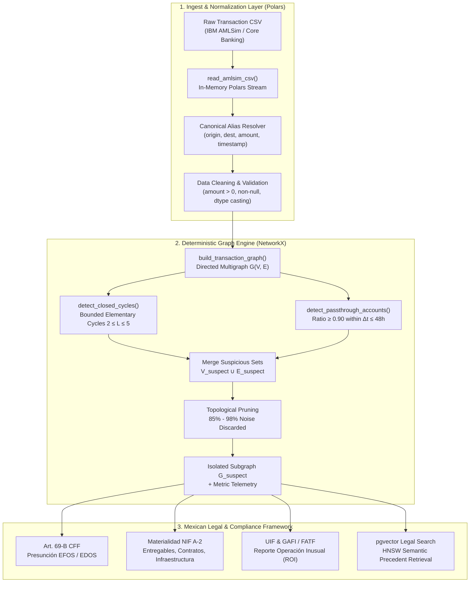
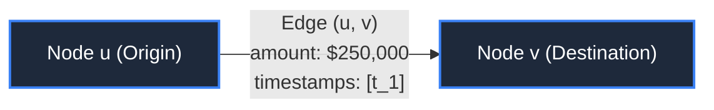
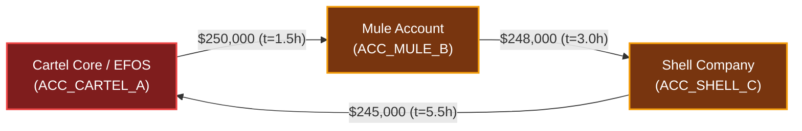
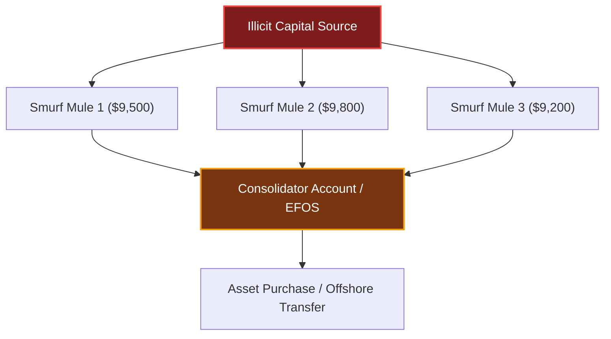
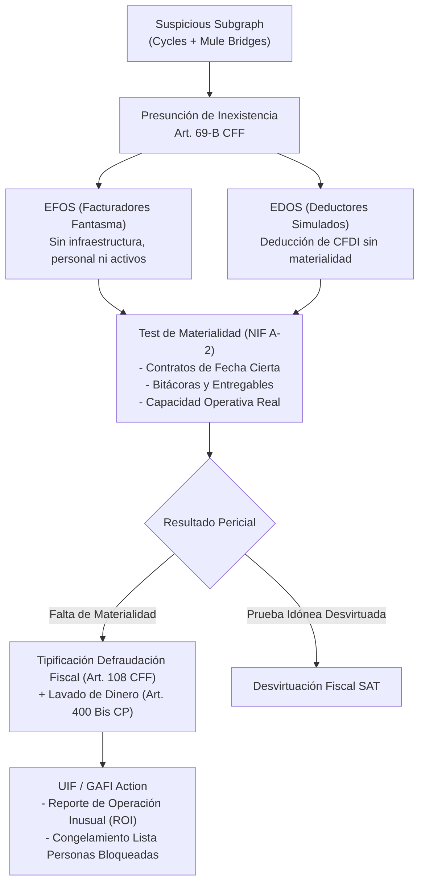

[← Back to Master Documentation](../README.md) | [Agent Routing Index](../index.md)

# Data Pipeline, Deterministic Graph Analytics & Forensic Compliance Engine

## 1. Overview

The **Data and Compliance** segment provides the foundational ingest, algorithmic pruning, and forensic legal compliance layer for the Polar Forensic Auditor monorepo. It bridges raw financial transactional ledgers (specifically the synthetic IBM AMLSim benchmark) to high-speed deterministic topological graph algorithms (implemented in [Polars](https://pola.rs/) and [NetworkX](https://networkx.org/)), and aligns suspicious transactional patterns with Mexican regulatory frameworks, including **Artículo 69-B del Código Fiscal de la Federación (CFF)**, the **Unidad de Inteligencia Financiera (UIF)**, and **FATF/GAFI** anti-money laundering recommendations.



### Key Technical Value Propositions
1. **Computational Noise Reduction**: Financial transaction graphs exhibit high volumes of legitimate economic noise (payroll, merchant point-of-sale purchases, utility payments). The deterministic filtering engine achieves between **85% and 98% pruning efficiency**, preventing LLM context window saturation and computational overhead.
2. **Deterministic Mathematical Guarantees**: Instead of relying exclusively on stochastic LLM heuristics for anomaly detection, graph invariants (closed cycles and flow conservation ratios) provide non-probabilistic evidence suitable for judicial and audit scrutiny.
3. **Mexican Legal Forensic Alignment**: Suspicious transaction subgraphs are mapped directly to Mexican statutory criteria—distinguishing between EFOS (*Empresas que Facturan Operaciones Simuladas*) and EDOS (*Empresas que Deducen Operaciones Simuladas*)—while integrating evidence requirements for operational materiality (*materialidad de operaciones*).

---

## 2. IBM AMLSim Dataset Architecture & Ingestion

### 2.1 Dataset Specification
The primary benchmark ingested is derived from the **IBM AMLSim** (Anti-Money Laundering Simulation) multi-agent banking transaction model. AMLSim generates synthetic transaction topologies simulating both legitimate economic activity and known financial crime patterns (e.g., cycle layering, smurfing, fan-in/fan-out structuring).

#### Supported Schema & Canonical Aliases
Financial institutions and simulation engines label transaction fields inconsistently. The ingestion engine in `backend/services/ingestion.py` contains a canonical alias mapper ([`COLUMN_ALIASES`](file:///c:/Users/maxan/OneDrive/Documentos/Repositories/HackMTY%202026/Infosys/Polar/backend/services/ingestion.py#L7-L12)) that accepts standard variations:

| Canonical Concept | Supported Aliases in CSV | Target Polars Type | Description |
| :--- | :--- | :--- | :--- |
| `origin` | `origin`, `nameorig`, `from_account`, `source`, `orig_account`, `orig` | `pl.Utf8` | Source account identifier / CLABE / tax ID. |
| `destination` | `destination`, `namedest`, `to_account`, `target`, `dest_account`, `dest` | `pl.Utf8` | Target account identifier / CLABE / tax ID. |
| `amount` | `amount`, `value`, `monto`, `sum` | `pl.Float64` | Transaction monetary value (strictly positive $> 0$). |
| `timestamp` | `timestamp`, `step`, `time`, `date`, `datetime`, `trans_time` | `pl.Float64` | Sequential simulation step or epoch timestamp (hours/seconds). |

### 2.2 Ingestion Engine Mechanics
The function [`read_amlsim_csv(source)`](file:///c:/Users/maxan/OneDrive/Documentos/Repositories/HackMTY%202026/Infosys/Polar/backend/services/ingestion.py#L28-L102) processes inputs from either in-memory binary streams (`bytes`, `UploadFile.file`) or filesystem paths:

```python
# Canonical resolution and Polars lazy-like cleansing pipeline
df = pl.read_csv(io.BytesIO(content))

# Fallback synthetic step generation if timestamp is absent
if not has_timestamp:
    select_exprs.append(pl.int_range(0, df.height, dtype=pl.Float64).alias("timestamp"))

# Cleansing filter
cleaned_df = (
    df.select(select_exprs)
    .filter(
        pl.col("origin").is_not_null()
        & pl.col("destination").is_not_null()
        & pl.col("amount").is_not_null()
        & (pl.col("amount") > 0)
    )
)
```

#### Ingestion Telemetry Metadata
Upon parsing, the ingestion service extracts summary statistics returned to the API caller:
- `total_records`: Total valid non-null rows retained.
- `total_volume`: Cumulative monetary value ($\sum \text{amount}$).
- `unique_accounts`: Total distinct entities $|V_{\text{raw}}| = |\text{Origins} \cup \text{Destinations}|$.
- `original_columns`: Schema snapshot prior to normalization.

### 2.3 Reference Dataset: `data/sample_amlsim.csv`
A minimal benchmark dataset is located at [`data/sample_amlsim.csv`](file:///c:/Users/maxan/OneDrive/Documentos/Repositories/HackMTY%202026/Infosys/Polar/data/sample_amlsim.csv). It provides immediate end-to-end verification of three transaction classes:
1. **Circular Layering ($L = 3$)**:
   `ACC_CARTEL_A` $\to$ `ACC_MULE_B` (\$250,000) $\to$ `ACC_SHELL_C` (\$248,000) $\to$ `ACC_CARTEL_A` (\$245,000).
2. **High-Velocity Mule Account**:
   `CORP_INFLOW_LTD` $\to$ `ACC_PASSTHROUGH_01` (\$850,000 at $t = 12.0$) $\to$ `OFFSHORE_CRYPTO_EXCHANGE` (\$840,000 at $t = 24.0$). Retention ratio = $840000 / 850000 = 0.9882$, elapsed time = 12 hours.
3. **Legitimate Economic Noise (Pruned)**:
   Payroll distributions (`EMPLOYEE_PAYROLL` $\to$ `ACC_CLEAN_01`, `ACC_CLEAN_02`), retail point-of-sale transactions (`SUPERMARKET_POS`, `COFFEE_SHOP`), and utility payments (`UTILITY_ELECTRIC`).

---

## 3. Mathematical Pruning & Graph Heuristics

The core topological algorithms reside in [`backend/services/deterministic_filter.py`](file:///c:/Users/maxan/OneDrive/Documentos/Repositories/HackMTY%202026/Infosys/Polar/backend/services/deterministic_filter.py). They construct a directed weighted graph $G = (V, E)$ where nodes represent accounts and directed edges represent aggregated transactional flows.

### 3.1 Graph Representation & Node State Vectors
For every account $u \in V$:
- Inflow state: $\text{total\_in}(u) = \sum_{(w, u) \in E} \text{amount}(w, u)$ with occurrence timestamps $T_{\text{in}}(u) = [t_1, t_2, \dots]$.
- Outflow state: $\text{total\_out}(u) = \sum_{(u, v) \in E} \text{amount}(u, v)$ with occurrence timestamps $T_{\text{out}}(u) = [t_1, t_2, \dots]$.

For every directed edge $(u, v) \in E$:
- Aggregated flow: $\text{amount}(u, v) = \sum_{k} a_k$, transaction count $C(u, v)$, and timestamps list.



---

### 3.2 Closed Directed Cycle Detection (`detect_closed_cycles`)

#### Mathematical Formalism
A directed cycle $C$ is an ordered sequence of nodes $(v_1, v_2, \dots, v_k)$ such that $(v_i, v_{i+1}) \in E$ for $1 \le i < k$, and $(v_k, v_1) \in E$. In AML forensics, closed cycles represent **round-tripping** and **layering (*estratificación*)**, designed to obscure illicit capital origins by cycling money back to the orchestrator or associated shell entities.

$$2 \le |C| \le \text{MAX\_CYCLE\_LENGTH}$$

Where $\text{MAX\_CYCLE\_LENGTH} = 5$ by default ([`settings.MAX_CYCLE_LENGTH`](file:///c:/Users/maxan/OneDrive/Documentos/Repositories/HackMTY%202026/Infosys/Polar/backend/core/config.py#L42)).



#### Complexity & Algorithmic Bounds
- Unbounded cycle searches in dense graphs trigger Johnson’s algorithm complexity $O((|V| + |E|)(c + 1))$, where $c$ is the number of elementary cycles. In dense financial graphs, $c$ grows exponentially.
- Polar prevents unbounded combinatorial explosions by iterating through `nx.simple_cycles(G)` and immediately bypassing cycles where $\text{length} > \text{MAX\_CYCLE\_LENGTH}$.

---

### 3.3 High-Velocity Pass-Through Mule Account Ratio (`detect_passthrough_accounts`)

Mule accounts (*cuentas puente o mulas*) are financial transit conduits. They receive large influxes of capital and rapidly disperse nearly identical amounts to third parties or offshore entities, retaining minimal operational reserves.

#### Mathematical Conditions
A node $v \in V$ is flagged as a high-velocity pass-through mule if and only if:
1. **Bidirectional Activity**: $\text{total\_in}(v) > 0$ and $\text{total\_out}(v) > 0$.
2. **Conservation / Pass-Through Ratio**:
   $$R(v) = \frac{\min(\text{total\_in}(v), \text{total\_out}(v))}{\max(\text{total\_in}(v), \text{total\_out}(v))} \ge \theta_{\text{ratio}}$$
   where $\theta_{\text{ratio}} = 0.90$ ([`settings.PASS_THROUGH_RATIO_THRESHOLD`](file:///c:/Users/maxan/OneDrive/Documentos/Repositories/HackMTY%202026/Infosys/Polar/backend/core/config.py#L43)).
3. **Temporal Velocity Window**:
   $$\Delta t(v) = |\max(T_{\text{out}}(v)) - \min(T_{\text{in}}(v))| \le \Delta t_{\text{max}}$$
   where $\Delta t_{\text{max}} = 48.0 \text{ hours}$ ([`settings.PASS_THROUGH_WINDOW_HOURS`](file:///c:/Users/maxan/OneDrive/Documentos/Repositories/HackMTY%202026/Infosys/Polar/backend/core/config.py#L44)).

When node $v$ matches these conditions, both incoming edges $\{(u, v) \in E\}$ and outgoing edges $\{(v, w) \in E\}$ are marked as `PASSTHROUGH_BRIDGE`.

---

### 3.4 Structuring / Smurfing Detection Logic

Structuring (*pitufeo*) is the deliberate practice of splitting large transactions into amounts below legal declaration thresholds ($10,000 USD / \approx \$180,000 MXN) to evade mandatory automatic bank alerts.



In the deterministic filter:
- **Fan-in aggregation**: High in-degree with individual transaction amounts clustered below reporting limits.
- **Fan-out dispersion**: High out-degree dispersing funds rapidly into retail or secondary accounts.
- Accounts participating in circular cycles with sub-threshold amounts receive composite tagging: `CIRCULAR_FLOW_CYCLE` + `HIGH_VELOCITY_PASSTHROUGH_90PCT`.

---

### 3.5 Topological Pruning Efficiency & Subgraph Isolation

#### Pruning Formula
Let $G_{\text{total}} = (V_{\text{total}}, E_{\text{total}})$ be the raw graph and $G_{\text{suspect}} = (V_{\text{suspect}}, E_{\text{suspect}})$ be the isolated subgraph:

$$V_{\text{suspect}} = V_{\text{cycle}} \cup V_{\text{passthrough}}$$

$$E_{\text{suspect}} = E_{\text{cycle}} \cup E_{\text{passthrough}}$$

The pruning efficiency percentage $\eta_{\text{prune}}$ is defined as:

$$\eta_{\text{prune}} = \left( \frac{|E_{\text{total}}| - |E_{\text{suspect}}|}{|E_{\text{total}}|} \right) \times 100\%$$

On standard benchmark sets, $\eta_{\text{prune}} \in [85\%, 98\%]$. Legitimate single-direction edges (wages, consumer purchases) are pruned away, leaving only the suspect subnetwork for the LLM audit agent.

#### Risk Scoring Formulation
For every isolated suspect node $v \in V_{\text{suspect}}$, a deterministic composite risk score is assigned:

$$\text{RiskScore}(v) = \min\left(1.0, \; 0.5 + 0.3 \cdot \mathbb{I}_{\text{cycle}}(v) + 0.2 \cdot \mathbb{I}_{\text{passthrough}}(v)\right)$$

| Indicator Conditions | Risk Score | Risk Classification |
| :--- | :--- | :--- |
| `CIRCULAR_FLOW_CYCLE` only | 0.80 | ALTO |
| `HIGH_VELOCITY_PASSTHROUGH_90PCT` only | 0.70 | ALTO |
| Both Cycle & High-Velocity Pass-Through | 1.00 | CRÍTICO |

---

## 4. Key Components & File Reference

| File / Component | Primary Responsibility | Key Functions / Classes | Dependencies |
| :--- | :--- | :--- | :--- |
| [`data/sample_amlsim.csv`](file:///c:/Users/maxan/OneDrive/Documentos/Repositories/HackMTY%202026/Infosys/Polar/data/sample_amlsim.csv) | Ground-truth synthetic validation dataset containing known cycles and mule accounts. | CSV Records | None |
| [`backend/services/ingestion.py`](file:///c:/Users/maxan/OneDrive/Documentos/Repositories/HackMTY%202026/Infosys/Polar/backend/services/ingestion.py) | In-memory CSV ingestion, alias normalization, and Polars cleansing pipeline. | [`read_amlsim_csv`](file:///c:/Users/maxan/OneDrive/Documentos/Repositories/HackMTY%202026/Infosys/Polar/backend/services/ingestion.py#L28), [`find_canonical_column`](file:///c:/Users/maxan/OneDrive/Documentos/Repositories/HackMTY%202026/Infosys/Polar/backend/services/ingestion.py#L15), `COLUMN_ALIASES` | `polars`, `io` |
| [`backend/services/deterministic_filter.py`](file:///c:/Users/maxan/OneDrive/Documentos/Repositories/HackMTY%202026/Infosys/Polar/backend/services/deterministic_filter.py) | Mathematical graph algorithms, cycle finding, velocity filtering, and subgraph pruning. | [`build_transaction_graph`](file:///c:/Users/maxan/OneDrive/Documentos/Repositories/HackMTY%202026/Infosys/Polar/backend/services/deterministic_filter.py#L7), [`detect_closed_cycles`](file:///c:/Users/maxan/OneDrive/Documentos/Repositories/HackMTY%202026/Infosys/Polar/backend/services/deterministic_filter.py#L53), [`detect_passthrough_accounts`](file:///c:/Users/maxan/OneDrive/Documentos/Repositories/HackMTY%202026/Infosys/Polar/backend/services/deterministic_filter.py#L90), [`apply_deterministic_filter`](file:///c:/Users/maxan/OneDrive/Documentos/Repositories/HackMTY%202026/Infosys/Polar/backend/services/deterministic_filter.py#L139) | `networkx`, `polars`, `backend.core.config` |
| [`backend/core/config.py`](file:///c:/Users/maxan/OneDrive/Documentos/Repositories/HackMTY%202026/Infosys/Polar/backend/core/config.py) | Centralized configuration managing cycle thresholds, temporal windows, and external webhook credentials. | [`Settings`](file:///c:/Users/maxan/OneDrive/Documentos/Repositories/HackMTY%202026/Infosys/Polar/backend/core/config.py#L7) (`MAX_CYCLE_LENGTH`, `PASS_THROUGH_RATIO_THRESHOLD`, `PASS_THROUGH_WINDOW_HOURS`) | `pydantic_settings` |
| [`backend/api/routes/investigations.py`](file:///c:/Users/maxan/OneDrive/Documentos/Repositories/HackMTY%202026/Infosys/Polar/backend/api/routes/investigations.py) | API endpoints executing ingestion, deterministic filtering, and SSE streaming of forensic verdicts. | [`upload_investigation_dataset`](file:///c:/Users/maxan/OneDrive/Documentos/Repositories/HackMTY%202026/Infosys/Polar/backend/api/routes/investigations.py#L20), [`stream_investigation_thoughts`](file:///c:/Users/maxan/OneDrive/Documentos/Repositories/HackMTY%202026/Infosys/Polar/backend/api/routes/investigations.py#L192) | `fastapi`, `httpx` |

---

## 5. Mexican Legal & Forensic Compliance Engine

The output of the deterministic graph engine feeds directly into a forensic evaluation modeled on the Mexican legal and financial crime system:



### 5.1 Artículo 69-B del Código Fiscal de la Federación (CFF)
Artículo 69-B of the CFF establishes the legal presumption that invoices (CFDI) issued by a taxpayer are devoid of real underlying transactions when the tax authority (SAT) discovers that the issuer lacks:
1. Direct or indirect personnel (*personal suficiente*).
2. Physical assets (*activos tangibles o maquinaria*).
3. Operational infrastructure (*capacidad de infraestructura o bodegas*).
4. Direct physical localization (*contribuyente no localizable en domicilio fiscal*).

#### The EFOS vs. EDOS Distinction
- **EFOS (*Empresas que Facturan Operaciones Simuladas*)**: Entities issuing tax-deductible invoices for non-existent goods or services ("ghost companies" or "factureras"). In the transaction graph, EFOS appear as originators or circular bridges receiving and transferring funds with negligible added value.
- **EDOS (*Empresas que Deducen Operaciones Simuladas*)**: Entities utilizing these simulated CFDIs to artificially inflate tax deductions and decrease ISR (*Impuesto Sobre la Renta*) or recover VAT (*IVA*). In graph forensics, EDOS are often the terminal originators of funds that cycle back through mule accounts.

#### Procedural Timelines & Judicial Lists
When the SAT detects presumptive EFOS/EDOS behavior:
1. **Presuntos**: Notification published in the *Diario Oficial de la Federación* (DOF) and SAT portal. The taxpayer has 15 business days (extendable by 10) to present defense arguments.
2. **Definitivos**: If unrefuted, the taxpayer is entered into the definitive 69-B black list. All invoices issued are rendered completely void of legal effects.
3. **EDOS Regularization**: Customers (EDOS) have 30 business days from definitive publication to reverse tax deductions or demonstrate real operational materiality before tax fraud charges are initiated.

---

### 5.2 Operation Materiality (*Materialidad de Operaciones*) & NIFs
Under Mexican tax jurisprudence (Supreme Court tesis *2a./J. 78/2019* and *Tribunal Federal de Justicia Administrativa* criteria), an invoice and bank transfer alone **do not prove an operation occurred**. The taxpayer must prove **materiality** through verifiable contemporaneous evidence adhering to the **Normas de Información Financiera (NIF)**:

- **NIF A-2 (*Postulado Básico de Sustancia Económica*)**: Economic substance must prevail over legal form. Simply having a corporate contract does not validate an expense if the actual flow of services is absent.
- **Evidentiary Forensic Triad**:
  1. **Contratos con Fecha Cierta**: Certified public deeds, notary public timestamps, or electronic signatures with NOM-151 timestamp certificates (*constancia de conservación*).
  2. **Entregables Verificables**: Tangible proof of work (georeferenced logs, engineering blueprints, software git commits, technical inspection reports, freight dispatch bills / *cartas porte*).
  3. **Trazabilidad Financiera**: Bank statements matching the exact amounts and continuous flow of the transaction without circular round-trips.

---

### 5.3 UIF & GAFI (FATF) Anti-Money Laundering Framework
In accordance with the **Ley Federal para la Prevención e Identificación de Operaciones con Recursos de Procedencia Ilícita (LFPIORPI)** and FATF Recommendations:

1. **Reporte de Operación Inusual (ROI)**:
   - Financial institutions must submit a ROI to the **Unidad de Inteligencia Financiera (UIF)** within 24 to 48 hours when client behavior, velocity, or transaction geometry diverges abruptly from declared operational profiles, or matches known smurfing/layering typologies.
2. **Reporte de Operación Relevante (ROR)**:
   - Mandatory reporting for all cash or monetary transactions exceeding \$7,500 USD (or national currency equivalent).
3. **Lista de Personas Bloqueadas (LPB)**:
   - Administrative precautionary measure under Article 115 of the *Ley de Instituciones de Crédito* allowing the immediate freezing of accounts associated with terrorist financing or money laundering networks detected by the UIF.
4. **FATF Typologies Covered**:
   - **Recommendation 10**: Customer Due Diligence (CDD) and identification of Ultimate Beneficial Owners (UBOs / *Beneficiario Controlador*).
   - **Recommendation 20**: Reporting of Suspicious Transactions without tipping off (*prohibición de alertamiento*).

---

### 5.4 PostgreSQL `pgvector` Semantic Knowledge Base Architecture
To assist LLMs and forensic auditors with automated regulatory cross-checks, the system integrates a vector database service running PostgreSQL with the `pgvector` extension (configured in [`docker-compose.yml`](file:///c:/Users/maxan/OneDrive/Documentos/Repositories/HackMTY%202026/Infosys/Polar/docker-compose.yml#L31-L42)).

#### Target Database Schema
```sql
CREATE EXTENSION IF NOT EXISTS vector;

CREATE TABLE legal_knowledge_vectors (
    id UUID PRIMARY KEY DEFAULT gen_random_uuid(),
    article_ref VARCHAR(64) NOT NULL,          -- e.g., 'CFF-Art-69B', 'LFPIORPI-Art-17'
    regulatory_body VARCHAR(32) NOT NULL,       -- 'SAT', 'UIF', 'GAFI', 'SCJN'
    precedent_type VARCHAR(32) NOT NULL,        -- 'Jurisprudencia', 'Tesis Aislada', 'Criterio Normativo'
    chunk_content TEXT NOT NULL,                -- Legal text, factual criteria, defense burdens
    embedding vector(1536),                     -- OpenAI text-embedding-3-small or Gemini Embeddings
    metadata JSONB DEFAULT '{}'::jsonb,
    created_at TIMESTAMPTZ DEFAULT NOW()
);

-- Approximate Nearest Neighbor Index for Sub-millisecond Cosine Retrieval
CREATE INDEX idx_legal_vectors_hnsw 
ON legal_knowledge_vectors 
USING hnsw (embedding vector_cosine_ops)
WITH (m = 16, ef_construction = 64);
```

#### RAG Retrieval Flow
When a cycle or mule account is detected:
1. Node statistics (flow volume, cycle length, pass-through ratio) are structured into a forensic query embedding.
2. The vector index retrieves the exact evidentiary precedents under CFF 69-B and UIF guidelines.
3. The LLM constructs the final audit summary quoting applicable jurisprudence and statutory obligations.

---

## 6. Edge Cases & Gotchas

### 6.1 High-Volume Legitimate Merchants & Payment Gateways
- **Symptom**: Payment aggregators (e.g., Stripe, MercadoPago, PayPal Mexico) and e-commerce processors frequently exhibit pass-through ratios $> 0.90$ within 24-48 hours, collecting customer payments and settling to vendor bank accounts.
- **Mitigation**: Exclude known verified financial entities via merchant tax ID (RFC) whitelists, or check whether the node’s degree distribution represents a star-topology aggregator rather than a closed cyclic circuit.

### 6.2 Corporate Treasury & Cash Pooling
- **Symptom**: Enterprise holding companies use automated cash pooling to sweep subsidiary account balances into a central treasury account at end-of-day, returning operational balances the following morning. This can trigger false cycle and pass-through alarms.
- **Mitigation**: Verify corporate group identity (*Grupo Empresarial* under Art. 24 de la Ley del Mercado de Valores) and incorporate payroll and inter-company contracts (*Contratos de cuenta corriente o tesorería centralizada*) into the node metadata.

### 6.3 Sequential Timestamp Modeling & Step Normalization
- **Symptom**: Datasets without native ISO datetime strings may use relative time steps (e.g., AMLSim `step` column, where each step represents 1 hour or 1 day).
- **Gotcha**: When calculating `time_delta_hours`, ensure `timestamp` units correspond to the `window_hours` setting (default 48.0 hours). If steps represent days, `window_hours` must be scaled accordingly.

### 6.4 Combinatorial Explosion in Dense Transaction Networks
- **Symptom**: In complete or highly interconnected dense transaction graphs ($|E| \gg |V|$), cycle finding algorithms can exhaust memory or run indefinitely.
- **Mitigation**:
  - Bound cycle length strictly ($2 \le |C| \le 5$).
  - Pre-filter zero-balance or micro-cent transactions before graph construction.
  - Implement timeout wrappers or fallbacks around `nx.simple_cycles`.
