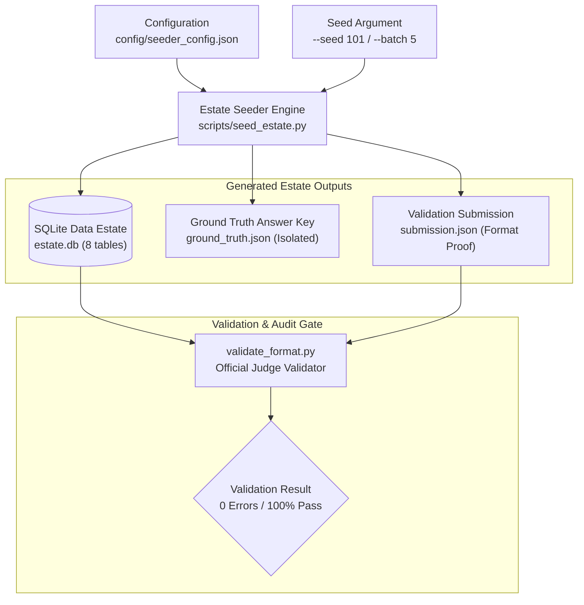
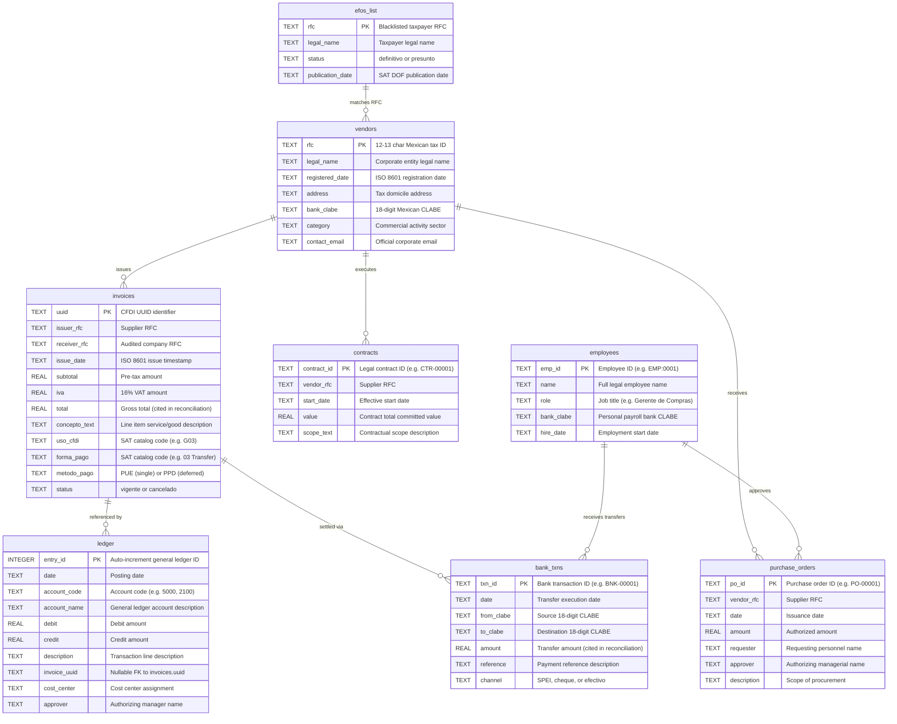

# Forensic Data Estate Seeder (`estate_schema.sql`)

[← Back to Master Documentation](../README.md) | [Agent Routing Index](../index.md) | [Data and Compliance Overview](./README.md)

---

## 1. Overview and Core Purpose

The Polar Forensic Auditor evaluates investigative agent systems against complex corporate financial fraud patterns across realistic enterprise data estates. To avoid model overfitting and satisfy judging competition requirements, systems must be scored against **held-out evaluation seeds**—synthetic databases generated with previously unseen pseudo-random seeds.

The **Forensic Data Estate Seeder** (`scripts/seed_estate.py`) is an offline, zero-network, fully deterministic generator implemented in pure Python standard library. It produces complete SQLite databases complying strictly with the official 8-table specification (`estate_schema.sql`), simultaneously generating isolated ground-truth answer keys (`ground_truth.json`) and format-compliant test submissions (`submission.json`).



### Key Capabilities
- **Strict 8-Table Schema Compliance (`estate_schema.sql`)**: Generates normalized relational tables with CFDI 4.0 tax metadata and Mexican banking identifiers.
- **Offline / Zero-Network Determinism**: Runs without internet or API dependencies using Python's `random.Random(seed)`. Identical seeds produce bit-for-bit identical databases.
- **Batch Dataset Generation (`--batch <n>`)**: Rapidly provisions disjoint sets of training and held-out evaluation seeds in standardized directory layouts.
- **Calibrated Injection of the 5 Contest Fraud Schemes**: Injects `phantom_vendor`, `kickback`, `round_tripping`, `threshold_splitting`, and `revenue_inflation` with configurable volume and difficulty.
- **Innocent Decoys with Documentary Justifications**: Plants entities exhibiting suspicious statistical indicators (e.g. sub-threshold purchase splits or rapid transfers) accompanied by exonerating evidence (board resolutions, framework contracts, transport weight limits) to test agent skepticism.
- **Strict Ground Truth Isolation**: Generates ground-truth answer keys conforming to `ground_truth_schema.json` in isolated output paths never accessible to investigative tools.
- **Guaranteed Arithmetic Reconciliation ($\le 2\%$)**: Guarantees that claimed scheme `peso_amount` values match the sum of cited records per table, fully satisfying `validate_format.py`.

---

## 2. File and Directory Layout

| Component | Repository Path | Primary Responsibility |
| :--- | :--- | :--- |
| **Master Configuration** | `config/seeder_config.json` | Global settings for baseline volumes, company RFC/CLABEs, active schemes, decoys, and batch defaults. |
| **Seeder Engine** | `scripts/seed_estate.py` | Standalone Python generator script creating tables, populating rows, injecting fraud, and compiling ground truth. |
| **Official Schema Contract** | `tmp/estate_schema.sql` | Official SQLite DDL specification defining the 8 tables and CFDI 4.0 column names. |
| **Official Validator** | `tmp/validate_format.py` | Official competition validation script testing JSON structure and database exhibit reconciliation. |
| **Ground Truth Contract** | `tmp/ground_truth_schema.json` | JSON schema defining the shape of evaluation answer keys. |
| **Submission Contract** | `tmp/submission_schema.json` | JSON schema defining the required investigative output findings, declined leads, and run metadata. |
| **Generated Data Estate** | `data/estate.db` | Populated SQLite database used as the target environment for investigative audits. |
| **Answer Key (Isolated)** | `data/ground_truth.json` | Evaluation key detailing planted schemes and decoys. **Must never be read by agent tools.** |
| **Test Submission** | `data/submission.json` | Sample findings file generated alongside the estate to verify format validity immediately. |

---

## 3. Relational Architecture: The 8 Tables

The seeder creates and populates the 8 relational tables defined in `estate_schema.sql`:



---

## 4. Configuration Guide (`config/seeder_config.json`)

The seeder behavior is parameterized via `config/seeder_config.json`. Key configuration sections include:

### 4.1 General Environment Settings (`general`)
Defines the audit scope, primary target paths, and audited corporate identity:
```json
"general": {
  "seed": 42,
  "output_db_path": "data/estate.db",
  "ground_truth_path": "data/ground_truth.json",
  "submission_path": "data/submission.json",
  "audit_period": {
    "start_date": "2025-01-01",
    "end_date": "2026-03-31"
  },
  "company": {
    "rfc": "EMP920101AB1",
    "legal_name": "Industrias Corporativas del Norte SA de CV",
    "primary_clabe": "000000000000000099",
    "operating_clabes": [
      "000000000000000099",
      "000000000000000098"
    ]
  }
}
```

### 4.2 Baseline Operational Noise (`baseline_operations`)
Simulates legitimate business activity to serve as realistic background noise:
- `num_normal_vendors` (default 25): Legitimate suppliers across varied corporate categories.
- `num_normal_employees` (default 20): Company staff across operations, procurement, accounting, and leadership.
- `num_normal_invoices` (default 60): Regular trade invoices with valid CFDI metadata.
- `num_normal_pos` (default 40): Standard approved purchase orders.
- `num_normal_contracts` (default 10): Long-term commercial agreements.
- `include_payroll` (default true): Generates periodic bi-weekly payroll disbursements in `bank_txns` and corresponding double-entry rows in `ledger`.

### 4.3 Injected Fraud Schemes (`schemes`)
Configures the 5 required forensic fraud archetypes:
1. **`phantom_vendor`**:
   - `efos_status`: Status in `efos_list` (`"definitivo"` or `"presunto"`).
   - `invoices_count`: Number of simulated service invoices.
   - `service_concept`: Intangible consulting description lacking operational deliverables.
   - Violation: SAT Art. 69-B del CFF.
2. **`kickback`**:
   - `employee_role`: Target employee (e.g. `"Gerente de Compras"`).
   - `kickback_percentage`: Proportion of invoiced funds transferred back to employee's personal CLABE (e.g. 0.20 = 20%).
3. **`round_tripping`**:
   - `cycle_length`: Number of hops in the closed cycle (e.g. 3 hops: Company $\to$ Supplier A $\to$ Subcontractor B $\to$ Company).
   - `retention_loss_pct`: Friction spread retained by intermediaries (default 0.02 = 2%).
   - `days_interval`: Duration of complete circuit (e.g. 2 days / $\le 48\text{h}$).
4. **`threshold_splitting`**:
   - `threshold_limit`: Approval boundary (e.g. $50,000 MXN).
   - `split_count`: Number of consecutive split transactions (e.g. 4 invoices).
   - `amount_per_split`: Clustered amount under the limit (e.g. $48,600 MXN).
   - `days_span`: Narrow time span of issuance (e.g. 3 days).
5. **`revenue_inflation`**:
   - `invoices_count`: Number of end-of-period sham sales invoices issued to shell clients.
   - `settlement_type`: Circular or uncollected fictitious accounts receivable.

### 4.4 Decoy Patterns (`decoys`)
Plants benign transactions that trigger statistical detectors but are exonerated by documentary evidence:
- `split_urgent_order`: Three sub-threshold orders justified by transport vehicle weight limits recorded in purchase order notes.
- `high_value_board_approved`: High-ticket capital expense ($350,000 MXN) explicitly authorized in Board of Directors minutes.
- `high_velocity_logistics`: Freight vendor with high cash turnover protected by a multi-year master contract and verified SAT 32-D tax compliance.
- `employee_relocation_bonus`: Direct bank transfer to employee CLABE justified by documented HR executive relocation reimbursement policy.
- `similar_name_clean_tax`: Supplier sharing a similar name or bank branch with a blacklisted EFOS, but possessing a verified clean SAT tax opinion.

---

## 5. Command-Line Usage and Workflows

### 5.1 Single Estate Generation (Specific Seed)
To generate a single deterministic estate with seed 42:
```bash
python scripts/seed_estate.py --seed 42 \
  --output data/estate.db \
  --ground-truth data/ground_truth.json \
  --submission data/submission.json
```

### 5.2 Batch Generation for Held-Out Judge Evaluation
To generate 5 held-out evaluation datasets starting at seed 101:
```bash
python scripts/seed_estate.py --batch 5 --start-seed 101 --output-dir data/datasets
```
This command generates the following clean directory structure:
```text
data/datasets/
├── seed_101/
│   ├── estate.db           # Populated SQLite database
│   ├── ground_truth.json   # Answer key (isolated)
│   └── submission.json     # Test format submission
├── seed_102/
│   ├── estate.db
│   ├── ground_truth.json
│   └── submission.json
├── ...
└── seed_105/
```

### 5.3 Custom Configuration File
To override defaults using a specialized configuration:
```bash
python scripts/seed_estate.py --config config/custom_audit_config.json
```

---

## 6. Official Validation & Reconciliation Checks

To verify that generated datasets conform to competition rules and pass judge checks:

```bash
# Validate JSON structure and verify exhibit existence against SQLite:
python tmp/validate_format.py --submission data/submission.json --estate data/estate.db
```

### Expected Output
```text
======================================================================
  FORENSIC AUDITOR - SUBMISSION FORMAT CHECK
======================================================================
  findings: 5   leads_not_pursued: 5   estate check: yes
----------------------------------------------------------------------
  PASS  submission conforms to the required format
```

### Per-Table Arithmetic Reconciliation
The validator computes the sum of cited exhibit amounts **per table** (`invoices.total`, `bank_txns.amount`, `purchase_orders.amount`, `contracts.value`). The claimed `peso_amount` must match the best-matching table within 2% tolerance:
$$\left| \text{peso\_amount} - \text{sum}_{\text{table}} \right| \le 0.02 \times \max(\text{sum}_{\text{table}}, 1)$$
Because invoices and the bank transfers settling them represent the same underlying economic pesos, summing across tables would falsely double-count the funds. The seeder ensures per-table equality by design.

---

## 7. Python & SQL Inspection Snippets

Auditors can quickly explore generated data estates using standard Python and SQLite:

```python
import sqlite3
import polars as pl

conn = sqlite3.connect("data/estate.db")

# 1. Print row counts across all 8 tables
tables = ["vendors", "invoices", "ledger", "bank_txns", "purchase_orders", "contracts", "employees", "efos_list"]
for table in tables:
    count = conn.execute(f"SELECT COUNT(*) FROM {table}").fetchone()[0]
    print(f"{table:16s}: {count:4d} rows")

# 2. Inspect blacklisted phantom vendor invoices
df_efos = pl.read_database("""
    SELECT i.uuid, i.issuer_rfc, v.legal_name, i.total, i.issue_date, e.status
    FROM invoices i
    JOIN efos_list e ON i.issuer_rfc = e.rfc
    JOIN vendors v ON i.issuer_rfc = v.rfc
""", conn)
print(df_efos)

# 3. Inspect kickback transfers from suppliers to employee CLABEs
df_kickbacks = pl.read_database("""
    SELECT b.txn_id, b.date, b.from_clabe, b.to_clabe, b.amount, emp.name AS employee_name
    FROM bank_txns b
    JOIN employees emp ON b.to_clabe = emp.bank_clabe
""", conn)
print(df_kickbacks)

conn.close()
```

---

## 8. Testing and Automated Quality Assurance

The seeder is covered by comprehensive unit and integration tests in `backend/tests/test_estate_seeder.py`:

```bash
# Run seeder test suite
pytest backend/tests/test_estate_seeder.py -v
```

The test suite asserts:
1. `test_schema_integrity`: Validates presence of all 8 tables and primary keys.
2. `test_seeder_record_counts`: Confirms non-zero row generation across every table.
3. `test_determinism`: Verifies that identical seeds yield identical database rows.
4. `test_validate_format_compliance`: Confirms that generated submissions pass `validate_format.py` with 0 structural or reconciliation errors.
5. `test_ground_truth_isolation`: Confirms that ground truth files remain isolated and unreferenced by investigative agents.
