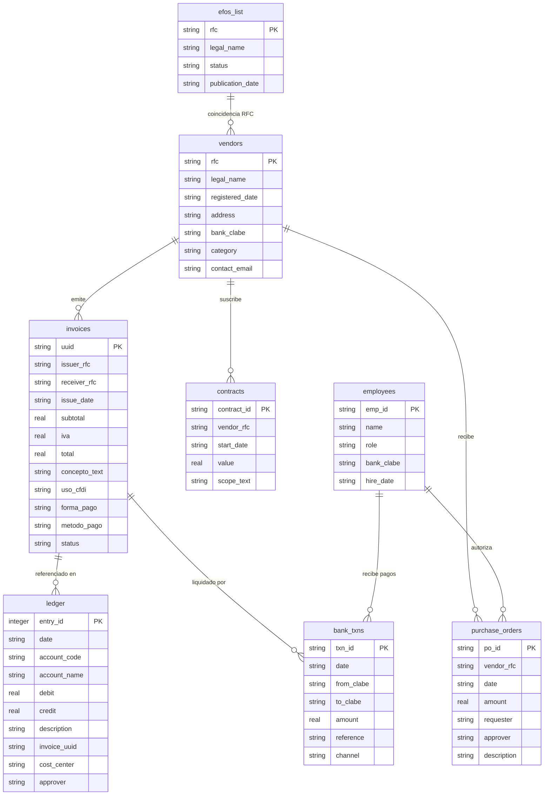

# Forensic Data Estate Seeder (`estate_schema.sql`)

> **Guía para el equipo de auditoría forense e ingeniería de datos.**
> Este documento explica cómo generar, configurar y validar datasets sintéticos de auditoría contable y bancaria bajo la especificación oficial de 8 tablas (`estate_schema.sql`).

---

## 1. Resumen y Propósito

El sistema de auditoría forense requiere evaluar la capacidad de los agentes para detectar fraudes financieros complejos sobre un patrimonio de datos empresariales reales o sintéticos. Para evitar el sobreajuste y permitir evaluaciones con **semillas nunca antes vistas (held-out seeds)** según las reglas de competencia, este seeder permite generar patrimonios reproducibles y deterministas.

### Capacidades principales:
- **Cumplimiento estricto del esquema de 8 tablas (`estate_schema.sql`)**.
- **Generación determinista y sin red (Offline / Zero-Network)** mediante `--seed <int>`.
- **Generación por lotes (`--batch <n>`)** para crear en un solo paso los datasets de prueba y evaluación.
- **Inyección calibrada de los 5 esquemas de fraude forense** requeridos por los jueces.
- **Generación de señuelos (decoys)** con justificaciones documentales de inocencia para penalizar falsas acusaciones.
- **Salida aislada de Ground Truth** conforme a `ground_truth_schema.json`.
- **Reconciliación aritmética garantizada ($\le 2\%$ por tabla)** para pasar el validador oficial `validate_format.py`.

---

## 2. Dónde Vive Cada Archivo

| Archivo | Ubicación | Descripción |
| :--- | :--- | :--- |
| **Configuración Maestra** | `config/seeder_config.json` | Parámetros de volumen, empresa, esquemas activos, señuelos y rutas. |
| **Script del Seeder** | `scripts/seed_estate.py` | Motor en Python (stdlib pura, sin dependencias externas) que genera los datos. |
| **Esquema DDL Oficial** | `student-materials/forensic-auditor/estate_schema.sql` | Especificación de las 8 tablas en SQLite con nombres CFDI 4.0. |
| **Validador Oficial** | `student-materials/forensic-auditor/validate_format.py` | Script oficial que comprueba la estructura JSON y la reconciliación contra la base `.db`. |
| **Bases de Datos Generadas** | `data/estate.db` o `data/datasets/seed_*/estate.db` | Archivos SQLite con las 8 tablas pobladas. |
| **Ground Truth (Aislado)** | `data/ground_truth.json` o `data/datasets/seed_*/ground_truth.json` | Llave de respuestas para evaluación (nunca debe ser leída por el agente de investigación). |
| **Submission de Prueba** | `data/submission.json` o `data/datasets/seed_*/submission.json` | JSON de hallazgos para validar de inmediato el formato con `validate_format.py`. |

---

## 3. Las 8 Tablas del Patrimonio de Datos

El generador crea y puebla las 8 tablas del archivo `estate_schema.sql`:



---

## 4. Guía de Configuración (`config/seeder_config.json`)

El archivo `config/seeder_config.json` controla el comportamiento de la generación. El equipo puede editarlo para simular distintos entornos corporativos:

### Bloque `general`:
```json
"general": {
  "seed": 42,
  "output_db_path": "data/estate.db",
  "ground_truth_path": "data/ground_truth.json",
  "submission_path": "data/submission.json",
  "audit_period": {
    "start_date": "2025-01-01",
    "end_date": "2026-03-31"
  },
  "company": {
    "rfc": "EMP920101AB1",
    "legal_name": "Industrias Corporativas del Norte SA de CV",
    "primary_clabe": "000000000000000099"
  }
}
```

### Bloque `baseline_operations`:
Controla el ruido y volumen de operaciones legítimas ordinarias:
- `num_normal_vendors`: Cantidad de proveedores legítimos (ej. 25-50).
- `num_normal_employees`: Cantidad de empleados con roles y CLABEs (ej. 20-40).
- `num_normal_invoices`: Cantidad de facturas comerciales ordinarias.
- `num_normal_pos`: Órdenes de compra autorizadas.
- `num_normal_contracts`: Contratos marco a largo plazo.
- `include_payroll`: Genera dispersión periódica de nómina en `bank_txns` y `ledger`.

### Bloque `schemes` (Los 5 Tipos de Fraude):
Cada esquema puede activarse (`"enabled": true`), configurarse en cantidad (`"count"`), montos y dificultad:
1. **`phantom_vendor`**: Facturas de servicios intangibles emitidas por un RFC en lista negra SAT 69-B (`efos_list`) sin contratos ni entregables reales.
2. **`kickback`**: Proveedor coludido con un empleado (`EMP:xxxx`), quien autoriza órdenes de compra; tras cobrar, el proveedor transfiere un porcentaje de retorno (ej. 20%) a la cuenta personal del empleado.
3. **`round_tripping`**: Circuito cerrado de transferencias bancarias en menos de 48h (`Empresa -> Proveedor A -> Subcontratista B -> Empresa`) simulando actividad comercial.
4. **`threshold_splitting`**: Fraccionamiento intencional de compras en múltiples facturas consecutivas justo debajo del umbral de autorización directiva (ej. $50,000 MXN) para evadir comités.
5. **`revenue_inflation`**: Facturación ficticia de ingresos hacia clientes cascarón antes del cierre contable para inflar ventas en `ledger`.

### Bloque `decoys` (Señuelos Inocentes):
Configura entidades legítimas que disparan alertas estadísticas pero cuentan con justificación documental contundente (contratos trianuales, actas de consejo, restricciones de peso SCT, reembolsos médicos autorizados).

---

## 5. Instrucciones de Uso (Paso a Paso)

### 5.1 Generar un Solo Dataset (Semilla Específica)
Para generar un dataset individual con la semilla 1:
```bash
python scripts/seed_estate.py --seed 1 --output data/test_estate.db --ground-truth data/test_ground_truth.json --submission data/test_submission.json
```

### 5.2 Generar un Lote de Datasets (Para la Evaluación de Jueces)
Las reglas de la competencia exigen evaluar el sistema sobre **al menos 5 semillas no vistas (held-out seeds)**. Con este comando se generan automáticamente:
```bash
python scripts/seed_estate.py --batch 5 --start-seed 101 --output-dir data/datasets
```
Esto creará la siguiente estructura limpia:
```text
data/datasets/
├── seed_101/
│   ├── estate.db           # SQLite con las 8 tablas
│   ├── ground_truth.json   # Respuestas esperadas (aislado)
│   └── submission.json     # Hallazgos de prueba correspondientes
├── seed_102/
│   ├── estate.db
│   ├── ground_truth.json
│   └── submission.json
├── ...
└── seed_105/
```

### 5.3 Usar un Archivo de Configuración Personalizado
```bash
python scripts/seed_estate.py --config config/mi_configuracion_especial.json
```

---

## 6. Validación de Formato y Reconciliación

Para comprobar que el dataset generado cumple al 100% las especificaciones y reglas de scoring de los jueces, ejecuta el validador oficial:

```bash
# Validar estructura y reconciliación contra la base de datos:
python student-materials/forensic-auditor/validate_format.py --submission data/test_submission.json --estate data/test_estate.db
```

**Salida esperada:**
```text
======================================================================
  FORENSIC AUDITOR - SUBMISSION FORMAT CHECK
======================================================================
  findings: 5   leads_not_pursued: 5   estate check: yes
----------------------------------------------------------------------
  PASS  submission conforms to the required format
```

> [!NOTE]
> La regla de **reconciliación de pesos por tabla** verifica que el `peso_amount` reclamado coincida (con margen $\le 2\%$) con la suma de los montos de los exhibits citados en `invoices` o `bank_txns`. El seeder garantiza esta igualdad matemática por diseño.

---

## 7. Inspección Rápida con SQLite y Python

Cualquier integrante del equipo puede consultar y explorar los datos generados usando Python o la línea de comandos de SQLite:

```python
import sqlite3
import polars as pl

conn = sqlite3.connect("data/test_estate.db")

# Ver el conteo de registros en cada una de las 8 tablas
tables = ["vendors", "invoices", "ledger", "bank_txns", "purchase_orders", "contracts", "employees", "efos_list"]
for t in tables:
    count = conn.execute(f"SELECT COUNT(*) FROM {t}").fetchone()[0]
    print(f"{t:16s}: {count:4d} filas")

# Inspeccionar facturas del proveedor fantasma (EFOS)
df_efos = pl.read_database("SELECT * FROM invoices WHERE issuer_rfc LIKE 'EFOS%'", conn)
print(df_efos)
```
