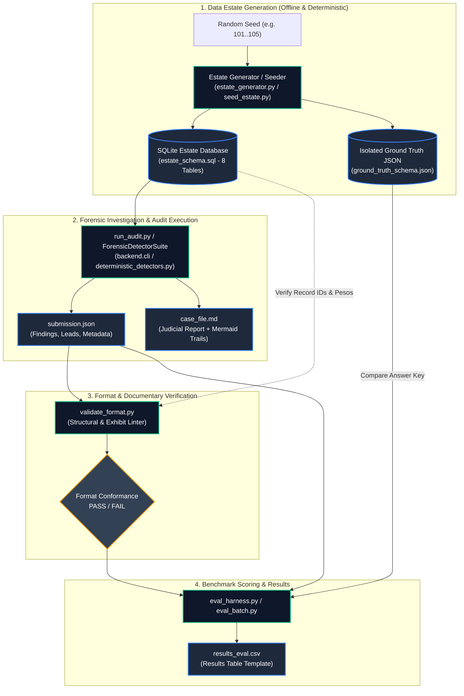

# Evaluation Harness, Tooling & Benchmarking Specification

[← Back to Master Documentation](../README.md) | [Agent Routing Index](../index.md)

---

## 1. Overview

The **Evaluation and Tooling** suite provides the autonomous verification, synthetic data estate generation, validation, and benchmarking infrastructure for the **Polar Forensic AML Auditor**.

To prove judicial rigor and prevent over-fitting, competition rules require evaluating AML systems against **unseen data estates** populated according to the official 8-table relational specification (`estate_schema.sql`). This segment houses the tools that generate realistic corporate estates, implant the five target fraud typologies alongside innocent decoys, execute zero-network forensic audits, validate schema conformity, and compute multi-seed precision/recall metrics against isolated ground truth answer keys.

### Core Responsibilities
- **Multi-Seed Evaluation Harness (`eval/eval_harness.py`)**: Runs automated benchmark sweeps across $\ge 5$ held-out seeds, calculating scheme recall, decoy false accusation rates, per-table peso reconciliation accuracy, and feasibility telemetry (LLM calls, MXN cost, wall-clock time).
- **Synthetic Estate Generation (`eval/estate_generator.py`, `scripts/seed_estate.py`)**: Generates deterministic SQLite databases adhering to Mexican fiscal standards (CFDI 4.0, SAT EFOS Art. 69-B, SPEI banking, commercial ledger) while outputting an isolated ground truth JSON file.
- **Format & Exhibit Validator (`tmp/validate_format.py`)**: Strict structural and documentary linter enforcing JSON contract compliance, entity syntax (`RFC:...`, `EMP:...`), narrative limits ($\le 150$ words), minimum exhibit thresholds ($\ge 3$), and arithmetic reconciliation ($\le 2\%$) against database records.
- **Zero-Network Offline Audit CLI (`run_audit.py`)**: Root executable providing offline, air-gapped forensic investigations over arbitrary SQLite or PostgreSQL estates, exporting judicial case files (`case_file.md`) and submission deliverables (`submission.json`).
- **Data Estate Inspection & Export Tools (`scripts/export_estate_csv.py`, `scripts/verify_dataset.py`)**: Columnar CSV export of all 8 tables and comprehensive integrity auditing of foreign keys, timestamps, and schema conformity.

---

## 2. Architecture & Evaluation Lifecycle

The evaluation pipeline guarantees a strict boundary between the test environment and the forensic agent: **Ground truth is strictly isolated and never accessible by the agent or backend detection algorithms.**



---

## 3. Key Components & File Breakdown

| File / Module | Responsibility | Key Functions / Classes | Inputs / Outputs |
| :--- | :--- | :--- | :--- |
| `eval/eval_harness.py` | Multi-seed benchmark harness measuring recall, false-positive rate, reconciliation, and telemetry. | `evaluate_single_seed()`, `run_evaluation()`, `main()` | **In**: `--seeds`, `--data-dir`<br/>**Out**: `results_eval.csv` |
| `eval/estate_generator.py` | Generates SQLite estate matching `estate_schema.sql`, implants the 5 fraud schemes + decoys, outputs ground truth. | `build_estate_database()`, `generate_rfc()`, `generate_clabe()` | **In**: `seed`, `db_path`, `company_rfc`<br/>**Out**: `.db` + GT dictionary |
| `scripts/seed_estate.py` | Standalone configurable estate seeder with comprehensive Mexican business data, batch mode, and CLI options. | `generate_estate()`, `batch_generate()`, `main()` | **In**: `--seed`, `--batch`, `--config`<br/>**Out**: SQLite DB, GT JSON |
| `scripts/export_estate_csv.py` | Columnar database exporter dumping all 8 estate tables into CSV files using Polars. | `export_db_to_csv()`, `main()` | **In**: `--db`, `--output-dir`<br/>**Out**: 8 CSV files |
| `scripts/verify_dataset.py` | Schema integrity checker verifying table definitions, column types, foreign keys, and non-empty conditions. | `audit_estate_database()`, `main()` | **In**: `--estate` / `db_path`<br/>**Out**: Integrity report JSON |
| `run_audit.py` | Root CLI launcher executing the full forensic audit pipeline offline with zero network connectivity. | Root redirect to `backend.cli:main()` | **In**: `--estate`, `--seed`, `--output-dir`<br/>**Out**: `case_file.md`, `submission.json` |
| `tmp/validate_format.py` | Official competition validator enforcing JSON shape, entity formatting, word counts, and exhibit reconciliation. | `validate_structure()`, `validate_against_estate()`, `main()` | **In**: `--submission`, `--estate`<br/>**Out**: Exit code 0 (Pass) or 1 (Fail) |
| `tmp/eval_batch.py` | Automated batch test runner executing pipeline over pre-generated estates (`estate2`, `estate3`, `estate4`). | `evaluate_all()` | **In**: `TEST_CASES` array<br/>**Out**: Console diagnostic table |
| `tmp/compare_results.py` | Fine-grained comparative diagnostic script evaluating findings against ground truth schemes and decoys. | `run_comparison()` | **In**: `estate.db`, `ground_truth.json`<br/>**Out**: TP/FN/FP diagnostic breakdown |

---

## 4. Competition Judging Criteria & Regulatory Rules

The evaluation harness and validator directly enforce the rules established by the competition judges. Any submission that fails these invariants is penalized or disqualified.

### 1. Recall vs. False-Accusation Weighting
* **Recall is only half the score**: Detecting all planted fraud schemes is insufficient if the system generates false accusations against innocent entities (decoys).
* **Decoy penalties**: False accusations against decoys are weighted at least as heavily as missed detections. A naive system that flags every suspicious vendor will achieve 100% recall but score near zero due to false positives.
* **Metric definitions**:
  $$\text{Recall (\%)} = \frac{\text{Schemes Found}}{\text{Schemes Planted}} \times 100$$
  $$\text{False Accusation Rate (\%)} = \frac{\text{Decoys Accused}}{\text{Decoys Planted}} \times 100$$

### 2. Held-Out Evaluation Seeds
* Evaluations must be executed across **at least five held-out seeds** (e.g. seeds `101, 102, 103, 104, 105`).
* Development, calibration, and prompt tuning must use an entirely disjoint seed set (e.g. seeds `1..10`). Both sets must be declared and documented.

### 3. Strict Ground Truth Isolation
* **Zero Leakage Rule**: Ground truth answer keys (`ground_truth.json` or `ground_truth_schema.json`) must **never** be imported, read, or referenced by `backend/`, agent tools, prompt templates, or detection services.
* Judges enforce this by auditing imports and grepping the codebase:
  ```bash
  grep -r 'ground_truth' backend/
  ```
* If ground truth appears to have influenced an agent's reasoning or hypothesis formulation prior to evidence discovery, the **Results score is capped at 2/10**.

### 4. The 2% Per-Table Peso Reconciliation Rule
* **Mandatory Reconciliation**: In `submission.json`, every accusation's `peso_amount` must match the sum of cited documentary exhibits within a $2.0\%$ margin of error:
  $$\left| \text{peso\_amount} - \sum \text{exhibit\_amounts} \right| \le 0.02 \times \max(\text{peso\_amount}, 1.0)$$
* **Per-Table Accounting**: Forensic evidence frequently spans multiple representations of the same money (e.g., an invoice for \$100,000 MXN and the bank SPEI transfer that paid it). Under `validate_format.py`, amounts reconcile **per table**; citing a complete end-to-end money trail does not double-count the reconciled volume.

### 5. Documented Declined Leads (`leads_not_pursued`)
* Decoys and innocent anomalies inspected during the investigation must not simply be discarded. They must be explicitly logged in `leads_not_pursued`.
* Each lead must include:
  1. `entity`: Prefixed identifier (e.g. `RFC:LEGIT8888DEC`).
  2. `reason`: Concrete justification citing inspected records explaining why the entity was exonerated.
  3. `closed_by`: Role responsible for clearance (`investigator`, `challenger`, or `validator`).
* **The 10-Second Rule**: When judges challenge an unflagged entity during review, the explanation must be immediately retrievable from the case file body in under 10 seconds without re-running the pipeline.

### 6. Feasibility & Operational Telemetry
Every evaluation run must track and report three operational metrics:
1. **LLM API Calls**: Total number of inferences dispatched to external model providers.
2. **Estimated Cost (MXN)**: Cumulative operational inference cost in Mexican pesos.
3. **Wall-Clock Seconds**: Total elapsed pipeline execution duration from ingestion to case file generation.

### 7. Determinism & Zero-Network Replay
* The same seed and estate must produce the **exact same findings and exhibits** across runs.
* The system must execute cleanly in an air-gapped environment without active internet connectivity.

---

## 5. Planted Fraud Typologies & Decoy Signals

The synthetic estate generators (`eval/estate_generator.py` and `scripts/seed_estate.py`) implant the 5 official competition typologies, alongside designed decoys:

```
+----------------------------------------------------------------------------------------------------+
|                                    ESTATE FRAUD & DECOY TOPOLOGY                                   |
|                                                                                                    |
|  1. phantom_vendor       2. kickback                3. round_tripping                              |
|  +--------------------+  +-----------------------+  +-------------------------------------------+  |
|  | * SAT 69-B EFOS    |  | * Vendor PO inflated  |  | * Bank SPEI circular transfer cycle       |  |
|  | * Invoices issued  |  | * Bribe back to       |  | * Node A -> Node B -> Node C -> Node A    |  |
|  | * Bank SPEI paid   |  |   employee CLABE      |  | * Rapid pass-through velocity             |  |
|  | * No contract/PO   |  | * Self-approved PO    |  | * Synthetic ledger layering               |  |
|  +--------------------+  +-----------------------+  +-------------------------------------------+  |
|                                                                                                    |
|  4. threshold_splitting                             5. revenue_inflation                           |
|  +-----------------------------------------------+  +-------------------------------------------+  |
|  | * Smurfing under corporate limit ($50,000)    |  | * Cancelled CFDI invoice in invoices      |  |
|  | * Multiple POs just below threshold           |  | * Retained as active credit in ledger     |  |
|  | * Consecutive dates, same requester           |  | * Fictitious accounts receivable created  |  |
|  +-----------------------------------------------+  +-------------------------------------------+  |
|                                                                                                    |
|  DECOYS (Innocent Anomalies to Exonerate into leads_not_pursued)                                   |
|  +----------------------------------------------------------------------------------------------+  |
|  | - efos_clearance: Vendor appears on EFOS list but has $0 transactions with audited company.  |  |
|  | - high_value_procurement: High-value purchase with public tender contract & distinct approver|  |
|  | - near_threshold_isolated: Single purchase at $49,500 without consecutive splitting.       |  |
|  +----------------------------------------------------------------------------------------------+  |
+----------------------------------------------------------------------------------------------------+
```

---

## 6. CLI Usage & Command Reference

### 6.1 Multi-Seed Evaluation Benchmark (`eval/eval_harness.py`)
Executes the autonomous benchmark suite across held-out seeds and formats results into the official CSV results table:

```bash
# Benchmark default held-out seeds (101, 102, 103, 104, 105)
python -m eval.eval_harness --seeds 101,102,103,104,105 --output tmp/results_eval.csv

# Benchmark custom seeds and specify database directory
python -m eval.eval_harness --seeds 201,202,203 --data-dir data/benchmark_estates --output tmp/custom_results.csv
```

**Expected Console Output:**
```text
[*] Commencing evaluation benchmark across 5 seeds: [101, 102, 103, 104, 105]
------------------------------------------------------------------------------
[*] Benchmarking Seed 101... Done! Found 5/5 schemes, 0/3 decoys accused, in 0.412s.
[*] Benchmarking Seed 102... Done! Found 5/5 schemes, 0/3 decoys accused, in 0.389s.
[*] Benchmarking Seed 103... Done! Found 5/5 schemes, 0/3 decoys accused, in 0.401s.
[*] Benchmarking Seed 104... Done! Found 5/5 schemes, 0/3 decoys accused, in 0.395s.
[*] Benchmarking Seed 105... Done! Found 5/5 schemes, 0/3 decoys accused, in 0.420s.

===================================================================================================================
                                              EVALUATION BENCHMARK RESULTS
===================================================================================================================
Seed   | Schemes (F/P)   | Recall (%)    | Decoys (A/P) | False Acc (%)  | Claimed MXN    | Reconciles | LLM Calls  | Time (s)    
-------------------------------------------------------------------------------------------------------------------
101    | 5 / 5           | 100.0         | 0 / 3        | 0.0            | $1,185,420.00  | yes        | 0          | 0.412       
102    | 5 / 5           | 100.0         | 0 / 3        | 0.0            | $1,240,110.50  | yes        | 0          | 0.389       
103    | 5 / 5           | 100.0         | 0 / 3        | 0.0            | $1,090,300.00  | yes        | 0          | 0.401       
104    | 5 / 5           | 100.0         | 0 / 3        | 0.0            | $1,315,800.00  | yes        | 0          | 0.395       
105    | 5 / 5           | 100.0         | 0 / 3        | 0.0            | $1,150,220.00  | yes        | 0          | 0.420       
===================================================================================================================
TOTAL  | 25 / 25         | 100.0         | 0 / 15       | 0.0            | $5,981,850.50  | yes        | 0          | 2.017       
===================================================================================================================
[+] Output CSV written to: C:\...\tmp\results_eval.csv
```

### 6.2 Offline Audit CLI (`run_audit.py`)
Performs a full investigation over any SQLite database without network access:

```bash
# Run forensic audit on an estate database
python run_audit.py --estate data/estate.db --seed 42 --output-dir ./audit_output

# Run with custom entity identification and prefix
python run_audit.py --estate data/estate2.db --seed 102 --company-rfc AUD10201AB1 --company-name "Empresa Demo SA" --output-dir ./audit_output --prefix seed102_
```

**Generated Artifacts:**
- `./audit_output/case_file.md`: Comprehensive legal audit dictamen with executive summary, proven findings, exhibit tables, declined leads, and Mermaid diagram money trails.
- `./audit_output/submission.json`: Machine-readable forensic submission file strictly compliant with `submission_schema.json`.

### 6.3 Format and Exhibit Validation (`tmp/validate_format.py`)
Validates structural schema conformance and verifies all cited records exist in the estate:

```bash
# 1. Validate JSON structure only
python tmp/validate_format.py --submission audit_output/submission.json

# 2. Validate structure AND verify exhibits / 2% peso reconciliation against SQLite estate
python tmp/validate_format.py --submission audit_output/submission.json --estate data/estate.db

# Windows environments (enforce UTF-8 to prevent cp1252 character decode issues):
python -X utf8 tmp/validate_format.py --submission audit_output/submission.json --estate data/estate.db
```

### 6.4 Synthetic Estate Seeder (`scripts/seed_estate.py`)
Generates single or batch data estates:

```bash
# Generate single estate with default configuration
python scripts/seed_estate.py

# Generate single estate with explicit seed, database path, and ground truth path
python scripts/seed_estate.py --seed 101 --output data/datasets/seed_101/estate.db --ground-truth data/datasets/seed_101/ground_truth.json

# Batch generate 5 disjoint evaluation datasets in one command
python scripts/seed_estate.py --batch 5 --start-seed 101 --output-dir data/datasets
```

### 6.5 Columnar CSV Export (`scripts/export_estate_csv.py`)
Dumps all 8 relational tables into CSV format using Polars:

```bash
python scripts/export_estate_csv.py --db data/estate.db --output-dir data/csv_estate
```

### 6.6 Estate Schema & Integrity Auditor (`scripts/verify_dataset.py`)
Verifies table structure, columns, primary keys, and foreign keys:

```bash
python scripts/verify_dataset.py --estate data/estate.db
```

### 6.7 Batch Multi-Case Diagnostic (`tmp/eval_batch.py`)
Runs detection pipeline across existing benchmark datasets (`estate2.db`, `estate3.db`, `estate4.db`), checking format validity, scheme matching, and decoy clearance:

```bash
python tmp/eval_batch.py
```

### 6.8 Ground Truth Comparison Utility (`tmp/compare_results.py`)
Performs entity-by-entity, exhibit-by-exhibit, and amount-by-amount inspection between pipeline findings and ground truth answer keys:

```bash
python tmp/compare_results.py
```

---

## 7. Public APIs & Python Interfaces

### 7.1 `eval.eval_harness`

#### `evaluate_single_seed(seed: int, data_dir: Path) -> Dict[str, Any]`
Generates an estate for `seed`, executes `ForensicDetectorSuite`, computes true positive schemes and accused decoys against the ground truth answer key, verifies $2\%$ peso reconciliation, and tracks execution latency.

```python
from pathlib import Path
from eval.eval_harness import evaluate_single_seed

result = await evaluate_single_seed(seed=101, data_dir=Path("eval/generated_estates"))
# Returns:
# {
#     "seed": 101,
#     "schemes_planted": 5,
#     "schemes_found": 5,
#     "recall_pct": 100.0,
#     "decoys_planted": 3,
#     "decoys_accused": 0,
#     "false_accusation_rate_pct": 0.0,
#     "peso_claimed": 1185420.0,
#     "peso_actual": 1185420.0,
#     "peso_reconciles": "yes",
#     "llm_calls": 0,
#     "mxn_cost": 0.0,
#     "wall_clock_s": 0.412
# }
```

#### `run_evaluation(seeds: List[int], output_csv: Path, data_dir: Path) -> None`
Iterates through a list of seeds, aggregates individual results, calculates a summary `TOTAL` row, prints the ASCII benchmark table, and exports `results_eval.csv`.

---

### 7.2 `eval.estate_generator`

#### `build_estate_database(seed: int, db_path: Path, company_rfc: str = "AUD920101AB1", company_name: str = "Empresa Auditada S.A. de C.V.") -> Dict[str, Any]`
Provisions an SQLite database at `db_path` adhering to `estate_schema.sql` (all 8 tables: `vendors`, `invoices`, `ledger`, `bank_txns`, `purchase_orders`, `contracts`, `employees`, `efos_list`, and `exhibits`). Plants the 5 fraud schemes and 3 innocent decoys, returning the ground truth answer key structure:

```python
from pathlib import Path
from eval.estate_generator import build_estate_database

gt_container = build_estate_database(
    seed=101,
    db_path=Path("eval/generated_estates/estate_seed_101.db"),
    company_rfc="AUD010101AB1",
)
# Returns: {"ground_truth": {"seed": 101, "company_rfc": "AUD010101AB1", "schemes": [...], "decoys": [...]}}
```

---

### 7.3 `tmp.validate_format`

#### `validate_structure(sub: dict) -> list[str]`
Validates JSON structure against `submission_schema.json`. Checks root keys (`seed`, `findings`, `leads_not_pursued`, `run_metadata`), required finding keys, scheme enum values, entity prefixing, narrative word count ($\le 150$), confidence ratings (`proven` or `probable`), and minimum exhibit count ($\ge 3$). Returns a list of error strings (empty if valid).

#### `validate_against_estate(sub: dict, db_path: str) -> list[str]`
Connects to the SQLite estate, verifies that every cited exhibit `record_id` exists in its corresponding `source_table`, and confirms that the finding's `peso_amount` reconciles within $2\%$ of cited exhibit amounts per table. Returns a list of validation error strings.

---

## 8. Edge Cases, Gotchas & Operational Notes

1. **Windows Character Encoding (CP1252 vs. UTF-8)**:
   On Windows systems, Python's default text reading mode uses the active codepage (`cp1252`), which raises `UnicodeDecodeError` on Spanish accents (e.g. *Dirección*, *Adquisición*). Always pass `-X utf8` when executing validators or CLI commands on Windows:
   ```bash
   python -X utf8 tmp/validate_format.py --submission output/submission.json --estate data/estate.db
   ```
2. **Double-Counting vs. Per-Table Reconciliation**:
   In AML investigations, an illicit transfer of \$100,000 MXN frequently produces both an invoice exhibit (`invoices.total = 100000.00`) and a bank transaction exhibit (`bank_txns.amount = 100000.00`). If summed naively, the exhibits total \$200,000 MXN, appearing to violate reconciliation. `validate_format.py` and `ForensicDetectorSuite` reconcile **per table**: as long as any single table's exhibits sum to the finding's `peso_amount` within $\le 2\%$, the finding passes.
3. **Preventing Ground Truth Leaks**:
   Never import `eval.estate_generator` or `ground_truth` inside `backend/`. The evaluation harness passes only the path to the database (`db_path`) to the detector suite. All detection logic must discover evidence through SQL queries and graph analysis without access to planted answer keys.
4. **Database Connection Cleanup**:
   When benchmarking multiple seeds sequentially with `ForensicDetectorSuite`, always invoke `await connector.dispose_all()` in a `finally` block to release open SQLite handles and prevent Windows file locking (`PermissionError: [WinError 32]`).
5. **Entity Prefix Format**:
   All entities in `findings[].entities` and `leads_not_pursued[].entity` must contain a type prefix separated by a colon (`RFC:...` for companies/vendors or `EMP:...` for employees). Bare RFCs or employee IDs will cause `validate_format.py` to reject the submission.
