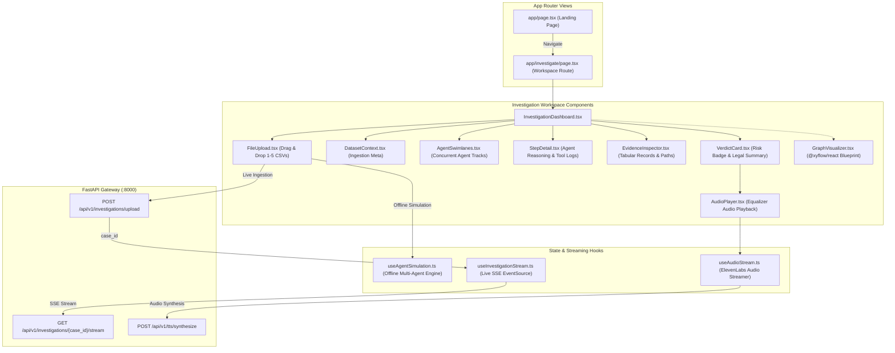
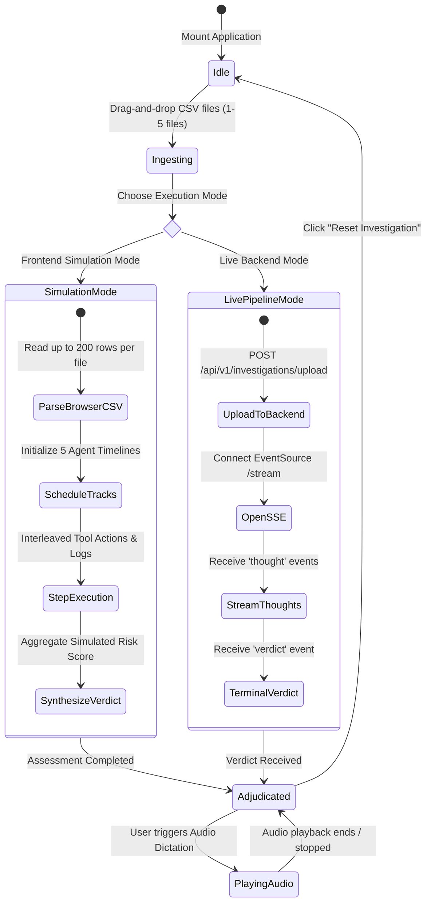

# Frontend Architecture & Client Dashboard

[← Back to Master Documentation](../README.md) | [Agent Routing Index](../index.md)

---

## 1. Overview

The **frontend** tier of Polar Forensic Auditor is a high-precision, real-time investigation dashboard built with **Next.js 14 (App Router)**, **React 18**, **TypeScript**, and **Tailwind CSS**. It serves as the primary investigative console for Anti-Money Laundering (AML) compliance officers, forensic auditors, and financial intelligence analysts.

### Current Application Entry Points & Interface Conventions
- **Landing Page (`/`)**: The main landing page introduces the Polar platform, highlighting its hybrid deterministic graph reduction and agentic reasoning capabilities. Action buttons ("Explore the platform", "Explore Polar") navigate directly to `/investigate`.
- **Investigation Workspace (`/investigate`)**: Implemented via `app/investigate/page.tsx` and `components/InvestigationDashboard.tsx`. It provides a multi-agent forensic workspace featuring `DatasetContext`, `AgentSwimlanes`, `StepDetail`, `EvidenceInspector`, and `VerdictCard`.
- **Interface Language & Theme**: In accordance with platform conventions, the workspace interface uses **English** UI labels with the signature Polar charcoal/ice-blue forensic theme (`#090d16`, `#111827`, `#1f293d`). Narrative text generated by upstream forensic services retains its supplied language.
- **Dual-Mode Operational Architecture**:
  - **Frontend Simulation Mode**: Fully functional offline demo mode powered by `useAgentSimulation`. Accepts 1-5 CSV files (up to 20 MB), parses sample rows directly in the browser, and executes simulated concurrent specialist reasoning across a synchronized timeline without requiring an active backend connection.
  - **Live Inference Pipeline Mode**: Production mode integrating with the FastAPI backend via `POST /api/v1/investigations/upload`, real-time SSE reasoning via `useInvestigationStream`, and audio verdict playback via `useAudioStream`.
  - **Interactive Money Trail Visualization**: Target integration blueprint using `@xyflow/react` and `@dagrejs/dagre` (documented in [React Flow Architecture Blueprint](./react-flow-blueprint.md)).

```
+----------------------------------------------------------------------------------------------------+
|                                    Next.js 14 Client Dashboard                                     |
|                                                                                                    |
|  +---------------------------+  +---------------------------------------------------------------+  |
|  |       Landing Page        |  |                     Investigation Workspace                   |  |
|  |          app/             |  |                        app/investigate/                       |  |
|  |  - Hero & Value Prop      |  |  - DatasetContext (Multi-file summary & AMLSim columns)       |  |
|  |  - "Explore Polar" CTA    |  |  - AgentSwimlanes (5 concurrent specialist tracks)            |  |
|  |                           |  |  - StepDetail (Narrative tool logs & evidence citations)     |  |
|  |                           |  |  - EvidenceInspector (Transaction records & path traces)      |  |
|  |                           |  |  - VerdictCard (Risk badge, financial sums, UIF/GAFI text)    |  |
|  +-------------+-------------+  +-------------------------------+-------------------------------+  |
|                |                                                |                                  |
|                v                                                v                                  |
|  +---------------------------+  +---------------------------------------------------------------+  |
|  |   Simulation Pipeline     |  |                    Live API & Streaming Hooks                 |  |
|  |   - useAgentSimulation    |  |  - useInvestigationStream (EventSource SSE: thought, verdict) |  |
|  |   - In-Browser CSV Parser |  |  - useAudioStream (ElevenLabs MP3 proxy streaming playback)   |  |
|  |   - Scheduled Timelines   |  |  - GraphVisualizer (@xyflow/react + Dagre Topology Canvas)    |  |
|  +---------------------------+  +---------------------------------------------------------------+  |
+----------------------------------------------------------------------------------------------------+
```

---

## 2. Architecture & Component Hierarchy

The client architecture adheres to Next.js 14 App Router patterns, utilizing client-side reactive components (`"use client"`).

### Component & Data Flow Diagram



### State Machine Lifecycle



---

## 3. Key Components & File Breakdown

The frontend codebase follows a clean, componentized Next.js 14 layout:

```
frontend/
├── Dockerfile
├── package.json
├── tsconfig.json
├── next.config.js
├── tailwind.config.js
├── app/
│   ├── favicon.ico
│   ├── globals.css
│   ├── layout.tsx
│   ├── page.tsx
│   └── investigate/
│       └── page.tsx
├── components/
│   ├── AgentSwimlanes.tsx
│   ├── AudioPlayer.tsx
│   ├── DatasetContext.tsx
│   ├── EvidenceInspector.tsx
│   ├── FileUpload.tsx
│   ├── InvestigationDashboard.tsx
│   ├── StepDetail.tsx
│   ├── ThoughtStream.tsx
│   └── VerdictCard.tsx
├── hooks/
│   ├── useAgentSimulation.ts
│   ├── useAudioStream.ts
│   └── useInvestigationStream.ts
├── lib/
│   └── utils.ts
└── types/
    └── investigation.ts
```

### Component Responsibility Matrix

| File / Module | Responsibility | Key Symbols / Classes | External Dependencies |
| :--- | :--- | :--- | :--- |
| `app/layout.tsx` | Global HTML root shell, font configurations, metadata, and theme container. | `RootLayout`, `metadata` | `next` |
| `app/page.tsx` | Polar marketing and platform landing page with CTAs navigating to `/investigate`. | `HomePage` | `next`, `lucide-react` |
| `app/investigate/page.tsx` | Next.js route entry point hosting the interactive multi-agent investigation workspace. | `InvestigatePage` | `next` |
| `components/InvestigationDashboard.tsx` | Top-level workspace coordinator managing datasets, swimlane progress, and view transitions. | `InvestigationDashboard` | `react`, `lucide-react` |
| `components/FileUpload.tsx` | Multi-file drag-and-drop CSV ingestion zone supporting 1-5 files (up to 20 MB total). | `FileUpload`, `FileUploadProps` | `react`, `lucide-react` |
| `components/DatasetContext.tsx` | Metric cards and dataset summary chips detailing total volume, record counts, and accounts. | `DatasetContext` | `react`, `lucide-react` |
| `components/AgentSwimlanes.tsx` | Synchronized concurrent timeline rendering tracks for the orchestrator and 4 specialist agents. | `AgentSwimlanes`, `AgentTrack` | `react`, `lucide-react` |
| `components/StepDetail.tsx` | Narrative panel displaying detailed tool calls, input parameters, execution telemetry, and evidence citations. | `StepDetail` | `react`, `lucide-react` |
| `components/EvidenceInspector.tsx` | Tabular inspector displaying verified transaction records, detected cycle paths, and pass-through nodes. | `EvidenceInspector` | `react`, `lucide-react` |
| `components/VerdictCard.tsx` | Executive verdict summary displaying risk badges, financial breakdown, UIF/GAFI legal text, and suspect entities list. | `VerdictCard` | `react`, `lucide-react` |
| `components/ThoughtStream.tsx` | Collapsible terminal rendering live SSE thought events from the backend streaming pipeline. | `ThoughtStream` | `react`, `lucide-react` |
| `components/AudioPlayer.tsx` | Voice verdict dictation button featuring animated equalizer wave visualization. | `AudioPlayer` | `react`, `lucide-react` |
| `hooks/useAgentSimulation.ts` | Complete browser-side multi-agent simulation engine with scheduled tracks and timer cleanup. | `useAgentSimulation` | `react` |
| `hooks/useInvestigationStream.ts` | Browser `EventSource` connection hook managing real-time SSE `thought` and `verdict` events. | `useInvestigationStream` | `react` |
| `hooks/useAudioStream.ts` | Custom hook managing audio fetch, Blob URL synthesis, abort signaling, and `HTMLAudioElement` playback. | `useAudioStream` | `react` |
| `lib/utils.ts` | Shared utility helpers including Tailwind class merger (`cn`) and MXN currency formatter (`formatCurrencyMXN`). | `cn()`, `formatCurrencyMXN()` | `clsx`, `tailwind-merge` |
| `types/investigation.ts` | Complete TypeScript interface definitions for events, subgraphs, investigation metrics, and API responses. | `ThoughtEvent`, `VerdictEvent`, `UploadResponse`, `SubgraphData` | TypeScript |

---

## 4. Multi-Agent Investigation Simulation Engine

To enable offline demonstrations and testing without backend infrastructure, the workspace incorporates a local multi-agent simulation engine via `hooks/useAgentSimulation.ts`:

### 4.1 Ingestion & Parsing
- Ingests 1 to 5 user-supplied CSV files (up to 20 MB total).
- Reads up to 200 rows per file client-side using `FileReader`.
- Performs canonical alias matching for IBM AMLSim column names (`origin`, `destination`, `amount`, `timestamp`).
- Extracts sample account identifiers, transaction amounts, and volume statistics to populate realistic forensic evidence.

### 4.2 Concurrent Specialist Agent Tracks
The simulation executes 5 specialized agent tracks across a synchronized time axis:
1. **Lead Forensic Orchestrator**: Manages investigation lifecycle, delegates sub-tasks, and synthesizes the judicial dictamen.
2. **Ingestion & Data Validation Specialist**: Normalizes transaction ledgers, filters zero-balance noise, and validates schema integrity.
3. **Circular Flow Specialist**: Extracts directed cycles and uncovers circular layering (*smurfing*) rings.
4. **Pass-Through Velocity Analyst**: Analyzes high-velocity transit accounts with flow retention ratios $\ge 90\%$ within $\le 48\text{h}$.
5. **Risk & Legal Compliance Auditor**: Cross-references findings against Mexican tax/AML statutes (CFF Art. 69-B, NIF A-2, UIF ROI guidelines).

### 4.3 Simulation Integrity & Transparency
- Persistent disclaimers clarify that the simulation is illustrative and does not connect to external AI models or financial institutions.
- Resetting the investigation cancels all pending execution timers and cleanly resets local component state.

---

## 5. Public APIs, Hooks & Data Contracts

### 5.1 `useInvestigationStream` Hook
Manages the Server-Sent Events lifecycle for a live backend investigation case:

```typescript
export interface UseInvestigationStreamReturn {
  thoughts: ThoughtEvent[];               // Progressive stream of reasoning thoughts
  verdict: VerdictEvent | null;           // Final forensic verdict (terminates stream)
  isStreaming: boolean;                   // True while SSE connection is active
  error: string | null;                   // SSE connection error message
  startStream: (caseId: string) => void;  // Opens EventSource to backend
  resetStream: () => void;                // Closes EventSource and clears state
}
```

### 5.2 `useAudioStream` Hook
Controls streaming audio synthesis and playback:

```typescript
export interface UseAudioStreamReturn {
  isPlaying: boolean;                     // True while audio is actively playing
  isLoading: boolean;                     // True while fetching audio blob from proxy
  error: string | null;                   // Playback or fetch error message
  playAudio: (text: string) => Promise<void>; // Sends text to TTS and initiates audio
  stopAudio: () => void;                  // Aborts fetch or halts audio playback
}
```

### 5.3 Core Data Contracts (`types/investigation.ts`)

```typescript
export interface ThoughtEvent {
  step: number;
  phase: string;
  message: string;
  timestamp: string;
}

export interface VerdictEvent {
  case_id: string;
  risk_level: "CRÍTICO" | "ALTO" | "MEDIO" | "BAJO";
  fraud_type: string;
  total_amount_mxn: number;
  confidence_score: number;
  entities_involved: string[];
  pruned_leads_count: number;
  patterns_summary: {
    closed_cycles: number;
    passthrough_accounts: number;
    pruning_efficiency_pct: number;
  };
  legal_recommendation: string;
  audit_summary_text: string;
  completed_at: string;
}

export interface SubgraphData {
  nodes: GraphNode[];
  edges: GraphEdge[];
}

export interface GraphNode {
  id: string;
  total_in: number;
  total_out: number;
  in_degree: number;
  out_degree: number;
  reasons: string[];
  risk_score: number;
}

export interface GraphEdge {
  source: string;
  target: string;
  amount: number;
  count: number;
  timestamps: number[];
  reasons: string[];
}
```

---

## 6. Target Architecture: React Flow Graph Visualizer

The backend delivers reduced topological subgraphs containing pruned nodes, edges, cycle annotations, and pass-through metrics within `UploadResponse.subgraph`.

To support visual money-trail analysis, the frontend is architected to integrate `@xyflow/react`:
- **Interactive Money Trail Canvas**: Interactive node-link canvas rendering high-risk entities and transaction edges.
- **Topological Layout Engine**: Automatic hierarchical layering computed via `@dagrejs/dagre`.
- **Custom Nodes & Edges**: Bank account cards displaying inflow/outflow metrics and animated transaction wires highlighting active cycles.

> [!NOTE]
> For the complete technical blueprint, node schemas, layout algorithms, and implementation code, consult the dedicated [React Flow Architecture Blueprint](./react-flow-blueprint.md).

---

## 7. Testing, Build & Quality Assurance

### Verification Commands
- **Non-Emitting Typecheck**:
  ```bash
  cd frontend
  npx --no-install tsc --noEmit --incremental false
  ```
  *Note*: This checks strict TypeScript rules without writing to the `.next` build cache.
- **Production Build**:
  ```bash
  npm run build
  ```
- **Linting**:
  ```bash
  npm run lint
  ```

### Build Nuances & Windows File Locking
- On Windows systems, concurrent development processes or anti-virus scanners may temporarily hold file locks on `.next/trace`. If encountered, resolve by ensuring other dev servers are stopped before invoking `npm run build`.

---

## 8. Edge Cases, Performance & Gotchas

### 8.1 Missing Utility Module (`@/lib/utils.ts`)
- **Issue**: Standard `.gitignore` rules with `lib/` can inadvertently ignore `frontend/lib/utils.ts`.
- **Resolution**: Ensure `.gitignore` anchors rules to root (`/lib/`) so `frontend/lib/utils.ts` (`cn`, `formatCurrencyMXN`) remains tracked in source control.

### 8.2 Browser `EventSource` Protocol Constraints
- Standard browser `EventSource` only supports HTTP `GET` requests and cannot supply custom headers (such as `Authorization: Bearer <token>`).
- If token authorization is required in production, pass an ephemeral query token or utilize `@microsoft/fetch-event-source`.

### 8.3 Object URL Garbage Collection
- `useAudioStream` converts audio responses into in-memory `Blob` objects and creates temporary URLs via `URL.createObjectURL(blob)`.
- Always track active URLs in a `useRef` and explicitly call `URL.revokeObjectURL(url)` during teardown or before generating a new audio clip to prevent browser memory leaks.

### 8.4 Client-Side Directive (`"use client"`)
- Every component consuming browser APIs (`EventSource`, `HTMLAudioElement`, `FileReader`, DOM scrolling) must declare `"use client"` at the top of the file to prevent SSR hydration errors in Next.js.

### 8.5 Separation of Simulation and Live Analysis
- When enhancing the UI, maintain strict architectural separation between local simulation (`useAgentSimulation`) and live backend analysis (`useInvestigationStream`). Never fabricate backend requests in simulation mode.

---

## 9. Configuration Reference

All frontend environment variables and tokens:

| Variable | Scope | Default Value | Description |
| :--- | :--- | :--- | :--- |
| `NEXT_PUBLIC_API_URL` | Browser & SSR | `"http://localhost:8000"` | Base URL of the FastAPI backend service |
| `PORT` | Node Runtime | `3000` | Port on which the Next.js application server listens |
| `NODE_ENV` | Build & Runtime | `"development"` | Node execution environment (`development`, `production`, `test`) |

