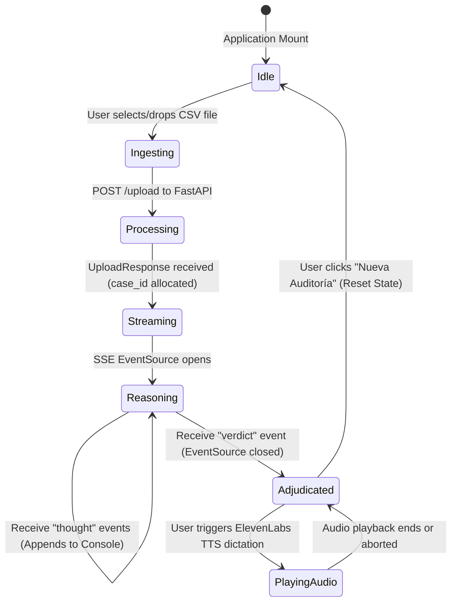

# Frontend Architecture & Client Dashboard

[← Back to Master Documentation](../README.md) | [Agent Routing Index](../index.md)

## Current Application Entry Point

The landing page remains at `/`. Its **Explore the platform** button and **Explore Polar** calls to action open `/investigate`, implemented by `app/investigate/page.tsx` and `components/InvestigationDashboard.tsx`.

The workspace uses English interface labels and the existing Polar charcoal/ice-blue theme. It contains `DatasetContext`, `AgentSwimlanes`, `StepDetail`, `EvidenceInspector`, and `VerdictCard`. Mobile users switch between Activity, Dataset, and Evidence views. Provider-generated narrative text retains its original language.

The current `/investigate` experience is a **frontend-only visual simulation**. Backend development is owned by another contributor; do not change backend files for UI work without coordination. `FileUpload` accepts 1-5 CSV files (20 MB total) and passes them to `useAgentSimulation`. The hook reads up to 200 rows per file in the browser, recognizes common AMLSim aliases, and uses filenames, sample account IDs, amounts, and row counts to populate the preview.

The orchestrator and four specialists execute on a shared time axis via concurrent schedule tracks covering data validation, circular flows, pass-through activity, and risk review (with dependency scheduling and interleaved plain-language tool executions). When complete, the board collapses smoothly to elevate the final assessment. Pattern findings and the final risk level are illustrative. Persistent simulation labels state that no backend, AI model, or real fraud detector analyzed the files. Reset clears pending timers and local case state.

`EvidenceInspector` shows uploaded sample records alongside simulated paths and bridge-account evidence. `VerdictCard` labels the outcome as a simulated assessment and suppresses backend audio controls in demo mode. The existing `useInvestigationStream` and `useAudioStream` remain available for future live integration, but `/investigate` does not invoke them in simulation mode.

Verification from `frontend`: `npx --no-install tsc --noEmit --incremental false` checks types without touching Next's build cache. `npm run build` remains the production verification. On Windows, a permission/lock error opening `.next/trace` must be resolved by the workspace owner rather than deleting their cache or stopping their processes without permission.

The sections below describe the original pipeline architecture; where component placement differs, use this entry-point section and the current source files.

## 1. Overview

The **frontend** segment of Polar Forensic Auditor is a high-precision, real-time investigation dashboard built with **Next.js 14 (App Router)**, **React 18**, **TypeScript**, and **Tailwind CSS**. It serves as the primary user interface for Anti-Money Laundering (AML) compliance officers, forensic auditors, and financial investigators.

### Core Responsibilities
- **Dataset Ingestion**: Drag-and-drop CSV ingestion of transaction datasets (formatted according to IBM AMLSim standards) to trigger backend deterministic graph reduction with Polars and NetworkX.
- **Live Forensic Reasoning Stream**: Real-time visualization of the forensic reasoning process via Server-Sent Events (SSE), streaming chain-of-thought events from the inference pipeline.
- **Forensic Verdict Presentation**: Structured presentation of risk metrics, financial volume in Mexican Pesos (MXN), identified AML typologies (closed circular transactions, rapid passthrough accounts), and legal/regulatory guidance (UIF / GAFI).
- **Executive Voice Dictation**: Audio playback of synthesized forensic verdicts powered by a secure ElevenLabs backend proxy.
- **Money Trail Topology (Planned Blueprint)**: Interactive graph visualization of transaction subgraphs and suspicious money trails using `@xyflow/react` (React Flow).

---

## 2. Architecture & Component Hierarchy

The client architecture follows Next.js App Router conventions with client-side reactive streaming components (`"use client"`).

### Component & Data Flow Diagram

```mermaid
graph TD
    subgraph UI ["User Interface (Next.js 14 App Router)"]
        Page["app/page.tsx (Investigation Orchestrator)"]
        FileUpload["components/FileUpload.tsx"]
        ThoughtStream["components/ThoughtStream.tsx"]
        VerdictCard["components/VerdictCard.tsx"]
        AudioPlayer["components/AudioPlayer.tsx"]
        ReactFlowView["components/GraphVisualizer.tsx (Blueprint)"]
    end

    subgraph Hooks ["Custom Streaming Hooks"]
        useStream["hooks/useInvestigationStream.ts"]
        useAudio["hooks/useAudioStream.ts"]
    end

    subgraph Backend ["FastAPI Backend (:8000)"]
        UploadEndpoint["POST /api/v1/investigations/upload"]
        SSEEndpoint["GET /api/v1/investigations/{case_id}/stream"]
        TTSEndpoint["POST /api/v1/tts/synthesize"]
    end

    Page --> FileUpload
    Page --> ThoughtStream
    Page --> VerdictCard
    Page -.-> ReactFlowView
    VerdictCard --> AudioPlayer

    FileUpload -->|CSV FormData| UploadEndpoint
    UploadEndpoint -->|UploadResponse (case_id + subgraph)| Page

    Page -->|case_id| useStream
    useStream -->|EventSource SSE| SSEEndpoint
    SSEEndpoint -->|event: thought| ThoughtStream
    SSEEndpoint -->|event: verdict| VerdictCard

    AudioPlayer --> useAudio
    useAudio -->|POST json {text}| TTSEndpoint
    TTSEndpoint -->|audio/mpeg Blob| useAudio
```

### State Machine Lifecycle



---

## 3. Key Components & Files

| File / Component | Primary Responsibility | Key Interfaces / Exports |
| :--- | :--- | :--- |
| [`app/layout.tsx`](file:///c:/Users/maxan/OneDrive/Documentos/Repositories/HackMTY%202026/Infosys/Polar/frontend/app/layout.tsx) | Root HTML shell, typography, metadata and global theme wrapper. | `RootLayout`, `metadata` |
| [`app/page.tsx`](file:///c:/Users/maxan/OneDrive/Documentos/Repositories/HackMTY%202026/Infosys/Polar/frontend/app/page.tsx) | Central dashboard orchestrator coordinating upload, streaming, metric tiles, and verdict states. | `Home` (default client component) |
| [`app/globals.css`](file:///c:/Users/maxan/OneDrive/Documentos/Repositories/HackMTY%202026/Infosys/Polar/frontend/app/globals.css) | Dark theme root variables, radial/linear gradients, and custom terminal scrollbar styling. | Tailwind base, custom CSS vars |
| [`components/FileUpload.tsx`](file:///c:/Users/maxan/OneDrive/Documentos/Repositories/HackMTY%202026/Infosys/Polar/frontend/components/FileUpload.tsx) | Drag-and-drop file ingestion zone with CSV validation and upload dispatch. | `FileUpload`, `FileUploadProps` |
| [`components/AgentSwimlanes.tsx`](file:///frontend/components/AgentSwimlanes.tsx) | Horizontal concurrent specialist timeline on a shared time axis with collapsible stage transition. | `AgentSwimlanes`, `AgentSwimlanesProps` |
| [`components/StepDetail.tsx`](file:///frontend/components/StepDetail.tsx) | Dedicated narrative panel rendering plain-language explanations, tool outcomes, metrics, and evidence links. | `StepDetail`, `StepDetailProps` |
| [`components/VerdictCard.tsx`](file:///frontend/components/VerdictCard.tsx) | Executive verdict presentation with risk badges, financial breakdown, UIF/GAFI legal text, and suspect entities list. | `VerdictCard`, `VerdictCardProps` |
| [`components/AudioPlayer.tsx`](file:///c:/Users/maxan/OneDrive/Documentos/Repositories/HackMTY%202026/Infosys/Polar/frontend/components/AudioPlayer.tsx) | Voice dictation playback button with animated audio equalizer wave visualization. | `AudioPlayer`, `AudioPlayerProps` |
| [`hooks/useInvestigationStream.ts`](file:///c:/Users/maxan/OneDrive/Documentos/Repositories/HackMTY%202026/Infosys/Polar/frontend/hooks/useInvestigationStream.ts) | Custom hook managing browser `EventSource` connection for SSE events (`thought` and `verdict`). | `useInvestigationStream` |
| [`hooks/useAudioStream.ts`](file:///c:/Users/maxan/OneDrive/Documentos/Repositories/HackMTY%202026/Infosys/Polar/frontend/hooks/useAudioStream.ts) | Custom hook managing audio fetch, Blob URL synthesis, abort signaling, and `HTMLAudioElement` lifecycle. | `useAudioStream` |
| [`types/investigation.ts`](file:///c:/Users/maxan/OneDrive/Documentos/Repositories/HackMTY%202026/Infosys/Polar/frontend/types/investigation.ts) | TypeScript contracts for events, graph subgraphs, investigation metrics, and API responses. | `ThoughtEvent`, `VerdictEvent`, `UploadResponse`, `GraphNode`, `GraphEdge`, `InvestigationMetrics` |
| [`next.config.js`](file:///c:/Users/maxan/OneDrive/Documentos/Repositories/HackMTY%202026/Infosys/Polar/frontend/next.config.js) | Next.js configuration enabling React Strict Mode. | `nextConfig` |
| [`tailwind.config.js`](file:///c:/Users/maxan/OneDrive/Documentos/Repositories/HackMTY%202026/Infosys/Polar/frontend/tailwind.config.js) | Tailwind CSS theme extension with custom surface palette (`#090d16`, `#111827`, `#1f293d`) and brand emerald shades. | Tailwind config object |
| [`Dockerfile`](file:///c:/Users/maxan/OneDrive/Documentos/Repositories/HackMTY%202026/Infosys/Polar/frontend/Dockerfile) | Production Docker container configuration using `node:20-alpine` base image. | Container build definition |

---

## 4. Dependencies & Interactions

### Internal System Interactions
- **Backend API (`/api/v1/investigations/upload`)**: Consumed by `FileUpload.tsx` to initiate case creation and deterministic graph pruning.
- **Backend SSE Stream (`/api/v1/investigations/{caseId}/stream`)**: Consumed by `useInvestigationStream.ts` for real-time thought events and the final verdict.
- **Backend Audio Proxy (`/api/v1/tts/synthesize`)**: Consumed by `useAudioStream.ts` to request audio bytes generated from ElevenLabs.

### External Third-Party Libraries
- **`next` (`^14.2.3`) & `react` (`^18.3.1`)**: Core App Router runtime and UI rendering engine.
- **`lucide-react` (`^0.363.0`)**: Comprehensive icon set used across dashboard tiles, upload widgets, terminal status, and audio playback controls.
- **`clsx` & `tailwind-merge`**: Utility helpers for conditional and merged Tailwind CSS class strings.
- **`@xyflow/react` (Target Integration)**: Planned dependency for node-edge graph visualization of AML money trails (see [React Flow Architecture Blueprint](./react-flow-blueprint.md)).

### Consumers
- **AML Compliance Officers & Forensic Auditors**: End-users who upload transaction ledgers, observe live inference, and evaluate legal recommendations.
- **Demonstration / Pericial Hub Stakeholders**: Users requiring accessible audio dictation of forensic reports.

---

## 5. Public APIs, Hooks & Data Contracts

### 1. `useInvestigationStream` Hook
Manages the Server-Sent Events lifecycle for a specific investigation case.

```typescript
interface UseInvestigationStreamReturn {
  thoughts: ThoughtEvent[];         // Progressive stream of reasoning thoughts
  verdict: VerdictEvent | null;     // Final forensic verdict (terminates stream)
  isStreaming: boolean;             // True while SSE connection is active
  error: string | null;             // SSE connection error string
  startStream: (caseId: string) => void;  // Opens EventSource to backend
  resetStream: () => void;          // Closes EventSource and clears state
}
```

### 2. `useAudioStream` Hook
Controls streaming audio synthesis and playback.

```typescript
interface UseAudioStreamReturn {
  isPlaying: boolean;               // True while audio is actively playing
  isLoading: boolean;               // True while fetching audio blob from proxy
  error: string | null;             // Playback or fetch error message
  playAudio: (text: string) => Promise<void>; // Sends text to TTS and initiates audio
  stopAudio: () => void;            // Aborts fetch or halts audio playback
}
```

### 3. Core Data Contracts (`types/investigation.ts`)

```typescript
// SSE Thought Event
export interface ThoughtEvent {
  step: number;
  phase: string;
  message: string;
  timestamp: string;
}

// Final Forensic Verdict Event
export interface VerdictEvent {
  case_id: string;
  risk_level: "CRÍTICO" | "ALTO" | "MEDIO" | "BAJO";
  fraud_type: string;
  total_amount_mxn: number;
  confidence_score: number;
  entities_involved: string[];
  pruned_leads_count: number;
  patterns_summary: {
    closed_cycles: number;
    passthrough_accounts: number;
    pruning_efficiency_pct: number;
  };
  legal_recommendation: string;
  audit_summary_text: string;
  completed_at: string;
}

// Graph Subgraph for Topology Rendering
export interface SubgraphData {
  nodes: GraphNode[];
  edges: GraphEdge[];
}

export interface GraphNode {
  id: string;
  total_in: number;
  total_out: number;
  in_degree: number;
  out_degree: number;
  reasons: string[];
  risk_score: number;
}

export interface GraphEdge {
  source: string;
  target: string;
  amount: number;
  count: number;
  timestamps: number[];
  reasons: string[];
}
```

---

## 6. Target Architecture: React Flow Graph Visualizer

The backend delivers reduced topological subgraphs containing pruned nodes, edges, cycle annotations, and passthrough metrics within `UploadResponse.subgraph`.

To satisfy forensic visual inspection requirements, the frontend is architected to incorporate `@xyflow/react`:
- **Interactive Money Trail**: Interactive node-link canvas showing high-risk entities and transaction edges.
- **Topological Layout Engine**: Automatic DAG/hierarchical layering using `@dagrejs/dagre` or ElkJS.
- **Color-Coded Nodes**: Visual distinction between cyclic originators, pass-through conduits, and destination sinks.
- **Animated Transaction Flows**: Animated stroke dashes on edges indicating flow velocity and suspected laundering cycles.

> [!NOTE]
> For the complete technical blueprint, node schemas, layout algorithms, and implementation code, consult the dedicated [React Flow Architecture Blueprint](./react-flow-blueprint.md).

---

## 7. Edge Cases, Gotchas & Engineering Considerations

### 1. Missing Utility Module (`@/lib/utils`)
- **Issue**: Both [`app/page.tsx`](file:///c:/Users/maxan/OneDrive/Documentos/Repositories/HackMTY%202026/Infosys/Polar/frontend/app/page.tsx#L19) and [`components/VerdictCard.tsx`](file:///c:/Users/maxan/OneDrive/Documentos/Repositories/HackMTY%202026/Infosys/Polar/frontend/components/VerdictCard.tsx#L16) import `formatCurrencyMXN` from `@/lib/utils`. However, the file `frontend/lib/utils.ts` was not initially committed to the repository.
- **Impact**: Running `npm run build` or `next build` will trigger a TypeScript module resolution error (`Cannot find module '@/lib/utils'`).
- **Resolution**: Create `frontend/lib/utils.ts` exporting:
  ```typescript
  import { type ClassValue, clsx } from "clsx";
  import { twMerge } from "tailwind-merge";

  export function cn(...inputs: ClassValue[]) {
    return twMerge(clsx(inputs));
  }

  export function formatCurrencyMXN(amount: number): string {
    return new Intl.NumberFormat("es-MX", {
      style: "currency",
      currency: "MXN",
      minimumFractionDigits: 2,
    }).format(amount);
  }
  ```

### 2. Browser `EventSource` Protocol Constraints
- Standard browser `EventSource` only supports HTTP `GET` requests and cannot set custom headers (such as `Authorization: Bearer <token>`).
- If authorization is added to `/api/v1/investigations/{case_id}/stream`, use an alternative client library such as `@microsoft/fetch-event-source` or pass an ephemeral query token.

### 3. Object URL Garbage Collection
- `useAudioStream` converts audio response streams into an in-memory `Blob` and creates a URL via `URL.createObjectURL(blob)`.
- It properly revokes the URL on `audio.onended` and `audio.onerror`. However, calling `stopAudio()` prematurely halts playback without revoking the previous object URL if not tracked. Ensure object URLs are explicitly tracked in a ref and revoked during cancellations.

### 4. Client-Side Rendering (`"use client"`)
- Every component consuming browser APIs (`EventSource`, `HTMLAudioElement`, `FileReader`, DOM scrolling `scrollIntoView`) must declare `"use client"` at the very top.
- SSR rendering of these components in Next.js will throw `ReferenceError: window is not defined` if rendered without the client directive.

### 5. Environment Configuration
- Default API fallback is hardcoded to `http://localhost:8000`. In containerized or production deployments, `NEXT_PUBLIC_API_URL` must be passed at build time (or configured through environment variables) to reach the backend gateway correctly.
