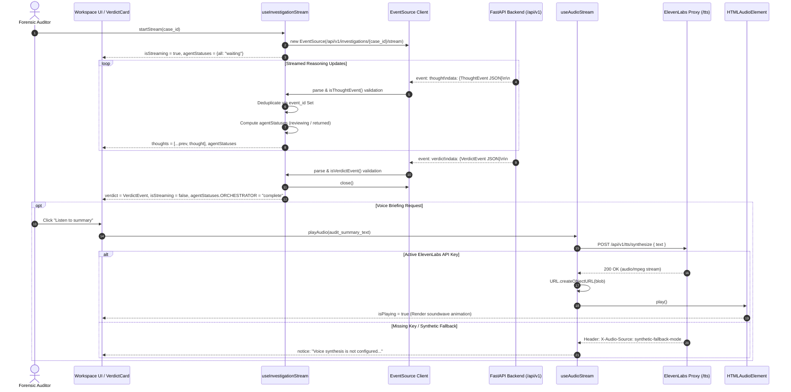
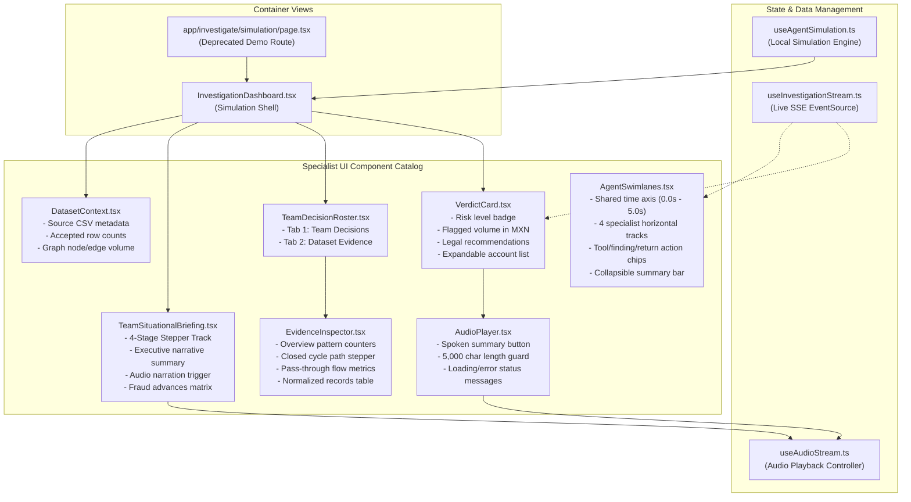

# Agent Orchestration, Real-Time Streaming & Voice Narration

[← Back to Frontend Documentation](../README.md) | [Master Architecture](../../README.md) | [Agent Routing Index](../../index.md)

---

## 1. Overview & Core Responsibilities

The **Agent Orchestration and Streaming** subsystem represents the real-time reasoning and forensic presentation layer of the Polar platform. It bridges asynchronous backend analytical pipelines (or client-side simulated timelines) with an institutional, high-precision investigative workspace.

```
+----------------------------------------------------------------------------------------------------+
|                      Agent Orchestration & Real-Time Streaming Architecture                         |
|                                                                                                    |
|   +----------------------------------------------------+   +------------------------------------+  |
|   |            Live Investigation Pipeline             |   |     Legacy Simulation Pipeline     |  |
|   |                                                    |   |            (Deprecated)            |  |
|   |   FastAPI / n8n Orchestrator                       |   |   In-Browser CSV Parser            |  |
|   |     └─ GET /api/v1/investigations/{id}/stream      |   |     └─ Client-Side Aliasing        |  |
|   |        (text/event-stream)                         |   |                                    |  |
|   |     └─ useInvestigationStream.ts                   |   |   useAgentSimulation.ts            |  |
|   |        (EventSource lifecycle & validation)        |   |     └─ 4-Stage Timed Dispatcher    |  |
|   +-------------------------+--------------------------+   +-----------------+------------------+  |
|                             |                                                |                     |
|                             +-----------------------+------------------------+                     |
|                                                     |                                              |
|                                                     v                                              |
|   +---------------------------------------------------------------------------------------------+  |
|   |                           Multi-Agent Forensic UI Component Suite                           |  |
|   |                                                                                             |  |
|   |   - TeamSituationalBriefing: Multi-stage progress track, status badges & spoken briefing    |  |
|   |   - AgentSwimlanes: Concurrent specialist activity tracks along a shared time axis          |  |
|   |   - TeamDecisionRoster: Dual-tab specialist task/decision matrix and evidence navigation     |  |
|   |   - EvidenceInspector: Deep-dive viewer for cycles, pass-through accounts & raw records     |  |
|   |   - VerdictCard: Risk classification, MXN sums, legal actions, and entities involved        |  |
|   |   - AudioPlayer & useAudioStream: ElevenLabs TTS proxy playback with fallback handling      |  |
|   |   - DatasetContext: Source file metrics, schema coverage & AMLSim unit verification         |  |
|   +---------------------------------------------------------------------------------------------+  |
+----------------------------------------------------------------------------------------------------+
```

### Core Responsibilities
1. **Real-Time SSE Streaming (`useInvestigationStream`)**: Connects to the FastAPI backend SSE endpoint (`/api/v1/investigations/{case_id}/stream`), parses incoming `thought` and `verdict` events, runs runtime schema validation guards, deduplicates frames, and computes dynamic agent lifecycle statuses.
2. **Multi-Agent Execution Visualization (`AgentSwimlanes`, `TeamSituationalBriefing`)**: Maps concurrent specialist work across shared time axes, illustrating dependency scheduling, tool executions, interim findings, and hand-offs.
3. **Specialist Decision Rostering & Evidence Inspection (`TeamDecisionRoster`, `EvidenceInspector`)**: Organizes forensic conclusions by specialist agent, enabling direct cross-inspection of closed circular fund paths, high-velocity transit accounts, and normalized transaction previews.
4. **Adjudication & Forensic Verdicts (`VerdictCard`)**: Translates structured AML verdicts into human-auditable executive findings, regulatory risk badges, flagged transaction totals in MXN, and statutory next steps under Mexican AML frameworks (e.g., CFF Art. 69-B, UIF/GAFI).
5. **Streaming Voice Narration (`AudioPlayer`, `useAudioStream`)**: Proxies synthesized forensic audio summaries from ElevenLabs via `/api/v1/tts/synthesize`, managing audio blobs, browser playback controls, and offline fallback detection.
6. **Dual Mode Integrity (Live Backend vs. Legacy Simulation)**: Enforces an explicit architectural boundary between live backend-connected analysis and the standalone legacy frontend simulation at `/investigate/simulation`.

---

## 2. Forensic Specialist Review Team

The multi-agent architecture models a forensic audit squad consisting of an orchestrator and four domain-specialized analytical tracks (`REVIEW_TEAM` defined in [`frontend/components/AgentTeam.tsx`](../../../frontend/components/AgentTeam.tsx)):

| Agent Identifier (`AgentId`) | Specialist Display Name | Domain Scope & Analytical Target | Primary Artifacts & Tools |
| :--- | :--- | :--- | :--- |
| **`ORCHESTRATOR`** | Global Orchestrator | Task allocation, dependency resolution, evidence synthesis, and final forensic adjudication. | Execution schedule, unified verdict dossier, synthesis notes. |
| **`DATA_VALIDATION`** | Data Validation | CSV integrity, column alias mapping (`origin`, `destination`, `amount`, `timestamp`), and schema normalization. | Normalized dataset preview, `normalize_columns` tool. |
| **`CIRCULAR_FLOWS`** | Circular Flows | Detection of closed fund paths where capital moves through connected accounts and loops back to origin. | Directed graph topology (`nx.simple_cycles`), path volume calculation, `prune_linear_chains` tool. |
| **`PASSTHROUGH`** | Pass-Through Conduits | High-velocity transit accounts with closely matched incoming/outgoing fund ratios ($\ge 0.90$) within narrow windows ($\le 48\text{h}$). | Conduit dwell time, flow parity ratio, `match_flow_ratio` tool. |
| **`RISK_REVIEW`** | Risk & Compliance Review | Cross-pattern correlation, operational materiality, legal classification, and regulatory statutory thresholds. | UIF/GAFI typologies, CFF Art. 69-B cross-referencing, `evaluate_thresholds` tool. |

---

## 3. Architecture & Data Flow Diagrams

### 3.1 Live SSE Streaming & Audio Narration Lifecycle

The live investigation workflow streams real-time reasoning thoughts and terminal verdicts from FastAPI to the client via Server-Sent Events (`text/event-stream`), culminating in optional speech synthesis:



---

### 3.2 Multi-Agent Component Topology & State Tree

The following diagram maps the structural relationship and data flow between the orchestration components in the workspace:



---

## 4. Key Components Catalog

### 4.1 `AgentSwimlanes.tsx`
*Location*: [`frontend/components/AgentSwimlanes.tsx`](../../../frontend/components/AgentSwimlanes.tsx)

Renders horizontal execution tracks for all four specialist agents along a shared temporal coordinate system.

```typescript
interface AgentSwimlanesProps {
  statuses: AgentStatuses;
  thoughts: ThoughtEvent[];
  selectedStepId: string | null;
  onSelectStep: (stepId: string) => void;
  selectedAgent: AgentId | null;
  onSelectAgent: (agent: AgentId) => void;
  isRunning: boolean;
  isCollapsed: boolean;
  onToggleCollapse: () => void;
  hasCase: boolean;
  verdictReady: boolean;
}
```

#### Key Features & Visual Layout:
- **Shared Time Axis**: A pinned chronological scale (`T=0.0s (Start)`, `T=1.5s (Parallel Execution)`, `T=3.0s (Dependency Resolution)`, `T=5.0s (Return)`).
- **Specialist Lanes**: Displays agent identities, operational roles, and live status badges (`Waiting`, `Running`, `Returned`).
- **Action Chips**: Color-coded interactive milestones along each lane:
  - *Tool Calls* (`action === "tool"`): Pinned with a CPU icon and border-brand styling.
  - *Interim Findings* (`action === "finding"`): Highlighted with warning amber and metric badges.
  - *Handoff Returns* (`action === "returned"`): Forest green return markers denoting completed specialist tasks.
  - *Active Pulses*: The trailing chip pulses during active execution.
- **Collapsible Summary Mode**: When a final verdict is ready, the swimlanes can collapse into a compact summary bar (`4/4 Reviews Complete`) to give visual prominence to the forensic verdict while maintaining an expand button.
- **Orchestrator Synthesis Footer**: Displays the latest coordinating directive from the global orchestrator.

---

### 4.2 `TeamSituationalBriefing.tsx`
*Location*: [`frontend/components/TeamSituationalBriefing.tsx`](../../../frontend/components/TeamSituationalBriefing.tsx)

Presents an executive-level situational report consolidating multi-agent progress, operational status, and real-time advances.

```typescript
interface TeamSituationalBriefingProps {
  situationalState: TeamSituationalState;
  hasCase: boolean;
  isRunning: boolean;
  verdictReady: boolean;
}
```

#### Key Features:
- **4-Stage Progress Stepper**: Tracks the macro phases of the investigation:
  1. `Ingestion & Schema` (`ingest`)
  2. `Pattern Discovery` (`discovery`)
  3. `Risk Synthesis` (`synthesis`)
  4. `Adjudication` (`verdict`)
- **Executive Summary Paragraph**: Synthesizes the active status into clear narrative language for compliance officers and non-technical stakeholders.
- **Spoken Briefing Integration**: Inline audio player powered by `useAudioStream`, featuring active soundwave animations and audio status indicators.
- **Cumulative Fraud Advances Matrix**: A responsive grid rendering key forensic parameters (e.g., suspicious volume, cycle counts, bridge conduits, noise pruning percentage), with alert badges for critical indicators.

---

### 4.3 `TeamDecisionRoster.tsx`
*Location*: [`frontend/components/TeamDecisionRoster.tsx`](../../../frontend/components/TeamDecisionRoster.tsx)

A responsive sidebar offering a dual-tab toggle between the specialist team's active tasks and the underlying dataset evidence.

```typescript
interface TeamDecisionRosterProps {
  statuses: AgentStatuses;
  agentDecisions: Record<AgentId, AgentDecision>;
  selectedAgent: AgentId | null;
  onSelectAgent: (agent: AgentId) => void;
  currentCase: UploadResponse | null;
  selectedEvidence: EvidenceRef | null;
  onEvidence: (ref: EvidenceRef) => void;
  hasCase: boolean;
}
```

#### Dual-Tab Interface:
- **Tab 1: Team Decisions (`activeTab === "decisions"`)**:
  - Displays each specialist agent's card with active status indicators.
  - Summarizes current assigned task, latest decision/finding, and metric pill.
  - Provides a 1-click `"Inspect finding"` button that automatically navigates to the evidence tab and selects the corresponding `evidence_ref`.
- **Tab 2: Dataset Evidence (`activeTab === "evidence"`)**:
  - Embeds the [`EvidenceInspector`](#44-evidenceinspectortsx) for deep forensic data drill-downs.

---

### 4.4 `EvidenceInspector.tsx`
*Location*: [`frontend/components/EvidenceInspector.tsx`](../../../frontend/components/EvidenceInspector.tsx)

Provides concrete factual backing for any forensic finding by rendering graph sub-paths, conduit balances, and raw normalized records.

```typescript
interface EvidenceInspectorProps {
  currentCase: UploadResponse | null;
  selected: EvidenceRef | null;
  onSelect: (ref: EvidenceRef) => void;
}
```

#### Supported Evidence Modes (`selected.kind`):
1. **`overview`**: Displays aggregate metrics (count of closed cycles, count of pass-through conduits), paginated listing of all detected pattern items, and a quick link to normalized records.
2. **`cycle`**: Traces closed circular loops step-by-step with directional downward arrows, highlighting origin and terminal accounts in ice blue, accompanied by the total estimated aggregated path volume in MXN.
3. **`passthrough`**: Visualizes rapid fund transit through bridge accounts, showing incoming vs. outgoing amounts, transit duration in hours, flow matching percentage, and up to 20 connected transfer edges.
4. **`dataset`**: Displays accepted normalized records (`From`, `To`, `MXN`, `Time`), or aggregated graph edges if raw records are not retained, along with synthetic timestamp disclaimers.

> [!NOTE]
> All currency amounts are strictly rendered via `formatCurrencyMXN()` to prevent formatting disparities. Disclaimers explicitly reinforce that flow match ratios represent mathematical balance, not calibrated probabilities of legal fraud.

---

### 4.5 `VerdictCard.tsx`
*Location*: [`frontend/components/VerdictCard.tsx`](../../../frontend/components/VerdictCard.tsx)

The terminal presentation component that conveys the final forensic adjudication.

```typescript
interface VerdictCardProps {
  verdict: VerdictEvent;
  onEvidence: (ref: EvidenceRef) => void;
}
```

#### Key Sections:
- **Risk Level Accent & Title**: Dynamic top accent bar and risk badge mapped from `verdict.risk_level` (`CRÍTICO` / `ALTO` / `MEDIO` / `BAJO` mapped to Critical, High, Medium, Low).
- **Core Forensic Indicators Grid**:
  - *Flagged volume (MXN)*: Total suspicious transaction volume formatted in MXN.
  - *Flagged accounts*: Distinct count of involved accounts.
  - *Links outside flagged set*: Total pruned non-suspicious transaction edges.
- **Narrative Audit Summary**: Comprehensive forensic evaluation describing observed transaction patterns.
- **Legal & Statutory Recommendations**: Concrete regulatory guidance (e.g., filing a suspicious operation report with the UIF or initiating an Art. 69-B CFF defense audit).
- **Collapsible Scope & Limitations**: Explicit boundaries stating confidence score meaning and dataset constraints.
- **Expandable Flagged Entities**: Expandable list of all account IDs flagged in the investigation.
- **Voice Player & Completion Timestamp**: Integrated [`AudioPlayer`](#46-audioplayertsx) synthesizing the audit summary.

---

### 4.6 `AudioPlayer.tsx`
*Location*: [`frontend/components/AudioPlayer.tsx`](../../../frontend/components/AudioPlayer.tsx)

A self-contained audio playback button designed for embedding within cards, headers, or narrative sidebars.

```typescript
interface AudioPlayerProps {
  textToSynthesize: string;
  label?: string; // Defaults to "Listen to summary"
}
```

#### Behavior & Safety Guards:
- **Character Limit**: Disables playback and surfaces a warning if `textToSynthesize.length > 5000` to respect TTS payload boundaries.
- **State Feedback**: Reflects `isLoading` ("Preparing spoken summary…") and `isPlaying` ("Playing summary").
- **Graceful Fallbacks**: Surfaces informational notices if ElevenLabs returns synthetic fallback mode headers.

---

### 4.7 `DatasetContext.tsx`
*Location*: [`frontend/components/DatasetContext.tsx`](../../../frontend/components/DatasetContext.tsx)

The left-column metadata viewer summarizing uploaded source files, accepted transactions, analyzed accounts, and time-window assumptions.

```typescript
interface DatasetContextProps {
  currentCase: UploadResponse | null;
  onOpenDataset: () => void;
}
```

---

## 5. Streaming & Audio Hooks

### 5.1 `useInvestigationStream.ts`
*Location*: [`frontend/hooks/useInvestigationStream.ts`](../../../frontend/hooks/useInvestigationStream.ts)

A specialized hook managing the lifecycle of an `EventSource` connection to the backend SSE endpoint.

#### Hook Signature:
```typescript
export interface UseInvestigationStreamReturn {
  thoughts: ThoughtEvent[];
  verdict: VerdictEvent | null;
  isStreaming: boolean;
  error: string | null;
  source: ReviewSource | null;
  agentStatuses: AgentStatuses;
  startStream: (caseId: string) => void;
  resetStream: () => void;
}
```

#### Key Implementation Mechanics:
1. **Connection Lifecycle**: Initializes `new EventSource("${API_BASE}/api/v1/investigations/${caseId}/stream")` on `startStream(caseId)`. Existing connections are cleanly closed first.
2. **Typed Event Listeners**:
   - `thought` listener: Validates incoming data using `isThoughtEvent()`, deduplicates frames using an `event_id` Set, and appends to the `thoughts` array.
   - `verdict` listener: Validates data using `isVerdictEvent()`, asserts case ID consistency, assigns `verdict`, and closes the stream.
3. **Dynamic Agent Status Calculation**: Evaluates the sequence of received thought actions (`started`, `finding`, `synthesizing`, `returned`, `fallback`) to dynamically compute `agentStatuses` for each specialist. If an error occurs, active reviewing agents transition to `"interrupted"`.
4. **Teardown**: Automatically closes the `EventSource` on component unmount via a `useEffect` return handler.

---

### 5.2 `useAudioStream.ts`
*Location*: [`frontend/hooks/useAudioStream.ts`](../../../frontend/hooks/useAudioStream.ts)

Controls streaming binary audio synthesis, blob management, and HTMLAudioElement playback.

#### Hook Signature:
```typescript
export interface UseAudioStreamReturn {
  isPlaying: boolean;
  isLoading: boolean;
  error: string | null;
  notice: string | null;
  playAudio: (text: string) => Promise<void>;
  stopAudio: () => void;
}
```

#### Audio Lifecycle & Safety:
1. **Fetch & Abort Control**: Uses an `AbortController` to cancel in-flight HTTP requests if the user pauses or triggers new audio before previous synthesis resolves.
2. **Fallback Detection**: Checks the response header:
   ```typescript
   if (response.headers.get("X-Audio-Source") === "synthetic-fallback-mode") {
     setNotice("Voice synthesis is not configured. Please use the written summary.");
     stopAudio();
     return;
   }
   ```
3. **Memory Safety**: Generates blob URLs with `URL.createObjectURL(blob)` and explicitly cleans them up with `URL.revokeObjectURL()` inside a `releaseAudio()` callback to avoid browser memory leaks.
4. **HTMLAudioElement Handlers**: Mounts `onplay`, `onended`, and `onerror` handlers to transition reactive UI states seamlessly.

---

### 5.3 `useAgentSimulation.ts`
*Location*: [`frontend/hooks/useAgentSimulation.ts`](../../../frontend/hooks/useAgentSimulation.ts)

> [!WARNING]
> **Deprecated Legacy Hook**: This hook powers the pre-contract frontend-only simulation at `/investigate/simulation`. It has been superseded by `CaseFileWorkspace` at `/investigate`.

#### Hook Signature:
```typescript
export interface UseAgentSimulationReturn {
  currentCase: UploadResponse | null;
  thoughts: ThoughtEvent[];
  verdict: VerdictEvent | null;
  statuses: AgentStatuses;
  situationalState: TeamSituationalState;
  agentDecisions: Record<AgentId, AgentDecision>;
  isPreparing: boolean;
  isRunning: boolean;
  error: string | null;
  selectedStepId: string | null;
  setSelectedStepId: (id: string | null) => void;
  selectedStep: ThoughtEvent | null;
  startSimulation: (files: File[]) => Promise<void>;
  resetSimulation: () => void;
}
```

#### Simulation Engine Features:
- **Client-Side CSV Parsing**: Reads local files, handles UTF-8 BOM characters, parses quoted CSV lines (`splitCsvLine`), and dynamically resolves column aliases (`origin`, `destination`, `amount`, `timestamp`).
- **Deterministic 4-Stage Timed Dispatch**: Executes 19 discrete chronological events across a 5.4-second timeline:
  - *T=50ms - 1200ms*: Ingestion & schema mapping (`DATA_VALIDATION`).
  - *T=1200ms - 2800ms*: Concurrent pattern discovery (`CIRCULAR_FLOWS` and `PASSTHROUGH`).
  - *T=2800ms - 4850ms*: Multi-pattern risk synthesis (`RISK_REVIEW`).
  - *T=4850ms - 5400ms*: Global orchestrator synthesis and final verdict generation.
- **Timer Management**: Tracks active timers via `timersRef` and invalidates pending runs using a generational `runRef` counter to prevent state corruption when a user resets or uploads new files mid-simulation.

---

## 6. Legacy Simulation Page (`/investigate/simulation`)

The legacy simulation page ([`frontend/app/investigate/simulation/page.tsx`](../../../frontend/app/investigate/simulation/page.tsx)) provides an illustrative demonstration of how a multi-agent team cooperates to analyze financial transactions.

### Key Characteristics:
- **Deprecation Banner**: Prominently warns users that the view is an illustrative reference demo that predates the official case file contract, providing a link to `/investigate`.
- **Zero Backend Dependencies**: Runs entirely in the client browser without issuing network requests to FastAPI, n8n, or TigerData.
- **Illustrative Outputs**: Findings, cycle paths, and risk scores are derived deterministically from file column names and sample row indices for demonstration purposes only.
- **Strict Boundary**: Code in `/investigate/simulation` must never be conflated with live investigation routes or produce fabricated backend SSE traffic.

---

## 7. Data Contracts & Type Definitions

The subsystem relies on rigorous TypeScript schemas defined in [`frontend/types/investigation.ts`](../../../frontend/types/investigation.ts).

### 7.1 Core Event Schemas

```typescript
export interface ThoughtToolCall {
  name: string;
  label: string;
  outcome: string;
  duration_ms?: number;
}

export interface ThoughtEvent {
  step: number;
  phase: string;
  message: string;
  timestamp: string;
  event_id?: string;
  agent_id?: AgentId;
  action?: ReviewAction;
  source?: ReviewSource;
  evidence_refs?: EvidenceRef[];
  headline?: string;
  metric?: string;
  tool_call?: ThoughtToolCall;
}

export interface VerdictEvent {
  case_id: string;
  risk_level: "CRÍTICO" | "ALTO" | "MEDIO" | "BAJO";
  fraud_type: string;
  total_amount_mxn: number;
  confidence_score: number | null;
  source?: ReviewSource;
  assessment_method?: string;
  assessment_status?: "SUSPICIOUS_PATTERNS_DETECTED" | "NO_PATTERNS_DETECTED";
  limitations?: string[];
  entities_involved: string[];
  pruned_leads_count: number;
  patterns_summary: {
    closed_cycles: number;
    passthrough_accounts: number;
    pruning_efficiency_pct: number;
  };
  legal_recommendation: string;
  audit_summary_text: string;
  completed_at: string;
}
```

### 7.2 Enumerations & Discriminators

```typescript
export const AGENT_IDS = [
  "ORCHESTRATOR",
  "DATA_VALIDATION",
  "CIRCULAR_FLOWS",
  "PASSTHROUGH",
  "RISK_REVIEW"
] as const;

export type AgentId = typeof AGENT_IDS[number];
export type ReviewSource = "DETERMINISTIC" | "EXTERNAL" | "SIMULATION";
export type ReviewAction = "started" | "delegated" | "tool" | "finding" | "returned" | "synthesizing" | "fallback";
export type AgentStatus = "waiting" | "available" | "reviewing" | "returned" | "interrupted" | "complete";
export type AgentStatuses = Record<AgentId, AgentStatus>;
export type InvestigationStage = "ingestion" | "discovery" | "synthesis" | "verdict";
```

### 7.3 Runtime Schema Validation Guards

To protect against malformed SSE packets or incomplete payloads, `types/investigation.ts` provides explicit runtime type assertions:
- `isThoughtEvent(value: unknown): value is ThoughtEvent`: Validates step numbers, phase strings, ISO date timestamps, allowed agent IDs, and evidence reference structures.
- `isVerdictEvent(value: unknown): value is VerdictEvent`: Validates risk level enumerations, required numeric totals, pattern summaries, and limitation arrays.
- `isUploadResponse(value: unknown): value is UploadResponse`: Verifies that uploaded file metadata, subgraph structures, and pattern arrays adhere to backend specifications.

---

## 8. ElevenLabs Voice Narration Integration

The voice synthesis layer vocalizes forensic verdicts and executive briefings using ElevenLabs generative speech technology.

### 8.1 API Communication Flow
- **Endpoint**: `POST /api/v1/tts/synthesize`
- **Request Body**:
  ```json
  {
    "text": "Forensic audit complete. Four specialist tracks concluded analysis..."
  }
  ```
- **Response**: Binary MP3 audio stream (`audio/mpeg`).

### 8.2 Degradation & Synthetic Fallback
When running without an ElevenLabs API key or when network limits are reached, the backend responds with a 1-frame silent MP3 and attaches the header:
```http
X-Audio-Source: synthetic-fallback-mode
```
The frontend hooks detect this header, cancel audio loading, and surface an informational message:
> *"Voice synthesis is not configured. Please use the written summary."*

This guarantees that the user interface never freezes, crashes, or fails an audit review due to external audio provider unreachability.

---

## 9. Troubleshooting & Edge Cases

| Issue / Symptom | Root Cause | Resolution |
| :--- | :--- | :--- |
| **SSE connection drops immediately (`onerror` fired)** | Backend server is offline, CORS is misconfigured, or the case ID does not exist in memory. | Verify backend status on `http://localhost:8000/health`. Confirm case was uploaded to `/upload` before opening the stream. |
| **Audio playback fails with "Audio could not be played"** | Browser autoplay policy blocked programmatic `.play()`, or audio blob URL was revoked prematurely. | Ensure `playAudio()` is invoked directly from a user click event (user gesture requirement). Check `audioRef` integrity. |
| **"Audio is unavailable for summaries longer than 5,000 characters"** | Input text exceeds ElevenLabs proxy single-request payload limits. | The UI enforces a 5,000 character maximum in `AudioPlayer.tsx`. Read the written summary directly or summarize the verdict text. |
| **CSV parsing fails in simulation with "needs origin, destination, and amount columns"** | Uploaded CSV uses non-standard header names not covered by `aliases`. | Verify CSV headers. Standard aliases supported: `origin`/`nameorig`/`source`, `destination`/`namedest`/`target`, `amount`/`value`/`monto`, `timestamp`/`step`/`time`. |
| **Swimlane chips out of order or duplicate keys** | SSE backend emitted duplicate thoughts or unindexed events. | `useInvestigationStream` deduplicates via `seen = new Set<string>()` on `event.event_id`. Ensure backend emits unique `event_id` strings. |
| **Memory usage climbs during extended investigation sessions** | Audio blob URLs were not revoked after playback completed. | `useAudioStream` calls `URL.revokeObjectURL(objectUrlRef.current)` in `releaseAudio()` on stop, abort, or component unmount. |
