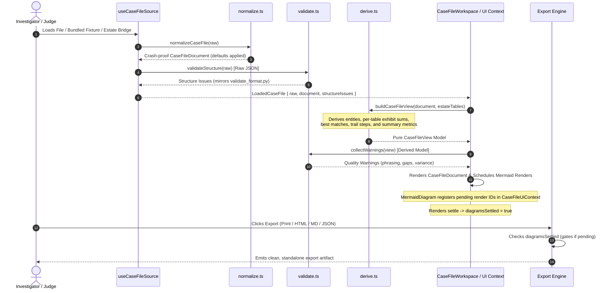

# Forensic Case File Viewer & Export Engine

[← Back to Frontend Documentation](../README.md) | [Master Architecture](../../README.md) | [Agent Routing Index](../../index.md)

---

## 1. Module Overview & Core Responsibilities

The `frontend/case-file-viewer` module powers the primary forensic investigation dossier at `/investigate` (`frontend/app/investigate/page.tsx`). Conforming strictly to the judges' data contract defined in [`student-materials/forensic-auditor/submission_schema.json`](../../../student-materials/forensic-auditor/submission_schema.json) and [`case_file_structure.md`](../../../student-materials/forensic-auditor/case_file_structure.md), it renders a full forensic dossier styled after an institutional audit workpaper.

### Core Responsibilities
1. **Dossier Presentation & Section Ordering**: Implements the required 5-section courtroom audit structure:
   - **Section 1: Header & Audit Telemetry** (`CaseHeader.tsx`): Company identification, tax ID (RFC), audit period, random seed, token/LLM call counts, MXN compute cost, wall-clock time, and run determinism.
   - **Section 2: Executive Summary** (`ExecutiveSummary.tsx`): Standalone plain-language narrative, synoptic card metrics (total findings count, exposure sum in MXN, evidentiary confidence breakdown, and count of investigated/declined leads).
   - **Section 3: Validated Findings** (`FindingSection.tsx`): Detailed workpaper cards per accusation including entity IDs, statutory scheme type, legal rule broken citation, peso amount, 2-state evidentiary confidence, narrative, money trail diagram/timeline, exhibit schedule, per-table reconciliation arithmetic, and adversarial review.
   - **Section 4: Leads Investigated and Closed** (`LeadsNotPursued.tsx`): Disclosure of non-accusatory leads investigated and closed without charges, complete with closure reason, signal, tools invoked, closing agent role, and interactive search/category filters.
   - **Section 5: Method and Limits** (`MethodAndLimits.tsx`): Explicit disclosure of system architecture, out-of-scope transactions, fraud types undetectable by the algorithms, and reproducibility steps.
2. **Dual-Path Data Pipeline (Normalization & Strict Validation)**:
   - **Lenient Normalization** (`lib/caseFile/normalize.ts`): Sanitizes arbitrary JSON input into a crash-proof `CaseFileDocument` with safe defaults for missing or malformed fields.
   - **Strict Offline Validation** (`lib/caseFile/validate.ts`): TypeScript port of `validate_format.py::validate_structure` that operates on raw JSON to emit errors identical to judges' offline checks.
   - **Renderer Quality Warnings** (`lib/caseFile/validate.ts::collectWarnings`): Surfaces heuristic warnings for missing optional sections, statistical rather than legal rule citations, disconnected money trails, and reconciliation variances.
3. **Pure Deterministic Derivation** (`lib/caseFile/derive.ts`): Computes display models, entity resolution, money trail step linkages, exhibit anchors, and per-table reconciliation math without side effects or non-deterministic date/random calls.
4. **Interactive Money Trail Rendering** (`MermaidDiagram.tsx`, `lib/caseFile/mermaid.ts`): Renders directed transaction flowcharts (`flowchart LR`) using browser-side Mermaid compilation (pinned to `11.17.2`), serializing renders to avoid race conditions and falling back automatically to generated graphs if run-supplied syntax fails.
5. **Multi-Format Export Engine** (`ExportToolbar.tsx`, `lib/caseFile/toHtml.ts`, `lib/caseFile/toMarkdown.ts`, `lib/caseFile/download.ts`): Generates 4 zero-roundtrip outputs (Print/PDF, standalone self-contained HTML with embedded JSON, clean Markdown with ````mermaid` blocks, and formatted source JSON) gated by diagram render completion.

---

## 2. Architecture & Component Hierarchy

### 2.1 Component Flow & Layout Diagram

```mermaid
flowchart TD
    Page["app/investigate/page.tsx<br/>(Route Entry Point)"]
    
    subgraph WorkspaceShell ["CaseFileWorkspace.tsx"]
        AppBar["InvestigateAppBar.tsx<br/>(Global Navigation & Reset)"]
        
        SourcePanel["CaseFileSourcePanel.tsx<br/>• Fixture Picker (sample/no-findings/edge-cases)<br/>• Local JSON Drag & Drop<br/>• SQLite .db / CSV Ingestion Bridge<br/>• Live SSE Streaming Modal"]
        
        subgraph ActiveDossier ["CaseFileUiProvider Context Scope"]
            Toolbar["ExportToolbar.tsx<br/>• Source & Format Check Chips<br/>• Expand / Collapse All<br/>• Print, HTML, Markdown, JSON"]
            ValidationView["ValidationPanel.tsx<br/>(Full Error & Warning Inspector)"]
            
            subgraph DocumentTree ["CaseFileDocument.tsx (#case-file-document)"]
                Header["1. CaseHeader.tsx<br/>(Telemetry, Determinism Badge)"]
                Nav["Table of Contents Nav"]
                ExecSummary["2. ExecutiveSummary.tsx<br/>(Narrative + 4 Synoptic Cards)"]
                
                subgraph FindingsList ["3. Findings (FindingSection.tsx)"]
                    Heading["Collapsible Header<br/>• EntityId.tsx<br/>• SchemeTypeBadge.tsx<br/>• ConfidenceBadge.tsx"]
                    Rule["RuleBrokenCallout.tsx<br/>(Statutory Article / NIF Note)"]
                    Amount["AmountConfidence.tsx<br/>(Courtroom Read Typography)"]
                    Narrative["FindingNarrative.tsx<br/>(Word Limit Checker)"]
                    
                    subgraph MoneyTrailView ["MoneyTrail.tsx"]
                        Mermaid["MermaidDiagram.tsx<br/>(Compiled SVG Graph)"]
                        Timeline["MoneyTrailTimeline.tsx<br/>(Step Sequence & Broken Links)"]
                    end
                    
                    Schedule["ExhibitsTable.tsx<br/>(Workpaper Schedule & Estate Check)"]
                    Recon["ReconciliationBlock.tsx<br/>(Per-Table Arithmetic & Delta)"]
                    Adversarial["AdversarialReview.tsx<br/>(Challenger vs Defense Careo)"]
                end
                
                Leads["4. LeadsNotPursued.tsx<br/>(Searchable Declined Leads Table)"]
                Limits["5. MethodAndLimits.tsx<br/>(Scope & Reproducibility)"]
            end
        end
    end

    Page --> WorkspaceShell
    WorkspaceShell --> AppBar
    WorkspaceShell -->|!loaded| SourcePanel
    WorkspaceShell -->|loaded| Toolbar
    WorkspaceShell -->|loaded| ValidationView
    WorkspaceShell -->|loaded| DocumentTree
    DocumentTree --> Header
    DocumentTree --> Nav
    DocumentTree --> ExecSummary
    DocumentTree --> FindingsList
    FindingsList --> Heading
    FindingsList --> Rule
    FindingsList --> Amount
    FindingsList --> Narrative
    FindingsList --> MoneyTrailView
    MoneyTrailView --> Mermaid
    MoneyTrailView --> Timeline
    FindingsList --> Schedule
    FindingsList --> Recon
    FindingsList --> Adversarial
    DocumentTree --> Leads
    DocumentTree --> Limits
```



### 2.2 Data Pipeline Lifecycle



---

## 3. Key Components & Implementation Directory

### 3.1 Component Catalog (`frontend/components/case-file/`)

| Component | Lines | Responsibility |
| :--- | :--- | :--- |
| `CaseFileWorkspace.tsx` | 91 | Primary orchestrator at `/investigate`. Subscribes to `InvestigateSessionProvider`, runs derivation, controls validation drawer, and updates document title to `case-file-seed-<seed>`. |
| `CaseFileDocument.tsx` | 101 | Root print/export paper container (`#case-file-document`, `.case-paper`). Assembles sections 1–5 in required sequence with contents navigation. |
| `CaseFileSourcePanel.tsx` | 317 | Ingestion hub for blank workspace. Supports fixture selection (`sample`, `no-findings`, `edge-cases`), drag-drop JSON/DB/CSV, live SSE audit modal trigger, and API loading. |
| `CaseFileUiContext.tsx` | 85 | Scoped React Context tracking section expand/collapse states and diagram rendering statuses (`diagramsSettled` gating for exports). |
| `CaseHeader.tsx` | 90 | Task 1 header: company name, RFC, audit period dates, metric cards (seed, LLM calls, MXN cost, wall-clock seconds, determinism badge), and cost-by-role chips. |
| `ExecutiveSummary.tsx` | 64 | Task 2 summary: plain-language synopsis narrative accompanied by 4 synoptic metric cards (Findings, Confidence, Exposure, Closed Leads). |
| `FindingSection.tsx` | 99 | Wrapper for each validated accusation (Tasks 3–10) in an institutional collapsible container with workpaper ID (`F-01`). |
| `RuleBrokenCallout.tsx` | 38 | Task 4 legal alert callout with distinct left border. Emphasizes cited article, authority, code, and exact statutory quotation. |
| `AmountConfidence.tsx` | 30 | Task 5 financial callout: displays high-visibility peso sum in courtroom typography alongside confidence badge. |
| `FindingNarrative.tsx` | 27 | Task 6 narrative presentation: displays plain-language finding narrative with dev-only 150-word count monitor. |
| `MoneyTrail.tsx` | 88 | Task 7 container: embeds the compiled Mermaid diagram, zoom toggles (Fit / 100%), source inspector drawer, and step timeline. |
| `MermaidDiagram.tsx` | 87 | Compiles Mermaid diagram strings to inline SVGs. Tries primary run-supplied source first, falls back to generated source on failure, and reports settlement to UI context. |
| `MoneyTrailTimeline.tsx` | 67 | Step-by-step numbered breakdown beneath diagram linking source/target accounts, amounts, dates, and clickable exhibit references. Flags breaks in fund flow. |
| `ExhibitsTable.tsx` | 131 | Task 8 exhibit schedule workpaper table. Features record IDs, source tables, evidentiary notes, duplicate flags, and live estate verification badges. |
| `ReconciliationBlock.tsx` | 88 | Task 9 arithmetic table: verifies claimed amount equals cited exhibit sum within 2% tolerance. Displays delta, percentage variance, and per-table breakdown. |
| `AdversarialReview.tsx` | 39 | Task 10 two-panel "careo": side-by-side juxtaposition of challenger defense argument against evidence justifying why the finding held. |
| `LeadsNotPursued.tsx` | 208 | Task 11 table: catalog of investigated and dismissed leads with quick-filter inputs (search query, closing role, closure category). |
| `MethodAndLimits.tsx` | 94 | Task 12 disclosure: 4 collapsible sections detailing architecture, out-of-scope boundaries, undetectable fraud vectors, and reproducibility. |
| `ExportToolbar.tsx` | 173 | Task 13 sticky action bar: surfaces source labels, format check chips, estate status, expand/collapse toggles, and export triggers (Print, HTML, MD, JSON). |
| `ValidationPanel.tsx` | 61 | Screen-only diagnostic drawer rendering grouped errors and warnings reflecting `validate_format.py` rules. |
| `ConfidenceBadge.tsx` | 63 | Evidentiary certainty badge (`PROVEN`, `PROBABLE`, or invalid) available in compact (`sm`) and descriptive (`lg`) sizes. |
| `SchemeTypeBadge.tsx` | 35 | Translates machine enum values (`phantom_vendor`, etc.) to human titles while retaining raw code in DOM `data-scheme-type` attributes. |
| `EntityId.tsx` | 37 | Formats prefixed entity IDs (`RFC:...`, `EMP:...`) with resolved human names and warning badges for invalid/missing prefixes. |
| `Collapsible.tsx` | 47 | Print-safe collapsible disclosure: keeps children mounted in DOM with `hidden` attribute to ensure complete expansion during print and export. |
| `IssueNotice.tsx` | 42 | Dev-only inline alert banner displaying validation errors directly beneath the offending input field. |

---

### 3.2 Core Logic Libraries (`frontend/lib/caseFile/`)

| Module | Lines | Primary Purpose | Key Functions & Exports |
| :--- | :--- | :--- | :--- |
| `normalize.ts` | 222 | Lenient ingestion parser. Guarantees a fully typed `CaseFileDocument` by substituting nulls/empty arrays for missing properties without throwing. | `normalizeCaseFile(raw)`, `NormalizeResult` |
| `validate.ts` | 391 | 1:1 TypeScript port of `validate_format.py::validate_structure` plus renderer quality checks (`collectWarnings`). | `validateStructure(raw)`, `collectWarnings(view)`, `countWords(text)`, `pyRepr(val)` |
| `derive.ts` | 415 | Pure deterministic view model transformer. Resolves entities, builds trail views, and mirrors Python per-table reconciliation arithmetic. | `buildCaseFileView(doc, estate)`, `computePerTableSubtotals()`, `pickBestMatch()` |
| `mermaid.ts` | 119 | Serialized Mermaid SVG renderer with singleton configuration and deterministic ID generation (`polar-case-file`). Generates fallback flowcharts from trail steps. | `loadMermaid()`, `renderMermaidSvg()`, `buildMermaidFromTrail()` |
| `toHtml.ts` | 54 | Generates fully self-contained HTML export: inlines stylesheets, expands collapsibles, strips interactive chrome, and embeds original raw JSON. | `buildStandaloneHtml(params)`, `BuildStandaloneHtmlParams` |
| `toMarkdown.ts` | 292 | Generates GitHub-flavored Markdown dossier with embedded ````mermaid` syntax, formatted tables, and reconciliation summaries. | `buildCaseFileMarkdown(view, options)`, `BuildMarkdownOptions` |
| `download.ts` | 14 | Client-side in-memory text/blob download trigger using ephemeral object URLs. | `downloadTextFile(filename, content, mime)` |
| `constants.ts` | 112 | Schema constants, type guards, ID column mappings, display labels, threshold definitions (`MIN_EXHIBITS=3`, `MAX_NARRATIVE_WORDS=150`), and statutory legal catalog. | `SCHEME_LABELS`, `CONFIDENCE_COPY`, `CLOSED_BY_LABELS`, `RULE_CATALOG`, `ID_COLUMN` |

---

## 4. Source State Management (`useCaseFileSource.ts`)

The `useCaseFileSource` hook manages case file lifecycle across multiple ingestion avenues:

```typescript
export interface UseCaseFileSourceReturn {
  status: "idle" | "loading" | "ready" | "error";
  loaded: LoadedCaseFile | null;
  error: string | null;
  loadFixture: (id: FixtureId) => void;
  loadFile: (file: File) => Promise<void>;
  loadRaw: (raw: unknown, source: CaseFileSource) => void;
  loadFromApi: (caseId: string) => Promise<void>;
  reset: () => void;
}
```

### Ingestion Channels
1. **Bundled Fixtures (`loadFixture`)**:
   - `sample` (`fixtures/case-file.sample.json`): Realistic multi-finding case file (illustrative entities).
   - `no-findings` (`fixtures/case-file.no-findings.json`): Clean submission documenting investigated leads without accusations.
   - `edge-cases` (`fixtures/case-file.edge-cases.json`): Invalid dataset exercising exactly 10 schema errors for offline testing.
2. **Local File Upload (`loadFile`)**:
   - Validates `.json` extension, blocks database extensions (`.db`, `.sqlite`, `.csv`) with guidance to use the Data Estate page, and enforces `MAX_JSON_BYTES` (5 MB limit).
3. **Data Estate Handoff (`loadRaw`)**:
   - Allows `/investigate/data` or CSV parsers to pass a parsed JSON object directly into the case file state without disk serialization.
4. **Backend API Proxy (`loadFromApi`)**:
   - Enabled when `NEXT_PUBLIC_CASE_FILE_API=enabled`. Queries `GET /api/v1/investigations/{case_id}/case-file` with an explicit 15s timeout and abort controller.

---

## 5. Evidentiary Standards, Schemas & Edge Cases

### 5.1 Data Contract Superset
The case file viewer accepts a superset of `student-materials/forensic-auditor/submission_schema.json`:
- **Load-Bearing Fields** (Validated strictly by `validate_format.py`):
  - `seed`: Integer.
  - `findings`: Array with `scheme_type`, `entities` (prefixed `RFC:` or `EMP:`), `narrative` (≤ 150 words), `rule_broken`, `peso_amount` (> 0), `confidence` (`proven` | `probable`), and `exhibits` (≥ 3 items).
  - `exhibits`: Array with `exhibit_id`, `source_table`, `record_id`, `note`.
  - `leads_not_pursued`: Array with `entity`, `signal`, `reason`, and optional `closed_by`.
  - `run_metadata`: Object with `llm_calls`, `mxn_cost`, `wall_clock_seconds`.
- **Frontend Extension Fields** (Optional metadata rendered gracefully if present, with deterministic fallbacks if omitted):
  - `header`: Audit metadata (falls back to "not reported").
  - `executive_summary`: Plain narrative (falls back to derived synthesis from findings).
  - `rule_detail`: Authority, article, legal text citation (matched against `RULE_CATALOG` if code is provided).
  - `mermaid_source`: Raw Mermaid graph (falls back to graph auto-generated from `money_trail`).
  - `reconciliation`: Backend variance breakdown (falls back to derived exhibit math or live SQLite estate matching).
  - `adversarial_review`: Challenger position and rebuttal (falls back to "No adversarial review was recorded").
  - `method_and_limits`: Scope and reproducibility documentation (falls back to "Not provided").

### 5.2 Confidence Badge Color Metrics
Evidentiary certainty badges reflect high-contrast forensic status tokens:
- **`proven`**: `bg-evidence-proven` (`#8E1B1F`, deep crimson). Accompanied by a `Gavel` icon. Standard: Complete documentary evidence and fully traced funds.
- **`probable`**: `bg-evidence-probable` (`#9A5A06`, amber). Accompanied by a `TriangleAlert` icon. Standard: Serious documented inconsistencies; secondary record missing.
- **`null` / No Findings**: `bg-evidence-neutral-soft` (`#ECEAE5`, neutral slate). Label: `NO FINDINGS`.
- **Invalid String**: Emits an alert badge with `border-evidence-proven` indicating non-schema confidence text.

### 5.3 Per-Table Reconciliation Math
Amounts are never summed across disparate tables (e.g., an invoice and the bank transfer settling it represent the same pesos seen twice). Per `validate_format.py::validate_against_estate`:
1. Subtotals are accumulated strictly by source table (`invoices.total`, `bank_txns.amount`, `purchase_orders.amount`, `contracts.value`).
2. The best-matching table is chosen by minimizing `|claimed_pesos - table_subtotal|` (ties resolve to the first table encountered).
3. The finding reconciles if `|claimed_pesos - matched_subtotal| <= 0.02 * max(matched_subtotal, 1)`.

---

## 6. Export Engine Specifications

The Export Engine (`ExportToolbar.tsx`) provides four distinct export formats constructed directly in the browser:

```text
Export Pipeline Overview
├── Print / PDF: window.print() + @media print CSS rules
├── Standalone HTML: DOM clone + inlined CSS + embedded JSON payload
├── Markdown (.md): Deterministic text builder + ```mermaid blocks
└── Source JSON: Formatted raw submission string
```

### 6.1 Print / PDF Formatting (`globals.css`)
- Triggered by `window.print()`.
- Interactive chrome is stripped using `[data-print="hide"]`.
- Forces open all collapsed sections (`[data-collapsible-body][hidden] { display: block !important; }`) and unhides filtered table rows (`tr[data-filterable-row][hidden]`).
- Enforces clean pagination: `section[data-finding-section] + section[data-finding-section] { break-before: page; }`.
- Prevents table split breaks via `.case-avoid-break { break-inside: avoid; }`.

### 6.2 Standalone HTML Export (`lib/caseFile/toHtml.ts`)
- Deep-clones the `#case-file-document` DOM node.
- Removes all interactive and print-hidden elements (`[data-export="exclude"]`, `[data-print="hide"]`).
- Force-opens all collapsed elements.
- Extracts and inlines all active CSS rules from `document.styleSheets`.
- Embeds the original submission JSON inside a `<script type="application/json" id="case-file-data">` tag.
- Output is completely self-contained with no external CDN or network requests.

### 6.3 Markdown Dossier (`lib/caseFile/toMarkdown.ts`)
- Deterministic string compilation matching GitHub-flavored Markdown standards.
- Preserves the exact rendered Mermaid source inside fenced ````mermaid` blocks.
- Emits structured markdown tables for Header telemetry, Synoptic summary, Money trail steps, Exhibits schedule, and Declined leads.

### 6.4 Export Readiness Gating (`diagramsSettled`)
To guarantee that exported documents never contain missing diagrams or half-rendered SVG states, export buttons in `ExportToolbar.tsx` remain disabled until `diagramsSettled` is `true` in `CaseFileUiContext`.

---

## 7. Quality Assurance & Offline Verification

### Offline Format Checking
The format validation in `lib/caseFile/validate.ts` is verified against the official Python evaluator using checked-in fixtures:

```bash
# Verify valid sample passes
python -X utf8 student-materials/forensic-auditor/validate_format.py --submission frontend/fixtures/case-file.sample.json

# Verify zero-findings sample passes
python -X utf8 student-materials/forensic-auditor/validate_format.py --submission frontend/fixtures/case-file.no-findings.json

# Verify edge-cases fixture flags exactly 10 errors
python -X utf8 student-materials/forensic-auditor/validate_format.py --submission frontend/fixtures/case-file.edge-cases.json
```

### TypeScript Quality & Build Verification
```bash
cd frontend
# Non-emitting strict typecheck
npx --no-install tsc --noEmit --incremental false

# Production bundle build
npm run build
```
