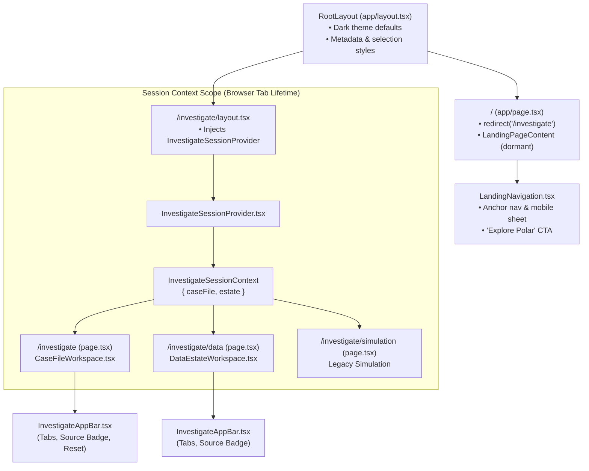
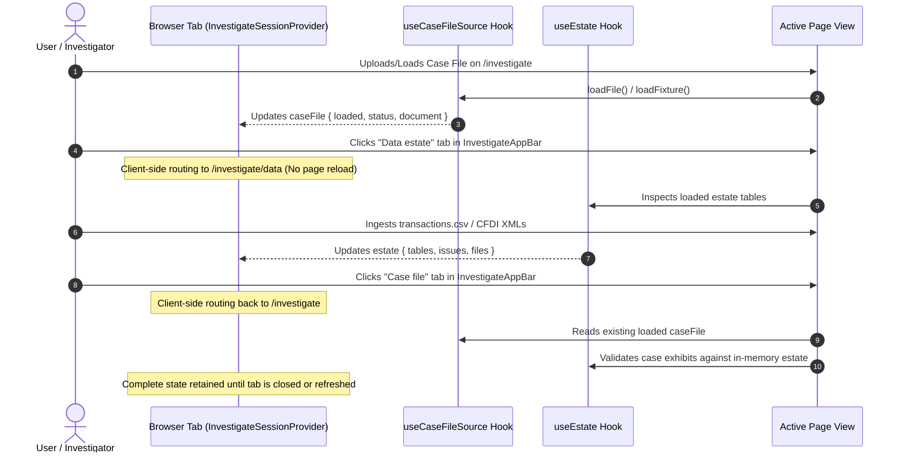

# Frontend Core Shell, Shared Navigation & Foundations

[← Back to Frontend Documentation](../README.md) | [Master Architecture](../../README.md) | [Agent Routing Index](../../index.md)

---

## 1. Module Overview & Core Responsibilities

The `frontend/core-shell-and-shared` module provides the architectural backbone and common foundations of the Polar web application. Built on **Next.js 14 App Router**, **React 18**, and **Tailwind CSS 3**, it establishes:

1. **Root App Shell & Global Layout** (`frontend/app/layout.tsx`): Configures HTML root metadata, English locale defaults, font smoothing, and global dark-theme selection highlights.
2. **Landing Page & Direct Entry Routing** (`frontend/app/page.tsx`, `frontend/components/LandingNavigation.tsx`): Implements the Polar marketing and capabilities showcase, paired with an intentional root redirect (`redirect("/investigate")`) prioritizing direct investigator workflow access.
3. **Cross-View In-Tab Session State** (`frontend/components/investigate/InvestigateSessionProvider.tsx`): A React Context provider that unifies the active Case File (`useCaseFileSource`) and the loaded in-browser Data Estate (`useEstate`). This state survives navigation between `/investigate` and `/investigate/data` within the same tab without server-side persistence.
4. **Investigation Navigation Chrome** (`frontend/components/investigate/InvestigateAppBar.tsx`): The persistent top application bar across forensic workflows, supplying tab switching between **Case file** and **Data estate**, displaying active source badges, and offering a reset action and link to the legacy simulation.
5. **Brand Identity & Visual Metaphor** (`frontend/components/PolarLogo.tsx`, `frontend/components/PolarMark.tsx`, `frontend/lib/brand.ts`): The Polar logo — a two-tone iceberg (white tip above the waterline, blue submerged body) beside the "polar" wordmark — representing Polar's core mission: revealing the 90% of connected financial crime hidden beneath the surface. The vector paths were traced from the supplied logo artwork and live in `lib/brand.ts`; `app/icon.svg` reuses the mark as the favicon.
6. **Drag-and-Drop Ingestion UI** (`frontend/components/FileUpload.tsx`): Reusable drag-and-drop file upload target handling CSV validation, 5-file and 20 MB size limits, error feedback, and visual progress states.
7. **Dark Forensic Design System** (`frontend/tailwind.config.js`, `frontend/app/globals.css`): A custom Tailwind palette containing dark slate background scales, brand ice-blues, alert statuses, high-contrast "paper" styles for forensic printing/exhibits, and print media optimizations.
8. **Shared Utilities & Canonical Typing** (`frontend/lib/utils.ts`, `frontend/types/investigation.ts`): CSS class composition (`cn`), Mexican Peso currency formatting (`formatCurrencyMXN`), and wire-accurate TypeScript interfaces with runtime guards for Server-Sent Events (SSE) and graph structures.

---

## 2. Architecture & Layout Diagrams

### 2.1 App Shell & Routing Hierarchy

The Next.js 14 App Router organizes page routes and layout nesting. Route group `/investigate` injects the shared session context across all investigative sub-routes.



---

### 2.2 Shared Session State Flow (`InvestigateSessionProvider`)

State loaded in either `/investigate` (e.g. an uploaded JSON case file) or `/investigate/data` (e.g. an uploaded SQLite database or CSVs) is maintained simultaneously in browser memory:



---

## 3. Key Components & Shared Utilities

| File / Path | Primary Responsibility | Key Exports & Symbols |
| :--- | :--- | :--- |
| `frontend/app/layout.tsx` | HTML document shell, viewport metadata, OpenGraph tags, root fonts, and global selection styling. | `metadata`, `RootLayout(props)` |
| `frontend/app/page.tsx` | Root landing page with hero, platform preview, capabilities, workflow steps, and redirect to `/investigate`. | `default Home()`, `LandingPageContent()` |
| `frontend/components/LandingNavigation.tsx` | Sticky navigation bar for marketing landing page with anchor links, keyboard Escape handler, and mobile drawer. | `LandingNavigation` |
| `frontend/components/investigate/InvestigateAppBar.tsx` | Top navigation bar for forensic workspace; renders tab switchers (`/investigate` vs `/investigate/data`), active file badge, and reset action. | `InvestigateAppBar`, `InvestigateAppBarProps` |
| `frontend/components/investigate/InvestigateSessionProvider.tsx` | In-memory React context binding `useCaseFileSource` and `useEstate` across investigation views within a browser tab. | `InvestigateSessionProvider`, `useInvestigateSession()` |
| `frontend/components/PolarLogo.tsx` | Full Polar lockup (iceberg mark + "polar" wordmark) used in the app bars and the landing header/footer. Decorative SVG (`aria-hidden`) sized by height (`h-7 w-auto`); the wrapping link carries the accessible name. | `PolarLogo` |
| `frontend/components/PolarMark.tsx` | Iceberg mark alone (white tip above the waterline, blue submerged body) for icon-only placements such as the landing CTA. | `PolarMark` |
| `frontend/lib/brand.ts` | Logo path data and brand colors (`#4DA8DF` blue, `#FDFDFD` ice) shared by `PolarLogo` and `PolarMark`; `app/icon.svg` mirrors the mark paths. | `POLAR_BRAND_COLORS`, `POLAR_LOGO_VIEWBOX`, `POLAR_MARK_VIEWBOX`, `POLAR_MARK_CAP_PATH`, `POLAR_MARK_BASE_PATH`, `POLAR_WORDMARK_PATH` |
| `frontend/components/FileUpload.tsx` | Drag-and-drop file upload target with multi-file management, size threshold enforcement, and simulation warnings. | `FileUpload`, `FileUploadProps` |
| `frontend/lib/utils.ts` | Shared helper routines for class name merging and forensic currency/number formatting. | `cn()`, `formatCurrencyMXN()`, `formatPesos()`, `formatSeconds()`, `formatInteger()` |
| `frontend/types/investigation.ts` | TypeScript schemas and runtime validation guards for backend SSE events, graph subgraphs, and metrics. | `ThoughtEvent`, `VerdictEvent`, `UploadResponse`, `isThoughtEvent()`, `isVerdictEvent()`, `isUploadResponse()` |
| `frontend/next.config.js` | Next.js configuration providing client-side fallback stubs (`fs`, `path`, `crypto`) for `sql.js` browser bundling. | `nextConfig` |
| `frontend/tailwind.config.js` | Extended design tokens: dark forensic surfaces, ice brand palette, paper report theme, and subtle grid patterns. | `module.exports` (Tailwind Config) |

---

## 4. Design System & Theming Specifications

Polar adopts a **dark forensic terminal** aesthetic for analysis, contrasted with a clean **paper document** aesthetic for case files and printed exhibits.

### 4.1 Color Token Architecture (`tailwind.config.js`)

```text
Dark Forensic Palette (Workspace UI)
├── background: #080A0D         (Canvas backdrop)
├── surface: #11151B            (Default card / container surface)
├── surface-deep: #0A0D11       (Inset areas, inputs, app bar)
├── surface-raised: #191F28     (Hover states, elevated cards)
├── surface-blue: #101C25       (Tinted alert / file drop zones)
├── surface-border: #293240     (Dividers and component borders)
├── foreground: #F2F6FA         (Primary high-contrast text)
└── muted: #A0ADBD              (Secondary / label text)

Brand Accents (The Polar Ice Theme)
├── brand.ink: #061017          (Deepest contrast text on cyan)
├── brand.50: #EAF7FF           (Subtle highlights)
├── brand.300: #A6DEFF          (Light ice accent)
├── brand.500: #79C7F5          (Polar primary cyan)
└── brand.600: #389DDD          (Action blue)

Paper & Exhibit Palette (Forensic Dossier & Print)
├── paper.DEFAULT: #FBFAF7      (Ivory paper background)
├── paper.raised: #F2EFE8       (Section headers & table head)
├── paper.border: #D8D2C6       (Subtle printed rules)
├── paper.ink: #161B22          (Dark neutral document typography)
└── paper.muted: #5A6270        (Document metadata and footnotes)

Evidence Classification Status
├── evidence.proven: #8E1B1F / proven-soft: #F6E1DF        (Direct evidence / critical)
├── evidence.probable: #9A5A06 / probable-soft: #FBEBD2    (Inferred / circumstantial)
├── evidence.reconciled: #1E6A3B / reconciled-soft: #DFF0E3 (Audited / verified)
├── evidence.held: #1C4F8C / held-soft: #E2EBF6            (Under review / held)
└── evidence.neutral: #4B5563 / neutral-soft: #ECEAE5      (Unclassified baseline)
```

### 4.2 Global Styles & Print Optimization (`frontend/app/globals.css`)

- **Component Utility Classes**:
  - `.app-button`: Standard elevated interactive button (`min-h-11`, border, hover transitions).
  - `.app-primary`: High-visibility cyan brand button (`bg-brand-500`, `text-brand-ink`).
  - `.app-icon-button`: Fixed 44x44px accessible touch/click target for toolbar actions.
- **Accessibility & Focus**:
  - Focus rings enforce `2px solid #79c7f5` with `3px` offset on interactive elements.
  - Full motion reduction support via `@media (prefers-reduced-motion: reduce)` dampening animations to `0.01ms`.
- **Print Optimization Rules** (`@media print`):
  - Inverts canvas to pure white (`#ffffff`) and hides navigation bars using `[data-print="hide"]`.
  - Automatically expands collapsed sections (`[data-collapsible-body][hidden]` set to `display: block !important`).
  - Implements page break avoidance on exhibits and table rows (`break-inside: avoid`).
  - Injects page breaks between distinct finding sections (`section[data-finding-section] + section[data-finding-section] { break-before: page; }`).

---

## 5. Shared Utilities & Wire Data Contracts

### 5.1 Utility Helpers (`frontend/lib/utils.ts`)

```typescript
// Merge Tailwind class names without specificity collision
cn(...inputs: ClassValue[]): string

// Format monetary floats into Mexican Pesos (MXN) with proper es-MX grouping
formatCurrencyMXN(amount: number): string
// Output: "$1,250,400.50"

// Currency string with explicit currency code suffix
formatPesos(amount: number): string
// Output: "$1,250,400.50 MXN"

// Format execution durations in seconds
formatSeconds(seconds: number): string
// Output: "3.4s"

// Format integer counts with standard thousands separators
formatInteger(value: number): string
// Output: "14,892"
```

### 5.2 Wire Data Contracts (`frontend/types/investigation.ts`)

The wire contracts define the JSON shapes streamed by the FastAPI backend over Server-Sent Events (`GET /api/v1/investigations/{case_id}/stream`) and returned by the ingestion endpoint:

```typescript
// SSE Thought Event payload (repeated reasoning emissions)
export interface ThoughtEvent {
  step: number;
  phase: string;
  message: string;
  timestamp: string;
  event_id?: string;
  agent_id?: AgentId;        // "ORCHESTRATOR" | "DATA_VALIDATION" | "CIRCULAR_FLOWS" | ...
  action?: ReviewAction;     // "started" | "tool" | "finding" | "synthesizing" | ...
  source?: ReviewSource;     // "DETERMINISTIC" | "EXTERNAL" | "SIMULATION"
  evidence_refs?: EvidenceRef[];
  headline?: string;
  metric?: string;
  tool_call?: ThoughtToolCall;
}

// SSE Verdict Event payload (terminal emission)
export interface VerdictEvent {
  case_id: string;
  risk_level: "CRÍTICO" | "ALTO" | "MEDIO" | "BAJO";
  fraud_type: string;
  total_amount_mxn: number;
  confidence_score: number | null;
  source?: ReviewSource;
  assessment_status?: "SUSPICIOUS_PATTERNS_DETECTED" | "NO_PATTERNS_DETECTED";
  entities_involved: string[];
  pruned_leads_count: number;
  patterns_summary: VerdictPatternsSummary;
  legal_recommendation: string;
  audit_summary_text: string;
  completed_at: string;
}
```

Runtime validator functions (`isThoughtEvent`, `isVerdictEvent`, `isUploadResponse`) perform defensive type-checking on incoming JSON payloads to ensure corrupted or malformed SSE frames do not trigger client unhandled exceptions.

---

## 6. Configuration & Tooling

### 6.1 Webpack Node Module Fallbacks (`frontend/next.config.js`)

The in-browser SQLite engine (`sql.js`) contains legacy Node.js UMD probes for `fs`, `path`, and `crypto`. Next.js webpack configuration explicitly disables these on client builds to prevent bundling failures:

```javascript
webpack: (config, { isServer }) => {
  if (!isServer) {
    config.resolve.fallback = {
      ...config.resolve.fallback,
      fs: false,
      path: false,
      crypto: false,
    };
  }
  return config;
}
```

### 6.2 SQLite WASM Asset Synchronization (`package.json`)

To enable client-side SQLite execution without dynamic CDN downloads, the WebAssembly binary must exist in Next.js's static `public/` directory:

- **Command**: `npm run copy:sqlwasm`
- **Script**: `node -e "require('fs').mkdirSync('public',{recursive:true});require('fs').copyFileSync('node_modules/sql.js/dist/sql-wasm-browser.wasm','public/sql-wasm.wasm')"`
- **Hooks**: Automatically invoked as `predev` and `prebuild` steps before `next dev` or `next build` execute.

### 6.3 Environment Variables

| Variable | Client Visibility | Default | Purpose |
| :--- | :--- | :--- | :--- |
| `NEXT_PUBLIC_API_URL` | Public (Client + SSR) | `http://localhost:8000` | Target URL for backend FastAPI endpoints and SSE streams. |
| `NEXT_PUBLIC_CASE_FILE_API` | Public (Client) | `disabled` | Feature flag enabling direct backend fetching of judged case files (`/api/v1/investigations/{id}/case-file`). |
| `NEXT_PUBLIC_ESTATE_UPLOAD_API` | Public (Client) | `disabled` | Feature flag exposing remote export of in-browser data estates to the backend. |

---

## 7. Edge Cases, Gotchas & Operational Invariants

1. **Root Path Redirection**:
   `app/page.tsx` executes an immediate Next.js server redirection:
   ```typescript
   export default function Home() {
     redirect("/investigate");
   }
   ```
   The full landing page is retained in `LandingPageContent()` in the same file and can be restored by returning it directly from `Home()`.

2. **Transient In-Tab Session Persistence**:
   The `InvestigateSessionProvider` relies entirely on React state held in the browser's memory.
   - **Maintained**: Tab navigation between `/investigate` (Case file) and `/investigate/data` (Data estate).
   - **Lost**: Hard page refreshes (`F5`), browser tab closures, or new window creation reset both the loaded case file and data estate. This is an intentional security design ensuring sensitive forensic data does not persist unencrypted in `localStorage`.

3. **Anchored `.gitignore` Sensitivity**:
   Because `frontend/lib/utils.ts` and `frontend/app/investigate/data/` share names with common ignore patterns (`lib/`, `data/`), all root `.gitignore` entries must remain anchored to the root (`/lib/`, `/data`) to prevent git from dropping frontend source files.

4. **File Upload Invariants (`FileUpload.tsx`)**:
   - Accepts strictly `.csv` files.
   - Batch count enforced at `1 <= count <= 5`.
   - Aggregate payload capped at 20 MB (`20 * 1024 * 1024` bytes).
   - Displays clear visual disclaimers indicating browser-side simulation behavior when running in mock modes.
