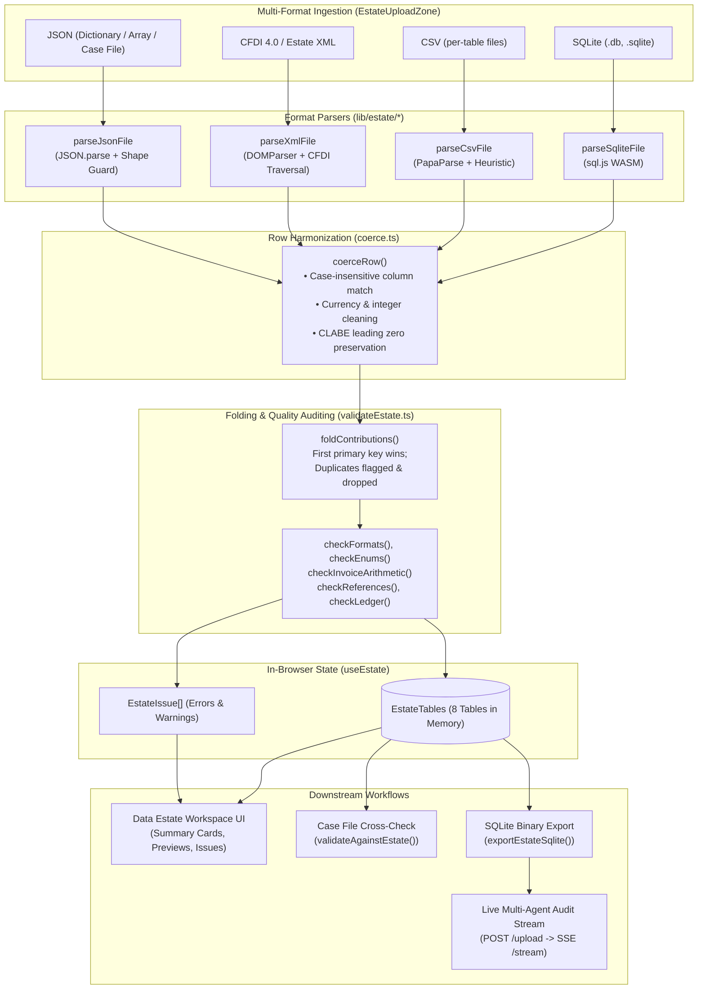
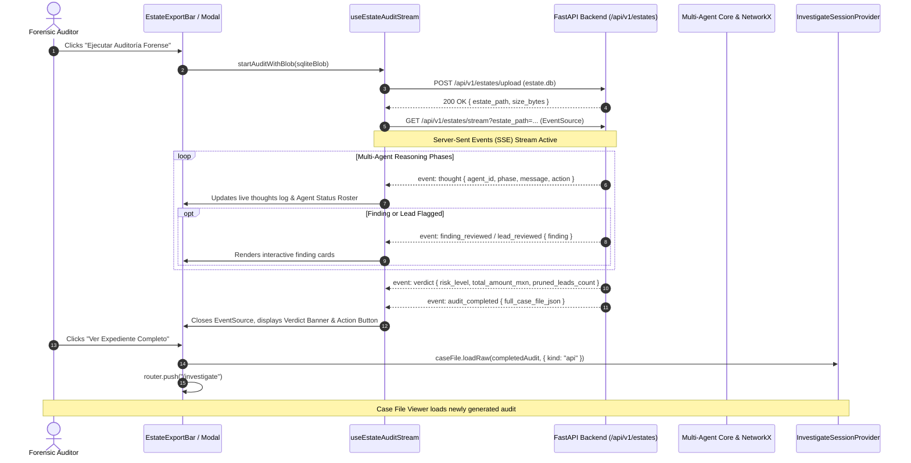

# In-Browser Data Estate Workspace (`frontend/data-estate`)

[← Back to Frontend Documentation](../README.md) | [Master Architecture](../../README.md) | [Agent Routing Index](../../index.md)

---

## 1. Module Overview & Core Responsibilities

The **Data Estate Workspace** (`frontend/app/investigate/data/page.tsx` rendering `frontend/components/estate/DataEstateWorkspace.tsx`) is Polar's in-browser financial data ingestion, normalization, exploration, and verification tier. Operating at the route `/investigate/data`, it provides forensic investigators with an isolated environment to load, inspect, validate, and query target company data estates without sending sensitive raw financial files to any remote server.

### Core Capabilities

1. **Zero-Server Privacy & In-Browser SQL Execution**:
   - Ingests raw financial artifacts entirely in browser memory using **WebAssembly SQLite** (`sql.js` 1.14.2).
   - Guarantees data confidentiality: raw ledgers, employee payrolls, banking records, and vendor catalogs never persist on the backend or survive browser reload unless the user explicitly triggers an automated audit stream.
2. **Multi-Format Ingestion Engine** (`frontend/lib/estate/*`):
   - **SQLite Databases** (`.db`, `.sqlite`, `.sqlite3`): Validated via magic bytes (`SQLite format 3\0`) and extracted across the 8 standard forensic tables.
   - **Delimited CSVs** (`.csv`): High-performance streaming via `PapaParse`, UTF-8 BOM removal, automated table detection via filename patterns or column-ratio heuristics, and user-driven manual assignment for ambiguous schemas.
   - **CFDI 4.0 XML & Estate XML** (`.xml`): Direct DOM parsing of Mexican electronic fiscal vouchers (`Comprobante`, SAT UUID extraction, IVA 002 reconciliation, Serie/Folio fallback) as well as structured multi-table XML estates.
   - **JSON Datasets & Case Files** (`.json`): Intelligent shape differentiation routing between full Case File JSON documents (routed directly to the case file viewer), multi-table dictionaries, and table-named record arrays.
3. **Strict Schema Harmonization & Content Validation** (`estate_schema.sql`):
   - Mirrors the official competition specification across the **8 canonical tables**: `vendors`, `invoices`, `ledger`, `bank_txns`, `purchase_orders`, `contracts`, `employees`, and `efos_list`.
   - Executes extensive content validation: Mexican Tax ID (RFC) syntax, 18-digit banking CLABE verification, ISO-8601 timestamps, Mexican fiscal enums (`PUE`/`PPD`, `vigente`/`cancelado`, `SPEI`), SAT Article 69-B blacklists (`efos_list`), 16% IVA arithmetic, and cross-table referential integrity.
4. **Case File Exhibit Cross-Examination**:
   - Acts as the browser-side counterpart to the offline Python validator (`validate_format.py::validate_against_estate`).
   - Cross-checks finding exhibits cited in loaded case files against the loaded estate, validating record existence and reconciling peso totals within a 2% tolerance threshold (`PESO_TOLERANCE = 0.02`).
5. **Real-Time Forensic Audit Streaming**:
   - Exports the normalized in-memory estate into an in-memory SQLite binary (`Uint8Array`), uploads the binary to the backend ingestion endpoint (`POST /api/v1/estates/upload`), and opens a Server-Sent Events (SSE) stream (`GET /api/v1/estates/stream`) inside a dedicated live modal (`EstateAuditStreamModal.tsx`), orchestrating live multi-agent deliberation. Honors `InvestigateSessionProvider.auditMode`: when set to `offline` the stream URL carries `n8n_url=offline`, which makes the backend skip every n8n call and run the deterministic engine only.

---

## 2. Architecture & Data Flow

### 2.1 Ingestion & Validation Pipeline

The client-side ingestion pipeline accepts arbitrary file collections, parses each file according to its format, coerces heterogeneous fields into typed columns, folds duplicate keys across sources, validates referential integrity, and updates the shared session context.



---

### 2.2 Live Multi-Agent Audit Sequence

When an investigator triggers **"Ejecutar Auditoría Forense (Live Stream)"** from the export bar, the in-memory estate is compiled into an official SQLite binary and streamed through the backend reasoning engine:



---

## 3. The 8 Canonical Estate Tables

The estate tables mirror `student-materials/forensic-auditor/estate_schema.sql` verbatim. Every Finding exhibit in a Polar case file references one of these 8 tables using `source_table` and `record_id`:

| Table Name | Primary Key | Mandatory Columns (`REQUIRED_COLUMNS`) | Amount Column (`AMOUNT_COLUMN`) | Primary Forensic Purpose |
| :--- | :--- | :--- | :--- | :--- |
| `vendors` | `rfc` | `rfc`, `legal_name` | — | Corporate identity, registered fiscal addresses, bank CLABE, business category. |
| `invoices` | `uuid` | `uuid`, `issuer_rfc`, `receiver_rfc`, `issue_date`, `total` | `total` | CFDI vouchers, 16% IVA breakdowns, payment methods (`PUE`/`PPD`), cancellation status. |
| `ledger` | `entry_id` | `entry_id`, `date`, `account_code` | `debit` / `credit` | Internal double-entry accounting records, cost centers, expense descriptions, approvers. |
| `bank_txns` | `txn_id` | `txn_id`, `date`, `amount` | `amount` | SPEI wire transfers, account-to-account CLABE trails, transaction timestamps, bank references. |
| `purchase_orders` | `po_id` | `po_id`, `vendor_rfc`, `amount` | `amount` | Procurement authorizations, vendor links, requisition amounts, approver identities. |
| `contracts` | `contract_id` | `contract_id`, `vendor_rfc`, `value` | `value` | Legal service agreements, vendor commitments, contract terms, scope text. |
| `employees` | `emp_id` | `emp_id`, `name`, `bank_clabe` | — | Internal staff records, corporate roles, payroll accounts (`EMP:####` format). |
| `efos_list` | `rfc` | `rfc`, `status` | — | Official SAT Article 69-B registry of shell companies (*Empresas que Facturan Operaciones Simuladas*). |

---

## 4. Key UI Components (`frontend/components/estate/*`)

The estate UI is organized into 8 modular client components styled with Polar's dark forensic palette:

| Component | Path | Core Responsibility |
| :--- | :--- | :--- |
| `DataEstateWorkspace` | `frontend/components/estate/DataEstateWorkspace.tsx` | Top-level workspace container. Connects to `InvestigateSessionProvider`, coordinates sample loading, handles file drops, exposes window debug tools in development, and renders the 5 estate sections. |
| `EstateUploadZone` | `frontend/components/estate/EstateUploadZone.tsx` | Accessible drag-and-drop zone and file picker. Enforces 50-file batch limits and 50 MB file thresholds. Provides buttons to load bundled illustrative samples, generate a fresh seeded dataset via `POST /api/v1/estates/generate-dataset` (downloads a ZIP with `estate.db` + `ground_truth.json`), or clear the estate. |
| `EstateFileList` | `frontend/components/estate/EstateFileList.tsx` | Comprehensive table of uploaded files displaying filename, detected format, row contribution counts, error/warning tallies, status badges, manual table assignment selectors (`AssignTableControl`), and deletion triggers. |
| `EstateTableSummary` | `frontend/components/estate/EstateTableSummary.tsx` | 8-card responsive metric grid (one per table). Summarizes row volume, error/warning counts, and calculated sums for amount-bearing columns ($\Sigma\text{ total}$, $\Sigma\text{ debit}$, $\Sigma\text{ amount}$, etc.). Clicking a card selects it for detailed preview. |
| `EstateTablePreview` | `frontend/components/estate/EstateTablePreview.tsx` | Paginated (50 rows/page) interactive table viewer. Supports global full-text search across all row columns, an "Only rows with issues" filter toggle, and inline cell warning/error highlighting. |
| `EstateIssuesPanel` | `frontend/components/estate/EstateIssuesPanel.tsx` | Grouped diagnostic log displaying all validation errors and warnings across the folded estate. Capped at 500 rows per group to maintain snappy DOM performance on large datasets. |
| `EstateExportBar` | `frontend/components/estate/EstateExportBar.tsx` | Bottom action bar. Houses triggers for downloading `estate.db` (SQLite binary) and `estate.json`, a navigation shortcut to the Case File Viewer, and the primary button launching `EstateAuditStreamModal`. |
| `EstateAuditStreamModal` | `frontend/components/estate/EstateAuditStreamModal.tsx` | Modal dialog for live SSE forensic audits. Features a 4-agent status bar (`DATA_VALIDATION`, `CIRCULAR_FLOWS`, `RISK_REVIEW`, `ORCHESTRATOR`), an autoscrolling thought stream, validated finding notifications, and a terminal verdict banner. |

---

## 5. Ingestion & Processing Libraries (`frontend/lib/estate/*`)

The `frontend/lib/estate/` directory houses the parsing, normalization, and verification engines:

### 5.1 SQLite & WebAssembly Engine (`sqlite.ts`)
- **Singleton WASM Loader (`loadSqlJs`)**: Dynamically imports `sql.js` and compiles the WebAssembly binary once, locating `/sql-wasm.wasm` on the local Next.js server.
- **Magic Byte Verification**: Verifies that SQLite files begin with the 16-byte header `"SQLite format 3\0"`. Rejects non-SQLite or encrypted files with `E_SQLITE_MAGIC`.
- **Database Ingestion (`parseSqliteFile`)**: Queries `sqlite_master` for available tables, iterates over `ESTATE_TABLE_ORDER`, runs `SELECT * FROM "<table>"`, coerces each row, and warns on missing or extraneous tables (`W_TABLE_MISSING`, `W_EXTRA_TABLE`).
- **Database Serialization (`exportEstateSqlite`)**: Constructs a fresh in-memory SQLite database, applies `ESTATE_DDL`, begins an explicit transaction (`BEGIN`), compiles parameterized insert statements (`INSERT INTO ... VALUES (?, ...)`), inserts all rows, commits (`COMMIT`), and returns the binary as a `Uint8Array`.

### 5.2 Type Coercion & Normalization (`coerce.ts`)
- **Case-Insensitive Resolution**: Trims and normalizes all incoming record keys to lowercase. Matches keys against schema column definitions, dropping unrecognized columns with `W_UNKNOWN_COLUMN` and filling omitted columns with `null` (`W_MISSING_COLUMN`). Deduplicates column-level warnings per file to prevent log flooding.
- **Value Coercion (`coerceValue`)**:
  - `TEXT`: Trims whitespace; converts empty strings to `null`. Converts numeric values to string while raising `W_CLABE_NUMERIC` if a bank CLABE column arrives as a number (warning the user that leading zeros may have been stripped).
  - `REAL`: Strips comma grouping separators from numeric strings (`"1,234,567.89"` $\rightarrow$ `1234567.89`), checks for `Number.isFinite()`, and flags invalid values with `E_TYPE`.
  - `INTEGER`: Coerces numeric strings and verifies `Number.isInteger()`. Rejects fractional values on integer fields (e.g. `ledger.entry_id`) with `E_TYPE`.

### 5.3 Specialized Format Parsers
- **CSV Ingestion (`parseCsvFile.ts`)**:
  - Uses `PapaParse` with `skipEmptyLines: "greedy"`.
  - Automatically removes UTF-8 Byte Order Marks (`^\ufeff`).
  - Table identification heuristic: Checks filename suffix first (`_vendors.csv`, `invoices.csv`). If inconclusive, evaluates header match ratio against `ESTATE_SCHEMA`: requires matching the table's primary key and achieving $\ge 60\%$ column overlap without ties.
  - If detection fails, marks file status as `needs_table` and holds raw arrays in `pendingCsv` for investigator assignment via `assignCsvTable()`.
- **JSON Ingestion (`parseJsonFile.ts`)**:
  - Checks if parsed JSON represents a Case File (`"findings"`, `"leads_not_pursued"`, or `"run_metadata"` present). If so, marks as `status: "case_file"` for direct handoff to the case file viewer.
  - Supports multi-table dictionary objects (`{ "vendors": [...], "invoices": [...] }`).
  - Supports bare record arrays whose table name matches the filename (`vendors.json`).
- **XML & CFDI Ingestion (`parseXmlFile.ts`)**:
  - Parses XML with native browser `DOMParser`.
  - **CFDI 4.0 (`Comprobante`)**: Traverses namespaces agnostically using `localName`. Extracts UUID from `Complemento > TimbreFiscalDigital` (falls back to `Serie + Folio`). Reads root-level `Impuestos > TotalImpuestosTrasladados` or sums `Traslado` entries where `Impuesto="002"` (IVA). Warns that CFDI XML files lack SAT cancellation status (`W_CFDI_STATUS_UNKNOWN`).
  - **Structured `<estate>` XML**: Reads `<estate>` documents containing `<vendors>`, `<invoices>`, etc.
  - **Single-Table XML**: Reads `<tableName><row>...</row></tableName>` structures.

### 5.4 Unified Dispatcher (`ingest.ts`)
- Dispatches uploaded `File` objects to the appropriate parser by file extension.
- Enforces system thresholds: rejects files exceeding `MAX_ESTATE_FILE_BYTES` (50 MB) or unsupported extensions.

### 5.5 Estate Validation & Folding (`validateEstate.ts`)
- **Contribution Folding (`foldContributions`)**: Combines rows from all `imported` files into unified table arrays. Uses a primary key set (`seenKeys`): the first occurrence of a primary key is preserved; subsequent duplicate keys are dropped with `E_DUPLICATE_PK`.
- **Format Verification**:
  - RFC syntax: `^[A-ZÑ&]{3,4}\d{6}[A-Z0-9]{3}$` on `vendors`, `efos_list`, `invoices`, `purchase_orders`, `contracts`.
  - CLABE syntax: `^\d{18}$` on `vendors`, `employees`, `bank_txns`.
  - Timestamp syntax: ISO-8601 regex on date columns.
  - Employee ID syntax: `^EMP:\d{4}$` on `employees.emp_id`.
- **Enum Conformance**:
  - `invoices.metodo_pago` $\in \{\text{"PUE"}, \text{"PPD"}\}$.
  - `invoices.status` $\in \{\text{"vigente"}, \text{"cancelado"}\}$.
  - `bank_txns.channel` $\in \{\text{"SPEI"}, \text{"cheque"}, \text{"efectivo"}\}$.
  - `efos_list.status` $\in \{\text{"definitivo"}, \text{"presunto"}\}$.
- **Financial & Accounting Arithmetic**:
  - IVA validation: Checks $|\text{iva} - 0.16 \times \text{subtotal}| \le 0.01$.
  - Invoice total validation: Checks $|\text{total} - (\text{subtotal} + \text{iva})| \le 0.01$.
  - Double-entry ledger rule: Warns if both `debit > 0` and `credit > 0` on the same entry (`W_LEDGER_BOTH_SIDES`).
- **Referential Integrity**:
  - `purchase_orders.vendor_rfc` and `contracts.vendor_rfc` must resolve to a valid record in `vendors`.
  - `ledger.invoice_uuid` must resolve to an existing voucher in `invoices`.

### 5.6 Exhibit Cross-Checking (`estateCheck.ts`)
- **`findEstateRecord(tables, table, recordId)`**: Retrieves an arbitrary record from the in-memory estate by its primary key.
- **`validateAgainstEstate(document, tables)`**:
  - Validates every finding exhibit in the active case file document against the estate.
  - Emits `E_ESTATE_RECORD_MISSING` if an exhibit cites a nonexistent primary key.
  - Emits `E_ESTATE_NO_AMOUNT` if finding exhibits cite zero amount-bearing tables.
  - Sums amounts per cited table and reconciles them against `finding.peso_amount` using the minimum delta. Emits `E_ESTATE_RECONCILE` if the discrepancy exceeds 2% (`PESO_TOLERANCE = 0.02`).

---

## 6. State Management & Hooks

### 6.1 `useEstate` (`frontend/hooks/useEstate.ts`)

Encapsulates all reactive state for the data estate:

```typescript
export interface UseEstateReturn {
  status: "idle" | "processing" | "ready";
  files: EstateFileEntry[];
  tables: EstateTables;
  issues: EstateIssue[];
  totalRows: number;
  hasEstate: boolean;
  addFiles: (files: File[]) => Promise<{
    caseFiles: { fileName: string; raw: unknown }[];
    tables: EstateTables;
    exportSqlite: () => Promise<Uint8Array>;
  }>;
  assignTable: (fileId: string, table: SourceTable) => void;
  removeFile: (fileId: string) => void;
  clear: () => void;
  exportSqlite: () => Promise<Uint8Array>;
  exportJson: () => string;
}
```

- **Ref Synchronization**: Maintains `filesRef` in sync with `files` state to prevent stale-closure bugs in asynchronous multi-file ingestion chains.
- **Memoized Aggregation**: Automatically recalculates folded `tables` and estate-wide `issues` via `useMemo(() => buildEstate(files), [files])`.
- **Batching & Overflow**: Slices incoming files to `MAX_FILES_PER_BATCH` (50 files); files beyond the cap are marked with `E_BATCH_LIMIT`.

### 6.2 `useEstateAuditStream` (`frontend/hooks/useEstateAuditStream.ts`)

Coordinates live SSE streaming for on-demand forensic audits:

- **Dual Ingestion Paths**:
  - `startAuditWithBlob(blob, seed, companyName)`: Multipart POST of SQLite binary to `/api/v1/estates/upload`, then launches stream.
  - `startAuditWithPath(estatePath, seed, companyName)`: Direct stream attachment to a pre-existing server-side database file.
- **Agent Lifecycle Derivation**: Dynamically maps SSE `thought` events and `action` flags (`started`, `finding`, `synthesizing`, `returned`) to agent visual statuses (`waiting`, `reviewing`, `returned`, `complete`, `interrupted`) across the 4 audit agents:
  1. `DATA_VALIDATION` (Ingestion & 2% Reconciliation)
  2. `CIRCULAR_FLOWS` (NetworkX Topology & Mule Accounts)
  3. `RISK_REVIEW` (Adversarial Challenger vs. Investigator)
  4. `ORCHESTRATOR` (Official Forensic Verdict)
- **Teardown & Cleanup**: Automatically terminates active `EventSource` connections on unmount or reset.

---

## 7. WebAssembly Lifecycle, Bundling & Limits

### 7.1 WebAssembly Packaging (`sql-wasm.wasm`)

1. **Dependency Pin**: `sql.js` is pinned to version `1.14.2` in `package.json`.
2. **Binary Copy Script**: The WASM binary cannot be bundled inline by Webpack. A pre-build step copies it into the public distribution directory:
   ```json
   "scripts": {
     "copy:sqlwasm": "node -e \"require('fs').mkdirSync('public',{recursive:true});require('fs').copyFileSync('node_modules/sql.js/dist/sql-wasm-browser.wasm','public/sql-wasm.wasm')\"",
     "predev": "npm run copy:sqlwasm",
     "prebuild": "npm run copy:sqlwasm"
   }
   ```
3. **Webpack Fallbacks (`next.config.js`)**:
   `sql.js`'s UMD wrapper contains legacy checks for Node's `fs`, `path`, and `crypto` modules. Next.js is configured with client-side fallback stubs to prevent bundling errors:
   ```javascript
   webpack: (config, { isServer }) => {
     if (!isServer) {
       config.resolve.fallback = { ...config.resolve.fallback, fs: false, path: false, crypto: false };
     }
     return config;
   }
   ```

### 7.2 Performance Thresholds & Safety Limits

| Parameter | Limit | Location | Rationale |
| :--- | :--- | :--- | :--- |
| `MAX_ESTATE_FILE_BYTES` | 50 MB (`52,428,800` bytes) | `lib/estate/schema.ts` | Prevents browser tab Out-Of-Memory (OOM) crashes during client-side array buffering. |
| `MAX_FILES_PER_BATCH` | 50 files | `lib/estate/schema.ts` | Prevents event loop lockup during concurrent XML/CSV parsing. |
| `PREVIEW_PAGE_SIZE` | 50 rows | `lib/estate/schema.ts` | Keeps DOM nodes lean when viewing large tables. |
| `MAX_ROWS` (Issues Panel) | 500 rows / group | `components/estate/EstateIssuesPanel.tsx` | Prevents rendering stalls when malformed datasets produce thousands of validation warnings. |
| `PESO_TOLERANCE` | 2% (`0.02`) | `lib/caseFile/constants.ts` | Accommodates rounding differences in tax and currency conversions. |

---

## 8. Edge Cases, Gotchas & Debugging Facilities

1. **Bare Gitignore Collisions**: A bare pattern like `data` or `lib/` in root `.gitignore` will swallow `frontend/app/investigate/data/` or `frontend/lib/estate/`. Root-anchor all patterns (`/data/`, `/lib/`).
2. **Missing WASM Binary**: If `/investigate/data` fails with a WASM fetch error on a fresh clone, verify that `npm run copy:sqlwasm` executed and created `frontend/public/sql-wasm.wasm`.
3. **Primary Key Deduplication ("First Wins")**: If two files provide rows with the same primary key (e.g. invoice UUID or vendor RFC), the row from the file parsed first is retained; later occurrences are dropped with `E_DUPLICATE_PK`.
4. **CFDI Status Omission**: SAT CFDI 4.0 XML documents do not encode whether an invoice was subsequently cancelled on the SAT portal. Ingested CFDI invoices always set `invoices.status = null` accompanied by `W_CFDI_STATUS_UNKNOWN`.
5. **Session Lifetime**: Data estates loaded in `/investigate/data` are retained in browser memory across tab navigation (e.g. switching between Case File and Data Estate), but are permanently discarded on page refresh.
6. **Developer Debug Console (`window.__estateDebug`)**: In non-production environments (`process.env.NODE_ENV !== "production"`), `DataEstateWorkspace` registers helper methods on `window`:
   - `window.__estateDebug.ingestText(fileName, content)`: Programmatically injects CSV/JSON/XML strings.
   - `window.__estateDebug.exportSqliteBase64()`: Returns current estate as base64-encoded SQLite.
   - `window.__estateDebug.roundTripSqlite()`: Validates SQLite serialization by re-parsing the exported binary and checking row counts.
   - `window.__estateDebug.summary()`: Returns row counts and issue counts across all tables.
