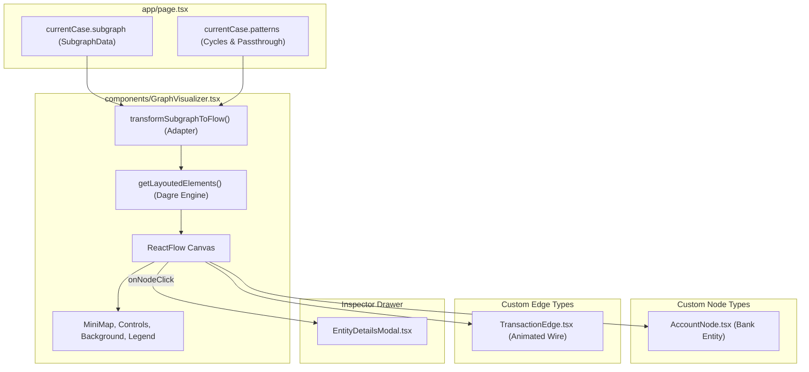

# React Flow Architecture Blueprint: AML Money Trail Visualizer

[← Back to Master Documentation](../README.md) | [Agent Routing Index](../index.md) | [Parent Segment (Frontend)](./README.md)

## 1. Overview & Objective

The **AML Money Trail Visualizer** is a planned core interactive component for Polar Forensic Auditor. Its purpose is to take the reduced topological subgraphs computed by the backend (via Polars and NetworkX) and render an intuitive, interactive node-link graph on the frontend using **`@xyflow/react`** (React Flow 12+).

### Key Visualization Goals
1. **Interactive Money Trail Exploration**: Allow compliance officers to inspect accounts, trace money flow directions, and uncover hidden circular layering schemes.
2. **Deterministic Pruning Verification**: Visually differentiate high-risk accounts and suspicious edges from pruned noise.
3. **Pattern Highlighting**: Prominently display closed cycles and high-velocity passthrough conduits with visual cues (animated flows, glowing badges, colored nodes).
4. **Detail Inspection**: Clicking a node or edge displays a contextual drawer containing transaction volumes, degrees, and flagged forensic reasons.

---

## 2. Target Component Architecture



---

## 3. Dependency Requirements

To implement this blueprint, install the following packages in `frontend/package.json`:

```bash
npm install @xyflow/react @dagrejs/dagre
npm install --save-dev @types/dagre
```

| Package | Purpose |
| :--- | :--- |
| `@xyflow/react` | Modern React Flow library for graph canvas, node dragging, viewport panning/zooming, and custom node/edge rendering. |
| `@dagrejs/dagre` | Directed graph layout algorithm to compute deterministic `(x, y)` coordinates for nodes and routing points for edges. |

---

## 4. Data Adapter: Converting Subgraph to React Flow

The backend returns `UploadResponse.subgraph` adhering to `SubgraphData` in [`types/investigation.ts`](../../frontend/types/investigation.ts):

```typescript
import { Node, Edge } from "@xyflow/react";
import dagre from "@dagrejs/dagre";
import { SubgraphData, GraphNode, GraphEdge } from "@/types/investigation";

export interface AccountNodeData {
  id: string;
  totalIn: number;
  totalOut: number;
  riskScore: number;
  reasons: string[];
  isPassthrough: boolean;
  isInCycle: boolean;
  cycleIds: string[];
}

export interface TransactionEdgeData {
  amount: number;
  count: number;
  timestamps: number[];
  reasons: string[];
  isInCycle: boolean;
}
```

### Layout Calculation Engine (`getLayoutedElements`)

Because the backend delivers topological relationships without graphical coordinates, `@dagrejs/dagre` generates the hierarchical directed graph:

```typescript
const nodeWidth = 220;
const nodeHeight = 100;

export function getLayoutedElements(
  nodes: Node<AccountNodeData>[],
  edges: Edge<TransactionEdgeData>[],
  direction: "LR" | "TB" = "LR"
) {
  const dagreGraph = new dagre.graphlib.Graph();
  dagreGraph.setDefaultEdgeLabel(() => ({}));
  dagreGraph.setGraph({ rankdir: direction, nodesep: 60, ranksep: 100 });

  nodes.forEach((node) => {
    dagreGraph.setNode(node.id, { width: nodeWidth, height: nodeHeight });
  });

  edges.forEach((edge) => {
    dagreGraph.setEdge(edge.source, edge.target);
  });

  dagre.layout(dagreGraph);

  const layoutedNodes = nodes.map((node) => {
    const nodeWithPosition = dagreGraph.node(node.id);
    return {
      ...node,
      position: {
        x: nodeWithPosition.x - nodeWidth / 2,
        y: nodeWithPosition.y - nodeHeight / 2,
      },
    };
  });

  return { nodes: layoutedNodes, edges };
}
```

---

## 5. Custom Node: `AccountNode`

A specialized node rendering bank account information, risk badges, inbound/outbound financial metrics, and typology flags.

```tsx
import React, { memo } from "react";
import { Handle, Position, NodeProps } from "@xyflow/react";
import { ShieldAlert, ArrowDownLeft, ArrowUpRight, Repeat, Zap } from "lucide-react";
import { AccountNodeData } from "./types";
import { formatCurrencyMXN } from "@/lib/utils";

export const AccountNode = memo(({ data, selected }: NodeProps<AccountNodeData>) => {
  const isHighRisk = data.riskScore >= 0.7;

  return (
    <div
      className={`rounded-xl border p-3.5 bg-gray-900/95 text-white shadow-xl transition-all duration-200 min-w-[210px] ${
        selected
          ? "border-emerald-400 ring-2 ring-emerald-500/40"
          : isHighRisk
          ? "border-red-500/80 shadow-red-950/40"
          : "border-gray-700 hover:border-gray-500"
      }`}
    >
      <Handle type="target" position={Position.Left} className="!bg-emerald-400 !w-2.5 !h-2.5" />

      <div className="flex items-center justify-between gap-2 mb-2 pb-2 border-b border-gray-800">
        <div className="flex items-center gap-1.5 font-mono text-xs font-bold text-gray-200 truncate">
          <span className="w-2 h-2 rounded-full bg-sky-400"></span>
          {data.id}
        </div>
        {isHighRisk && (
          <span className="flex items-center gap-1 px-1.5 py-0.5 rounded bg-red-950 text-[10px] font-bold text-red-400 border border-red-800">
            <ShieldAlert className="w-3 h-3" /> Riesgo
          </span>
        )}
      </div>

      {/* Financial Volumes */}
      <div className="grid grid-cols-2 gap-2 text-[11px] mb-2 font-mono">
        <div className="flex items-center gap-1 text-emerald-400">
          <ArrowDownLeft className="w-3 h-3 shrink-0" />
          <span className="truncate">{formatCurrencyMXN(data.totalIn)}</span>
        </div>
        <div className="flex items-center gap-1 text-rose-400 justify-end">
          <span className="truncate">{formatCurrencyMXN(data.totalOut)}</span>
          <ArrowUpRight className="w-3 h-3 shrink-0" />
        </div>
      </div>

      {/* Forensic Badges */}
      <div className="flex flex-wrap gap-1">
        {data.isInCycle && (
          <span className="flex items-center gap-1 px-1.5 py-0.5 rounded bg-amber-950/70 border border-amber-700/50 text-[9px] text-amber-300 font-mono">
            <Repeat className="w-2.5 h-2.5" /> Ciclo
          </span>
        )}
        {data.isPassthrough && (
          <span className="flex items-center gap-1 px-1.5 py-0.5 rounded bg-purple-950/70 border border-purple-700/50 text-[9px] text-purple-300 font-mono">
            <Zap className="w-2.5 h-2.5" /> Puente
          </span>
        )}
      </div>

      <Handle type="source" position={Position.Right} className="!bg-rose-400 !w-2.5 !h-2.5" />
    </div>
  );
});

AccountNode.displayName = "AccountNode";
```

---

## 6. Custom Edge: `TransactionEdge`

A custom directed edge displaying currency amount, transaction frequency, and animated flows for active cycle traces:

```tsx
import React, { memo } from "react";
import { BaseEdge, EdgeLabelRenderer, EdgeProps, getBezierPath } from "@xyflow/react";
import { formatCurrencyMXN } from "@/lib/utils";
import { TransactionEdgeData } from "./types";

export const TransactionEdge = memo(
  ({
    id,
    sourceX,
    sourceY,
    targetX,
    targetY,
    sourcePosition,
    targetPosition,
    data,
    selected,
  }: EdgeProps<TransactionEdgeData>) => {
    const [edgePath, labelX, labelY] = getBezierPath({
      sourceX,
      sourceY,
      sourcePosition,
      targetX,
      targetY,
      targetPosition,
    });

    const isInCycle = data?.isInCycle;

    return (
      <>
        <BaseEdge
          id={id}
          path={edgePath}
          style={{
            stroke: isInCycle ? "#f59e0b" : selected ? "#10b981" : "#4b5563",
            strokeWidth: isInCycle ? 2.5 : selected ? 2 : 1.5,
            strokeDasharray: isInCycle ? "5 5" : undefined,
            animation: isInCycle ? "dashdraw 0.5s linear infinite" : undefined,
          }}
        />
        <EdgeLabelRenderer>
          <div
            style={{
              position: "absolute",
              transform: `translate(-50%, -50%) translate(${labelX}px,${labelY}px)`,
              pointerEvents: "all",
            }}
            className="px-1.5 py-0.5 rounded bg-gray-950/90 border border-gray-800 text-[10px] font-mono text-gray-300 shadow"
          >
            {data ? formatCurrencyMXN(data.amount) : ""}
          </div>
        </EdgeLabelRenderer>
      </>
    );
  }
);

TransactionEdge.displayName = "TransactionEdge";
```

---

## 7. Visualizer Integration Blueprint (`GraphVisualizer.tsx`)

```tsx
"use client";

import React, { useMemo, useState, useCallback } from "react";
import {
  ReactFlow,
  Controls,
  MiniMap,
  Background,
  BackgroundVariant,
  useNodesState,
  useEdgesState,
  Node,
  Edge,
} from "@xyflow/react";
import "@xyflow/react/dist/style.css";
import { SubgraphData, UploadResponse } from "@/types/investigation";
import { AccountNode } from "./AccountNode";
import { TransactionEdge } from "./TransactionEdge";
import { getLayoutedElements } from "./layoutUtils";

const nodeTypes = { accountNode: AccountNode };
const edgeTypes = { transactionEdge: TransactionEdge };

interface GraphVisualizerProps {
  subgraph: SubgraphData;
  patterns: UploadResponse["patterns"];
}

export const GraphVisualizer: React.FC<GraphVisualizerProps> = ({ subgraph, patterns }) => {
  const { initialNodes, initialEdges } = useMemo(() => {
    // 1. Identify cycle entity sets
    const cycleNodesSet = new Set<string>();
    patterns.cycles.forEach((c) => c.path.forEach((id) => cycleNodesSet.add(id)));

    // 2. Identify passthrough entity sets
    const passthroughSet = new Set(patterns.passthrough_accounts.map((p) => p.account));

    // 3. Map Subgraph Nodes to React Flow Nodes
    const rawNodes: Node[] = subgraph.nodes.map((n) => ({
      id: n.id,
      type: "accountNode",
      position: { x: 0, y: 0 },
      data: {
        id: n.id,
        totalIn: n.total_in,
        totalOut: n.total_out,
        riskScore: n.risk_score,
        reasons: n.reasons,
        isInCycle: cycleNodesSet.has(n.id),
        isPassthrough: passthroughSet.has(n.id),
      },
    }));

    // 4. Map Subgraph Edges to React Flow Edges
    const rawEdges: Edge[] = subgraph.edges.map((e, idx) => ({
      id: `e-${e.source}-${e.target}-${idx}`,
      source: e.source,
      target: e.target,
      type: "transactionEdge",
      data: {
        amount: e.amount,
        count: e.count,
        timestamps: e.timestamps,
        reasons: e.reasons,
        isInCycle: cycleNodesSet.has(e.source) && cycleNodesSet.has(e.target),
      },
    }));

    return getLayoutedElements(rawNodes, rawEdges, "LR");
  }, [subgraph, patterns]);

  const [nodes, , onNodesChange] = useNodesState(initialNodes);
  const [edges, , onEdgesChange] = useEdgesState(initialEdges);

  return (
    <div className="w-full h-[550px] bg-[#090d16] border border-surface-border rounded-xl overflow-hidden shadow-2xl relative">
      <div className="absolute top-3 left-4 z-10 bg-gray-900/90 border border-gray-800 rounded-lg px-3 py-1.5 flex items-center gap-4 text-xs font-mono text-gray-300">
        <span className="flex items-center gap-1.5">
          <span className="w-2.5 h-2.5 rounded-full bg-emerald-400"></span> Inbound Handle
        </span>
        <span className="flex items-center gap-1.5">
          <span className="w-2.5 h-2.5 rounded-full bg-rose-400"></span> Outbound Handle
        </span>
        <span className="flex items-center gap-1.5">
          <span className="w-3 h-0.5 bg-amber-400"></span> Ciclo Cerrado (Laundering Loop)
        </span>
      </div>

      <ReactFlow
        nodes={nodes}
        edges={edges}
        nodeTypes={nodeTypes}
        edgeTypes={edgeTypes}
        onNodesChange={onNodesChange}
        onEdgesChange={onEdgesChange}
        fitView
      >
        <Background variant={BackgroundVariant.Dots} gap={16} size={1} color="#1f293d" />
        <Controls className="!bg-gray-900 !border-gray-800 !text-white" />
        <MiniMap
          nodeColor={(node) => (node.data?.isHighRisk ? "#ef4444" : "#10b981")}
          className="!bg-gray-900 !border-gray-800 rounded-lg"
        />
      </ReactFlow>
    </div>
  );
};
```

---

## 8. Dashboard Layout Integration in `/investigate` Workspace

When integrating the visualizer into the primary investigation workspace (`components/InvestigationDashboard.tsx` or `app/investigate/page.tsx`):
1. Place `<GraphVisualizer subgraph={currentCase.subgraph} patterns={currentCase.patterns} />` adjacent to `EvidenceInspector` to enable dual tabular/graphical exploration.
2. Wrap the visualizer in an expanding panel with an optional full-screen modal toggle.
3. Coordinate node selection events with the `VerdictCard` collapsible suspect list to highlight accounts across both views.

---

## 9. Edge Cases, Performance & Gotchas

### 9.1 Layout Performance on Large Subgraphs
- Dagre calculates hierarchical layouts synchronously on the main thread. For graphs with $> 100$ nodes, wrap `getLayoutedElements` in `useMemo` or delegate to a Web Worker to avoid freezing the UI.

### 9.2 Custom Node Re-rendering
- Wrap `AccountNode` and `TransactionEdge` in `React.memo` with custom comparison functions to prevent unnecessary canvas re-renders when panning or zooming.

### 9.3 Viewport Viewfit on Dimension Changes
- Call `fitView({ padding: 0.2, duration: 400 })` only when the active dataset changes, not on every node selection event.
