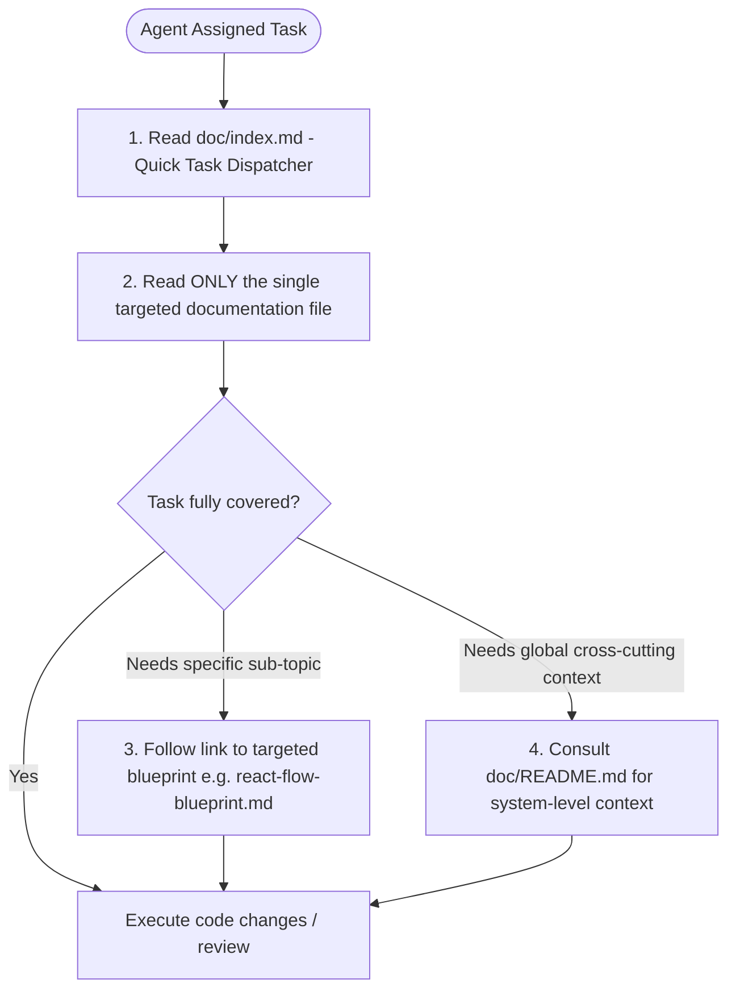

# Documentation Agent Routing Index

> [!CAUTION]
> **Instructions for AI Agents:**
> **DO NOT read all documentation files in `doc/`!**
> Loading the full documentation tree will saturate your context window, degrade your reasoning performance, and waste tokens.
> Consult the **Quick Task Dispatcher** and **Keyword Map** below to identify the **exact single file** relevant to your specific task, and read only that file.

---

## 1. Quick Task Dispatcher

Find the exact single documentation file needed for common engineering and maintenance workflows:

| If your task involves... | Primary Target File | Scope & Summary | Do NOT Read |
| :--- | :--- | :--- | :--- |
| **Global system architecture, end-to-end 6-stage lifecycle, or tech stack overview** | [`doc/README.md`](./README.md) | High-level system topology, architectural evolution, and cross-cutting concerns. | Detailed component or algorithm docs |
| **Multi-container orchestration, docker-compose, or external service topologies** | [`doc/architecture/README.md`](./architecture/README.md) | Docker service layout, networking, external TigerData and n8n connections. | Individual component files or Python algorithms |
| **Unified SSE communication contract (`thought` and `verdict` schemas), or n8n webhook payload** | [`doc/architecture/README.md`](./architecture/README.md) | Exact JSON payloads, streaming headers, and proxy contracts. | Frontend styling or database schema files |
| **FastAPI routing, `/investigations/upload`, `/stream`, `/tts/synthesize`, or app lifecycle** | [`doc/backend/README.md`](./backend/README.md) | Route handlers, request validation, Pydantic settings, and pytest suite. | Next.js components or React Flow docs |
| **Connecting backend to TigerData PostgreSQL via SQLAlchemy and pgvector** | [`doc/backend/README.md`](./backend/README.md) | Connection pool design, SQLAlchemy models, migration roadmap, and vector search. | Frontend UI docs or Docker Compose files |
| **Read-only Agent Tools (`/api/v1/tools/*`), dynamic AST validation, or `tool_registry.py`** | [`doc/backend/README.md`](./backend/README.md) | Read-only agent inspection endpoints, AST expression compiler, and SQL safety tests. | Frontend styling or AMLSim schema files |
| **Polars data ingestion, column alias resolution, or CSV cleansing** | [`doc/backend/README.md`](./backend/README.md) | `read_amlsim_csv()` implementation, column mapping, and Polars filtering. | UI styling or legal jurisprudence docs |
| **NetworkX graph building, cycle detection, or pass-through account algorithms** | [`doc/backend/README.md`](./backend/README.md) | Mathematical graph algorithms, `MAX_CYCLE_LENGTH`, and pruning telemetry. | Frontend components or audio synthesis code |
| **ElevenLabs TTS streaming proxy, API key shielding, or silent MP3 fallback** | [`doc/backend/README.md`](./backend/README.md) | Audio streaming proxy endpoint, chunked transfer, and offline fallback frame. | Frontend UI layout or database models |
| **Running backend automated test suites (121 tests across 13 modules)** | [`doc/backend/README.md`](./backend/README.md) | Pytest commands, test database isolation, pipeline validation, and tool fixtures. | Frontend React components |
| **Next.js workspace UI (`/investigate`), multi-file upload, or dual simulation mode** | [`doc/frontend/README.md`](./frontend/README.md) | App Router layout, multi-CSV ingestion (1-5 files), simulation vs. live SSE modes. | Backend Python code or database models |
| **Frontend streaming hooks (`useInvestigationStream` or `useAudioStream`)** | [`doc/frontend/README.md`](./frontend/README.md) | `EventSource` lifecycle, Blob URL audio synthesis, and abort signaling. | Graph pruning math or Docker configs |
| **Fixing missing `frontend/lib/utils.ts` / `formatCurrencyMXN` build error** | [`doc/frontend/README.md`](./frontend/README.md) | Section 6 edge cases identifying the missing utility and exact solution. | Backend code or AMLSim schemas |
| **Implementing the interactive AML Money Trail Visualizer with `@xyflow/react`** | [`doc/frontend/react-flow-blueprint.md`](./frontend/react-flow-blueprint.md) | React Flow 12+ setup, `@dagrejs/dagre` layout engine, custom nodes & edges. | Backend algorithms or legal compliance docs |
| **IBM AMLSim benchmark dataset schema, column formats, or synthetic sample** | [`doc/data-and-compliance/README.md`](./data-and-compliance/README.md) | Transaction schema fields, aliases, and `sample_amlsim.csv` patterns. | Frontend components or Dockerfiles |
| **Forensic Data Estate Seeder (`estate_schema.sql`), multi-dataset batch generation, or ground truth** | [`doc/data-and-compliance/data_estate_seeder.md`](./data-and-compliance/data_estate_seeder.md) | 8-table SQLite generation, 5 forensic scheme injections, decoys, config guide, and `validate_format.py`. | Frontend components or audio proxy |
| **Deterministic graph pruning mathematical formulas and noise reduction proof** | [`doc/data-and-compliance/README.md`](./data-and-compliance/README.md) | Bounded cycle equations, flow retention ratios, and smurfing logic. | REST endpoints or React hooks |
| **Mexican legal AML compliance (Art. 69-B CFF EFOS/EDOS, NIFs, UIF/GAFI ROI)** | [`doc/data-and-compliance/README.md`](./data-and-compliance/README.md) | Mexican tax/AML statutes, operational materiality, and forensic defense proofs. | Frontend styling or API routing boilerplate |

---

## 2. Segment Catalog & Keyword Map

Scan this catalog to match domain concepts to their home directory:

### [`doc/architecture/README.md`](./architecture/README.md)
- **Keywords**: `architecture`, `topology`, `docker-compose`, `sse-contracts`, `n8n-integration`, `tigerdata`, `end-to-end`, `event-schemas`, `agent-tools-topology`
- **Read When**: Designing cross-service integrations, configuring container environments, reviewing SSE event contracts, or updating communication boundaries between FastAPI, Next.js, TigerData, and n8n.
- **Skip When**: Modifying specific React UI components, tuning Python graph algorithms, or writing database migrations.

### [`doc/backend/README.md`](./backend/README.md)
- **Keywords**: `fastapi`, `polars`, `networkx`, `sse-streaming`, `elevenlabs`, `tigerdata-sqlalchemy`, `pgvector`, `agent-tools`, `tool-registry`, `pytest`, `httpx`
- **Read When**: Developing backend API routes, improving Polars ingestion speed, tuning NetworkX pruning, implementing SQLAlchemy models for TigerData, testing agent inspection tools, or updating the ElevenLabs voice proxy.
- **Skip When**: Editing Next.js JSX/TSX components, styling with Tailwind, or reading Mexican statutory law texts.

### [`doc/frontend/README.md`](./frontend/README.md)
- **Keywords**: `nextjs`, `react`, `tailwindcss`, `sse-streaming`, `audio-streaming`, `components`, `hooks`, `types`, `investigate-workspace`, `multi-file-upload`, `simulation-mode`
- **Read When**: Modifying the web dashboard, adding UI components, handling SSE connection state in React, managing audio playback, configuring multi-file upload, or resolving frontend build errors.
- **Skip When**: Writing Python backend logic, tuning graph pruning algorithms, or designing database schemas.
- **Sub-module**:
  - [`doc/frontend/react-flow-blueprint.md`](./frontend/react-flow-blueprint.md) - Complete design blueprint for the `@xyflow/react` AML Money Trail interactive graph visualizer.

### [`doc/frontend/react-flow-blueprint.md`](./frontend/react-flow-blueprint.md)
- **Keywords**: `react-flow`, `xyflow`, `dagre`, `graph-visualizer`, `custom-nodes`, `custom-edges`, `money-trail`
- **Read When**: Implementing or enhancing the interactive graph visualizer, custom bank account nodes, animated transaction edges, or Dagre layout calculation.
- **Skip When**: Working on anything outside the interactive graph canvas component.

### [`doc/data-and-compliance/README.md`](./data-and-compliance/README.md)
- **Keywords**: `amlsim`, `deterministic_filter`, `graph_pruning`, `cff_69b`, `efos_edos`, `uif_gafi`, `pgvector`, `materialidad`, `complexity-proofs`
- **Read When**: Understanding or generating AMLSim synthetic datasets, analyzing graph pruning math (cycles and passthrough ratios), studying algorithmic proofs, or structuring legal forensic audit reports under Mexican law (CFF Art. 69-B, NIF A-2, UIF ROI).
- **Skip When**: Writing frontend React components, styling CSS, or adjusting FastAPI routing boilerplate.

---

## 3. Recommended Progressive Retrieval Flow for AI Agents

To optimize efficiency and avoid context degradation, follow this sequential retrieval procedure:

1. **Step 1**: Consult `doc/index.md` (this file) to look up your task in the Quick Task Dispatcher.
2. **Step 2**: Open and read **only** the designated primary target file.
3. **Step 3**: If your task involves the interactive graph visualizer, proceed directly to `doc/frontend/react-flow-blueprint.md`.
4. **Step 4**: Consult `doc/README.md` **only** if you require cross-cutting architectural standards, environment variable lists, or deployment instructions.

